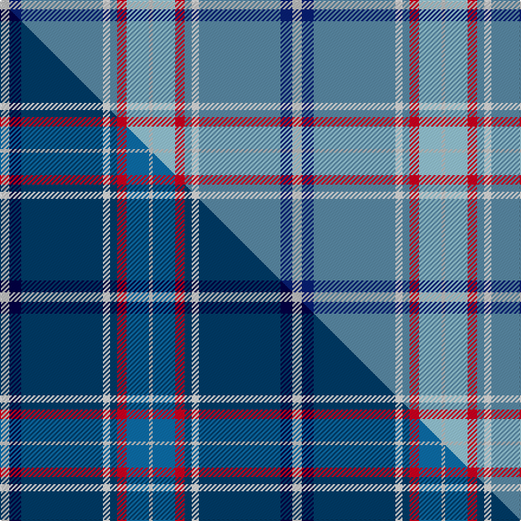

This page is one **sett** — a single exact thread-count. It belongs to the [tartan](/setts/lb8db10t69w6t6r8lbi19lb3/)
(the same proportion at any scale), whose colour order is pattern [WBBWBRWW](/stripes/wbbwbrww/).

Part of the [Virginia International Tattoo Hixon](/tartans/virginia-international-tattoo-hixon/) tartan — the named design grouping this sett with its other cloths.

Sourced from tartans-authority.  It is a [8 stripe tartan](/stripes/stripes8/).

Original link http://www.tartansauthority.com/tartan-ferret/display/10987/

## Register references

External register numbers recorded for this tartan.

- Scottish Register of Tartans: [10987](https://www.tartanregister.gov.uk/tartanDetails?ref=10987)
- Scottish Tartans Authority (ITI): 10987

## Thread count
LB/8 DB10 T69 W6 T6 R8 LBi19 LB/3

One full sett is **247 threads**.

## Palette
<table><thead><tr><th>Colour</th><th>Shade</th><th>OKLCh</th></tr></thead><tbody><tr><td>T</td><td><code style="background-color:#5C8CA8;">#5C8CA8</code> <small style="color:#888">#5C8CA8</small></td><td><small style="color:#888">oklch(61.7% 0.067 235.0)</small></td></tr><tr><td>DB</td><td><code style="background-color:#082077;">#082077</code> <small style="color:#888">#082077</small></td><td><small style="color:#888">oklch(30.0% 0.149 265.1)</small></td></tr><tr><td>LB</td><td><code style="background-color:#98C8E8;">#98C8E8</code> <small style="color:#888">#98C8E8</small></td><td><small style="color:#888">oklch(81.0% 0.068 237.9)</small></td></tr><tr><td>LB</td><td><code style="background-color:#C0C0C0;">#C0C0C0</code> <small style="color:#888">#C0C0C0</small></td><td><small style="color:#888">oklch(80.8% 0.000 89.9)</small></td></tr><tr><td>R</td><td><code style="background-color:#D60020;">#D60020</code> <small style="color:#888">#D60020</small></td><td><small style="color:#888">oklch(55.2% 0.224 25.5)</small></td></tr><tr><td>W</td><td><code style="background-color:#F7F7F7;">#F7F7F7</code> <small style="color:#888">#F7F7F7</small></td><td><small style="color:#888">oklch(97.6% 0.000 89.9)</small></td></tr></tbody></table>

# Sample pattern

## Compared to the master

This cloth is one sett of its design; the master sett (the exemplar the design is anchored on) is below for comparison.

Its **ΔTartan distance** from the master is **0.22** — the same measure the nearest-tartans table ranks by (0 is identical; a re-scale of the same cloth is near 0, a recolour or a different proportion further).

<figure class="master-compare" style="margin:0">

this sett
master sett ★

<figcaption style="color:#888;font-size:smaller">One weave of this sett against the <a href="/setts/lb8db10dbi69w6dbi6r8t19lb3/">master sett ★</a>, split on the diagonal: a shared proportion runs seamlessly across it with only the shades shifting; a different proportion breaks on it.</figcaption>
</figure>

## Nearest tartan variants

The nearest existing variants by ΔTartan distance, with this cloth at the top so the swatches line up against it.

ΔTartan

Threads

Variant

Sett

—

247

<a href="/variants/s8/lb8db10t69w6t6r8lbi19lb3~lb3200000-t2503227-lbi3203246/">Virginia International Tattoo Hixon</a>

<a href="/ttd/edit/#slug=lb8k10db69w6db6r8b19lb3~lb3300000-k0705267-db1404245-b2105244&amp;base=lb8db10t69w6t6r8lbi19lb3~lb3200000-t2503227-lbi3203246" title="compare in the TTD">0.22</a>

247

<a href="/variants/s8/lb8db10dbi69w6dbi6r8t19lb3~lb3300000-db0705267-dbi1404245-t2105244/">Virginia International Tattoo Hixon</a>

<a href="/ttd/edit/#slug=r2w1lb50t24g12k1ly1~x2~lb3203246-t2405244&amp;base=lb8db10t69w6t6r8lbi19lb3~lb3200000-t2503227-lbi3203246" title="compare in the TTD">2.53</a>

358

<a href="/variants/s7/r2w1lb50t24g12k1ly1~x2~lb3203246-t2405244/">Pincock (Name)</a>

<a href="/ttd/edit/#slug=lp6w2lp1db6n30lb1r3~x2&amp;base=lb8db10t69w6t6r8lbi19lb3~lb3200000-t2503227-lbi3203246" title="compare in the TTD">2.80</a>

178

<a href="/variants/s7/lp6w2lp1db6n30lb1r3~x2/">Kuehle (Personal)</a>

<a href="/ttd/edit/#slug=r2t4lb18n2lb2n41w2~x2&amp;base=lb8db10t69w6t6r8lbi19lb3~lb3200000-t2503227-lbi3203246" title="compare in the TTD">3.03</a>

276

<a href="/variants/s7/r2t4lb18n2lb2n41w2~x2/">Haddrell (2013)</a>

<a href="/ttd/edit/#slug=db5r3g2r3dg12t34g2w2~x2~dg1804158&amp;base=lb8db10t69w6t6r8lbi19lb3~lb3200000-t2503227-lbi3203246" title="compare in the TTD">3.08</a>

238

<a href="/variants/s8/db5r3g2r3dg12t34g2w2~x2~dg1804158/">Moran (Drummond) Personal Tartan</a>

<a href="/ttd/edit/#slug=db3g6db2t11dr3dy4dr3t28w3~x2&amp;base=lb8db10t69w6t6r8lbi19lb3~lb3200000-t2503227-lbi3203246" title="compare in the TTD">3.12</a>

240

<a href="/variants/s9/db3g6db2t11dr3dy4dr3t28w3~x2/">Bains of Caithness</a>

<a href="/ttd/edit/#slug=r2db4lb18n2lb2n41w2~x2&amp;base=lb8db10t69w6t6r8lbi19lb3~lb3200000-t2503227-lbi3203246" title="compare in the TTD">3.14</a>

276

<a href="/variants/s7/r2db4lb18n2lb2n41w2~x2/">Haddrell (2013)</a>

<a href="/ttd/edit/#slug=t40r2t7db5ly2db3w2db10n6t2n4w2~x2&amp;base=lb8db10t69w6t6r8lbi19lb3~lb3200000-t2503227-lbi3203246" title="compare in the TTD">3.16</a>

256

<a href="/variants/s12/t40r2t7db5ly2db3w2db10n6t2n4w2~x2/">Plymouth Armada (Commemorative)</a>

<a href="/ttd/edit/#slug=t33w2r3w2db14ri3g15t20r2t3~x2~r2109032-ri2806019&amp;base=lb8db10t69w6t6r8lbi19lb3~lb3200000-t2503227-lbi3203246" title="compare in the TTD">3.22</a>

316

<a href="/variants/s10/t33w2r3w2db14ri3g15t20r2t3~x2~r2109032-ri2806019/">Kansai St Andrews Society (Corp)</a>

<a href="/ttd/edit/#slug=db5r3g2r3dg12t34g2w2~x2&amp;base=lb8db10t69w6t6r8lbi19lb3~lb3200000-t2503227-lbi3203246" title="compare in the TTD">3.29</a>

238

<a href="/variants/s8/db5r3g2r3dg12t34g2w2~x2/">Moran (Wedding) (Personal)</a>

## Neighbour map

Every grey dot is one of 13620 variants placed by the first two principal components of the ΔTartan feature space (42% of its variance). Red is this tartan; blue dots are its nearest — click one to open its page.

<svg viewBox="0 0 640 380" role="img" style="max-width:100%;height:auto;border:1px solid #e0e0e0;border-radius:4px;display:block" xmlns="http://www.w3.org/2000/svg"><image href="/nn/cloud.v1.png" width="640" height="380"/><a href="/variants/s8/lb8db10dbi69w6dbi6r8t19lb3~lb3300000-db0705267-dbi1404245-t2105244/"><circle cx="319.6" cy="120.8" r="4" fill="#3465a4"><title>Virginia International Tattoo Hixon</title></circle></a><a href="/variants/s7/r2w1lb50t24g12k1ly1~x2~lb3203246-t2405244/"><circle cx="346.0" cy="88.0" r="4" fill="#3465a4"><title>Pincock (Name)</title></circle></a><a href="/variants/s7/lp6w2lp1db6n30lb1r3~x2/"><circle cx="387.0" cy="117.4" r="4" fill="#3465a4"><title>Kuehle (Personal)</title></circle></a><a href="/variants/s7/r2t4lb18n2lb2n41w2~x2/"><circle cx="424.1" cy="154.9" r="4" fill="#3465a4"><title>Haddrell (2013)</title></circle></a><a href="/variants/s8/db5r3g2r3dg12t34g2w2~x2~dg1804158/"><circle cx="332.9" cy="148.9" r="4" fill="#3465a4"><title>Moran (Drummond) Personal Tartan</title></circle></a><a href="/variants/s9/db3g6db2t11dr3dy4dr3t28w3~x2/"><circle cx="360.9" cy="168.2" r="4" fill="#3465a4"><title>Bains of Caithness</title></circle></a><a href="/variants/s7/r2db4lb18n2lb2n41w2~x2/"><circle cx="402.9" cy="146.9" r="4" fill="#3465a4"><title>Haddrell (2013)</title></circle></a><a href="/variants/s12/t40r2t7db5ly2db3w2db10n6t2n4w2~x2/"><circle cx="346.6" cy="115.5" r="4" fill="#3465a4"><title>Plymouth Armada (Commemorative)</title></circle></a><a href="/variants/s10/t33w2r3w2db14ri3g15t20r2t3~x2~r2109032-ri2806019/"><circle cx="318.0" cy="151.9" r="4" fill="#3465a4"><title>Kansai St Andrews Society (Corp)</title></circle></a><a href="/variants/s8/db5r3g2r3dg12t34g2w2~x2/"><circle cx="302.6" cy="136.9" r="4" fill="#3465a4"><title>Moran (Wedding) (Personal)</title></circle></a><circle cx="363.7" cy="137.9" r="5" fill="#c00000"/><text x="320" y="376" text-anchor="middle" font-size="11" fill="#999">ground</text><text x="11" y="190" text-anchor="middle" font-size="11" fill="#999" transform="rotate(-90 11 190)">complexity</text></svg>

ID: /variants/s8/lb8db10t69w6t6r8lbi19lb3~lb3200000-t2503227-lbi3203246/
