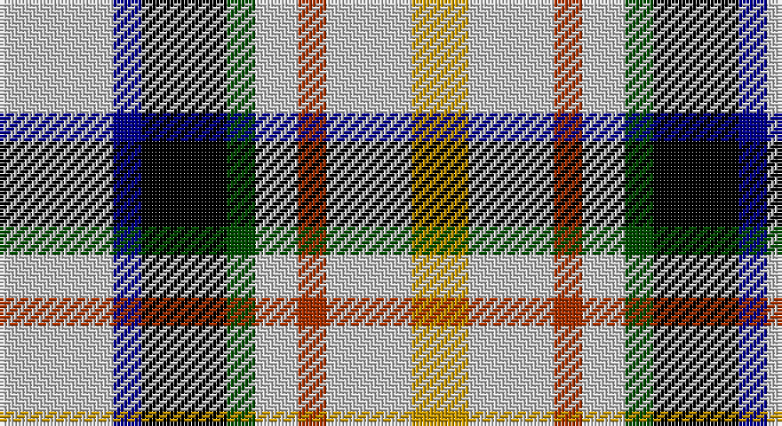

This page is one **sett** — a single exact thread-count. It belongs to the [tartan](/setts/lb8db2k6dg2lb3o2lb6ly4/)
(the same proportion at any scale), whose colour order is pattern [WBKGWRWY](/stripes/wbkgwrwy/).

Sourced from register-of-tartans.  It is a [8 stripe tartan](/stripes/stripes8/).

Original link https://www.tartanregister.gov.uk/tartanDetails.aspx?ref=2598

## Register references

External register numbers recorded for this tartan.

- Scottish Register of Tartans: [2598](https://www.tartanregister.gov.uk/tartanDetails.aspx?ref=2598)
- Scottish Tartans Authority (ITI): 5687

## Thread count
N/32 DB8 K24 G8 N12 R8 N24 DY/16

One full sett is **216 threads**.

## Palette

Palette: <strong>Tartan Register</strong> <small style="color:#888">(5 of 6 colours)</small>
<table><thead><tr><th>Colour</th><th>Threads</th><th>Shade</th><th>Base</th><th>OKLCh</th></tr></thead><tbody><tr><td>N/</td><td style="text-align:right;font-variant-numeric:tabular-nums">32</td><td><code style="background-color:#C8C8C8;">#C8C8C8</code> <small style="color:#888">#C8C8C8</small></td><td>W <code style="background-color:#F7F7F7;">#F7F7F7</code></td><td><small style="color:#888">oklch(83.3% 0.000 89.9)</small></td></tr><tr><td>DB</td><td style="text-align:right;font-variant-numeric:tabular-nums">8</td><td><code style="background-color:#00008C;">#00008C</code> <small style="color:#888">#00008C</small></td><td>B <code style="background-color:#2A418A;">#2A418A</code></td><td><small style="color:#888">oklch(28.9% 0.200 264.1)</small></td></tr><tr><td>K</td><td style="text-align:right;font-variant-numeric:tabular-nums">24</td><td><code style="background-color:#000000;">#000000</code> <small style="color:#888">#000000</small></td><td>K <code style="background-color:#000000;">#000000</code></td><td><small style="color:#888">oklch(0.0% 0.000 0.0)</small></td></tr><tr><td>G</td><td style="text-align:right;font-variant-numeric:tabular-nums">8</td><td><code style="background-color:#004C00;">#004C00</code> <small style="color:#888">#004C00</small></td><td>G <code style="background-color:#006100;">#006100</code></td><td><small style="color:#888">oklch(36.1% 0.123 142.5)</small></td></tr><tr><td>N</td><td style="text-align:right;font-variant-numeric:tabular-nums">12</td><td><code style="background-color:#C8C8C8;">#C8C8C8</code> <small style="color:#888">#C8C8C8</small></td><td>W <code style="background-color:#F7F7F7;">#F7F7F7</code></td><td><small style="color:#888">oklch(83.3% 0.000 89.9)</small></td></tr><tr><td>R</td><td style="text-align:right;font-variant-numeric:tabular-nums">8</td><td><code style="background-color:#A83000;">#A83000</code> <small style="color:#888">#A83000</small></td><td>R <code style="background-color:#CC0000;">#CC0000</code></td><td><small style="color:#888">oklch(48.9% 0.163 37.1)</small></td></tr><tr><td>N</td><td style="text-align:right;font-variant-numeric:tabular-nums">24</td><td><code style="background-color:#C8C8C8;">#C8C8C8</code> <small style="color:#888">#C8C8C8</small></td><td>W <code style="background-color:#F7F7F7;">#F7F7F7</code></td><td><small style="color:#888">oklch(83.3% 0.000 89.9)</small></td></tr><tr><td>DY/</td><td style="text-align:right;font-variant-numeric:tabular-nums">16</td><td><code style="background-color:#C89800;">#C89800</code> <small style="color:#888">#C89800</small></td><td>Y <code style="background-color:#F2BF00;">#F2BF00</code></td><td><small style="color:#888">oklch(70.6% 0.144 85.9)</small></td></tr></tbody></table>

# Sample pattern

## Nearest tartans

The nearest existing variants by ΔTartan distance, with this tartan at the top so the swatches line up against it.

ΔTartan

Tartan

Sett

—

<a href="/ttd/edit/#slug=lb8db2k6dg2lb3o2lb6ly4~x4">MacLaren Albino (Dance)</a> <a class="nn-out" href="/variants/s8/lb8db2k6dg2lb3o2lb6ly4~x4/" title="open its dictionary page">↗</a>

0.71

<a href="/ttd/edit/#slug=w16db4k12g4w6lo4w11ly7~x2&amp;base=lb8db2k6dg2lb3o2lb6ly4~x4">MacLaren</a> <a class="nn-out" href="/variants/s8/w16db4k12g4w6lo4w11ly7~x2/" title="open its dictionary page">↗</a>

0.83

<a href="/ttd/edit/#slug=w16db4k12dg4w6r4w11ly7~x2&amp;base=lb8db2k6dg2lb3o2lb6ly4~x4">MacLaren (D.C Dalgliesh version)</a> <a class="nn-out" href="/variants/s8/w16db4k12dg4w6r4w11ly7~x2/" title="open its dictionary page">↗</a>

0.84

<a href="/ttd/edit/#slug=w16db4k12dg4w6lo4w11ly7~x2&amp;base=lb8db2k6dg2lb3o2lb6ly4~x4">MacLaren Dress (Dance)</a> <a class="nn-out" href="/variants/s8/w16db4k12dg4w6lo4w11ly7~x2/" title="open its dictionary page">↗</a>

0.87

<a href="/ttd/edit/#slug=dr4w2lb8dg2lb8k3w2db4~x2&amp;base=lb8db2k6dg2lb3o2lb6ly4~x4">Desang</a> <a class="nn-out" href="/variants/s8/dr4w2lb8dg2lb8k3w2db4~x2/" title="open its dictionary page">↗</a>

1.17

<a href="/ttd/edit/#slug=db4w2k3lb8g2lb8w2r4~x4&amp;base=lb8db2k6dg2lb3o2lb6ly4~x4">Desang (Corporate)</a> <a class="nn-out" href="/variants/s8/db4w2k3lb8g2lb8w2r4~x4/" title="open its dictionary page">↗</a>

1.19

<a href="/ttd/edit/#slug=w4k1w4dg6k4w5r1t2~x2&amp;base=lb8db2k6dg2lb3o2lb6ly4~x4">MacDuff Dress</a> <a class="nn-out" href="/variants/s8/w4k1w4dg6k4w5r1t2~x2/" title="open its dictionary page">↗</a>

1.27

<a href="/ttd/edit/#slug=w4k1w4g6k4w5r1t2~x2&amp;base=lb8db2k6dg2lb3o2lb6ly4~x4">MacDuff, dress</a> <a class="nn-out" href="/variants/s8/w4k1w4g6k4w5r1t2~x2/" title="open its dictionary page">↗</a>

1.51

<a href="/ttd/edit/#slug=dg3b12dg12w12dg2w12dg3~x2&amp;base=lb8db2k6dg2lb3o2lb6ly4~x4">Game Fair (Corporate)</a> <a class="nn-out" href="/variants/s7/dg3b12dg12w12dg2w12dg3~x2/" title="open its dictionary page">↗</a>

1.57

<a href="/ttd/edit/#slug=r9g18k6g6k3ly3g6db8w3~x2&amp;base=lb8db2k6dg2lb3o2lb6ly4~x4">Bisset</a> <a class="nn-out" href="/variants/s9/r9g18k6g6k3ly3g6db8w3~x2/" title="open its dictionary page">↗</a>

1.60

<a href="/ttd/edit/#slug=lb12k3lbi3k3lb13t6k17r3~x2&amp;base=lb8db2k6dg2lb3o2lb6ly4~x4">Mitsukoshi (Corporate)</a> <a class="nn-out" href="/variants/s8/lb12k3lbi3k3lb13t6k17r3~x2/" title="open its dictionary page">↗</a>

## Neighbour map

Every grey dot is one of 14360 variants placed by the first two principal components of the ΔTartan feature space (44% of its variance). Red is this tartan; blue dots are its nearest — click one to open its page.

<svg viewBox="0 0 640 380" role="img" style="max-width:100%;height:auto;border:1px solid #e0e0e0;border-radius:4px;display:block" xmlns="http://www.w3.org/2000/svg"><image href="/nn/cloud.v1.png" width="640" height="380"/><a href="/variants/s8/w16db4k12g4w6lo4w11ly7~x2/"><circle cx="94.7" cy="194.8" r="4" fill="#3465a4"><title>MacLaren</title></circle></a><a href="/variants/s8/w16db4k12dg4w6r4w11ly7~x2/"><circle cx="101.6" cy="196.4" r="4" fill="#3465a4"><title>MacLaren (D.C Dalgliesh version)</title></circle></a><a href="/variants/s8/w16db4k12dg4w6lo4w11ly7~x2/"><circle cx="101.2" cy="197.1" r="4" fill="#3465a4"><title>MacLaren Dress (Dance)</title></circle></a><a href="/variants/s8/dr4w2lb8dg2lb8k3w2db4~x2/"><circle cx="91.6" cy="191.7" r="4" fill="#3465a4"><title>Desang</title></circle></a><a href="/variants/s8/db4w2k3lb8g2lb8w2r4~x4/"><circle cx="96.5" cy="191.9" r="4" fill="#3465a4"><title>Desang (Corporate)</title></circle></a><a href="/variants/s8/w4k1w4dg6k4w5r1t2~x2/"><circle cx="119.6" cy="206.1" r="4" fill="#3465a4"><title>MacDuff Dress</title></circle></a><a href="/variants/s8/w4k1w4g6k4w5r1t2~x2/"><circle cx="112.7" cy="204.2" r="4" fill="#3465a4"><title>MacDuff, dress</title></circle></a><a href="/variants/s7/dg3b12dg12w12dg2w12dg3~x2/"><circle cx="86.4" cy="194.8" r="4" fill="#3465a4"><title>Game Fair (Corporate)</title></circle></a><a href="/variants/s9/r9g18k6g6k3ly3g6db8w3~x2/"><circle cx="123.3" cy="184.1" r="4" fill="#3465a4"><title>Bisset</title></circle></a><a href="/variants/s8/lb12k3lbi3k3lb13t6k17r3~x2/"><circle cx="130.8" cy="191.1" r="4" fill="#3465a4"><title>Mitsukoshi (Corporate)</title></circle></a><circle cx="100.2" cy="201.9" r="5" fill="#c00000"/></svg>

ID: /variants/s8/lb8db2k6dg2lb3o2lb6ly4~x4/
