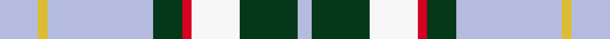

This page is one **sett** — a single exact thread-count. It belongs to the [tartan](/setts/lb8ly2lb22dg6r2w10dg12lb3/)
(the same proportion at any scale), whose colour order is pattern [WGWRGWYW](/stripes/wgwrgwyw/).

Part of the [Bahamas](/tartans/bahamas/) tartan — the named design grouping this sett with its other cloths.

Sourced from register-of-tartans.  It is a [8 stripe tartan](/stripes/stripes8/).

Original link [https://www.tartanregister.gov.uk/tartanDetails.aspx?ref=158](https://www.tartanregister.gov.uk/tartanDetails.aspx?ref=158)

2 attestations — the source records this cloth was collapsed from (oldest owns this page)

<ul>
<li>01/01/1966 — Bahamas (register-of-tartans, <a href="https://www.tartanregister.gov.uk/tartanDetails.aspx?ref=158">record</a>)  <em>Designed by Gordon Rees of the Scottish Shop in Nassau, now owned by Colin and Beverley Honnes. It was intended to commemorate the early Scottish settlers in the Bahamas including Thompson, Sands, Forsythe, Munroe, Johnston, Russell, Christie, Roberts, Kelly, MacKinney, Saunders, Malcolm, Crawford, MacPherson, Clark and Rae. The tartan was formally approved by the Bahamas Government in 1966.</em></li>
<li>1966 — Bahamas (District) (tartans-authority, <a href="https://www.tartanregister.gov.uk/tartanDetails.aspx?ref=2089">record</a>)  <em>Designed by the late Gordon Rees who owned the Scottish Shop in Nassau and formally adopted by the Bahamas Government in 1966. Possibly woven initially by Peter MacArthur Ltd. Sample from MacArthurs in STA Johnston Collection. Sindex notes say designed by Peter MacArthur Ltd.</em></li>
</ul>

Dataset <small>— provenance for this record, inherited from the source manifest</small>

<dl class="dataset-prov">
<dt>source</dt><dd><a href="/sources/register-of-tartans/">Scottish Register of Tartans</a></dd>
<dt>data captured from</dt><dd><a href="https://github.com/thetartan/tartan-database/blob/master/data/register-of-tartans/data.csv">https://github.com/thetartan/tartan-database/blob/master/data/register-of-tartans/data.csv</a></dd>
<dt>data date</dt><dd>1966 <small>(this record)</small></dd>
<dt>licence</dt><dd><a href="https://www.tartanregister.gov.uk/copyright">Crown copyright</a></dd>
</dl>

Capture chain <small>— the hands this data passed through, oldest first; each capture carries its own licence</small>

<ol class="capture-chain">
<li><a href="https://www.tartanregister.gov.uk/">Scottish Register of Tartans</a> · <a href="https://www.tartanregister.gov.uk/copyright">Crown copyright</a> <small>the living register — still published by National Records of Scotland</small></li>
<li><a href="https://github.com/thetartan/tartan-database">thetartan/tartan-database</a> <small>2016-2017</small> · <a href="https://creativecommons.org/licenses/by-nc-nd/4.0/">CC BY-NC-ND 4.0</a> <small>Levko Kravets's frozen compilation — the capture we vendored, and where its CC licence text came from</small></li>
<li>this dictionary <small>captured 2026-06-10 · commit 5bf86c7566</small> <small>each re-capture is a git commit to data/sources</small></li>
</ol>

## Register references

External register numbers recorded for this tartan.

- Scottish Register of Tartans: [158](https://www.tartanregister.gov.uk/tartanDetails.aspx?ref=158)
- Scottish Tartans Authority (ITI): 2089
- Scottish Tartans World Register: 2089

## Thread count
LB/16 LY4 LB44 DG12 R4 W20 DG24 LB/6

One full sett is **238 threads**.

## Palette
<table><thead><tr><th>Colour</th><th>Shade</th><th>OKLCh</th></tr></thead><tbody><tr><td>DR</td><td><code style="background-color:#55120C;">#55120C</code> <small style="color:#888">#55120C</small></td><td><small style="color:#888">oklch(30.0% 0.099 29.3)</small></td></tr><tr><td>LB</td><td><code style="background-color:#B5BBDE;">#B5BBDE</code> <small style="color:#888">#B5BBDE</small></td><td><small style="color:#888">oklch(79.9% 0.050 277.6)</small></td></tr><tr><td>DG</td><td><code style="background-color:#053819;">#053819</code> <small style="color:#888">#053819</small></td><td><small style="color:#888">oklch(30.0% 0.075 151.3)</small></td></tr><tr><td>LY</td><td><code style="background-color:#DCBC32;">#DCBC32</code> <small style="color:#888">#DCBC32</small></td><td><small style="color:#888">oklch(80.0% 0.150 95.2)</small></td></tr><tr><td>W</td><td><code style="background-color:#F7F7F7;">#F7F7F7</code> <small style="color:#888">#F7F7F7</small></td><td><small style="color:#888">oklch(97.6% 0.000 89.9)</small></td></tr><tr><td>R</td><td><code style="background-color:#D60020;">#D60020</code> <small style="color:#888">#D60020</small></td><td><small style="color:#888">oklch(55.2% 0.224 25.5)</small></td></tr></tbody></table>

# Sample pattern

## Nearest tartan variants

The nearest existing variants by ΔTartan distance, with this cloth at the top so the swatches line up against it.

ΔTartan

Threads

Variant

Sett

—

238

<a href="/variants/s8/lb8ly2lb22dg6r2w10dg12lb3~x2/">Bahamas</a>

<a href="/ttd/edit/#slug=db6y2db22g7r2w11g11db3~x2&amp;base=lb8ly2lb22dg6r2w10dg12lb3~x2" title="compare in the TTD">0.35</a>

238

<a href="/variants/s8/db6y2db22g7r2w11g11db3~x2/">Bahamas District Tartan</a>

<a href="/ttd/edit/#slug=db3g11w11r2g7db22y2db2~x2&amp;base=lb8ly2lb22dg6r2w10dg12lb3~x2" title="compare in the TTD">0.46</a>

230

<a href="/variants/s8/db3g11w11r2g7db22y2db2~x2/">Bahamas</a>

<a href="/ttd/edit/#slug=lb30r3lb3r3lb12dt30n3dt5~x2&amp;base=lb8ly2lb22dg6r2w10dg12lb3~x2" title="compare in the TTD">1.66</a>

286

<a href="/variants/s8/lb30r3lb3r3lb12dt30n3dt5~x2/">Dama Classic</a>

<a href="/ttd/edit/#slug=w8ly3w22n22dr3r2w4~x2&amp;base=lb8ly2lb22dg6r2w10dg12lb3~x2" title="compare in the TTD">2.31</a>

232

<a href="/variants/s7/w8ly3w22n22dr3r2w4~x2/">Banff, White (Fashion)</a>

<a href="/ttd/edit/#slug=w8lb30g5w3db8r5&amp;base=lb8ly2lb22dg6r2w10dg12lb3~x2" title="compare in the TTD">2.46</a>

105

<a href="/variants/s6/w8lb30g5w3db8r5/">Roseberry</a>

<a href="/ttd/edit/#slug=y4db5y4db5w8r2w24g2w8db5y4db5y4~x2&amp;base=lb8ly2lb22dg6r2w10dg12lb3~x2" title="compare in the TTD">2.73</a>

304

<a href="/variants/s13/y4db5y4db5w8r2w24g2w8db5y4db5y4~x2/">Aelfleda Arisaid (Personal)</a>

<a href="/ttd/edit/#slug=y4db5y4db5w8dg2w24r2w8db5y4db5y4~x2&amp;base=lb8ly2lb22dg6r2w10dg12lb3~x2" title="compare in the TTD">2.76</a>

304

<a href="/variants/s13/y4db5y4db5w8dg2w24r2w8db5y4db5y4~x2/">Aelfleda Arisaid (Personal)</a>

<a href="/ttd/edit/#slug=lb8w28ly3g3lb8k9lb4~x2&amp;base=lb8ly2lb22dg6r2w10dg12lb3~x2" title="compare in the TTD">2.89</a>

228

<a href="/variants/s7/lb8w28ly3g3lb8k9lb4~x2/">MacTavish of Dunardry Dress</a>

<a href="/ttd/edit/#slug=n2dr10n10o3dr2lb24w2~x2~n1900000-o2500000&amp;base=lb8ly2lb22dg6r2w10dg12lb3~x2" title="compare in the TTD">3.03</a>

204

<a href="/variants/s7/n2dr10n10o3dr2lb24w2~x2~n1900000-o2500000/">Un-named Dutch</a>

<a href="/ttd/edit/#slug=dr2o9lb4w2n22w2lb4w22n2w8dr2~x2~o2500000-n1900000&amp;base=lb8ly2lb22dg6r2w10dg12lb3~x2" title="compare in the TTD">3.05</a>

308

<a href="/variants/s11/dr2o9lb4w2n22w2lb4w22n2w8dr2~x2~o2500000-n1900000/">MacRae Grey (Fashion)</a>

## Neighbour map

Every grey dot is one of 13621 variants placed by the first two principal components of the ΔTartan feature space (42% of its variance). Red is this tartan; blue dots are its nearest — click one to open its page.

<svg viewBox="0 0 640 380" role="img" style="max-width:100%;height:auto;border:1px solid #e0e0e0;border-radius:4px;display:block" xmlns="http://www.w3.org/2000/svg"><image href="/nn/cloud.v1.png" width="640" height="380"/><a href="/variants/s8/db6y2db22g7r2w11g11db3~x2/"><circle cx="202.9" cy="185.8" r="4" fill="#3465a4"><title>Bahamas District Tartan</title></circle></a><a href="/variants/s8/db3g11w11r2g7db22y2db2~x2/"><circle cx="192.4" cy="178.8" r="4" fill="#3465a4"><title>Bahamas</title></circle></a><a href="/variants/s8/lb30r3lb3r3lb12dt30n3dt5~x2/"><circle cx="285.0" cy="190.7" r="4" fill="#3465a4"><title>Dama Classic</title></circle></a><a href="/variants/s7/w8ly3w22n22dr3r2w4~x2/"><circle cx="266.2" cy="182.5" r="4" fill="#3465a4"><title>Banff, White (Fashion)</title></circle></a><a href="/variants/s6/w8lb30g5w3db8r5/"><circle cx="246.9" cy="195.5" r="4" fill="#3465a4"><title>Roseberry</title></circle></a><a href="/variants/s13/y4db5y4db5w8r2w24g2w8db5y4db5y4~x2/"><circle cx="212.5" cy="157.2" r="4" fill="#3465a4"><title>Aelfleda Arisaid (Personal)</title></circle></a><a href="/variants/s13/y4db5y4db5w8dg2w24r2w8db5y4db5y4~x2/"><circle cx="211.7" cy="156.7" r="4" fill="#3465a4"><title>Aelfleda Arisaid (Personal)</title></circle></a><a href="/variants/s7/lb8w28ly3g3lb8k9lb4~x2/"><circle cx="170.6" cy="177.4" r="4" fill="#3465a4"><title>MacTavish of Dunardry Dress</title></circle></a><a href="/variants/s7/n2dr10n10o3dr2lb24w2~x2~n1900000-o2500000/"><circle cx="237.9" cy="178.5" r="4" fill="#3465a4"><title>Un-named Dutch</title></circle></a><a href="/variants/s11/dr2o9lb4w2n22w2lb4w22n2w8dr2~x2~o2500000-n1900000/"><circle cx="205.2" cy="162.0" r="4" fill="#3465a4"><title>MacRae Grey (Fashion)</title></circle></a><circle cx="225.6" cy="188.7" r="5" fill="#c00000"/><text x="320" y="376" text-anchor="middle" font-size="11" fill="#999">ground</text><text x="11" y="190" text-anchor="middle" font-size="11" fill="#999" transform="rotate(-90 11 190)">complexity</text></svg>

ID: /variants/s8/lb8ly2lb22dg6r2w10dg12lb3~x2/
