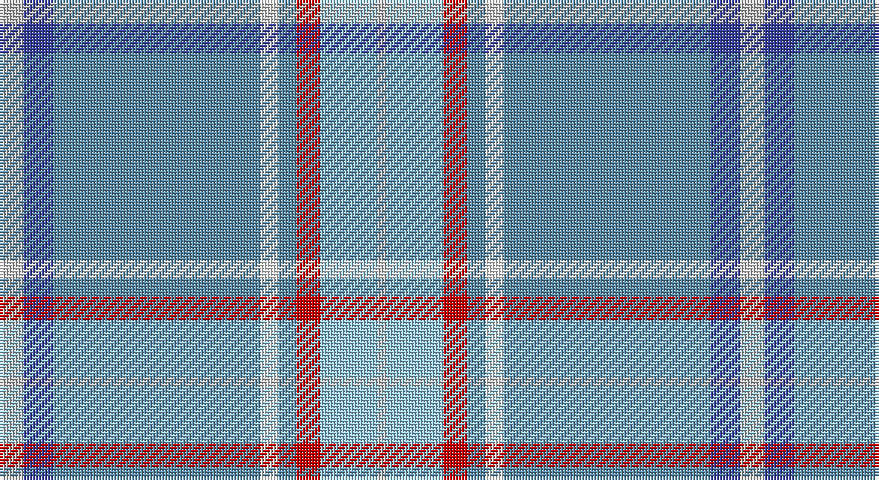

This page is one **sett** — a single exact thread-count. It belongs to the [tartan](/setts/lbi8db10t69w6t6r8lb19lbi3/)
(the same proportion at any scale), whose colour order is pattern [WBBWBRWW](/stripes/wbbwbrww/).

Sourced from tartans-authority.  It is a [8 stripe tartan](/stripes/stripes8/).

Original link http://www.tartansauthority.com/tartan-ferret/display/10987/

## Register references

External register numbers recorded for this tartan.

- Scottish Register of Tartans: [10987](https://www.tartanregister.gov.uk/tartanDetails?ref=10987)
- Scottish Tartans Authority (ITI): 10987

## Thread count
N/8 Ba10 B69 W6 B6 R8 LB19 N/3

One full sett is **247 threads**.

## Palette

Palette: <strong>Tartan Register</strong> <small style="color:#888">(5 of 6 colours)</small>
<table><thead><tr><th>Colour</th><th>Threads</th><th>Shade</th><th>Base</th><th>OKLCh</th></tr></thead><tbody><tr><td>N/</td><td style="text-align:right;font-variant-numeric:tabular-nums">8</td><td><code style="background-color:#C0C0C0;">#C0C0C0</code> <small style="color:#888">#C0C0C0</small></td><td>W <code style="background-color:#F7F7F7;">#F7F7F7</code></td><td><small style="color:#888">oklch(80.8% 0.000 89.9)</small></td></tr><tr><td>Ba</td><td style="text-align:right;font-variant-numeric:tabular-nums">10</td><td><code style="background-color:#38409C;">#38409C</code> <small style="color:#888">#38409C</small></td><td>B <code style="background-color:#2A418A;">#2A418A</code></td><td><small style="color:#888">oklch(42.1% 0.148 274.4)</small></td></tr><tr><td>B</td><td style="text-align:right;font-variant-numeric:tabular-nums">69</td><td><code style="background-color:#5C8CA8;">#5C8CA8</code> <small style="color:#888">#5C8CA8</small></td><td>B <code style="background-color:#2A418A;">#2A418A</code></td><td><small style="color:#888">oklch(61.7% 0.067 235.0)</small></td></tr><tr><td>W</td><td style="text-align:right;font-variant-numeric:tabular-nums">6</td><td><code style="background-color:#FCFCFC;">#FCFCFC</code> <small style="color:#888">#FCFCFC</small></td><td>W <code style="background-color:#F7F7F7;">#F7F7F7</code></td><td><small style="color:#888">oklch(99.1% 0.000 89.9)</small></td></tr><tr><td>B</td><td style="text-align:right;font-variant-numeric:tabular-nums">6</td><td><code style="background-color:#5C8CA8;">#5C8CA8</code> <small style="color:#888">#5C8CA8</small></td><td>B <code style="background-color:#2A418A;">#2A418A</code></td><td><small style="color:#888">oklch(61.7% 0.067 235.0)</small></td></tr><tr><td>R</td><td style="text-align:right;font-variant-numeric:tabular-nums">8</td><td><code style="background-color:#C80000;">#C80000</code> <small style="color:#888">#C80000</small></td><td>R <code style="background-color:#CC0000;">#CC0000</code></td><td><small style="color:#888">oklch(52.3% 0.215 29.2)</small></td></tr><tr><td>LB</td><td style="text-align:right;font-variant-numeric:tabular-nums">19</td><td><code style="background-color:#98C8E8;">#98C8E8</code> <small style="color:#888">#98C8E8</small></td><td>W <code style="background-color:#F7F7F7;">#F7F7F7</code></td><td><small style="color:#888">oklch(81.0% 0.068 237.9)</small></td></tr><tr><td>N/</td><td style="text-align:right;font-variant-numeric:tabular-nums">3</td><td><code style="background-color:#C0C0C0;">#C0C0C0</code> <small style="color:#888">#C0C0C0</small></td><td>W <code style="background-color:#F7F7F7;">#F7F7F7</code></td><td><small style="color:#888">oklch(80.8% 0.000 89.9)</small></td></tr></tbody></table>

# Sample pattern

## Nearest tartans

The nearest existing variants by ΔTartan distance, with this tartan at the top so the swatches line up against it.

ΔTartan

Tartan

Sett

—

<a href="/ttd/edit/#slug=lbi8db10t69w6t6r8lb19lbi3">Virginia International Tattoo Hixon</a> <a class="nn-out" href="/variants/s8/lbi8db10t69w6t6r8lb19lbi3/" title="open its dictionary page">↗</a>

1.27

<a href="/variants/s7/lp6wi2lp1db6o30w1r3~x2/">Kuehle (Personal)</a>

1.49

<a href="/ttd/edit/#slug=y18ly1y2ly1y2db6w4o1g6~x2&amp;base=lbi8db10t69w6t6r8lb19lbi3">Nickel Lodge, Centennial</a> <a class="nn-out" href="/variants/s9/y18ly1y2ly1y2db6w4o1g6~x2/" title="open its dictionary page">↗</a>

1.56

<a href="/ttd/edit/#slug=o55b8w8b8g5o8ly4w4k4~x2&amp;base=lbi8db10t69w6t6r8lb19lbi3">Ofsharick, Matthew (Personal)</a> <a class="nn-out" href="/variants/s9/o55b8w8b8g5o8ly4w4k4~x2/" title="open its dictionary page">↗</a>

1.60

<a href="/ttd/edit/#slug=t50r3t4r4t7k14g31lo2w2~x2&amp;base=lbi8db10t69w6t6r8lb19lbi3">Highland Glen (Corporate)</a> <a class="nn-out" href="/variants/s9/t50r3t4r4t7k14g31lo2w2~x2/" title="open its dictionary page">↗</a>

1.66

<a href="/ttd/edit/#slug=o18ly1o2ly1o2db6w4dy1g6~x2&amp;base=lbi8db10t69w6t6r8lb19lbi3">Nickel Lodge Centennial Corporate Tartan</a> <a class="nn-out" href="/variants/s9/o18ly1o2ly1o2db6w4dy1g6~x2/" title="open its dictionary page">↗</a>

1.70

<a href="/ttd/edit/#slug=b19db1y1b10db4ly9p4b9y1db1lo2~x4&amp;base=lbi8db10t69w6t6r8lb19lbi3">Cian of Ely (Clan)</a> <a class="nn-out" href="/variants/s11/b19db1y1b10db4ly9p4b9y1db1lo2~x4/" title="open its dictionary page">↗</a>

1.70

<a href="/ttd/edit/#slug=o38db4o8lo2o4w3o4r14n7o2n4w2~x2&amp;base=lbi8db10t69w6t6r8lb19lbi3">Portree Check</a> <a class="nn-out" href="/variants/s12/o38db4o8lo2o4w3o4r14n7o2n4w2~x2/" title="open its dictionary page">↗</a>

1.73

<a href="/ttd/edit/#slug=lg25r1ly1n9w4~x2&amp;base=lbi8db10t69w6t6r8lb19lbi3">Tailor Ishida, Kobe</a> <a class="nn-out" href="/variants/s5/lg25r1ly1n9w4~x2/" title="open its dictionary page">↗</a>

1.73

<a href="/ttd/edit/#slug=db5m3g2m3gi12b34g2w2~x2&amp;base=lbi8db10t69w6t6r8lb19lbi3">Moran (Drummond) Personal Tartan</a> <a class="nn-out" href="/variants/s8/db5m3g2m3gi12b34g2w2~x2/" title="open its dictionary page">↗</a>

1.74

<a href="/ttd/edit/#slug=dy6ly3n42w4dg18ly2n12r3~x2&amp;base=lbi8db10t69w6t6r8lb19lbi3">Glasgow High (School)</a> <a class="nn-out" href="/variants/s8/dy6ly3n42w4dg18ly2n12r3~x2/" title="open its dictionary page">↗</a>

## Neighbour map

Every grey dot is one of 14360 variants placed by the first two principal components of the ΔTartan feature space (44% of its variance). Red is this tartan; blue dots are its nearest — click one to open its page.

<svg viewBox="0 0 640 380" role="img" style="max-width:100%;height:auto;border:1px solid #e0e0e0;border-radius:4px;display:block" xmlns="http://www.w3.org/2000/svg"><image href="/nn/cloud.v1.png" width="640" height="380"/><a href="/variants/s7/lp6wi2lp1db6o30w1r3~x2/"><circle cx="376.7" cy="105.4" r="4" fill="#3465a4"><title>Kuehle (Personal)</title></circle></a><a href="/variants/s9/y18ly1y2ly1y2db6w4o1g6~x2/"><circle cx="286.2" cy="130.3" r="4" fill="#3465a4"><title>Nickel Lodge, Centennial</title></circle></a><a href="/variants/s9/o55b8w8b8g5o8ly4w4k4~x2/"><circle cx="317.5" cy="118.4" r="4" fill="#3465a4"><title>Ofsharick, Matthew (Personal)</title></circle></a><a href="/variants/s9/t50r3t4r4t7k14g31lo2w2~x2/"><circle cx="297.7" cy="122.0" r="4" fill="#3465a4"><title>Highland Glen (Corporate)</title></circle></a><a href="/variants/s9/o18ly1o2ly1o2db6w4dy1g6~x2/"><circle cx="271.1" cy="121.7" r="4" fill="#3465a4"><title>Nickel Lodge Centennial Corporate Tartan</title></circle></a><a href="/variants/s11/b19db1y1b10db4ly9p4b9y1db1lo2~x4/"><circle cx="343.4" cy="141.1" r="4" fill="#3465a4"><title>Cian of Ely (Clan)</title></circle></a><a href="/variants/s12/o38db4o8lo2o4w3o4r14n7o2n4w2~x2/"><circle cx="362.2" cy="114.9" r="4" fill="#3465a4"><title>Portree Check</title></circle></a><a href="/variants/s5/lg25r1ly1n9w4~x2/"><circle cx="390.2" cy="161.7" r="4" fill="#3465a4"><title>Tailor Ishida, Kobe</title></circle></a><a href="/variants/s8/db5m3g2m3gi12b34g2w2~x2/"><circle cx="329.5" cy="153.0" r="4" fill="#3465a4"><title>Moran (Drummond) Personal Tartan</title></circle></a><a href="/variants/s8/dy6ly3n42w4dg18ly2n12r3~x2/"><circle cx="366.6" cy="150.7" r="4" fill="#3465a4"><title>Glasgow High (School)</title></circle></a><circle cx="341.7" cy="122.9" r="5" fill="#c00000"/></svg>

ID: /variants/s8/lbi8db10t69w6t6r8lb19lbi3/
