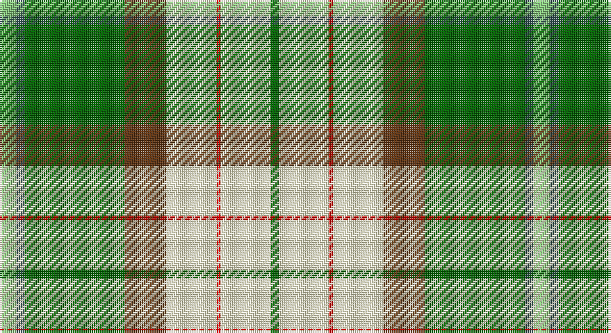

This page is one **sett** — a single exact thread-count. It belongs to the [tartan](/setts/lg4n2g24dy10w12r1w12g2/)
(the same proportion at any scale), whose colour order is pattern [GWRWGGBY](/stripes/gwrwggby/).

Sourced from register-of-tartans.  It is a [8 stripe tartan](/stripes/stripes8/).

Original link https://www.tartanregister.gov.uk/tartanDetails.aspx?ref=10503

## Register references

External register numbers recorded for this tartan.

- Scottish Register of Tartans: [10503](https://www.tartanregister.gov.uk/tartanDetails.aspx?ref=10503)

## Thread count
LG/8 N4 G48 T20 LY24 R2 LY24 G/4

One full sett is **256 threads**.

## Palette

Palette: <strong>Tartan Register</strong> <small style="color:#888">(3 of 6 colours)</small>
<table><thead><tr><th>Colour</th><th>Threads</th><th>Shade</th><th>Base</th><th>OKLCh</th></tr></thead><tbody><tr><td>LG/</td><td style="text-align:right;font-variant-numeric:tabular-nums">8</td><td><code style="background-color:#86C67C;">#86C67C</code> <small style="color:#888">#86C67C</small></td><td>Y <code style="background-color:#F2BF00;">#F2BF00</code></td><td><small style="color:#888">oklch(76.5% 0.122 141.1)</small></td></tr><tr><td>N</td><td style="text-align:right;font-variant-numeric:tabular-nums">4</td><td><code style="background-color:#2F4F4F;">#2F4F4F</code> <small style="color:#888">#2F4F4F</small></td><td>B <code style="background-color:#2A418A;">#2A418A</code></td><td><small style="color:#888">oklch(40.3% 0.038 195.8)</small></td></tr><tr><td>G</td><td style="text-align:right;font-variant-numeric:tabular-nums">48</td><td><code style="background-color:#006400;">#006400</code> <small style="color:#888">#006400</small></td><td>G <code style="background-color:#006100;">#006100</code></td><td><small style="color:#888">oklch(43.6% 0.148 142.5)</small></td></tr><tr><td>T</td><td style="text-align:right;font-variant-numeric:tabular-nums">20</td><td><code style="background-color:#603311;">#603311</code> <small style="color:#888">#603311</small></td><td>G <code style="background-color:#006100;">#006100</code></td><td><small style="color:#888">oklch(37.2% 0.079 53.9)</small></td></tr><tr><td>LY</td><td style="text-align:right;font-variant-numeric:tabular-nums">24</td><td><code style="background-color:#FFFCCF;">#FFFCCF</code> <small style="color:#888">#FFFCCF</small></td><td>W <code style="background-color:#F7F7F7;">#F7F7F7</code></td><td><small style="color:#888">oklch(98.2% 0.058 104.3)</small></td></tr><tr><td>R</td><td style="text-align:right;font-variant-numeric:tabular-nums">2</td><td><code style="background-color:#FF0000;">#FF0000</code> <small style="color:#888">#FF0000</small></td><td>R <code style="background-color:#CC0000;">#CC0000</code></td><td><small style="color:#888">oklch(62.8% 0.258 29.2)</small></td></tr><tr><td>LY</td><td style="text-align:right;font-variant-numeric:tabular-nums">24</td><td><code style="background-color:#FFFCCF;">#FFFCCF</code> <small style="color:#888">#FFFCCF</small></td><td>W <code style="background-color:#F7F7F7;">#F7F7F7</code></td><td><small style="color:#888">oklch(98.2% 0.058 104.3)</small></td></tr><tr><td>G/</td><td style="text-align:right;font-variant-numeric:tabular-nums">4</td><td><code style="background-color:#006400;">#006400</code> <small style="color:#888">#006400</small></td><td>G <code style="background-color:#006100;">#006100</code></td><td><small style="color:#888">oklch(43.6% 0.148 142.5)</small></td></tr></tbody></table>

# Sample pattern

## Nearest tartans

The nearest existing variants by ΔTartan distance, with this tartan at the top so the swatches line up against it.

ΔTartan

Tartan

Sett

—

<a href="/ttd/edit/#slug=lg4n2g24dy10w12r1w12g2~x2">Reuben J Jolley Family (Personal)</a> <a class="nn-out" href="/variants/s8/lg4n2g24dy10w12r1w12g2~x2/" title="open its dictionary page">↗</a>

1.35

<a href="/ttd/edit/#slug=g9k2r4g14w3lp3w23g5ly3~x2&amp;base=lg4n2g24dy10w12r1w12g2~x2">Taylor, dress</a> <a class="nn-out" href="/variants/s9/g9k2r4g14w3lp3w23g5ly3~x2/" title="open its dictionary page">↗</a>

1.41

<a href="/ttd/edit/#slug=ly6k2g12r4g8k10w24b2w3b2~x2&amp;base=lg4n2g24dy10w12r1w12g2~x2">Gillies Dress, Green (Dance)</a> <a class="nn-out" href="/variants/s10/ly6k2g12r4g8k10w24b2w3b2~x2/" title="open its dictionary page">↗</a>

1.43

<a href="/ttd/edit/#slug=dp6t2w24r15g12t4w4t4w4t4g34ly4&amp;base=lg4n2g24dy10w12r1w12g2~x2">Fredericton (District)</a> <a class="nn-out" href="/variants/s12/dp6t2w24r15g12t4w4t4w4t4g34ly4/" title="open its dictionary page">↗</a>

1.46

<a href="/ttd/edit/#slug=ly8r3b2db1w6g12db2~x2&amp;base=lg4n2g24dy10w12r1w12g2~x2">Carmen Lau (Hong Kong) (Personal)</a> <a class="nn-out" href="/variants/s7/ly8r3b2db1w6g12db2~x2/" title="open its dictionary page">↗</a>

1.47

<a href="/ttd/edit/#slug=ly8k3t2do1w6g12do2~x2&amp;base=lg4n2g24dy10w12r1w12g2~x2">Carmen Lau (Hong Kong) (Personal)</a> <a class="nn-out" href="/variants/s7/ly8k3t2do1w6g12do2~x2/" title="open its dictionary page">↗</a>

1.49

<a href="/ttd/edit/#slug=y3g32y36o12k2w68g3k2~x2&amp;base=lg4n2g24dy10w12r1w12g2~x2">Kintail Dress</a> <a class="nn-out" href="/variants/s8/y3g32y36o12k2w68g3k2~x2/" title="open its dictionary page">↗</a>

1.53

<a href="/ttd/edit/#slug=db4w2db1w18dg18g18ly3g4~x2&amp;base=lg4n2g24dy10w12r1w12g2~x2">Gigha, Green (Dance)</a> <a class="nn-out" href="/variants/s8/db4w2db1w18dg18g18ly3g4~x2/" title="open its dictionary page">↗</a>

1.53

<a href="/ttd/edit/#slug=r6g2w21ly2k8ly2g32w1k3~x2&amp;base=lg4n2g24dy10w12r1w12g2~x2">Fiander, Julian (Personal)</a> <a class="nn-out" href="/variants/s9/r6g2w21ly2k8ly2g32w1k3~x2/" title="open its dictionary page">↗</a>

1.54

<a href="/ttd/edit/#slug=dg9k2r4dg14w3lp3w23dg5ly3~x2&amp;base=lg4n2g24dy10w12r1w12g2~x2">Taylor Dress #2</a> <a class="nn-out" href="/variants/s9/dg9k2r4dg14w3lp3w23dg5ly3~x2/" title="open its dictionary page">↗</a>

1.55

<a href="/ttd/edit/#slug=ly6k2g15r6g8k12w25t2w3t2~x2&amp;base=lg4n2g24dy10w12r1w12g2~x2">Gillies, dress Green</a> <a class="nn-out" href="/variants/s10/ly6k2g15r6g8k12w25t2w3t2~x2/" title="open its dictionary page">↗</a>

## Neighbour map

Every grey dot is one of 14360 variants placed by the first two principal components of the ΔTartan feature space (44% of its variance). Red is this tartan; blue dots are its nearest — click one to open its page.

<svg viewBox="0 0 640 380" role="img" style="max-width:100%;height:auto;border:1px solid #e0e0e0;border-radius:4px;display:block" xmlns="http://www.w3.org/2000/svg"><image href="/nn/cloud.v1.png" width="640" height="380"/><a href="/variants/s9/g9k2r4g14w3lp3w23g5ly3~x2/"><circle cx="162.5" cy="131.2" r="4" fill="#3465a4"><title>Taylor, dress</title></circle></a><a href="/variants/s10/ly6k2g12r4g8k10w24b2w3b2~x2/"><circle cx="91.8" cy="115.8" r="4" fill="#3465a4"><title>Gillies Dress, Green (Dance)</title></circle></a><a href="/variants/s12/dp6t2w24r15g12t4w4t4w4t4g34ly4/"><circle cx="136.4" cy="94.2" r="4" fill="#3465a4"><title>Fredericton (District)</title></circle></a><a href="/variants/s7/ly8r3b2db1w6g12db2~x2/"><circle cx="88.9" cy="145.2" r="4" fill="#3465a4"><title>Carmen Lau (Hong Kong) (Personal)</title></circle></a><a href="/variants/s7/ly8k3t2do1w6g12do2~x2/"><circle cx="82.7" cy="141.4" r="4" fill="#3465a4"><title>Carmen Lau (Hong Kong) (Personal)</title></circle></a><a href="/variants/s8/y3g32y36o12k2w68g3k2~x2/"><circle cx="226.6" cy="96.4" r="4" fill="#3465a4"><title>Kintail Dress</title></circle></a><a href="/variants/s8/db4w2db1w18dg18g18ly3g4~x2/"><circle cx="136.1" cy="141.1" r="4" fill="#3465a4"><title>Gigha, Green (Dance)</title></circle></a><a href="/variants/s9/r6g2w21ly2k8ly2g32w1k3~x2/"><circle cx="216.3" cy="87.0" r="4" fill="#3465a4"><title>Fiander, Julian (Personal)</title></circle></a><a href="/variants/s9/dg9k2r4dg14w3lp3w23dg5ly3~x2/"><circle cx="158.5" cy="128.9" r="4" fill="#3465a4"><title>Taylor Dress #2</title></circle></a><a href="/variants/s10/ly6k2g15r6g8k12w25t2w3t2~x2/"><circle cx="83.8" cy="117.3" r="4" fill="#3465a4"><title>Gillies, dress Green</title></circle></a><circle cx="156.3" cy="108.8" r="5" fill="#c00000"/></svg>

ID: /variants/s8/lg4n2g24dy10w12r1w12g2~x2/
