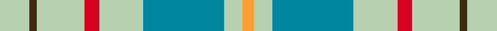

This page is one **sett** — a single exact thread-count. It belongs to the [tartan](/setts/lg8do2lg13r4lg12t22lg5lo3/)
(the same proportion at any scale), whose colour order is pattern [YBYRYBYY](/stripes/ybyrybyy/).

Sourced from house-of-tartan.  It is a [8 stripe tartan](/stripes/stripes8/).

Original link http://www.house-of-tartan.scotland.net/house/TartanViewjs.asp?colr=Def&tnam=2262

## Provenance

Earliest known date: 1996 One of a series of Irish District tartans designed by Polly Wittering of the House of Edgar, with colours reminiscent of the Country with soft warm colours dominating.

## Thread count
LG/16 DO4 LG26 R8 LG24 T44 LG10 LO/6

One full sett is **254 threads**.

## Palette
<table><thead><tr><th>Colour</th><th>Shade</th><th>OKLCh</th></tr></thead><tbody><tr><td>B</td><td><code style="background-color:#00879F;">#00879F</code> <small style="color:#888">#00879F</small></td><td><small style="color:#888">oklch(57.4% 0.102 216.1)</small></td></tr><tr><td>DR</td><td><code style="background-color:#D60020;">#D60020</code> <small style="color:#888">#D60020</small></td><td><small style="color:#888">oklch(55.2% 0.224 25.5)</small></td></tr><tr><td>DY</td><td><code style="background-color:#FF9C34;">#FF9C34</code> <small style="color:#888">#FF9C34</small></td><td><small style="color:#888">oklch(77.9% 0.161 61.8)</small></td></tr><tr><td>LG</td><td><code style="background-color:#6CAC84;">#6CAC84</code> <small style="color:#888">#6CAC84</small></td><td><small style="color:#888">oklch(69.0% 0.089 155.8)</small></td></tr><tr><td>N</td><td><code style="background-color:#B4D0AC;">#B4D0AC</code> <small style="color:#888">#B4D0AC</small></td><td><small style="color:#888">oklch(82.7% 0.058 138.8)</small></td></tr><tr><td>T</td><td><code style="background-color:#412714;">#412714</code> <small style="color:#888">#412714</small></td><td><small style="color:#888">oklch(30.1% 0.050 55.7)</small></td></tr></tbody></table>

# Sample pattern

## Nearest variants

The nearest existing variants by ΔTartan distance, with this cloth at the top so the swatches line up against it.

ΔTartan

Threads

Variant

Sett

—

254

<a href="/variants/s8/lg8do2lg13r4lg12t22lg5lo3~x2~lg3302138/">Kildare Irish County Tartan</a>

<a href="/ttd/edit/#slug=g1b8g8r1g8b8w1~x4&amp;base=lg8do2lg13r4lg12t22lg5lo3~x2~lg3302138" title="compare in the TTD">2.20</a>

272

<a href="/variants/s7/g1b8g8r1g8b8w1~x4/">MacKinnon Hunting</a>

<a href="/ttd/edit/#slug=g1b8g8r1g8b8w1~x2&amp;base=lg8do2lg13r4lg12t22lg5lo3~x2~lg3302138" title="compare in the TTD">2.20</a>

136

<a href="/variants/s7/g1b8g8r1g8b8w1~x2/">MacKinnon Hunting</a>

<a href="/ttd/edit/#slug=y2r6g1ri2g12lb1g1lb2~x2~r1807008-ri2109032&amp;base=lg8do2lg13r4lg12t22lg5lo3~x2~lg3302138" title="compare in the TTD">2.59</a>

100

<a href="/variants/s8/y2r6g1ri2g12lb1g1lb2~x2~r1807008-ri2109032/">Manitoba District Tartan</a>

<a href="/ttd/edit/#slug=y2r6g1ri2g12lb1g1lb2~x2~r1707016-ri2008029&amp;base=lg8do2lg13r4lg12t22lg5lo3~x2~lg3302138" title="compare in the TTD">2.59</a>

100

<a href="/variants/s8/y2r6g1ri2g12lb1g1lb2~x2~r1707016-ri2008029/">Manitoba</a>

<a href="/ttd/edit/#slug=y2r6g1ri2g12lb1g1lb2~x2~r1707016-ri2209032&amp;base=lg8do2lg13r4lg12t22lg5lo3~x2~lg3302138" title="compare in the TTD">2.59</a>

100

<a href="/variants/s8/y2r6g1ri2g12lb1g1lb2~x2~r1707016-ri2209032/">Manitoba Red</a>

## Neighbour map

Every grey dot is one of 13620 variants placed by the first two principal components of the ΔTartan feature space (42% of its variance). Red is this tartan; blue dots are its nearest — click one to open its page.

<svg viewBox="0 0 640 380" role="img" style="max-width:100%;height:auto;border:1px solid #e0e0e0;border-radius:4px;display:block" xmlns="http://www.w3.org/2000/svg"><image href="/nn/cloud.v1.png" width="640" height="380"/><a href="/variants/s7/g1b8g8r1g8b8w1~x4/"><circle cx="316.9" cy="253.7" r="4" fill="#3465a4"><title>MacKinnon Hunting</title></circle></a><a href="/variants/s7/g1b8g8r1g8b8w1~x2/"><circle cx="316.9" cy="253.7" r="4" fill="#3465a4"><title>MacKinnon Hunting</title></circle></a><a href="/variants/s8/y2r6g1ri2g12lb1g1lb2~x2~r1807008-ri2109032/"><circle cx="296.2" cy="177.8" r="4" fill="#3465a4"><title>Manitoba District Tartan</title></circle></a><a href="/variants/s8/y2r6g1ri2g12lb1g1lb2~x2~r1707016-ri2008029/"><circle cx="296.6" cy="178.5" r="4" fill="#3465a4"><title>Manitoba</title></circle></a><a href="/variants/s8/y2r6g1ri2g12lb1g1lb2~x2~r1707016-ri2209032/"><circle cx="296.8" cy="178.3" r="4" fill="#3465a4"><title>Manitoba Red</title></circle></a><circle cx="320.7" cy="218.8" r="5" fill="#c00000"/><text x="320" y="376" text-anchor="middle" font-size="11" fill="#999">ground</text><text x="11" y="190" text-anchor="middle" font-size="11" fill="#999" transform="rotate(-90 11 190)">complexity</text></svg>

ID: /variants/s8/lg8do2lg13r4lg12t22lg5lo3~x2~lg3302138/
