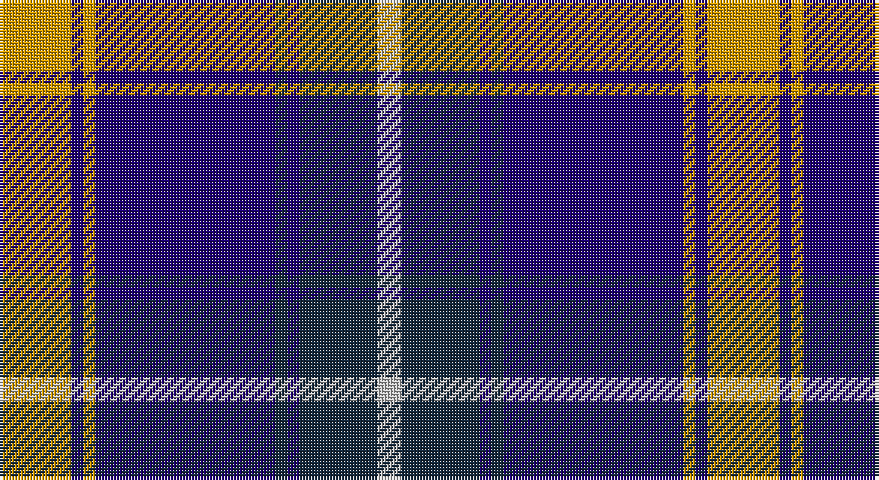

This page is one **sett** — a single exact thread-count. It belongs to the [tartan](/setts/lo12db2lo2db30dt2db2dt13lb4/)
(the same proportion at any scale), whose colour order is pattern [WBBBBYBY](/stripes/wbbbbyby/).

Part of the [Highlands School](/tartans/highlands-school/) tartan — the named design grouping this sett with its other cloths.

Sourced from register-of-tartans.  It is a [8 stripe tartan](/stripes/stripes8/).

Original link https://www.tartanregister.gov.uk/tartanDetails.aspx?ref=1732

## Also known as

This cloth is also recorded under:

- Highlands School,

2 attestations — the source records this cloth was collapsed from (oldest owns this page)

<ul>
<li>01/01/1991 — Highlands School (North Carolina) (register-of-tartans, <a href="https://www.tartanregister.gov.uk/tartanDetails.aspx?ref=1732">record</a>)</li>
<li>pre 2002 — Highlands School (Corporate) (tartans-authority, <a href="http://www.tartansauthority.com/tartan-ferret/display/2109/">record</a>)</li>
</ul>

## Register references

External register numbers recorded for this tartan.

- Scottish Register of Tartans: [1732](https://www.tartanregister.gov.uk/tartanDetails.aspx?ref=1732)
- Scottish Tartans Authority (ITI): 2109
- Scottish Tartans World Register: 2109

## Thread count
DY/24 DB4 DY4 DB60 DN4 DB4 DN26 N/8

One full sett is **236 threads**.

## Palette

Palette: <strong>Tartan Register</strong> <small style="color:#888">(3 of 4 colours)</small>
<table><thead><tr><th>Colour</th><th>Threads</th><th>Shade</th><th>Base</th><th>OKLCh</th></tr></thead><tbody><tr><td>DY/</td><td style="text-align:right;font-variant-numeric:tabular-nums">24</td><td><code style="background-color:#D09800;">#D09800</code> <small style="color:#888">#D09800</small></td><td>Y <code style="background-color:#F2BF00;">#F2BF00</code></td><td><small style="color:#888">oklch(71.4% 0.147 82.1)</small></td></tr><tr><td>DB</td><td style="text-align:right;font-variant-numeric:tabular-nums">4</td><td><code style="background-color:#1C0070;">#1C0070</code> <small style="color:#888">#1C0070</small></td><td>B <code style="background-color:#2A418A;">#2A418A</code></td><td><small style="color:#888">oklch(26.3% 0.162 277.1)</small></td></tr><tr><td>DY</td><td style="text-align:right;font-variant-numeric:tabular-nums">4</td><td><code style="background-color:#D09800;">#D09800</code> <small style="color:#888">#D09800</small></td><td>Y <code style="background-color:#F2BF00;">#F2BF00</code></td><td><small style="color:#888">oklch(71.4% 0.147 82.1)</small></td></tr><tr><td>DB</td><td style="text-align:right;font-variant-numeric:tabular-nums">60</td><td><code style="background-color:#1C0070;">#1C0070</code> <small style="color:#888">#1C0070</small></td><td>B <code style="background-color:#2A418A;">#2A418A</code></td><td><small style="color:#888">oklch(26.3% 0.162 277.1)</small></td></tr><tr><td>DN</td><td style="text-align:right;font-variant-numeric:tabular-nums">4</td><td><code style="background-color:#14283C;">#14283C</code> <small style="color:#888">#14283C</small></td><td>B <code style="background-color:#2A418A;">#2A418A</code></td><td><small style="color:#888">oklch(27.1% 0.046 249.9)</small></td></tr><tr><td>DB</td><td style="text-align:right;font-variant-numeric:tabular-nums">4</td><td><code style="background-color:#1C0070;">#1C0070</code> <small style="color:#888">#1C0070</small></td><td>B <code style="background-color:#2A418A;">#2A418A</code></td><td><small style="color:#888">oklch(26.3% 0.162 277.1)</small></td></tr><tr><td>DN</td><td style="text-align:right;font-variant-numeric:tabular-nums">26</td><td><code style="background-color:#14283C;">#14283C</code> <small style="color:#888">#14283C</small></td><td>B <code style="background-color:#2A418A;">#2A418A</code></td><td><small style="color:#888">oklch(27.1% 0.046 249.9)</small></td></tr><tr><td>N/</td><td style="text-align:right;font-variant-numeric:tabular-nums">8</td><td><code style="background-color:#C0C0C0;">#C0C0C0</code> <small style="color:#888">#C0C0C0</small></td><td>W <code style="background-color:#F7F7F7;">#F7F7F7</code></td><td><small style="color:#888">oklch(80.8% 0.000 89.9)</small></td></tr></tbody></table>

# Sample pattern

## Nearest tartans

The nearest existing variants by ΔTartan distance, with this tartan at the top so the swatches line up against it.

ΔTartan

Tartan

Sett

—

<a href="/ttd/edit/#slug=lo12db2lo2db30dt2db2dt13lb4~x2">Highlands School (North Carolina)</a> <a class="nn-out" href="/variants/s8/lo12db2lo2db30dt2db2dt13lb4~x2/" title="open its dictionary page">↗</a>

0.65

<a href="/ttd/edit/#slug=ly12dbi2ly2dbi30db3dbi2db13w4~x2&amp;base=lo12db2lo2db30dt2db2dt13lb4~x2">Highlands School (N. Carolina) Corporate Tartan</a> <a class="nn-out" href="/variants/s8/ly12dbi2ly2dbi30db3dbi2db13w4~x2/" title="open its dictionary page">↗</a>

0.66

<a href="/ttd/edit/#slug=r3db20k6lb5k4lb3k2r1db2~x2&amp;base=lo12db2lo2db30dt2db2dt13lb4~x2">Scottish Knights Templar Int. (Corp)</a> <a class="nn-out" href="/variants/s9/r3db20k6lb5k4lb3k2r1db2~x2/" title="open its dictionary page">↗</a>

0.71

<a href="/ttd/edit/#slug=lo6db3lo3db15dbi7lo7dbi5lo17dbi46lo4&amp;base=lo12db2lo2db30dt2db2dt13lb4~x2">Rhys (Welsh Name)</a> <a class="nn-out" href="/variants/s10/lo6db3lo3db15dbi7lo7dbi5lo17dbi46lo4/" title="open its dictionary page">↗</a>

0.73

<a href="/ttd/edit/#slug=y12db2y2db30dbi3db2dbi13w4~x2&amp;base=lo12db2lo2db30dt2db2dt13lb4~x2">Highlands School, (North Carolina)</a> <a class="nn-out" href="/variants/s8/y12db2y2db30dbi3db2dbi13w4~x2/" title="open its dictionary page">↗</a>

0.95

<a href="/ttd/edit/#slug=r3db20k6w5k4w3k2r1db2~x2&amp;base=lo12db2lo2db30dt2db2dt13lb4~x2">Scottish Knights Templar, of M.T.S. International</a> <a class="nn-out" href="/variants/s9/r3db20k6w5k4w3k2r1db2~x2/" title="open its dictionary page">↗</a>

0.96

<a href="/ttd/edit/#slug=r3db2w2db26k22w3db3w3~x2&amp;base=lo12db2lo2db30dt2db2dt13lb4~x2">DeCloud-McMasters (Personal)</a> <a class="nn-out" href="/variants/s8/r3db2w2db26k22w3db3w3~x2/" title="open its dictionary page">↗</a>

0.96

<a href="/ttd/edit/#slug=k8r1k1r1k4b11ly1b2~x6&amp;base=lo12db2lo2db30dt2db2dt13lb4~x2">Rutherford</a> <a class="nn-out" href="/variants/s8/k8r1k1r1k4b11ly1b2~x6/" title="open its dictionary page">↗</a>

0.96

<a href="/ttd/edit/#slug=k3db30k8w8k2r3~x2&amp;base=lo12db2lo2db30dt2db2dt13lb4~x2">Hydro-Electric</a> <a class="nn-out" href="/variants/s6/k3db30k8w8k2r3~x2/" title="open its dictionary page">↗</a>

1.04

<a href="/ttd/edit/#slug=db30lb2k9w3db6w4k3lb6~x2&amp;base=lo12db2lo2db30dt2db2dt13lb4~x2">Detroit Lions</a> <a class="nn-out" href="/variants/s8/db30lb2k9w3db6w4k3lb6~x2/" title="open its dictionary page">↗</a>

1.05

<a href="/ttd/edit/#slug=db4w1db1w3db24y9k1y9k3~x2&amp;base=lo12db2lo2db30dt2db2dt13lb4~x2">Historic Scotland</a> <a class="nn-out" href="/variants/s9/db4w1db1w3db24y9k1y9k3~x2/" title="open its dictionary page">↗</a>

## Neighbour map

Every grey dot is one of 14360 variants placed by the first two principal components of the ΔTartan feature space (44% of its variance). Red is this tartan; blue dots are its nearest — click one to open its page.

<svg viewBox="0 0 640 380" role="img" style="max-width:100%;height:auto;border:1px solid #e0e0e0;border-radius:4px;display:block" xmlns="http://www.w3.org/2000/svg"><image href="/nn/cloud.v1.png" width="640" height="380"/><a href="/variants/s8/ly12dbi2ly2dbi30db3dbi2db13w4~x2/"><circle cx="259.8" cy="156.5" r="4" fill="#3465a4"><title>Highlands School (N. Carolina) Corporate Tartan</title></circle></a><a href="/variants/s9/r3db20k6lb5k4lb3k2r1db2~x2/"><circle cx="265.8" cy="146.5" r="4" fill="#3465a4"><title>Scottish Knights Templar Int. (Corp)</title></circle></a><a href="/variants/s10/lo6db3lo3db15dbi7lo7dbi5lo17dbi46lo4/"><circle cx="285.0" cy="159.6" r="4" fill="#3465a4"><title>Rhys (Welsh Name)</title></circle></a><a href="/variants/s8/y12db2y2db30dbi3db2dbi13w4~x2/"><circle cx="279.9" cy="171.4" r="4" fill="#3465a4"><title>Highlands School, (North Carolina)</title></circle></a><a href="/variants/s9/r3db20k6w5k4w3k2r1db2~x2/"><circle cx="244.0" cy="136.9" r="4" fill="#3465a4"><title>Scottish Knights Templar, of M.T.S. International</title></circle></a><a href="/variants/s8/r3db2w2db26k22w3db3w3~x2/"><circle cx="256.3" cy="162.2" r="4" fill="#3465a4"><title>DeCloud-McMasters (Personal)</title></circle></a><a href="/variants/s8/k8r1k1r1k4b11ly1b2~x6/"><circle cx="261.3" cy="181.2" r="4" fill="#3465a4"><title>Rutherford</title></circle></a><a href="/variants/s6/k3db30k8w8k2r3~x2/"><circle cx="291.1" cy="168.8" r="4" fill="#3465a4"><title>Hydro-Electric</title></circle></a><a href="/variants/s8/db30lb2k9w3db6w4k3lb6~x2/"><circle cx="290.8" cy="154.2" r="4" fill="#3465a4"><title>Detroit Lions</title></circle></a><a href="/variants/s9/db4w1db1w3db24y9k1y9k3~x2/"><circle cx="301.2" cy="138.3" r="4" fill="#3465a4"><title>Historic Scotland</title></circle></a><circle cx="272.7" cy="161.3" r="5" fill="#c00000"/></svg>

ID: /variants/s8/lo12db2lo2db30dt2db2dt13lb4~x2/
