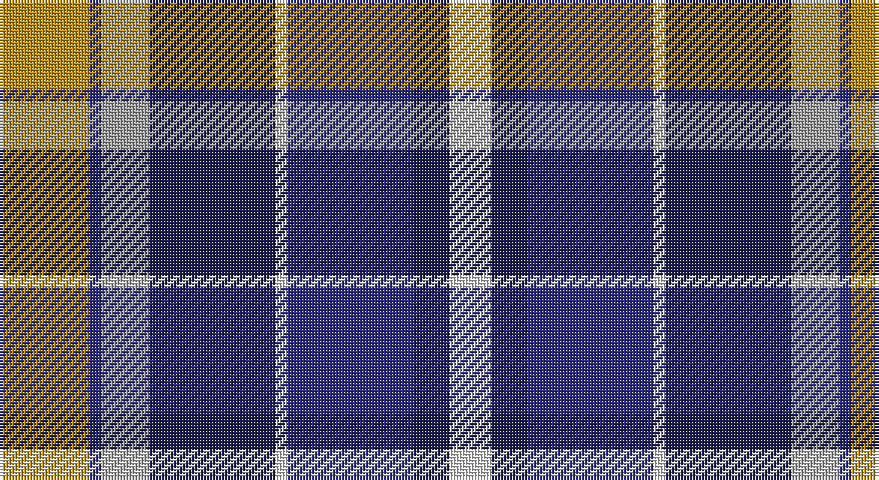

This page is one **sett** — a single exact thread-count. It belongs to the [tartan](/setts/lo15db2lr8dbi21w2db21dbi6w7/)
(the same proportion at any scale), whose colour order is pattern [WBBWBYBY](/stripes/wbbwbyby/).

Sourced from tartans-authority.  It is a [8 stripe tartan](/stripes/stripes8/).

Original link http://www.tartansauthority.com/tartan-ferret/display/7412/

## Also known as

This cloth is also recorded under:

- Monaghan County, Crest Range

2 attestations — the source records this cloth was collapsed from (oldest owns this page)

<ul>
<li>2004 — Monaghan County Crest (Fashion) (tartans-authority, <a href="http://www.tartansauthority.com/tartan-ferret/display/7412/">record</a>)</li>
<li>01/05/2005 — Monaghan County, Crest Range (register-of-tartans, <a href="https://www.tartanregister.gov.uk/tartanDetails.aspx?ref=5041">record</a>)</li>
</ul>

## Register references

External register numbers recorded for this tartan.

- Scottish Register of Tartans: [5041](https://www.tartanregister.gov.uk/tartanDetails.aspx?ref=5041)
- Scottish Tartans Authority (ITI): 7412
- Scottish Tartans World Register: 3096

## Thread count
DY/30 DB4 N16 DBa42 LN4 DB42 DBa12 LN/14

One full sett is **284 threads**.

## Palette

Palette: <strong>Tartan Register</strong>
<table><thead><tr><th>Colour</th><th>Threads</th><th>Shade</th><th>Base</th><th>OKLCh</th></tr></thead><tbody><tr><td>DY/</td><td style="text-align:right;font-variant-numeric:tabular-nums">30</td><td><code style="background-color:#BC8C00;">#BC8C00</code> <small style="color:#888">#BC8C00</small></td><td>Y <code style="background-color:#F2BF00;">#F2BF00</code></td><td><small style="color:#888">oklch(66.8% 0.137 84.1)</small></td></tr><tr><td>DB</td><td style="text-align:right;font-variant-numeric:tabular-nums">4</td><td><code style="background-color:#2C2C80;">#2C2C80</code> <small style="color:#888">#2C2C80</small></td><td>B <code style="background-color:#2A418A;">#2A418A</code></td><td><small style="color:#888">oklch(35.0% 0.138 276.6)</small></td></tr><tr><td>N</td><td style="text-align:right;font-variant-numeric:tabular-nums">16</td><td><code style="background-color:#A0A0A0;">#A0A0A0</code> <small style="color:#888">#A0A0A0</small></td><td>Y <code style="background-color:#F2BF00;">#F2BF00</code></td><td><small style="color:#888">oklch(70.6% 0.000 89.9)</small></td></tr><tr><td>DBa</td><td style="text-align:right;font-variant-numeric:tabular-nums">42</td><td><code style="background-color:#1C1C50;">#1C1C50</code> <small style="color:#888">#1C1C50</small></td><td>B <code style="background-color:#2A418A;">#2A418A</code></td><td><small style="color:#888">oklch(26.2% 0.093 277.9)</small></td></tr><tr><td>LN</td><td style="text-align:right;font-variant-numeric:tabular-nums">4</td><td><code style="background-color:#E0E0E0;">#E0E0E0</code> <small style="color:#888">#E0E0E0</small></td><td>W <code style="background-color:#F7F7F7;">#F7F7F7</code></td><td><small style="color:#888">oklch(90.7% 0.000 89.9)</small></td></tr><tr><td>DB</td><td style="text-align:right;font-variant-numeric:tabular-nums">42</td><td><code style="background-color:#2C2C80;">#2C2C80</code> <small style="color:#888">#2C2C80</small></td><td>B <code style="background-color:#2A418A;">#2A418A</code></td><td><small style="color:#888">oklch(35.0% 0.138 276.6)</small></td></tr><tr><td>DBa</td><td style="text-align:right;font-variant-numeric:tabular-nums">12</td><td><code style="background-color:#1C1C50;">#1C1C50</code> <small style="color:#888">#1C1C50</small></td><td>B <code style="background-color:#2A418A;">#2A418A</code></td><td><small style="color:#888">oklch(26.2% 0.093 277.9)</small></td></tr><tr><td>LN/</td><td style="text-align:right;font-variant-numeric:tabular-nums">14</td><td><code style="background-color:#E0E0E0;">#E0E0E0</code> <small style="color:#888">#E0E0E0</small></td><td>W <code style="background-color:#F7F7F7;">#F7F7F7</code></td><td><small style="color:#888">oklch(90.7% 0.000 89.9)</small></td></tr></tbody></table>

# Sample pattern

## Nearest tartans

The nearest existing variants by ΔTartan distance, with this tartan at the top so the swatches line up against it.

ΔTartan

Tartan

Sett

—

<a href="/ttd/edit/#slug=lo15db2lr8dbi21w2db21dbi6w7~x2">Monaghan County Crest (Fashion)</a> <a class="nn-out" href="/variants/s8/lo15db2lr8dbi21w2db21dbi6w7~x2/" title="open its dictionary page">↗</a>

0.74

<a href="/ttd/edit/#slug=w3t2n14lr8t14db16n13t2w3~x2&amp;base=lo15db2lr8dbi21w2db21dbi6w7~x2">Caitriot</a> <a class="nn-out" href="/variants/s9/w3t2n14lr8t14db16n13t2w3~x2/" title="open its dictionary page">↗</a>

0.87

<a href="/ttd/edit/#slug=y10k1db13k3lb9lo3~x2&amp;base=lo15db2lr8dbi21w2db21dbi6w7~x2">Inverary</a> <a class="nn-out" href="/variants/s6/y10k1db13k3lb9lo3~x2/" title="open its dictionary page">↗</a>

0.95

<a href="/ttd/edit/#slug=n12k2n2k2n2k12lp12t3w1~x2&amp;base=lo15db2lr8dbi21w2db21dbi6w7~x2">de Franck, Matt (Personal)</a> <a class="nn-out" href="/variants/s9/n12k2n2k2n2k12lp12t3w1~x2/" title="open its dictionary page">↗</a>

0.98

<a href="/ttd/edit/#slug=o10k3w3k3w3k3o10k7db20r3~x2&amp;base=lo15db2lr8dbi21w2db21dbi6w7~x2">Meeting Professionals International</a> <a class="nn-out" href="/variants/s10/o10k3w3k3w3k3o10k7db20r3~x2/" title="open its dictionary page">↗</a>

0.98

<a href="/ttd/edit/#slug=w2k1m10k6b12lo2~x2&amp;base=lo15db2lr8dbi21w2db21dbi6w7~x2">Soroptimist International (Corporate</a> <a class="nn-out" href="/variants/s6/w2k1m10k6b12lo2~x2/" title="open its dictionary page">↗</a>

1.05

<a href="/ttd/edit/#slug=do7w1r6db10g10w1~x4&amp;base=lo15db2lr8dbi21w2db21dbi6w7~x2">McEachern, Andrew</a> <a class="nn-out" href="/variants/s6/do7w1r6db10g10w1~x4/" title="open its dictionary page">↗</a>

1.08

<a href="/ttd/edit/#slug=db10k2g2r2g2k2w2k2w4k1w2~x4&amp;base=lo15db2lr8dbi21w2db21dbi6w7~x2">Highfield Dress (Name)</a> <a class="nn-out" href="/variants/s11/db10k2g2r2g2k2w2k2w4k1w2~x4/" title="open its dictionary page">↗</a>

1.12

<a href="/ttd/edit/#slug=w8dbi5db30lr4dbi13lr13g5lo5~x2&amp;base=lo15db2lr8dbi21w2db21dbi6w7~x2">Waterford County Crest (Fashion)</a> <a class="nn-out" href="/variants/s8/w8dbi5db30lr4dbi13lr13g5lo5~x2/" title="open its dictionary page">↗</a>

1.15

<a href="/ttd/edit/#slug=k4lb2db5lb7db9g14o4g1o4~x2&amp;base=lo15db2lr8dbi21w2db21dbi6w7~x2">Antigonish Centennial</a> <a class="nn-out" href="/variants/s9/k4lb2db5lb7db9g14o4g1o4~x2/" title="open its dictionary page">↗</a>

1.15

<a href="/ttd/edit/#slug=lb4r2db14k4lb4k3lb3k2r2lbi2~x2&amp;base=lo15db2lr8dbi21w2db21dbi6w7~x2">Naysmith, William A (Personal)</a> <a class="nn-out" href="/variants/s10/lb4r2db14k4lb4k3lb3k2r2lbi2~x2/" title="open its dictionary page">↗</a>

## Neighbour map

Every grey dot is one of 14360 variants placed by the first two principal components of the ΔTartan feature space (44% of its variance). Red is this tartan; blue dots are its nearest — click one to open its page.

<svg viewBox="0 0 640 380" role="img" style="max-width:100%;height:auto;border:1px solid #e0e0e0;border-radius:4px;display:block" xmlns="http://www.w3.org/2000/svg"><image href="/nn/cloud.v1.png" width="640" height="380"/><a href="/variants/s9/w3t2n14lr8t14db16n13t2w3~x2/"><circle cx="113.8" cy="194.8" r="4" fill="#3465a4"><title>Caitriot</title></circle></a><a href="/variants/s6/y10k1db13k3lb9lo3~x2/"><circle cx="117.1" cy="185.8" r="4" fill="#3465a4"><title>Inverary</title></circle></a><a href="/variants/s9/n12k2n2k2n2k12lp12t3w1~x2/"><circle cx="149.9" cy="156.7" r="4" fill="#3465a4"><title>de Franck, Matt (Personal)</title></circle></a><a href="/variants/s10/o10k3w3k3w3k3o10k7db20r3~x2/"><circle cx="101.0" cy="178.7" r="4" fill="#3465a4"><title>Meeting Professionals International</title></circle></a><a href="/variants/s6/w2k1m10k6b12lo2~x2/"><circle cx="163.9" cy="189.5" r="4" fill="#3465a4"><title>Soroptimist International (Corporate</title></circle></a><a href="/variants/s6/do7w1r6db10g10w1~x4/"><circle cx="104.5" cy="211.2" r="4" fill="#3465a4"><title>McEachern, Andrew</title></circle></a><a href="/variants/s11/db10k2g2r2g2k2w2k2w4k1w2~x4/"><circle cx="93.3" cy="149.2" r="4" fill="#3465a4"><title>Highfield Dress (Name)</title></circle></a><a href="/variants/s8/w8dbi5db30lr4dbi13lr13g5lo5~x2/"><circle cx="99.2" cy="172.9" r="4" fill="#3465a4"><title>Waterford County Crest (Fashion)</title></circle></a><a href="/variants/s9/k4lb2db5lb7db9g14o4g1o4~x2/"><circle cx="100.2" cy="173.5" r="4" fill="#3465a4"><title>Antigonish Centennial</title></circle></a><a href="/variants/s10/lb4r2db14k4lb4k3lb3k2r2lbi2~x2/"><circle cx="108.6" cy="167.6" r="4" fill="#3465a4"><title>Naysmith, William A (Personal)</title></circle></a><circle cx="109.7" cy="179.6" r="5" fill="#c00000"/></svg>

ID: /variants/s8/lo15db2lr8dbi21w2db21dbi6w7~x2/
