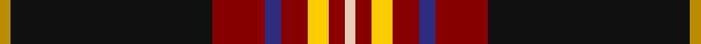
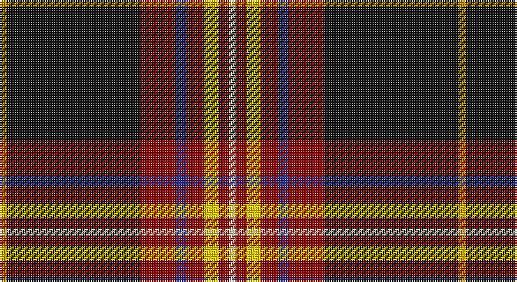

This page is one **sett** — a single exact thread-count. It belongs to the [tartan](/setts/lo2k38r10db3r5ly4r3lb2/)
(the same proportion at any scale), whose colour order is pattern [WRYRBRKY](/stripes/wryrbrky/).

Part of the [Westin Kierland](/tartans/westin-kierland/) tartan — the named design grouping this sett with its other cloths.

Sourced from tartans-authority.  It is a [8 stripe tartan](/stripes/stripes8/).

Original link http://www.tartansauthority.com/tartan-ferret/display/8699/

## Register references

External register numbers recorded for this tartan.

- Scottish Register of Tartans: [8699](https://www.tartanregister.gov.uk/tartanDetails?ref=8699)
- Scottish Tartans Authority (ITI): 8699

## Thread count
DY/4 K76 DR20 DB6 DR10 Y8 DR6 LR/4

One full sett is **260 threads**.

## Palette

Palette: <strong>Tartan Register</strong>
<table><thead><tr><th>Colour</th><th>Threads</th><th>Shade</th><th>Base</th><th>OKLCh</th></tr></thead><tbody><tr><td>DY/</td><td style="text-align:right;font-variant-numeric:tabular-nums">4</td><td><code style="background-color:#BC8C00;">#BC8C00</code> <small style="color:#888">#BC8C00</small></td><td>Y <code style="background-color:#F2BF00;">#F2BF00</code></td><td><small style="color:#888">oklch(66.8% 0.137 84.1)</small></td></tr><tr><td>K</td><td style="text-align:right;font-variant-numeric:tabular-nums">76</td><td><code style="background-color:#101010;">#101010</code> <small style="color:#888">#101010</small></td><td>K <code style="background-color:#000000;">#000000</code></td><td><small style="color:#888">oklch(17.3% 0.000 89.9)</small></td></tr><tr><td>DR</td><td style="text-align:right;font-variant-numeric:tabular-nums">20</td><td><code style="background-color:#880000;">#880000</code> <small style="color:#888">#880000</small></td><td>R <code style="background-color:#CC0000;">#CC0000</code></td><td><small style="color:#888">oklch(39.4% 0.162 29.2)</small></td></tr><tr><td>DB</td><td style="text-align:right;font-variant-numeric:tabular-nums">6</td><td><code style="background-color:#2C2C80;">#2C2C80</code> <small style="color:#888">#2C2C80</small></td><td>B <code style="background-color:#2A418A;">#2A418A</code></td><td><small style="color:#888">oklch(35.0% 0.138 276.6)</small></td></tr><tr><td>DR</td><td style="text-align:right;font-variant-numeric:tabular-nums">10</td><td><code style="background-color:#880000;">#880000</code> <small style="color:#888">#880000</small></td><td>R <code style="background-color:#CC0000;">#CC0000</code></td><td><small style="color:#888">oklch(39.4% 0.162 29.2)</small></td></tr><tr><td>Y</td><td style="text-align:right;font-variant-numeric:tabular-nums">8</td><td><code style="background-color:#FCCC00;">#FCCC00</code> <small style="color:#888">#FCCC00</small></td><td>Y <code style="background-color:#F2BF00;">#F2BF00</code></td><td><small style="color:#888">oklch(86.2% 0.176 91.5)</small></td></tr><tr><td>DR</td><td style="text-align:right;font-variant-numeric:tabular-nums">6</td><td><code style="background-color:#880000;">#880000</code> <small style="color:#888">#880000</small></td><td>R <code style="background-color:#CC0000;">#CC0000</code></td><td><small style="color:#888">oklch(39.4% 0.162 29.2)</small></td></tr><tr><td>LR/</td><td style="text-align:right;font-variant-numeric:tabular-nums">4</td><td><code style="background-color:#E8CCB8;">#E8CCB8</code> <small style="color:#888">#E8CCB8</small></td><td>W <code style="background-color:#F7F7F7;">#F7F7F7</code></td><td><small style="color:#888">oklch(86.3% 0.042 57.7)</small></td></tr></tbody></table>

# Sample pattern

## Compared to the master

This cloth is one sett of its design; the master sett (the exemplar the design is anchored on) is below for comparison.

<figure style="margin:0"><figcaption style="color:#888;font-size:smaller">this sett</figcaption></figure>
<figure style="margin:0"><figcaption style="color:#888;font-size:smaller"><a href="/setts/o2k37r10db3r5lo4r3w2/">master sett →</a></figcaption></figure>

## Nearest tartans

The nearest existing variants by ΔTartan distance, with this tartan at the top so the swatches line up against it.

ΔTartan

Tartan

Sett

—

<a href="/ttd/edit/#slug=lo2k38r10db3r5ly4r3lb2~x2">Westin Kierland (Corporate)</a> <a class="nn-out" href="/variants/s8/lo2k38r10db3r5ly4r3lb2~x2/" title="open its dictionary page">↗</a>

0.56

<a href="/ttd/edit/#slug=o2k37r10db3r5lo4r3w2~x2&amp;base=lo2k38r10db3r5ly4r3lb2~x2">Westin Kierland</a> <a class="nn-out" href="/variants/s8/o2k37r10db3r5lo4r3w2~x2/" title="open its dictionary page">↗</a>

0.59

<a href="/ttd/edit/#slug=o2k37r10db3r5ly4r3w2~x2&amp;base=lo2k38r10db3r5ly4r3lb2~x2">Westin Kierland</a> <a class="nn-out" href="/variants/s8/o2k37r10db3r5ly4r3w2~x2/" title="open its dictionary page">↗</a>

0.84

<a href="/ttd/edit/#slug=do62ly7g7r3w3db13w3r5~x2&amp;base=lo2k38r10db3r5ly4r3lb2~x2">Legion of Frontiersmen</a> <a class="nn-out" href="/variants/s8/do62ly7g7r3w3db13w3r5~x2/" title="open its dictionary page">↗</a>

0.93

<a href="/ttd/edit/#slug=dr62ly7g7r3w3db13w3r5~x2&amp;base=lo2k38r10db3r5ly4r3lb2~x2">Legion of Frontiersmen</a> <a class="nn-out" href="/variants/s8/dr62ly7g7r3w3db13w3r5~x2/" title="open its dictionary page">↗</a>

1.32

<a href="/ttd/edit/#slug=k58db5w5k10ly3k3w3k3dg14r11k3r4w3~x2&amp;base=lo2k38r10db3r5ly4r3lb2~x2">Stuart/Stewart Black #2</a> <a class="nn-out" href="/variants/s13/k58db5w5k10ly3k3w3k3dg14r11k3r4w3~x2/" title="open its dictionary page">↗</a>

1.35

<a href="/ttd/edit/#slug=db6w3r14k3lo2k2w2k38w2k2lo2~x2&amp;base=lo2k38r10db3r5ly4r3lb2~x2">Norwegian Night</a> <a class="nn-out" href="/variants/s11/db6w3r14k3lo2k2w2k38w2k2lo2~x2/" title="open its dictionary page">↗</a>

1.36

<a href="/ttd/edit/#slug=k60w2r10dg6w4r15ly10~x2&amp;base=lo2k38r10db3r5ly4r3lb2~x2">Iberia Dress, Black (Fashion)</a> <a class="nn-out" href="/variants/s7/k60w2r10dg6w4r15ly10~x2/" title="open its dictionary page">↗</a>

1.37

<a href="/ttd/edit/#slug=k30db3k4dp2k2dp2k2dg10r6k2r3w2~x2&amp;base=lo2k38r10db3r5ly4r3lb2~x2">Braveheart Commemorative Tartan</a> <a class="nn-out" href="/variants/s12/k30db3k4dp2k2dp2k2dg10r6k2r3w2~x2/" title="open its dictionary page">↗</a>

1.38

<a href="/ttd/edit/#slug=r9k3r9k2b4k4dp4k3dp2k32y6~x2&amp;base=lo2k38r10db3r5ly4r3lb2~x2">Brotherhood of Dirk (Corporate)</a> <a class="nn-out" href="/variants/s11/r9k3r9k2b4k4dp4k3dp2k32y6~x2/" title="open its dictionary page">↗</a>

1.40

<a href="/ttd/edit/#slug=r8m12k6m33k72o6k8w6&amp;base=lo2k38r10db3r5ly4r3lb2~x2">Sreijsener (Name)</a> <a class="nn-out" href="/variants/s8/r8m12k6m33k72o6k8w6/" title="open its dictionary page">↗</a>

## Neighbour map

Every grey dot is one of 14360 variants placed by the first two principal components of the ΔTartan feature space (44% of its variance). Red is this tartan; blue dots are its nearest — click one to open its page.

<svg viewBox="0 0 640 380" role="img" style="max-width:100%;height:auto;border:1px solid #e0e0e0;border-radius:4px;display:block" xmlns="http://www.w3.org/2000/svg"><image href="/nn/cloud.v1.png" width="640" height="380"/><a href="/variants/s8/o2k37r10db3r5lo4r3w2~x2/"><circle cx="299.4" cy="102.6" r="4" fill="#3465a4"><title>Westin Kierland</title></circle></a><a href="/variants/s8/o2k37r10db3r5ly4r3w2~x2/"><circle cx="296.4" cy="100.8" r="4" fill="#3465a4"><title>Westin Kierland</title></circle></a><a href="/variants/s8/do62ly7g7r3w3db13w3r5~x2/"><circle cx="315.0" cy="91.5" r="4" fill="#3465a4"><title>Legion of Frontiersmen</title></circle></a><a href="/variants/s8/dr62ly7g7r3w3db13w3r5~x2/"><circle cx="325.8" cy="92.4" r="4" fill="#3465a4"><title>Legion of Frontiersmen</title></circle></a><a href="/variants/s13/k58db5w5k10ly3k3w3k3dg14r11k3r4w3~x2/"><circle cx="315.0" cy="79.3" r="4" fill="#3465a4"><title>Stuart/Stewart Black #2</title></circle></a><a href="/variants/s11/db6w3r14k3lo2k2w2k38w2k2lo2~x2/"><circle cx="316.6" cy="91.2" r="4" fill="#3465a4"><title>Norwegian Night</title></circle></a><a href="/variants/s7/k60w2r10dg6w4r15ly10~x2/"><circle cx="315.5" cy="109.8" r="4" fill="#3465a4"><title>Iberia Dress, Black (Fashion)</title></circle></a><a href="/variants/s12/k30db3k4dp2k2dp2k2dg10r6k2r3w2~x2/"><circle cx="318.6" cy="116.9" r="4" fill="#3465a4"><title>Braveheart Commemorative Tartan</title></circle></a><a href="/variants/s11/r9k3r9k2b4k4dp4k3dp2k32y6~x2/"><circle cx="314.1" cy="134.1" r="4" fill="#3465a4"><title>Brotherhood of Dirk (Corporate)</title></circle></a><a href="/variants/s8/r8m12k6m33k72o6k8w6/"><circle cx="318.8" cy="154.4" r="4" fill="#3465a4"><title>Sreijsener (Name)</title></circle></a><circle cx="312.5" cy="109.0" r="5" fill="#c00000"/></svg>

ID: /variants/s8/lo2k38r10db3r5ly4r3lb2~x2/
