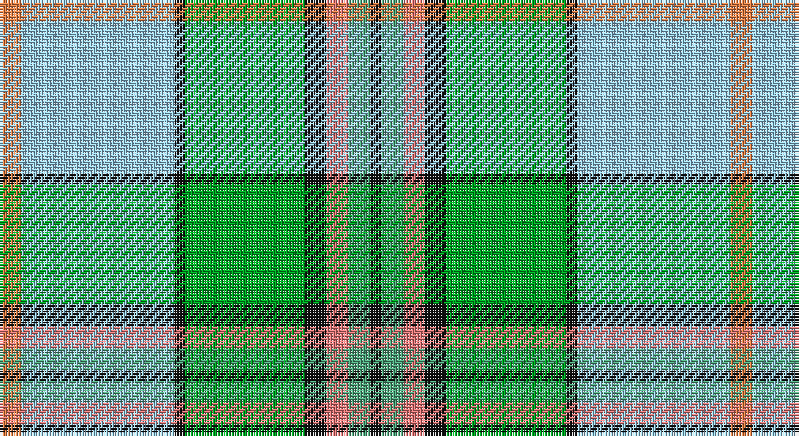

This page is one **sett** — a single exact thread-count. It belongs to the [tartan](/setts/lo2lb14k1g11k2r2gi2k1/)
(the same proportion at any scale), whose colour order is pattern [KGRKGKWY](/stripes/kgrkgkwy/).

Part of the [Mission](/tartans/mission/) tartan — the named design grouping this sett with its other cloths.

Sourced from tartans-authority.  It is a [8 stripe tartan](/stripes/stripes8/).

Original link http://www.tartansauthority.com/tartan-ferret/display/2669/

## Register references

External register numbers recorded for this tartan.

- Scottish Tartans Authority (ITI): 2669

## Thread count
O/8 LB56 K4 G44 K8 LR8 LG8 K/4

One full sett is **268 threads**.

## Palette

Palette: <strong>Tartan Register</strong> <small style="color:#888">(4 of 6 colours)</small>
<table><thead><tr><th>Colour</th><th>Threads</th><th>Shade</th><th>Base</th><th>OKLCh</th></tr></thead><tbody><tr><td>O/</td><td style="text-align:right;font-variant-numeric:tabular-nums">8</td><td><code style="background-color:#EC8048;">#EC8048</code> <small style="color:#888">#EC8048</small></td><td>Y <code style="background-color:#F2BF00;">#F2BF00</code></td><td><small style="color:#888">oklch(71.0% 0.150 46.4)</small></td></tr><tr><td>LB</td><td style="text-align:right;font-variant-numeric:tabular-nums">56</td><td><code style="background-color:#98C8E8;">#98C8E8</code> <small style="color:#888">#98C8E8</small></td><td>W <code style="background-color:#F7F7F7;">#F7F7F7</code></td><td><small style="color:#888">oklch(81.0% 0.068 237.9)</small></td></tr><tr><td>K</td><td style="text-align:right;font-variant-numeric:tabular-nums">4</td><td><code style="background-color:#101010;">#101010</code> <small style="color:#888">#101010</small></td><td>K <code style="background-color:#000000;">#000000</code></td><td><small style="color:#888">oklch(17.3% 0.000 89.9)</small></td></tr><tr><td>G</td><td style="text-align:right;font-variant-numeric:tabular-nums">44</td><td><code style="background-color:#00A424;">#00A424</code> <small style="color:#888">#00A424</small></td><td>G <code style="background-color:#006100;">#006100</code></td><td><small style="color:#888">oklch(62.4% 0.201 144.3)</small></td></tr><tr><td>K</td><td style="text-align:right;font-variant-numeric:tabular-nums">8</td><td><code style="background-color:#101010;">#101010</code> <small style="color:#888">#101010</small></td><td>K <code style="background-color:#000000;">#000000</code></td><td><small style="color:#888">oklch(17.3% 0.000 89.9)</small></td></tr><tr><td>LR</td><td style="text-align:right;font-variant-numeric:tabular-nums">8</td><td><code style="background-color:#E87878;">#E87878</code> <small style="color:#888">#E87878</small></td><td>R <code style="background-color:#CC0000;">#CC0000</code></td><td><small style="color:#888">oklch(70.0% 0.139 21.2)</small></td></tr><tr><td>LG</td><td style="text-align:right;font-variant-numeric:tabular-nums">8</td><td><code style="background-color:#50A47C;">#50A47C</code> <small style="color:#888">#50A47C</small></td><td>G <code style="background-color:#006100;">#006100</code></td><td><small style="color:#888">oklch(65.5% 0.103 160.9)</small></td></tr><tr><td>K/</td><td style="text-align:right;font-variant-numeric:tabular-nums">4</td><td><code style="background-color:#101010;">#101010</code> <small style="color:#888">#101010</small></td><td>K <code style="background-color:#000000;">#000000</code></td><td><small style="color:#888">oklch(17.3% 0.000 89.9)</small></td></tr></tbody></table>

# Sample pattern

## Compared to the master

This cloth is one sett of its design; the master sett (the exemplar the design is anchored on) is below for comparison.

<figure style="margin:0"><figcaption style="color:#888;font-size:smaller">this sett</figcaption></figure>
<figure style="margin:0"><figcaption style="color:#888;font-size:smaller"><a href="/setts/lo2t14k1gi11k2w2g2k1/">master sett →</a></figcaption></figure>

## Nearest tartans

The nearest existing variants by ΔTartan distance, with this tartan at the top so the swatches line up against it.

ΔTartan

Tartan

Sett

—

<a href="/ttd/edit/#slug=lo2lb14k1g11k2r2gi2k1~x4">Mission (District)</a> <a class="nn-out" href="/variants/s8/lo2lb14k1g11k2r2gi2k1~x4/" title="open its dictionary page">↗</a>

1.06

<a href="/ttd/edit/#slug=b16w3b2ly4g24r2g4r5g4r2lb8~x2&amp;base=lo2lb14k1g11k2r2gi2k1~x4">Currie of Arran (Clan/family)</a> <a class="nn-out" href="/variants/s11/b16w3b2ly4g24r2g4r5g4r2lb8~x2/" title="open its dictionary page">↗</a>

1.14

<a href="/ttd/edit/#slug=lo2t14k1gi11k2w2g2k1~x4&amp;base=lo2lb14k1g11k2r2gi2k1~x4">Mission</a> <a class="nn-out" href="/variants/s8/lo2t14k1gi11k2w2g2k1~x4/" title="open its dictionary page">↗</a>

1.19

<a href="/ttd/edit/#slug=lb38dt18lb4ly3g10lo3g4lb3lo17r4~x2&amp;base=lo2lb14k1g11k2r2gi2k1~x4">State Seal of Delaware (Fashion)</a> <a class="nn-out" href="/variants/s10/lb38dt18lb4ly3g10lo3g4lb3lo17r4~x2/" title="open its dictionary page">↗</a>

1.22

<a href="/ttd/edit/#slug=g9k2r4g14w3lp3w23g5ly3~x2&amp;base=lo2lb14k1g11k2r2gi2k1~x4">Taylor, dress</a> <a class="nn-out" href="/variants/s9/g9k2r4g14w3lp3w23g5ly3~x2/" title="open its dictionary page">↗</a>

1.23

<a href="/ttd/edit/#slug=t16r1g16w1dy1w8m3~x2&amp;base=lo2lb14k1g11k2r2gi2k1~x4">Chambers, Christopher J (Personal)</a> <a class="nn-out" href="/variants/s7/t16r1g16w1dy1w8m3~x2/" title="open its dictionary page">↗</a>

1.23

<a href="/ttd/edit/#slug=g3t3g5r4g28db8w3db3w24r2k2~x2&amp;base=lo2lb14k1g11k2r2gi2k1~x4">Downie Dress</a> <a class="nn-out" href="/variants/s11/g3t3g5r4g28db8w3db3w24r2k2~x2/" title="open its dictionary page">↗</a>

1.24

<a href="/ttd/edit/#slug=g3w29g3db3g3db6g13ly3r2~x2&amp;base=lo2lb14k1g11k2r2gi2k1~x4">Nova Scotia, dress</a> <a class="nn-out" href="/variants/s9/g3w29g3db3g3db6g13ly3r2~x2/" title="open its dictionary page">↗</a>

1.26

<a href="/ttd/edit/#slug=w4t5lo3t22ly4k3g16lo7k2lo7ly2~x2&amp;base=lo2lb14k1g11k2r2gi2k1~x4">Cossar (Personal)</a> <a class="nn-out" href="/variants/s11/w4t5lo3t22ly4k3g16lo7k2lo7ly2~x2/" title="open its dictionary page">↗</a>

1.29

<a href="/ttd/edit/#slug=t13r1g13w1k1w7k3~x2&amp;base=lo2lb14k1g11k2r2gi2k1~x4">Chambers, Christopher J (Personal)</a> <a class="nn-out" href="/variants/s7/t13r1g13w1k1w7k3~x2/" title="open its dictionary page">↗</a>

1.29

<a href="/ttd/edit/#slug=k2lb25k2b8k2g28ly2~x2&amp;base=lo2lb14k1g11k2r2gi2k1~x4">Presley of Lonmay</a> <a class="nn-out" href="/variants/s7/k2lb25k2b8k2g28ly2~x2/" title="open its dictionary page">↗</a>

## Neighbour map

Every grey dot is one of 14360 variants placed by the first two principal components of the ΔTartan feature space (44% of its variance). Red is this tartan; blue dots are its nearest — click one to open its page.

<svg viewBox="0 0 640 380" role="img" style="max-width:100%;height:auto;border:1px solid #e0e0e0;border-radius:4px;display:block" xmlns="http://www.w3.org/2000/svg"><image href="/nn/cloud.v1.png" width="640" height="380"/><a href="/variants/s11/b16w3b2ly4g24r2g4r5g4r2lb8~x2/"><circle cx="163.1" cy="127.0" r="4" fill="#3465a4"><title>Currie of Arran (Clan/family)</title></circle></a><a href="/variants/s8/lo2t14k1gi11k2w2g2k1~x4/"><circle cx="181.2" cy="137.3" r="4" fill="#3465a4"><title>Mission</title></circle></a><a href="/variants/s10/lb38dt18lb4ly3g10lo3g4lb3lo17r4~x2/"><circle cx="176.1" cy="122.8" r="4" fill="#3465a4"><title>State Seal of Delaware (Fashion)</title></circle></a><a href="/variants/s9/g9k2r4g14w3lp3w23g5ly3~x2/"><circle cx="162.5" cy="131.2" r="4" fill="#3465a4"><title>Taylor, dress</title></circle></a><a href="/variants/s7/t16r1g16w1dy1w8m3~x2/"><circle cx="170.4" cy="138.1" r="4" fill="#3465a4"><title>Chambers, Christopher J (Personal)</title></circle></a><a href="/variants/s11/g3t3g5r4g28db8w3db3w24r2k2~x2/"><circle cx="166.2" cy="101.9" r="4" fill="#3465a4"><title>Downie Dress</title></circle></a><a href="/variants/s9/g3w29g3db3g3db6g13ly3r2~x2/"><circle cx="209.9" cy="121.1" r="4" fill="#3465a4"><title>Nova Scotia, dress</title></circle></a><a href="/variants/s11/w4t5lo3t22ly4k3g16lo7k2lo7ly2~x2/"><circle cx="122.5" cy="137.1" r="4" fill="#3465a4"><title>Cossar (Personal)</title></circle></a><a href="/variants/s7/t13r1g13w1k1w7k3~x2/"><circle cx="138.5" cy="156.9" r="4" fill="#3465a4"><title>Chambers, Christopher J (Personal)</title></circle></a><a href="/variants/s7/k2lb25k2b8k2g28ly2~x2/"><circle cx="217.3" cy="154.5" r="4" fill="#3465a4"><title>Presley of Lonmay</title></circle></a><circle cx="163.1" cy="123.5" r="5" fill="#c00000"/></svg>

ID: /variants/s8/lo2lb14k1g11k2r2gi2k1~x4/
