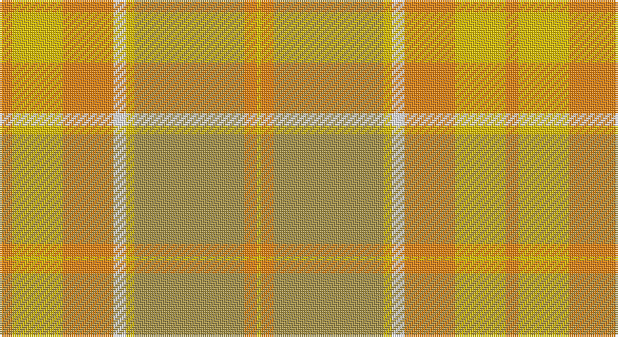

This page is one **sett** — a single exact thread-count. It belongs to the [tartan](/setts/lo3ly12lo12w3ly2lyi26lo3ly1/)
(the same proportion at any scale), whose colour order is pattern [YYYWYYYY](/stripes/yyywyyyy/).

Sourced from register-of-tartans.  It is a [8 stripe tartan](/stripes/stripes8/).

Original link https://www.tartanregister.gov.uk/tartanDetails.aspx?ref=919

2 attestations — the source records this cloth was collapsed from (oldest owns this page)

<ul>
<li>01/01/1972 — Desert in Bloom (register-of-tartans, <a href="https://www.tartanregister.gov.uk/tartanDetails.aspx?ref=919">record</a>)</li>
<li>1972 — Desert in Bloom (Fashion) (tartans-authority, <a href="http://www.tartansauthority.com/tartan-ferret/display/7054/">record</a>)</li>
</ul>

## Register references

External register numbers recorded for this tartan.

- Scottish Register of Tartans: [919](https://www.tartanregister.gov.uk/tartanDetails.aspx?ref=919)
- Scottish Tartans Authority (ITI): 7054

## Thread count
O/6 Y24 O24 W6 Y4 LT52 O6 Y/2

One full sett is **240 threads**.

## Palette

Palette: <strong>Tartan Register</strong> <small style="color:#888">(2 of 4 colours)</small>
<table><thead><tr><th>Colour</th><th>Threads</th><th>Shade</th><th>Base</th><th>OKLCh</th></tr></thead><tbody><tr><td>O/</td><td style="text-align:right;font-variant-numeric:tabular-nums">6</td><td><code style="background-color:#F88410;">#F88410</code> <small style="color:#888">#F88410</small></td><td>Y <code style="background-color:#F2BF00;">#F2BF00</code></td><td><small style="color:#888">oklch(72.9% 0.176 55.6)</small></td></tr><tr><td>Y</td><td style="text-align:right;font-variant-numeric:tabular-nums">24</td><td><code style="background-color:#E8C000;">#E8C000</code> <small style="color:#888">#E8C000</small></td><td>Y <code style="background-color:#F2BF00;">#F2BF00</code></td><td><small style="color:#888">oklch(81.9% 0.168 93.7)</small></td></tr><tr><td>O</td><td style="text-align:right;font-variant-numeric:tabular-nums">24</td><td><code style="background-color:#F88410;">#F88410</code> <small style="color:#888">#F88410</small></td><td>Y <code style="background-color:#F2BF00;">#F2BF00</code></td><td><small style="color:#888">oklch(72.9% 0.176 55.6)</small></td></tr><tr><td>W</td><td style="text-align:right;font-variant-numeric:tabular-nums">6</td><td><code style="background-color:#F8F8F8;">#F8F8F8</code> <small style="color:#888">#F8F8F8</small></td><td>W <code style="background-color:#F7F7F7;">#F7F7F7</code></td><td><small style="color:#888">oklch(97.9% 0.000 89.9)</small></td></tr><tr><td>Y</td><td style="text-align:right;font-variant-numeric:tabular-nums">4</td><td><code style="background-color:#E8C000;">#E8C000</code> <small style="color:#888">#E8C000</small></td><td>Y <code style="background-color:#F2BF00;">#F2BF00</code></td><td><small style="color:#888">oklch(81.9% 0.168 93.7)</small></td></tr><tr><td>LT</td><td style="text-align:right;font-variant-numeric:tabular-nums">52</td><td><code style="background-color:#A89448;">#A89448</code> <small style="color:#888">#A89448</small></td><td>Y <code style="background-color:#F2BF00;">#F2BF00</code></td><td><small style="color:#888">oklch(66.8% 0.099 94.8)</small></td></tr><tr><td>O</td><td style="text-align:right;font-variant-numeric:tabular-nums">6</td><td><code style="background-color:#F88410;">#F88410</code> <small style="color:#888">#F88410</small></td><td>Y <code style="background-color:#F2BF00;">#F2BF00</code></td><td><small style="color:#888">oklch(72.9% 0.176 55.6)</small></td></tr><tr><td>Y/</td><td style="text-align:right;font-variant-numeric:tabular-nums">2</td><td><code style="background-color:#E8C000;">#E8C000</code> <small style="color:#888">#E8C000</small></td><td>Y <code style="background-color:#F2BF00;">#F2BF00</code></td><td><small style="color:#888">oklch(81.9% 0.168 93.7)</small></td></tr></tbody></table>

# Sample pattern

## Nearest tartans

The nearest existing variants by ΔTartan distance, with this tartan at the top so the swatches line up against it.

ΔTartan

Tartan

Sett

—

<a href="/ttd/edit/#slug=lo3ly12lo12w3ly2lyi26lo3ly1~x2">Desert in Bloom</a> <a class="nn-out" href="/variants/s8/lo3ly12lo12w3ly2lyi26lo3ly1~x2/" title="open its dictionary page">↗</a>

1.82

<a href="/ttd/edit/#slug=y10lo5y54lo2lb32loi54b4loi10&amp;base=lo3ly12lo12w3ly2lyi26lo3ly1~x2">Cladish</a> <a class="nn-out" href="/variants/s8/y10lo5y54lo2lb32loi54b4loi10/" title="open its dictionary page">↗</a>

2.32

<a href="/ttd/edit/#slug=lb12loi1dy1lo1loi22lo1dy6loi4dy3loi2lo12loi2~x4&amp;base=lo3ly12lo12w3ly2lyi26lo3ly1~x2">Wcwm 969-2</a> <a class="nn-out" href="/variants/s12/lb12loi1dy1lo1loi22lo1dy6loi4dy3loi2lo12loi2~x4/" title="open its dictionary page">↗</a>

2.50

<a href="/ttd/edit/#slug=r12w4r3lo18r3ly4g2~x2&amp;base=lo3ly12lo12w3ly2lyi26lo3ly1~x2">Golden Pheasant</a> <a class="nn-out" href="/variants/s7/r12w4r3lo18r3ly4g2~x2/" title="open its dictionary page">↗</a>

2.57

<a href="/ttd/edit/#slug=o22m1y22dr4~x4&amp;base=lo3ly12lo12w3ly2lyi26lo3ly1~x2">McWilliams Hunting (2014)</a> <a class="nn-out" href="/variants/s4/o22m1y22dr4~x4/" title="open its dictionary page">↗</a>

2.65

<a href="/variants/s12/y23o4dy6g6y4lb1y4~x4/">Tricor</a>

2.65

<a href="/ttd/edit/#slug=o9oi9y9oii1t1oi9t1oii1~x4&amp;base=lo3ly12lo12w3ly2lyi26lo3ly1~x2">Jardine of Castlemilk Family Tartan</a> <a class="nn-out" href="/variants/s8/o9oi9y9oii1t1oi9t1oii1~x4/" title="open its dictionary page">↗</a>

2.71

<a href="/ttd/edit/#slug=lri3lb3lri1y25lri15lr5lb4ly2~x2&amp;base=lo3ly12lo12w3ly2lyi26lo3ly1~x2">Rikaco Morning Dew #2</a> <a class="nn-out" href="/variants/s8/lri3lb3lri1y25lri15lr5lb4ly2~x2/" title="open its dictionary page">↗</a>

2.74

<a href="/ttd/edit/#slug=r2ly20o2ly2r3lo3r3loii6loi24ly2~x2&amp;base=lo3ly12lo12w3ly2lyi26lo3ly1~x2">Golden Heather, The</a> <a class="nn-out" href="/variants/s10/r2ly20o2ly2r3lo3r3loii6loi24ly2~x2/" title="open its dictionary page">↗</a>

2.82

<a href="/ttd/edit/#slug=w6lt5lg4lt5lo2r5lg2r14lg10lo30lt1lg2r4lg2r1lo30r10lt14lg2lt5~x2&amp;base=lo3ly12lo12w3ly2lyi26lo3ly1~x2">elCorte</a> <a class="nn-out" href="/variants/s20/w6lt5lg4lt5lo2r5lg2r14lg10lo30lt1lg2r4lg2r1lo30r10lt14lg2lt5~x2/" title="open its dictionary page">↗</a>

2.83

<a href="/ttd/edit/#slug=o10y1k1y1k1y11o18y1k1y10~x4&amp;base=lo3ly12lo12w3ly2lyi26lo3ly1~x2">Donachie of Brockloch Ancient Hunting</a> <a class="nn-out" href="/variants/s10/o10y1k1y1k1y11o18y1k1y10~x4/" title="open its dictionary page">↗</a>

## Neighbour map

Every grey dot is one of 14360 variants placed by the first two principal components of the ΔTartan feature space (44% of its variance). Red is this tartan; blue dots are its nearest — click one to open its page.

<svg viewBox="0 0 640 380" role="img" style="max-width:100%;height:auto;border:1px solid #e0e0e0;border-radius:4px;display:block" xmlns="http://www.w3.org/2000/svg"><image href="/nn/cloud.v1.png" width="640" height="380"/><a href="/variants/s8/y10lo5y54lo2lb32loi54b4loi10/"><circle cx="321.2" cy="175.8" r="4" fill="#3465a4"><title>Cladish</title></circle></a><a href="/variants/s12/lb12loi1dy1lo1loi22lo1dy6loi4dy3loi2lo12loi2~x4/"><circle cx="322.3" cy="146.4" r="4" fill="#3465a4"><title>Wcwm 969-2</title></circle></a><a href="/variants/s7/r12w4r3lo18r3ly4g2~x2/"><circle cx="282.9" cy="219.5" r="4" fill="#3465a4"><title>Golden Pheasant</title></circle></a><a href="/variants/s4/o22m1y22dr4~x4/"><circle cx="408.8" cy="256.4" r="4" fill="#3465a4"><title>McWilliams Hunting (2014)</title></circle></a><a href="/variants/s12/y23o4dy6g6y4lb1y4~x4/"><circle cx="384.8" cy="190.3" r="4" fill="#3465a4"><title>Tricor</title></circle></a><a href="/variants/s8/o9oi9y9oii1t1oi9t1oii1~x4/"><circle cx="315.5" cy="241.3" r="4" fill="#3465a4"><title>Jardine of Castlemilk Family Tartan</title></circle></a><a href="/variants/s8/lri3lb3lri1y25lri15lr5lb4ly2~x2/"><circle cx="374.3" cy="191.3" r="4" fill="#3465a4"><title>Rikaco Morning Dew #2</title></circle></a><a href="/variants/s10/r2ly20o2ly2r3lo3r3loii6loi24ly2~x2/"><circle cx="252.0" cy="147.0" r="4" fill="#3465a4"><title>Golden Heather, The</title></circle></a><a href="/variants/s20/w6lt5lg4lt5lo2r5lg2r14lg10lo30lt1lg2r4lg2r1lo30r10lt14lg2lt5~x2/"><circle cx="287.0" cy="106.8" r="4" fill="#3465a4"><title>elCorte</title></circle></a><a href="/variants/s10/o10y1k1y1k1y11o18y1k1y10~x4/"><circle cx="420.0" cy="197.5" r="4" fill="#3465a4"><title>Donachie of Brockloch Ancient Hunting</title></circle></a><circle cx="375.5" cy="188.4" r="5" fill="#c00000"/></svg>

ID: /variants/s8/lo3ly12lo12w3ly2lyi26lo3ly1~x2/
