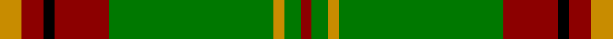
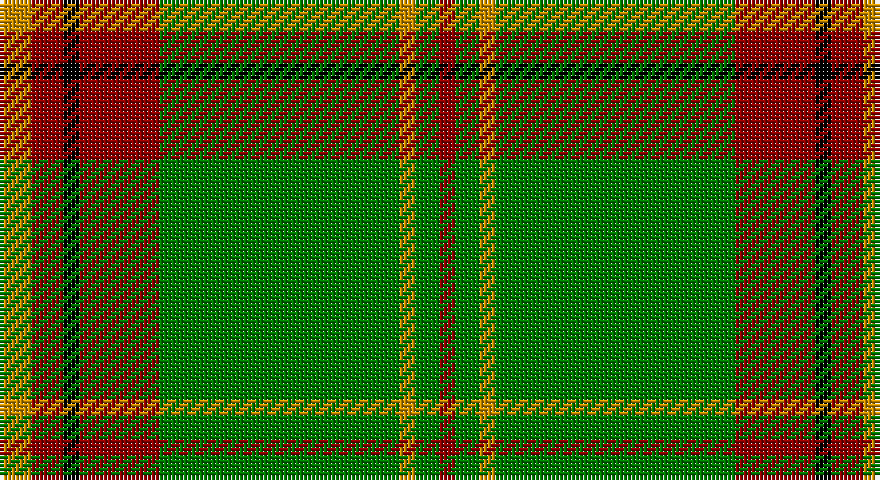

This page is one **sett** — a single exact thread-count. It belongs to the [tartan](/setts/lo4r4k2r10g30lo2g3r2/)
(the same proportion at any scale), whose colour order is pattern [RGYGRKRY](/stripes/rgygrkry/).

Sourced from register-of-tartans.  It is a [8 stripe tartan](/stripes/stripes8/).

Original link https://www.tartanregister.gov.uk/tartanDetails.aspx?ref=4890

## Register references

External register numbers recorded for this tartan.

- Scottish Register of Tartans: [4890](https://www.tartanregister.gov.uk/tartanDetails.aspx?ref=4890)
- Scottish Tartans Authority (ITI): 3666

## Thread count
DY/8 DR8 K4 DR20 G60 DY4 G6 DR/4

One full sett is **216 threads**.

## Palette

Palette: <strong>Tartan Register</strong> <small style="color:#888">(7 of 8 colours)</small>
<table><thead><tr><th>Colour</th><th>Threads</th><th>Shade</th><th>Base</th><th>OKLCh</th></tr></thead><tbody><tr><td>DY/</td><td style="text-align:right;font-variant-numeric:tabular-nums">8</td><td><code style="background-color:#C88C00;">#C88C00</code> <small style="color:#888">#C88C00</small></td><td>Y <code style="background-color:#F2BF00;">#F2BF00</code></td><td><small style="color:#888">oklch(68.2% 0.142 78.2)</small></td></tr><tr><td>DR</td><td style="text-align:right;font-variant-numeric:tabular-nums">8</td><td><code style="background-color:#8C0000;">#8C0000</code> <small style="color:#888">#8C0000</small></td><td>R <code style="background-color:#CC0000;">#CC0000</code></td><td><small style="color:#888">oklch(40.2% 0.165 29.2)</small></td></tr><tr><td>K</td><td style="text-align:right;font-variant-numeric:tabular-nums">4</td><td><code style="background-color:#000000;">#000000</code> <small style="color:#888">#000000</small></td><td>K <code style="background-color:#000000;">#000000</code></td><td><small style="color:#888">oklch(0.0% 0.000 0.0)</small></td></tr><tr><td>DR</td><td style="text-align:right;font-variant-numeric:tabular-nums">20</td><td><code style="background-color:#8C0000;">#8C0000</code> <small style="color:#888">#8C0000</small></td><td>R <code style="background-color:#CC0000;">#CC0000</code></td><td><small style="color:#888">oklch(40.2% 0.165 29.2)</small></td></tr><tr><td>G</td><td style="text-align:right;font-variant-numeric:tabular-nums">60</td><td><code style="background-color:#007800;">#007800</code> <small style="color:#888">#007800</small></td><td>G <code style="background-color:#006100;">#006100</code></td><td><small style="color:#888">oklch(49.6% 0.169 142.5)</small></td></tr><tr><td>DY</td><td style="text-align:right;font-variant-numeric:tabular-nums">4</td><td><code style="background-color:#C88C00;">#C88C00</code> <small style="color:#888">#C88C00</small></td><td>Y <code style="background-color:#F2BF00;">#F2BF00</code></td><td><small style="color:#888">oklch(68.2% 0.142 78.2)</small></td></tr><tr><td>G</td><td style="text-align:right;font-variant-numeric:tabular-nums">6</td><td><code style="background-color:#007800;">#007800</code> <small style="color:#888">#007800</small></td><td>G <code style="background-color:#006100;">#006100</code></td><td><small style="color:#888">oklch(49.6% 0.169 142.5)</small></td></tr><tr><td>DR/</td><td style="text-align:right;font-variant-numeric:tabular-nums">4</td><td><code style="background-color:#8C0000;">#8C0000</code> <small style="color:#888">#8C0000</small></td><td>R <code style="background-color:#CC0000;">#CC0000</code></td><td><small style="color:#888">oklch(40.2% 0.165 29.2)</small></td></tr></tbody></table>

# Sample pattern

## Nearest tartans

The nearest existing variants by ΔTartan distance, with this tartan at the top so the swatches line up against it.

ΔTartan

Tartan

Sett

—

<a href="/ttd/edit/#slug=lo4r4k2r10g30lo2g3r2~x2">Beard</a> <a class="nn-out" href="/variants/s8/lo4r4k2r10g30lo2g3r2~x2/" title="open its dictionary page">↗</a>

1.15

<a href="/ttd/edit/#slug=g55p7r24g12db4ly3db4~x2&amp;base=lo4r4k2r10g30lo2g3r2~x2">Crieff, and Strathearn</a> <a class="nn-out" href="/variants/s7/g55p7r24g12db4ly3db4~x2/" title="open its dictionary page">↗</a>

1.23

<a href="/ttd/edit/#slug=db3g16ly1r1w1r6g3r1g3w1~x2&amp;base=lo4r4k2r10g30lo2g3r2~x2">Canadian Caledonian</a> <a class="nn-out" href="/variants/s10/db3g16ly1r1w1r6g3r1g3w1~x2/" title="open its dictionary page">↗</a>

1.26

<a href="/ttd/edit/#slug=ly5g3ly3g53r7db5r13w4~x2&amp;base=lo4r4k2r10g30lo2g3r2~x2">Hall (P.I.E.) (Personal)</a> <a class="nn-out" href="/variants/s8/ly5g3ly3g53r7db5r13w4~x2/" title="open its dictionary page">↗</a>

1.30

<a href="/ttd/edit/#slug=r3k2r3g12r3w1r1g1~x4&amp;base=lo4r4k2r10g30lo2g3r2~x2">MacCall/McCall</a> <a class="nn-out" href="/variants/s8/r3k2r3g12r3w1r1g1~x4/" title="open its dictionary page">↗</a>

1.31

<a href="/ttd/edit/#slug=g55dp7r24g12db4ly3db4~x2&amp;base=lo4r4k2r10g30lo2g3r2~x2">Crieff and Strathearn District Tartan</a> <a class="nn-out" href="/variants/s7/g55dp7r24g12db4ly3db4~x2/" title="open its dictionary page">↗</a>

1.34

<a href="/ttd/edit/#slug=g13k1g13r1g1k1g1k1r13k1ly1k1~x3&amp;base=lo4r4k2r10g30lo2g3r2~x2">Ulster</a> <a class="nn-out" href="/variants/s12/g13k1g13r1g1k1g1k1r13k1ly1k1~x3/" title="open its dictionary page">↗</a>

1.34

<a href="/ttd/edit/#slug=w6g5r5g45k4lo24k4g5~x2&amp;base=lo4r4k2r10g30lo2g3r2~x2">O'Neill (Name)</a> <a class="nn-out" href="/variants/s8/w6g5r5g45k4lo24k4g5~x2/" title="open its dictionary page">↗</a>

1.36

<a href="/ttd/edit/#slug=db3g16ly1r1w1r6g3r1g3w1~x4&amp;base=lo4r4k2r10g30lo2g3r2~x2">Canadian Caledonian</a> <a class="nn-out" href="/variants/s10/db3g16ly1r1w1r6g3r1g3w1~x4/" title="open its dictionary page">↗</a>

1.36

<a href="/ttd/edit/#slug=ly5g14dy4db4dy27g3dy4ly5~x2&amp;base=lo4r4k2r10g30lo2g3r2~x2">Invertere (Daks #2) (Fashion)</a> <a class="nn-out" href="/variants/s8/ly5g14dy4db4dy27g3dy4ly5~x2/" title="open its dictionary page">↗</a>

1.37

<a href="/ttd/edit/#slug=g28r2g28r7lb2r7lb2r7k5dp4lb2~x2&amp;base=lo4r4k2r10g30lo2g3r2~x2">Hynde (Sir John)</a> <a class="nn-out" href="/variants/s11/g28r2g28r7lb2r7lb2r7k5dp4lb2~x2/" title="open its dictionary page">↗</a>

## Neighbour map

Every grey dot is one of 14360 variants placed by the first two principal components of the ΔTartan feature space (44% of its variance). Red is this tartan; blue dots are its nearest — click one to open its page.

<svg viewBox="0 0 640 380" role="img" style="max-width:100%;height:auto;border:1px solid #e0e0e0;border-radius:4px;display:block" xmlns="http://www.w3.org/2000/svg"><image href="/nn/cloud.v1.png" width="640" height="380"/><a href="/variants/s7/g55p7r24g12db4ly3db4~x2/"><circle cx="357.8" cy="155.0" r="4" fill="#3465a4"><title>Crieff, and Strathearn</title></circle></a><a href="/variants/s10/db3g16ly1r1w1r6g3r1g3w1~x2/"><circle cx="339.3" cy="134.0" r="4" fill="#3465a4"><title>Canadian Caledonian</title></circle></a><a href="/variants/s8/ly5g3ly3g53r7db5r13w4~x2/"><circle cx="344.4" cy="131.8" r="4" fill="#3465a4"><title>Hall (P.I.E.) (Personal)</title></circle></a><a href="/variants/s8/r3k2r3g12r3w1r1g1~x4/"><circle cx="307.1" cy="183.3" r="4" fill="#3465a4"><title>MacCall/McCall</title></circle></a><a href="/variants/s7/g55dp7r24g12db4ly3db4~x2/"><circle cx="365.1" cy="158.3" r="4" fill="#3465a4"><title>Crieff and Strathearn District Tartan</title></circle></a><a href="/variants/s12/g13k1g13r1g1k1g1k1r13k1ly1k1~x3/"><circle cx="325.7" cy="136.5" r="4" fill="#3465a4"><title>Ulster</title></circle></a><a href="/variants/s8/w6g5r5g45k4lo24k4g5~x2/"><circle cx="299.0" cy="167.7" r="4" fill="#3465a4"><title>O'Neill (Name)</title></circle></a><a href="/variants/s10/db3g16ly1r1w1r6g3r1g3w1~x4/"><circle cx="333.5" cy="130.5" r="4" fill="#3465a4"><title>Canadian Caledonian</title></circle></a><a href="/variants/s8/ly5g14dy4db4dy27g3dy4ly5~x2/"><circle cx="277.8" cy="195.0" r="4" fill="#3465a4"><title>Invertere (Daks #2) (Fashion)</title></circle></a><a href="/variants/s11/g28r2g28r7lb2r7lb2r7k5dp4lb2~x2/"><circle cx="335.4" cy="153.9" r="4" fill="#3465a4"><title>Hynde (Sir John)</title></circle></a><circle cx="360.6" cy="165.4" r="5" fill="#c00000"/></svg>

ID: /variants/s8/lo4r4k2r10g30lo2g3r2~x2/
