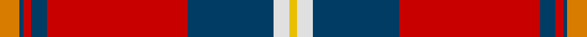
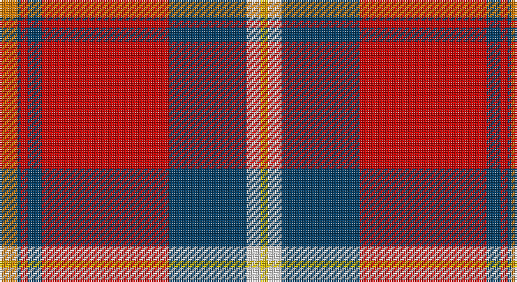

This page is one **sett** — a single exact thread-count. It belongs to the [tartan](/setts/lo5dt1r2dt4r36dt22w4ly2/)
(the same proportion at any scale), whose colour order is pattern [YBRBRBWY](/stripes/ybrbrbwy/).

Part of the [Aberdeen F.C.](/tartans/aberdeen-f-c/) tartan — the named design grouping this sett with its other cloths.

Sourced from house-of-tartan.  It is a [8 stripe tartan](/stripes/stripes8/).

Original link http://www.house-of-tartan.scotland.net/house/TartanViewjs.asp?colr=Def&tnam=2694

## Provenance

Earliest known date: 1997 The Aberdeen Football Club commissioned this design to include the colours of the teams away strip - navy and gold.

## Thread count
O/10 DB2 R4 DB8 R72 DB44 LN8 Y/4

One full sett is **290 threads**.

## Palette

Palette: <strong>Tartan Register</strong>
<table><thead><tr><th>Colour</th><th>Threads</th><th>Shade</th><th>Base</th><th>OKLCh</th></tr></thead><tbody><tr><td>O/</td><td style="text-align:right;font-variant-numeric:tabular-nums">10</td><td><code style="background-color:#D87C00;">#D87C00</code> <small style="color:#888">#D87C00</small></td><td>Y <code style="background-color:#F2BF00;">#F2BF00</code></td><td><small style="color:#888">oklch(67.3% 0.155 61.8)</small></td></tr><tr><td>DB</td><td style="text-align:right;font-variant-numeric:tabular-nums">2</td><td><code style="background-color:#003C64;">#003C64</code> <small style="color:#888">#003C64</small></td><td>B <code style="background-color:#2A418A;">#2A418A</code></td><td><small style="color:#888">oklch(34.5% 0.089 246.0)</small></td></tr><tr><td>R</td><td style="text-align:right;font-variant-numeric:tabular-nums">4</td><td><code style="background-color:#C80000;">#C80000</code> <small style="color:#888">#C80000</small></td><td>R <code style="background-color:#CC0000;">#CC0000</code></td><td><small style="color:#888">oklch(52.3% 0.215 29.2)</small></td></tr><tr><td>DB</td><td style="text-align:right;font-variant-numeric:tabular-nums">8</td><td><code style="background-color:#003C64;">#003C64</code> <small style="color:#888">#003C64</small></td><td>B <code style="background-color:#2A418A;">#2A418A</code></td><td><small style="color:#888">oklch(34.5% 0.089 246.0)</small></td></tr><tr><td>R</td><td style="text-align:right;font-variant-numeric:tabular-nums">72</td><td><code style="background-color:#C80000;">#C80000</code> <small style="color:#888">#C80000</small></td><td>R <code style="background-color:#CC0000;">#CC0000</code></td><td><small style="color:#888">oklch(52.3% 0.215 29.2)</small></td></tr><tr><td>DB</td><td style="text-align:right;font-variant-numeric:tabular-nums">44</td><td><code style="background-color:#003C64;">#003C64</code> <small style="color:#888">#003C64</small></td><td>B <code style="background-color:#2A418A;">#2A418A</code></td><td><small style="color:#888">oklch(34.5% 0.089 246.0)</small></td></tr><tr><td>LN</td><td style="text-align:right;font-variant-numeric:tabular-nums">8</td><td><code style="background-color:#E0E0E0;">#E0E0E0</code> <small style="color:#888">#E0E0E0</small></td><td>W <code style="background-color:#F7F7F7;">#F7F7F7</code></td><td><small style="color:#888">oklch(90.7% 0.000 89.9)</small></td></tr><tr><td>Y/</td><td style="text-align:right;font-variant-numeric:tabular-nums">4</td><td><code style="background-color:#E8C000;">#E8C000</code> <small style="color:#888">#E8C000</small></td><td>Y <code style="background-color:#F2BF00;">#F2BF00</code></td><td><small style="color:#888">oklch(81.9% 0.168 93.7)</small></td></tr></tbody></table>

# Sample pattern

## Nearest tartans

The nearest existing variants by ΔTartan distance, with this tartan at the top so the swatches line up against it.

ΔTartan

Tartan

Sett

—

<a href="/ttd/edit/#slug=lo5dt1r2dt4r36dt22w4ly2~x2">Aberdeen F.C. Corporate Tartan</a> <a class="nn-out" href="/variants/s8/lo5dt1r2dt4r36dt22w4ly2~x2/" title="open its dictionary page">↗</a>

0.83

<a href="/ttd/edit/#slug=r27y4k4y4k4t6lo1~x4&amp;base=lo5dt1r2dt4r36dt22w4ly2~x2">MacLeay</a> <a class="nn-out" href="/variants/s7/r27y4k4y4k4t6lo1~x4/" title="open its dictionary page">↗</a>

0.86

<a href="/ttd/edit/#slug=db3t1r30db32r3w1r3dg23r31db3w1&amp;base=lo5dt1r2dt4r36dt22w4ly2~x2">MacDonald of Glenaladale</a> <a class="nn-out" href="/variants/s11/db3t1r30db32r3w1r3dg23r31db3w1/" title="open its dictionary page">↗</a>

0.87

<a href="/ttd/edit/#slug=r28dg4k4dg4k4t6ly1~x2&amp;base=lo5dt1r2dt4r36dt22w4ly2~x2">Livingstone MacLay MacLeay</a> <a class="nn-out" href="/variants/s7/r28dg4k4dg4k4t6ly1~x2/" title="open its dictionary page">↗</a>

0.96

<a href="/ttd/edit/#slug=r27g4k4g4k4db6lo1~x4&amp;base=lo5dt1r2dt4r36dt22w4ly2~x2">MacLeay (Clan)</a> <a class="nn-out" href="/variants/s7/r27g4k4g4k4db6lo1~x4/" title="open its dictionary page">↗</a>

0.98

<a href="/ttd/edit/#slug=r6ly1r24g6db2k1db2k1db12r1~x2&amp;base=lo5dt1r2dt4r36dt22w4ly2~x2">MacEdward</a> <a class="nn-out" href="/variants/s10/r6ly1r24g6db2k1db2k1db12r1~x2/" title="open its dictionary page">↗</a>

0.99

<a href="/ttd/edit/#slug=ri5k1r2k4r36k23w4ly2~x2&amp;base=lo5dt1r2dt4r36dt22w4ly2~x2">Aberdeen Football Club (1999)</a> <a class="nn-out" href="/variants/s8/ri5k1r2k4r36k23w4ly2~x2/" title="open its dictionary page">↗</a>

1.07

<a href="/ttd/edit/#slug=ly3g9db9k1ly2k15r37g2~x2&amp;base=lo5dt1r2dt4r36dt22w4ly2~x2">Mensah</a> <a class="nn-out" href="/variants/s8/ly3g9db9k1ly2k15r37g2~x2/" title="open its dictionary page">↗</a>

1.07

<a href="/ttd/edit/#slug=db3t1r30db32r3w1r3g23r31db3w1&amp;base=lo5dt1r2dt4r36dt22w4ly2~x2">MacDonald of Glenaladale</a> <a class="nn-out" href="/variants/s11/db3t1r30db32r3w1r3g23r31db3w1/" title="open its dictionary page">↗</a>

1.08

<a href="/ttd/edit/#slug=r6w1r24db6dg2k1dg2k1dg12r1~x2&amp;base=lo5dt1r2dt4r36dt22w4ly2~x2">Chisholm #2</a> <a class="nn-out" href="/variants/s10/r6w1r24db6dg2k1dg2k1dg12r1~x2/" title="open its dictionary page">↗</a>

1.12

<a href="/ttd/edit/#slug=r36lb1db3ly1dg16r8db3lb5&amp;base=lo5dt1r2dt4r36dt22w4ly2~x2">Drummond of Perth</a> <a class="nn-out" href="/variants/s8/r36lb1db3ly1dg16r8db3lb5/" title="open its dictionary page">↗</a>

## Neighbour map

Every grey dot is one of 14360 variants placed by the first two principal components of the ΔTartan feature space (44% of its variance). Red is this tartan; blue dots are its nearest — click one to open its page.

<svg viewBox="0 0 640 380" role="img" style="max-width:100%;height:auto;border:1px solid #e0e0e0;border-radius:4px;display:block" xmlns="http://www.w3.org/2000/svg"><image href="/nn/cloud.v1.png" width="640" height="380"/><a href="/variants/s7/r27y4k4y4k4t6lo1~x4/"><circle cx="324.3" cy="117.2" r="4" fill="#3465a4"><title>MacLeay</title></circle></a><a href="/variants/s11/db3t1r30db32r3w1r3dg23r31db3w1/"><circle cx="319.8" cy="100.3" r="4" fill="#3465a4"><title>MacDonald of Glenaladale</title></circle></a><a href="/variants/s7/r28dg4k4dg4k4t6ly1~x2/"><circle cx="323.9" cy="110.5" r="4" fill="#3465a4"><title>Livingstone MacLay MacLeay</title></circle></a><a href="/variants/s7/r27g4k4g4k4db6lo1~x4/"><circle cx="324.9" cy="121.0" r="4" fill="#3465a4"><title>MacLeay (Clan)</title></circle></a><a href="/variants/s10/r6ly1r24g6db2k1db2k1db12r1~x2/"><circle cx="342.6" cy="106.9" r="4" fill="#3465a4"><title>MacEdward</title></circle></a><a href="/variants/s8/ri5k1r2k4r36k23w4ly2~x2/"><circle cx="315.3" cy="88.2" r="4" fill="#3465a4"><title>Aberdeen Football Club (1999)</title></circle></a><a href="/variants/s8/ly3g9db9k1ly2k15r37g2~x2/"><circle cx="279.4" cy="97.6" r="4" fill="#3465a4"><title>Mensah</title></circle></a><a href="/variants/s11/db3t1r30db32r3w1r3g23r31db3w1/"><circle cx="325.9" cy="106.5" r="4" fill="#3465a4"><title>MacDonald of Glenaladale</title></circle></a><a href="/variants/s10/r6w1r24db6dg2k1dg2k1dg12r1~x2/"><circle cx="339.6" cy="103.3" r="4" fill="#3465a4"><title>Chisholm #2</title></circle></a><a href="/variants/s8/r36lb1db3ly1dg16r8db3lb5/"><circle cx="371.7" cy="93.8" r="4" fill="#3465a4"><title>Drummond of Perth</title></circle></a><circle cx="327.3" cy="94.7" r="5" fill="#c00000"/></svg>

ID: /variants/s8/lo5dt1r2dt4r36dt22w4ly2~x2/
