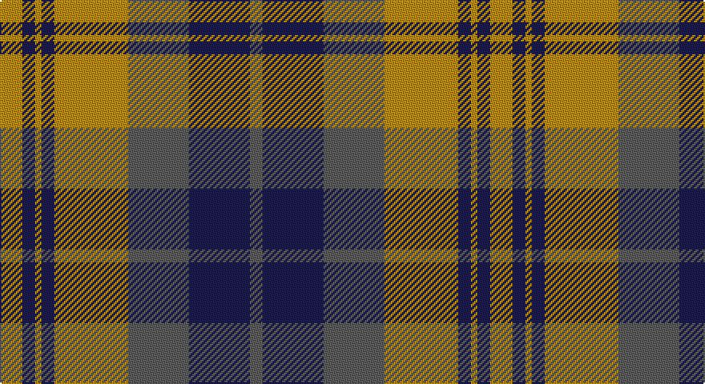

This page is one **sett** — a single exact thread-count. It belongs to the [tartan](/setts/lo7db4lo2db4lo23n19db19n4/)
(the same proportion at any scale), whose colour order is pattern [BBBYBYBY](/stripes/bbbybyby/).

Part of the [Chindecella Gorse](/tartans/chindecella-gorse/) tartan — the named design grouping this sett with its other cloths.

Sourced from tartans-authority.  It is a [8 stripe tartan](/stripes/stripes8/).

Original link http://www.tartansauthority.com/tartan-ferret/display/10254/

## Register references

External register numbers recorded for this tartan.

- Scottish Register of Tartans: [10254](https://www.tartanregister.gov.uk/tartanDetails?ref=10254)
- Scottish Tartans Authority (ITI): 10254

## Thread count
DY/14 DB8 DY4 DB8 DY46 N38 DB38 N/8

One full sett is **306 threads**.

## Palette

Palette: <strong>Tartan Register</strong> <small style="color:#888">(2 of 3 colours)</small>
<table><thead><tr><th>Colour</th><th>Threads</th><th>Shade</th><th>Base</th><th>OKLCh</th></tr></thead><tbody><tr><td>DY/</td><td style="text-align:right;font-variant-numeric:tabular-nums">14</td><td><code style="background-color:#BC8C00;">#BC8C00</code> <small style="color:#888">#BC8C00</small></td><td>Y <code style="background-color:#F2BF00;">#F2BF00</code></td><td><small style="color:#888">oklch(66.8% 0.137 84.1)</small></td></tr><tr><td>DB</td><td style="text-align:right;font-variant-numeric:tabular-nums">8</td><td><code style="background-color:#1C1C50;">#1C1C50</code> <small style="color:#888">#1C1C50</small></td><td>B <code style="background-color:#2A418A;">#2A418A</code></td><td><small style="color:#888">oklch(26.2% 0.093 277.9)</small></td></tr><tr><td>DY</td><td style="text-align:right;font-variant-numeric:tabular-nums">4</td><td><code style="background-color:#BC8C00;">#BC8C00</code> <small style="color:#888">#BC8C00</small></td><td>Y <code style="background-color:#F2BF00;">#F2BF00</code></td><td><small style="color:#888">oklch(66.8% 0.137 84.1)</small></td></tr><tr><td>DB</td><td style="text-align:right;font-variant-numeric:tabular-nums">8</td><td><code style="background-color:#1C1C50;">#1C1C50</code> <small style="color:#888">#1C1C50</small></td><td>B <code style="background-color:#2A418A;">#2A418A</code></td><td><small style="color:#888">oklch(26.2% 0.093 277.9)</small></td></tr><tr><td>DY</td><td style="text-align:right;font-variant-numeric:tabular-nums">46</td><td><code style="background-color:#BC8C00;">#BC8C00</code> <small style="color:#888">#BC8C00</small></td><td>Y <code style="background-color:#F2BF00;">#F2BF00</code></td><td><small style="color:#888">oklch(66.8% 0.137 84.1)</small></td></tr><tr><td>N</td><td style="text-align:right;font-variant-numeric:tabular-nums">38</td><td><code style="background-color:#5C5C5C;">#5C5C5C</code> <small style="color:#888">#5C5C5C</small></td><td>B <code style="background-color:#2A418A;">#2A418A</code></td><td><small style="color:#888">oklch(47.5% 0.000 89.9)</small></td></tr><tr><td>DB</td><td style="text-align:right;font-variant-numeric:tabular-nums">38</td><td><code style="background-color:#1C1C50;">#1C1C50</code> <small style="color:#888">#1C1C50</small></td><td>B <code style="background-color:#2A418A;">#2A418A</code></td><td><small style="color:#888">oklch(26.2% 0.093 277.9)</small></td></tr><tr><td>N/</td><td style="text-align:right;font-variant-numeric:tabular-nums">8</td><td><code style="background-color:#5C5C5C;">#5C5C5C</code> <small style="color:#888">#5C5C5C</small></td><td>B <code style="background-color:#2A418A;">#2A418A</code></td><td><small style="color:#888">oklch(47.5% 0.000 89.9)</small></td></tr></tbody></table>

# Sample pattern

## Compared to the master

This cloth is one sett of its design; the master sett (the exemplar the design is anchored on) is below for comparison.

<figure style="margin:0"><figcaption style="color:#888;font-size:smaller">this sett</figcaption></figure>
<figure style="margin:0"><figcaption style="color:#888;font-size:smaller"><a href="/setts/o9do4o4do4o24dy19do19dy4/">master sett →</a></figcaption></figure>

## Nearest tartans

The nearest existing variants by ΔTartan distance, with this tartan at the top so the swatches line up against it.

ΔTartan

Tartan

Sett

—

<a href="/ttd/edit/#slug=lo7db4lo2db4lo23n19db19n4~x2">Chindecella Gorse (Personal)</a> <a class="nn-out" href="/variants/s8/lo7db4lo2db4lo23n19db19n4~x2/" title="open its dictionary page">↗</a>

0.69

<a href="/ttd/edit/#slug=db9r3db1r3g9r3db1~x2&amp;base=lo7db4lo2db4lo23n19db19n4~x2">Logan, or Skene</a> <a class="nn-out" href="/variants/s7/db9r3db1r3g9r3db1~x2/" title="open its dictionary page">↗</a>

1.02

<a href="/ttd/edit/#slug=db8r3db1r3g14r3db1~x4&amp;base=lo7db4lo2db4lo23n19db19n4~x2">Logan</a> <a class="nn-out" href="/variants/s7/db8r3db1r3g14r3db1~x4/" title="open its dictionary page">↗</a>

1.05

<a href="/ttd/edit/#slug=db8r3db1r3dg14r3db1~x4&amp;base=lo7db4lo2db4lo23n19db19n4~x2">Logan</a> <a class="nn-out" href="/variants/s7/db8r3db1r3dg14r3db1~x4/" title="open its dictionary page">↗</a>

1.07

<a href="/ttd/edit/#slug=r6db2r2db21g20r4g4~x2&amp;base=lo7db4lo2db4lo23n19db19n4~x2">Robertson of Struan</a> <a class="nn-out" href="/variants/s7/r6db2r2db21g20r4g4~x2/" title="open its dictionary page">↗</a>

1.13

<a href="/ttd/edit/#slug=db10r1db1r1g10r13g2r13g10db10r1db1~x2&amp;base=lo7db4lo2db4lo23n19db19n4~x2">Inverness, Fencibles</a> <a class="nn-out" href="/variants/s12/db10r1db1r1g10r13g2r13g10db10r1db1~x2/" title="open its dictionary page">↗</a>

1.16

<a href="/ttd/edit/#slug=y9do1y1do1y1do7w7do2~x4&amp;base=lo7db4lo2db4lo23n19db19n4~x2">Grey Watch, Dress</a> <a class="nn-out" href="/variants/s8/y9do1y1do1y1do7w7do2~x4/" title="open its dictionary page">↗</a>

1.17

<a href="/ttd/edit/#slug=db20r2db2r2g19r18g2r18g19db19r2db2~x2&amp;base=lo7db4lo2db4lo23n19db19n4~x2">Fraser of Stratherrick</a> <a class="nn-out" href="/variants/s12/db20r2db2r2g19r18g2r18g19db19r2db2~x2/" title="open its dictionary page">↗</a>

1.17

<a href="/ttd/edit/#slug=y22dy2y2dy2y2dy14w16dy3~x2&amp;base=lo7db4lo2db4lo23n19db19n4~x2">Snaefell (District)</a> <a class="nn-out" href="/variants/s8/y22dy2y2dy2y2dy14w16dy3~x2/" title="open its dictionary page">↗</a>

1.17

<a href="/ttd/edit/#slug=db6r3g1r3g12r3g1~x4&amp;base=lo7db4lo2db4lo23n19db19n4~x2">Skene - 1831 (Clan)</a> <a class="nn-out" href="/variants/s7/db6r3g1r3g12r3g1~x4/" title="open its dictionary page">↗</a>

1.17

<a href="/ttd/edit/#slug=db9r3db1g9r3db1~x2&amp;base=lo7db4lo2db4lo23n19db19n4~x2">Logan #5</a> <a class="nn-out" href="/variants/s6/db9r3db1g9r3db1~x2/" title="open its dictionary page">↗</a>

## Neighbour map

Every grey dot is one of 14360 variants placed by the first two principal components of the ΔTartan feature space (44% of its variance). Red is this tartan; blue dots are its nearest — click one to open its page.

<svg viewBox="0 0 640 380" role="img" style="max-width:100%;height:auto;border:1px solid #e0e0e0;border-radius:4px;display:block" xmlns="http://www.w3.org/2000/svg"><image href="/nn/cloud.v1.png" width="640" height="380"/><a href="/variants/s7/db9r3db1r3g9r3db1~x2/"><circle cx="235.4" cy="233.9" r="4" fill="#3465a4"><title>Logan, or Skene</title></circle></a><a href="/variants/s7/db8r3db1r3g14r3db1~x4/"><circle cx="279.5" cy="207.1" r="4" fill="#3465a4"><title>Logan</title></circle></a><a href="/variants/s7/db8r3db1r3dg14r3db1~x4/"><circle cx="288.6" cy="210.5" r="4" fill="#3465a4"><title>Logan</title></circle></a><a href="/variants/s7/r6db2r2db21g20r4g4~x2/"><circle cx="268.9" cy="222.2" r="4" fill="#3465a4"><title>Robertson of Struan</title></circle></a><a href="/variants/s12/db10r1db1r1g10r13g2r13g10db10r1db1~x2/"><circle cx="251.0" cy="189.7" r="4" fill="#3465a4"><title>Inverness, Fencibles</title></circle></a><a href="/variants/s8/y9do1y1do1y1do7w7do2~x4/"><circle cx="215.5" cy="202.7" r="4" fill="#3465a4"><title>Grey Watch, Dress</title></circle></a><a href="/variants/s12/db20r2db2r2g19r18g2r18g19db19r2db2~x2/"><circle cx="219.0" cy="201.9" r="4" fill="#3465a4"><title>Fraser of Stratherrick</title></circle></a><a href="/variants/s8/y22dy2y2dy2y2dy14w16dy3~x2/"><circle cx="247.0" cy="190.4" r="4" fill="#3465a4"><title>Snaefell (District)</title></circle></a><a href="/variants/s7/db6r3g1r3g12r3g1~x4/"><circle cx="298.3" cy="217.5" r="4" fill="#3465a4"><title>Skene - 1831 (Clan)</title></circle></a><a href="/variants/s6/db9r3db1g9r3db1~x2/"><circle cx="260.4" cy="243.6" r="4" fill="#3465a4"><title>Logan #5</title></circle></a><circle cx="231.7" cy="211.3" r="5" fill="#c00000"/></svg>

ID: /variants/s8/lo7db4lo2db4lo23n19db19n4~x2/
