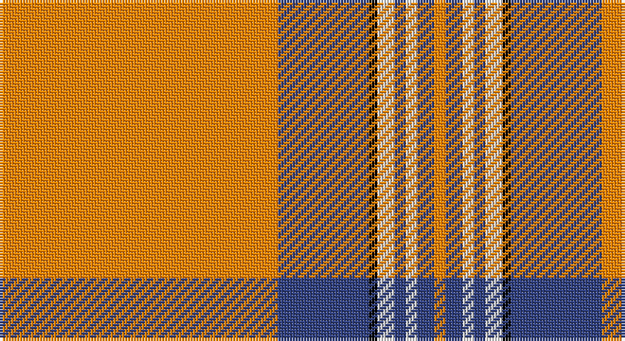

This page is one **sett** — a single exact thread-count. It belongs to the [tartan](/setts/lo98db32k3w6db4w4db6lo4/)
(the same proportion at any scale), whose colour order is pattern [YBKWBWBY](/stripes/ybkwbwby/).

Part of the [Irn Bru](/tartans/irn-bru/) tartan — the named design grouping this sett with its other cloths.

Sourced from weddslist.  It is a [8 stripe tartan](/stripes/stripes8/).

Original link http://www.weddslist.com/cgi-bin/tartans/pg.pl?source=sts

## Thread count
O/98 B32 K3 LN6 B4 LN4 B6 O/4

One full sett is **212 threads**.

## Palette

Palette: <strong>Tartan Register</strong> <small style="color:#888">(2 of 4 colours)</small>
<table><thead><tr><th>Colour</th><th>Threads</th><th>Shade</th><th>Base</th><th>OKLCh</th></tr></thead><tbody><tr><td>O/</td><td style="text-align:right;font-variant-numeric:tabular-nums">98</td><td><code style="background-color:#FF8500;">#FF8500</code> <small style="color:#888">#FF8500</small></td><td>Y <code style="background-color:#F2BF00;">#F2BF00</code></td><td><small style="color:#888">oklch(74.0% 0.183 55.1)</small></td></tr><tr><td>B</td><td style="text-align:right;font-variant-numeric:tabular-nums">32</td><td><code style="background-color:#304080;">#304080</code> <small style="color:#888">#304080</small></td><td>B <code style="background-color:#2A418A;">#2A418A</code></td><td><small style="color:#888">oklch(39.4% 0.109 270.2)</small></td></tr><tr><td>K</td><td style="text-align:right;font-variant-numeric:tabular-nums">3</td><td><code style="background-color:#000000;">#000000</code> <small style="color:#888">#000000</small></td><td>K <code style="background-color:#000000;">#000000</code></td><td><small style="color:#888">oklch(0.0% 0.000 0.0)</small></td></tr><tr><td>LN</td><td style="text-align:right;font-variant-numeric:tabular-nums">6</td><td><code style="background-color:#E0E0E0;">#E0E0E0</code> <small style="color:#888">#E0E0E0</small></td><td>W <code style="background-color:#F7F7F7;">#F7F7F7</code></td><td><small style="color:#888">oklch(90.7% 0.000 89.9)</small></td></tr><tr><td>B</td><td style="text-align:right;font-variant-numeric:tabular-nums">4</td><td><code style="background-color:#304080;">#304080</code> <small style="color:#888">#304080</small></td><td>B <code style="background-color:#2A418A;">#2A418A</code></td><td><small style="color:#888">oklch(39.4% 0.109 270.2)</small></td></tr><tr><td>LN</td><td style="text-align:right;font-variant-numeric:tabular-nums">4</td><td><code style="background-color:#E0E0E0;">#E0E0E0</code> <small style="color:#888">#E0E0E0</small></td><td>W <code style="background-color:#F7F7F7;">#F7F7F7</code></td><td><small style="color:#888">oklch(90.7% 0.000 89.9)</small></td></tr><tr><td>B</td><td style="text-align:right;font-variant-numeric:tabular-nums">6</td><td><code style="background-color:#304080;">#304080</code> <small style="color:#888">#304080</small></td><td>B <code style="background-color:#2A418A;">#2A418A</code></td><td><small style="color:#888">oklch(39.4% 0.109 270.2)</small></td></tr><tr><td>O/</td><td style="text-align:right;font-variant-numeric:tabular-nums">4</td><td><code style="background-color:#FF8500;">#FF8500</code> <small style="color:#888">#FF8500</small></td><td>Y <code style="background-color:#F2BF00;">#F2BF00</code></td><td><small style="color:#888">oklch(74.0% 0.183 55.1)</small></td></tr></tbody></table>

# Sample pattern

## Compared to the master

This cloth is one sett of its design; the master sett (the exemplar the design is anchored on) is below for comparison.

<figure style="margin:0"><figcaption style="color:#888;font-size:smaller">this sett</figcaption></figure>
<figure style="margin:0"><figcaption style="color:#888;font-size:smaller"><a href="/setts/lo49db16k2w3db2w2db3lo2/">master sett →</a></figcaption></figure>

## Nearest tartans

The nearest existing variants by ΔTartan distance, with this tartan at the top so the swatches line up against it.

ΔTartan

Tartan

Sett

—

<a href="/ttd/edit/#slug=lo98db32k3w6db4w4db6lo4">Irn Bru</a> <a class="nn-out" href="/variants/s8/lo98db32k3w6db4w4db6lo4/" title="open its dictionary page">↗</a>

0.78

<a href="/ttd/edit/#slug=lo49db16k2w3db2w2db3lo2~x2&amp;base=lo98db32k3w6db4w4db6lo4">Irn Bru Corporate Tartan</a> <a class="nn-out" href="/variants/s8/lo49db16k2w3db2w2db3lo2~x2/" title="open its dictionary page">↗</a>

0.94

<a href="/ttd/edit/#slug=o49db16k2w3db2w2db3o2~x2&amp;base=lo98db32k3w6db4w4db6lo4">Irn Bru (Corporate)</a> <a class="nn-out" href="/variants/s8/o49db16k2w3db2w2db3o2~x2/" title="open its dictionary page">↗</a>

1.22

<a href="/ttd/edit/#slug=lo5r6k5r6lo36db3lo2k1~x2&amp;base=lo98db32k3w6db4w4db6lo4">Lermontov Bicentenary</a> <a class="nn-out" href="/variants/s8/lo5r6k5r6lo36db3lo2k1~x2/" title="open its dictionary page">↗</a>

1.29

<a href="/ttd/edit/#slug=lo5r6k5r6lo36b3lo2k1~x2&amp;base=lo98db32k3w6db4w4db6lo4">Lermontov Bicentenary</a> <a class="nn-out" href="/variants/s8/lo5r6k5r6lo36b3lo2k1~x2/" title="open its dictionary page">↗</a>

1.36

<a href="/ttd/edit/#slug=r40w2db2w2r1ly20~x2&amp;base=lo98db32k3w6db4w4db6lo4">National Defense</a> <a class="nn-out" href="/variants/s6/r40w2db2w2r1ly20~x2/" title="open its dictionary page">↗</a>

1.47

<a href="/ttd/edit/#slug=w57k1r12w1g12r14w1r2~x2&amp;base=lo98db32k3w6db4w4db6lo4">McBrayer Dress</a> <a class="nn-out" href="/variants/s8/w57k1r12w1g12r14w1r2~x2/" title="open its dictionary page">↗</a>

1.47

<a href="/ttd/edit/#slug=w75o1r18g9o1r27w2r5~x2&amp;base=lo98db32k3w6db4w4db6lo4">Unidentified, Ross-shire</a> <a class="nn-out" href="/variants/s8/w75o1r18g9o1r27w2r5~x2/" title="open its dictionary page">↗</a>

1.48

<a href="/ttd/edit/#slug=w75dy1r18dg9dy1r27w2r5~x2&amp;base=lo98db32k3w6db4w4db6lo4">Unidentified Ross-shire</a> <a class="nn-out" href="/variants/s8/w75dy1r18dg9dy1r27w2r5~x2/" title="open its dictionary page">↗</a>

1.53

<a href="/ttd/edit/#slug=r49b16k2w3b2w2b3r2~x2&amp;base=lo98db32k3w6db4w4db6lo4">Irn Bru</a> <a class="nn-out" href="/variants/s8/r49b16k2w3b2w2b3r2~x2/" title="open its dictionary page">↗</a>

1.54

<a href="/ttd/edit/#slug=t5k1w11k1r42k1~x2&amp;base=lo98db32k3w6db4w4db6lo4">Davet (2014)</a> <a class="nn-out" href="/variants/s6/t5k1w11k1r42k1~x2/" title="open its dictionary page">↗</a>

## Neighbour map

Every grey dot is one of 14360 variants placed by the first two principal components of the ΔTartan feature space (44% of its variance). Red is this tartan; blue dots are its nearest — click one to open its page.

<svg viewBox="0 0 640 380" role="img" style="max-width:100%;height:auto;border:1px solid #e0e0e0;border-radius:4px;display:block" xmlns="http://www.w3.org/2000/svg"><image href="/nn/cloud.v1.png" width="640" height="380"/><a href="/variants/s8/lo49db16k2w3db2w2db3lo2~x2/"><circle cx="412.4" cy="102.8" r="4" fill="#3465a4"><title>Irn Bru Corporate Tartan</title></circle></a><a href="/variants/s8/o49db16k2w3db2w2db3o2~x2/"><circle cx="418.0" cy="99.1" r="4" fill="#3465a4"><title>Irn Bru (Corporate)</title></circle></a><a href="/variants/s8/lo5r6k5r6lo36db3lo2k1~x2/"><circle cx="436.3" cy="103.4" r="4" fill="#3465a4"><title>Lermontov Bicentenary</title></circle></a><a href="/variants/s8/lo5r6k5r6lo36b3lo2k1~x2/"><circle cx="446.7" cy="108.8" r="4" fill="#3465a4"><title>Lermontov Bicentenary</title></circle></a><a href="/variants/s6/r40w2db2w2r1ly20~x2/"><circle cx="407.7" cy="104.4" r="4" fill="#3465a4"><title>National Defense</title></circle></a><a href="/variants/s8/w57k1r12w1g12r14w1r2~x2/"><circle cx="390.2" cy="73.9" r="4" fill="#3465a4"><title>McBrayer Dress</title></circle></a><a href="/variants/s8/w75o1r18g9o1r27w2r5~x2/"><circle cx="377.7" cy="75.9" r="4" fill="#3465a4"><title>Unidentified, Ross-shire</title></circle></a><a href="/variants/s8/w75dy1r18dg9dy1r27w2r5~x2/"><circle cx="379.0" cy="74.3" r="4" fill="#3465a4"><title>Unidentified Ross-shire</title></circle></a><a href="/variants/s8/r49b16k2w3b2w2b3r2~x2/"><circle cx="401.1" cy="90.4" r="4" fill="#3465a4"><title>Irn Bru</title></circle></a><a href="/variants/s6/t5k1w11k1r42k1~x2/"><circle cx="462.6" cy="91.0" r="4" fill="#3465a4"><title>Davet (2014)</title></circle></a><circle cx="426.6" cy="86.1" r="5" fill="#c00000"/></svg>

ID: /variants/s8/lo98db32k3w6db4w4db6lo4/
