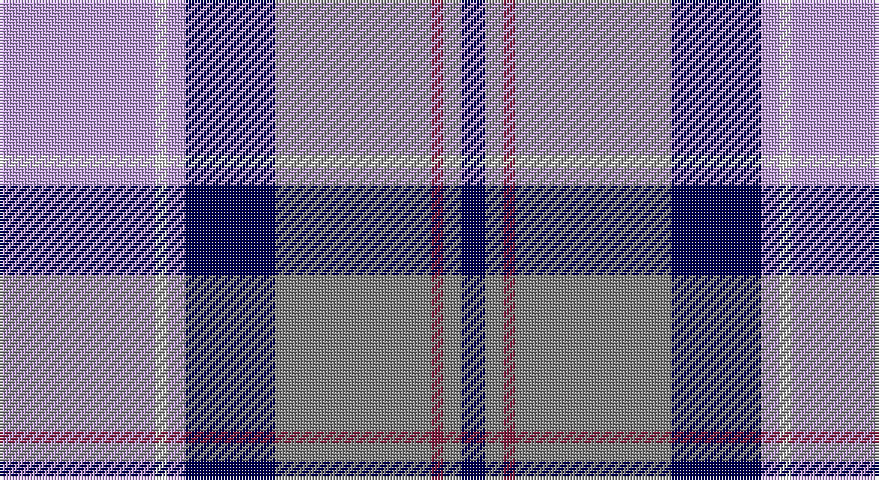

This page is one **sett** — a single exact thread-count. It belongs to the [tartan](/setts/lp26w2lp3db15y26m2y3db4/)
(the same proportion at any scale), whose colour order is pattern [BGRGBWWW](/stripes/bgrgbwww/).

Sourced from weddslist.  It is a [8 stripe tartan](/stripes/stripes8/).

Original link http://www.weddslist.com/cgi-bin/tartans/pg.pl?source=sts

## Thread count
LP/52 LN4 LP6 DB30 N52 DR4 N6 DB/8

One full sett is **264 threads**.

## Palette

Palette: <strong>Tartan Register</strong> <small style="color:#888">(2 of 5 colours)</small>
<table><thead><tr><th>Colour</th><th>Threads</th><th>Shade</th><th>Base</th><th>OKLCh</th></tr></thead><tbody><tr><td>LP/</td><td style="text-align:right;font-variant-numeric:tabular-nums">52</td><td><code style="background-color:#C0A0E0;">#C0A0E0</code> <small style="color:#888">#C0A0E0</small></td><td>W <code style="background-color:#F7F7F7;">#F7F7F7</code></td><td><small style="color:#888">oklch(75.7% 0.096 307.0)</small></td></tr><tr><td>LN</td><td style="text-align:right;font-variant-numeric:tabular-nums">4</td><td><code style="background-color:#E0E0E0;">#E0E0E0</code> <small style="color:#888">#E0E0E0</small></td><td>W <code style="background-color:#F7F7F7;">#F7F7F7</code></td><td><small style="color:#888">oklch(90.7% 0.000 89.9)</small></td></tr><tr><td>LP</td><td style="text-align:right;font-variant-numeric:tabular-nums">6</td><td><code style="background-color:#C0A0E0;">#C0A0E0</code> <small style="color:#888">#C0A0E0</small></td><td>W <code style="background-color:#F7F7F7;">#F7F7F7</code></td><td><small style="color:#888">oklch(75.7% 0.096 307.0)</small></td></tr><tr><td>DB</td><td style="text-align:right;font-variant-numeric:tabular-nums">30</td><td><code style="background-color:#000050;">#000050</code> <small style="color:#888">#000050</small></td><td>B <code style="background-color:#2A418A;">#2A418A</code></td><td><small style="color:#888">oklch(19.5% 0.135 264.1)</small></td></tr><tr><td>N</td><td style="text-align:right;font-variant-numeric:tabular-nums">52</td><td><code style="background-color:#808080;">#808080</code> <small style="color:#888">#808080</small></td><td>G <code style="background-color:#006100;">#006100</code></td><td><small style="color:#888">oklch(60.0% 0.000 89.9)</small></td></tr><tr><td>DR</td><td style="text-align:right;font-variant-numeric:tabular-nums">4</td><td><code style="background-color:#802040;">#802040</code> <small style="color:#888">#802040</small></td><td>R <code style="background-color:#CC0000;">#CC0000</code></td><td><small style="color:#888">oklch(40.8% 0.132 5.2)</small></td></tr><tr><td>N</td><td style="text-align:right;font-variant-numeric:tabular-nums">6</td><td><code style="background-color:#808080;">#808080</code> <small style="color:#888">#808080</small></td><td>G <code style="background-color:#006100;">#006100</code></td><td><small style="color:#888">oklch(60.0% 0.000 89.9)</small></td></tr><tr><td>DB/</td><td style="text-align:right;font-variant-numeric:tabular-nums">8</td><td><code style="background-color:#000050;">#000050</code> <small style="color:#888">#000050</small></td><td>B <code style="background-color:#2A418A;">#2A418A</code></td><td><small style="color:#888">oklch(19.5% 0.135 264.1)</small></td></tr></tbody></table>

# Sample pattern

## Nearest tartans

The nearest existing variants by ΔTartan distance, with this tartan at the top so the swatches line up against it.

ΔTartan

Tartan

Sett

—

<a href="/ttd/edit/#slug=lp26w2lp3db15y26m2y3db4~x2">Scottish Highlander, dress</a> <a class="nn-out" href="/variants/s8/lp26w2lp3db15y26m2y3db4~x2/" title="open its dictionary page">↗</a>

0.96

<a href="/ttd/edit/#slug=w17k2n6t6w1n1dp10k2dp3~x4&amp;base=lp26w2lp3db15y26m2y3db4~x2">Hebridean Arisaid Blue (Dance) Fashion Tartan</a> <a class="nn-out" href="/variants/s9/w17k2n6t6w1n1dp10k2dp3~x4/" title="open its dictionary page">↗</a>

0.99

<a href="/ttd/edit/#slug=db8r3db34t3k9w31r5w3r3w8~x2&amp;base=lp26w2lp3db15y26m2y3db4~x2">Stewart of Appin Dress Clan Tartan</a> <a class="nn-out" href="/variants/s10/db8r3db34t3k9w31r5w3r3w8~x2/" title="open its dictionary page">↗</a>

1.02

<a href="/ttd/edit/#slug=db8r3db34b3k9w31r5w3r3w8&amp;base=lp26w2lp3db15y26m2y3db4~x2">Stuart/Stewart of Appin Dress</a> <a class="nn-out" href="/variants/s10/db8r3db34b3k9w31r5w3r3w8/" title="open its dictionary page">↗</a>

1.06

<a href="/ttd/edit/#slug=r3lr25dbi6db3r2t5db18w3~x2&amp;base=lp26w2lp3db15y26m2y3db4~x2">Fulbright Foundation</a> <a class="nn-out" href="/variants/s8/r3lr25dbi6db3r2t5db18w3~x2/" title="open its dictionary page">↗</a>

1.06

<a href="/ttd/edit/#slug=w28t19dbi19w4db2p2dbi7~x2&amp;base=lp26w2lp3db15y26m2y3db4~x2">St. Andrews Dress, Earl of (Danc</a> <a class="nn-out" href="/variants/s7/w28t19dbi19w4db2p2dbi7~x2/" title="open its dictionary page">↗</a>

1.08

<a href="/ttd/edit/#slug=t12k1t1k1t1db8w9y2~x4&amp;base=lp26w2lp3db15y26m2y3db4~x2">Arran (Pendleton)</a> <a class="nn-out" href="/variants/s8/t12k1t1k1t1db8w9y2~x4/" title="open its dictionary page">↗</a>

1.09

<a href="/ttd/edit/#slug=w28t19dbi19w4db2lp2dbi7~x2&amp;base=lp26w2lp3db15y26m2y3db4~x2">St Andrews Dress, Earl of.. District Tartan</a> <a class="nn-out" href="/variants/s7/w28t19dbi19w4db2lp2dbi7~x2/" title="open its dictionary page">↗</a>

1.09

<a href="/ttd/edit/#slug=t12k1t1k1t1db8w9o2~x4&amp;base=lp26w2lp3db15y26m2y3db4~x2">Arran - 1989 (Fashion)</a> <a class="nn-out" href="/variants/s8/t12k1t1k1t1db8w9o2~x4/" title="open its dictionary page">↗</a>

1.10

<a href="/ttd/edit/#slug=r6t2r2t23k2r4k2b21r2b2w6~x2&amp;base=lp26w2lp3db15y26m2y3db4~x2">IRPA</a> <a class="nn-out" href="/variants/s11/r6t2r2t23k2r4k2b21r2b2w6~x2/" title="open its dictionary page">↗</a>

1.11

<a href="/ttd/edit/#slug=dt1lr7w1o3w1o7dt4p13w1~x4&amp;base=lp26w2lp3db15y26m2y3db4~x2">Wcwm 1893-11</a> <a class="nn-out" href="/variants/s9/dt1lr7w1o3w1o7dt4p13w1~x4/" title="open its dictionary page">↗</a>

## Neighbour map

Every grey dot is one of 14360 variants placed by the first two principal components of the ΔTartan feature space (44% of its variance). Red is this tartan; blue dots are its nearest — click one to open its page.

<svg viewBox="0 0 640 380" role="img" style="max-width:100%;height:auto;border:1px solid #e0e0e0;border-radius:4px;display:block" xmlns="http://www.w3.org/2000/svg"><image href="/nn/cloud.v1.png" width="640" height="380"/><a href="/variants/s9/w17k2n6t6w1n1dp10k2dp3~x4/"><circle cx="151.5" cy="123.6" r="4" fill="#3465a4"><title>Hebridean Arisaid Blue (Dance) Fashion Tartan</title></circle></a><a href="/variants/s10/db8r3db34t3k9w31r5w3r3w8~x2/"><circle cx="167.2" cy="126.9" r="4" fill="#3465a4"><title>Stewart of Appin Dress Clan Tartan</title></circle></a><a href="/variants/s10/db8r3db34b3k9w31r5w3r3w8/"><circle cx="168.5" cy="127.3" r="4" fill="#3465a4"><title>Stuart/Stewart of Appin Dress</title></circle></a><a href="/variants/s8/r3lr25dbi6db3r2t5db18w3~x2/"><circle cx="152.7" cy="134.4" r="4" fill="#3465a4"><title>Fulbright Foundation</title></circle></a><a href="/variants/s7/w28t19dbi19w4db2p2dbi7~x2/"><circle cx="169.1" cy="156.4" r="4" fill="#3465a4"><title>St. Andrews Dress, Earl of (Danc</title></circle></a><a href="/variants/s8/t12k1t1k1t1db8w9y2~x4/"><circle cx="157.8" cy="148.9" r="4" fill="#3465a4"><title>Arran (Pendleton)</title></circle></a><a href="/variants/s7/w28t19dbi19w4db2lp2dbi7~x2/"><circle cx="169.1" cy="156.3" r="4" fill="#3465a4"><title>St Andrews Dress, Earl of.. District Tartan</title></circle></a><a href="/variants/s8/t12k1t1k1t1db8w9o2~x4/"><circle cx="155.4" cy="143.3" r="4" fill="#3465a4"><title>Arran - 1989 (Fashion)</title></circle></a><a href="/variants/s11/r6t2r2t23k2r4k2b21r2b2w6~x2/"><circle cx="168.8" cy="130.8" r="4" fill="#3465a4"><title>IRPA</title></circle></a><a href="/variants/s9/dt1lr7w1o3w1o7dt4p13w1~x4/"><circle cx="137.4" cy="136.4" r="4" fill="#3465a4"><title>Wcwm 1893-11</title></circle></a><circle cx="177.9" cy="147.4" r="5" fill="#c00000"/></svg>

ID: /variants/s8/lp26w2lp3db15y26m2y3db4~x2/
