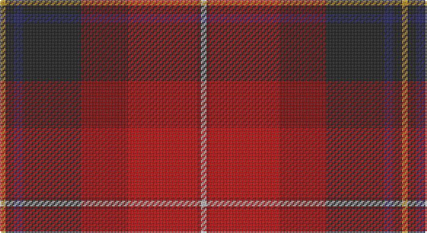

This page is one **sett** — a single exact thread-count. It belongs to the [tartan](/setts/lr2ri1r24ri16dt20db3dt3lo2/)
(the same proportion at any scale), whose colour order is pattern [YBBBRRRY](/stripes/ybbbrrry/).

Sourced from register-of-tartans.  It is a [8 stripe tartan](/stripes/stripes8/).

Original link https://www.tartanregister.gov.uk/tartanDetails.aspx?ref=4061

## Register references

External register numbers recorded for this tartan.

- Scottish Register of Tartans: [4061](https://www.tartanregister.gov.uk/tartanDetails.aspx?ref=4061)
- Scottish Tartans Authority (ITI): 5157

## Thread count
DY/4 K6 DB6 K40 DR32 R48 DR2 N/4

One full sett is **276 threads**.

## Palette

Palette: <strong>Tartan Register</strong> <small style="color:#888">(5 of 6 colours)</small>
<table><thead><tr><th>Colour</th><th>Threads</th><th>Shade</th><th>Base</th><th>OKLCh</th></tr></thead><tbody><tr><td>DY/</td><td style="text-align:right;font-variant-numeric:tabular-nums">4</td><td><code style="background-color:#BC8C00;">#BC8C00</code> <small style="color:#888">#BC8C00</small></td><td>Y <code style="background-color:#F2BF00;">#F2BF00</code></td><td><small style="color:#888">oklch(66.8% 0.137 84.1)</small></td></tr><tr><td>K</td><td style="text-align:right;font-variant-numeric:tabular-nums">6</td><td><code style="background-color:#1C1C1C;">#1C1C1C</code> <small style="color:#888">#1C1C1C</small></td><td>B <code style="background-color:#2A418A;">#2A418A</code></td><td><small style="color:#888">oklch(22.6% 0.000 89.9)</small></td></tr><tr><td>DB</td><td style="text-align:right;font-variant-numeric:tabular-nums">6</td><td><code style="background-color:#202060;">#202060</code> <small style="color:#888">#202060</small></td><td>B <code style="background-color:#2A418A;">#2A418A</code></td><td><small style="color:#888">oklch(28.9% 0.111 276.9)</small></td></tr><tr><td>K</td><td style="text-align:right;font-variant-numeric:tabular-nums">40</td><td><code style="background-color:#1C1C1C;">#1C1C1C</code> <small style="color:#888">#1C1C1C</small></td><td>B <code style="background-color:#2A418A;">#2A418A</code></td><td><small style="color:#888">oklch(22.6% 0.000 89.9)</small></td></tr><tr><td>DR</td><td style="text-align:right;font-variant-numeric:tabular-nums">32</td><td><code style="background-color:#880000;">#880000</code> <small style="color:#888">#880000</small></td><td>R <code style="background-color:#CC0000;">#CC0000</code></td><td><small style="color:#888">oklch(39.4% 0.162 29.2)</small></td></tr><tr><td>R</td><td style="text-align:right;font-variant-numeric:tabular-nums">48</td><td><code style="background-color:#C80000;">#C80000</code> <small style="color:#888">#C80000</small></td><td>R <code style="background-color:#CC0000;">#CC0000</code></td><td><small style="color:#888">oklch(52.3% 0.215 29.2)</small></td></tr><tr><td>DR</td><td style="text-align:right;font-variant-numeric:tabular-nums">2</td><td><code style="background-color:#880000;">#880000</code> <small style="color:#888">#880000</small></td><td>R <code style="background-color:#CC0000;">#CC0000</code></td><td><small style="color:#888">oklch(39.4% 0.162 29.2)</small></td></tr><tr><td>N/</td><td style="text-align:right;font-variant-numeric:tabular-nums">4</td><td><code style="background-color:#B8B8B8;">#B8B8B8</code> <small style="color:#888">#B8B8B8</small></td><td>Y <code style="background-color:#F2BF00;">#F2BF00</code></td><td><small style="color:#888">oklch(78.3% 0.000 89.9)</small></td></tr></tbody></table>

# Sample pattern

## Nearest tartans

The nearest existing variants by ΔTartan distance, with this tartan at the top so the swatches line up against it.

ΔTartan

Tartan

Sett

—

<a href="/ttd/edit/#slug=lr2ri1r24ri16dt20db3dt3lo2~x2">Tache, Sir Etienne Paschal</a> <a class="nn-out" href="/variants/s8/lr2ri1r24ri16dt20db3dt3lo2~x2/" title="open its dictionary page">↗</a>

1.06

<a href="/ttd/edit/#slug=g9ly2g6r35db6lb1ri20db5lb2~x2&amp;base=lr2ri1r24ri16dt20db3dt3lo2~x2">Telfer (Name)</a> <a class="nn-out" href="/variants/s9/g9ly2g6r35db6lb1ri20db5lb2~x2/" title="open its dictionary page">↗</a>

1.09

<a href="/ttd/edit/#slug=g9lo2g6r35db6lb1ri20db5lb2~x2&amp;base=lr2ri1r24ri16dt20db3dt3lo2~x2">Telfer</a> <a class="nn-out" href="/variants/s9/g9lo2g6r35db6lb1ri20db5lb2~x2/" title="open its dictionary page">↗</a>

1.20

<a href="/ttd/edit/#slug=r6k7r45rii14k10ri4k3riii6k20rii23lb5rii6&amp;base=lr2ri1r24ri16dt20db3dt3lo2~x2">Sweetheart (Fashion)</a> <a class="nn-out" href="/variants/s12/r6k7r45rii14k10ri4k3riii6k20rii23lb5rii6/" title="open its dictionary page">↗</a>

1.39

<a href="/ttd/edit/#slug=g2k16r5k1o8k1r5k1dp16ly2~x4&amp;base=lr2ri1r24ri16dt20db3dt3lo2~x2">Tribal #2</a> <a class="nn-out" href="/variants/s10/g2k16r5k1o8k1r5k1dp16ly2~x4/" title="open its dictionary page">↗</a>

1.47

<a href="/ttd/edit/#slug=w3dy1r29dy16dg23db3dg3lo2~x2&amp;base=lr2ri1r24ri16dt20db3dt3lo2~x2">Tache, Sir Etienne Paschal #2</a> <a class="nn-out" href="/variants/s8/w3dy1r29dy16dg23db3dg3lo2~x2/" title="open its dictionary page">↗</a>

1.47

<a href="/ttd/edit/#slug=g3r4k1r26y14r4dp16w2~x2&amp;base=lr2ri1r24ri16dt20db3dt3lo2~x2">MacQueen of Dalmagarry (Clan?)</a> <a class="nn-out" href="/variants/s8/g3r4k1r26y14r4dp16w2~x2/" title="open its dictionary page">↗</a>

1.50

<a href="/ttd/edit/#slug=dg15r25dg4k2ly1dt1ly1k2dg4dt12w1~x2&amp;base=lr2ri1r24ri16dt20db3dt3lo2~x2">Livingstone (Australia) Dress</a> <a class="nn-out" href="/variants/s11/dg15r25dg4k2ly1dt1ly1k2dg4dt12w1~x2/" title="open its dictionary page">↗</a>

1.54

<a href="/ttd/edit/#slug=dp2g18dp15r24k1ly2~x2&amp;base=lr2ri1r24ri16dt20db3dt3lo2~x2">Miller, Reverend Ian (Personal</a> <a class="nn-out" href="/variants/s6/dp2g18dp15r24k1ly2~x2/" title="open its dictionary page">↗</a>

1.57

<a href="/variants/s10/r63w4k4dp18ly4dg50~x2/">Gordon of Abergeldie</a>

1.57

<a href="/ttd/edit/#slug=r26g5dg7ri2do9lo1loi1dg4~x2&amp;base=lr2ri1r24ri16dt20db3dt3lo2~x2">Tartan Army Whisky</a> <a class="nn-out" href="/variants/s8/r26g5dg7ri2do9lo1loi1dg4~x2/" title="open its dictionary page">↗</a>

## Neighbour map

Every grey dot is one of 14360 variants placed by the first two principal components of the ΔTartan feature space (44% of its variance). Red is this tartan; blue dots are its nearest — click one to open its page.

<svg viewBox="0 0 640 380" role="img" style="max-width:100%;height:auto;border:1px solid #e0e0e0;border-radius:4px;display:block" xmlns="http://www.w3.org/2000/svg"><image href="/nn/cloud.v1.png" width="640" height="380"/><a href="/variants/s9/g9ly2g6r35db6lb1ri20db5lb2~x2/"><circle cx="249.9" cy="93.5" r="4" fill="#3465a4"><title>Telfer (Name)</title></circle></a><a href="/variants/s9/g9lo2g6r35db6lb1ri20db5lb2~x2/"><circle cx="249.9" cy="92.4" r="4" fill="#3465a4"><title>Telfer</title></circle></a><a href="/variants/s12/r6k7r45rii14k10ri4k3riii6k20rii23lb5rii6/"><circle cx="182.5" cy="120.5" r="4" fill="#3465a4"><title>Sweetheart (Fashion)</title></circle></a><a href="/variants/s10/g2k16r5k1o8k1r5k1dp16ly2~x4/"><circle cx="159.2" cy="120.0" r="4" fill="#3465a4"><title>Tribal #2</title></circle></a><a href="/variants/s8/w3dy1r29dy16dg23db3dg3lo2~x2/"><circle cx="225.9" cy="114.8" r="4" fill="#3465a4"><title>Tache, Sir Etienne Paschal #2</title></circle></a><a href="/variants/s8/g3r4k1r26y14r4dp16w2~x2/"><circle cx="271.0" cy="113.2" r="4" fill="#3465a4"><title>MacQueen of Dalmagarry (Clan?)</title></circle></a><a href="/variants/s11/dg15r25dg4k2ly1dt1ly1k2dg4dt12w1~x2/"><circle cx="221.8" cy="96.8" r="4" fill="#3465a4"><title>Livingstone (Australia) Dress</title></circle></a><a href="/variants/s6/dp2g18dp15r24k1ly2~x2/"><circle cx="264.2" cy="169.2" r="4" fill="#3465a4"><title>Miller, Reverend Ian (Personal</title></circle></a><a href="/variants/s10/r63w4k4dp18ly4dg50~x2/"><circle cx="182.5" cy="101.0" r="4" fill="#3465a4"><title>Gordon of Abergeldie</title></circle></a><a href="/variants/s8/r26g5dg7ri2do9lo1loi1dg4~x2/"><circle cx="261.6" cy="96.3" r="4" fill="#3465a4"><title>Tartan Army Whisky</title></circle></a><circle cx="218.2" cy="122.7" r="5" fill="#c00000"/></svg>

ID: /variants/s8/lr2ri1r24ri16dt20db3dt3lo2~x2/
