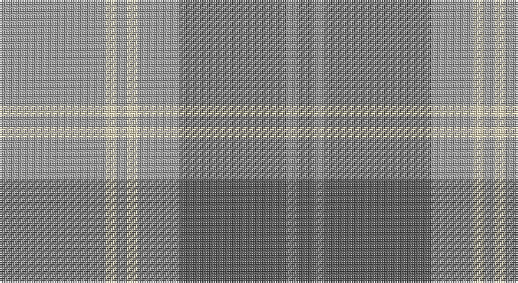

This page is one **sett** — a single exact thread-count. It belongs to the [tartan](/setts/lr30w3lr3w3lr12n30o3n5/)
(the same proportion at any scale), whose colour order is pattern [BRBYWYWY](/stripes/brbywywy/).

Part of the [Dama Classic](/tartans/dama-classic/) tartan — the named design grouping this sett with its other cloths.

Sourced from tartans-authority.  It is a [8 stripe tartan](/stripes/stripes8/).

Original link http://www.tartansauthority.com/tartan-ferret/display/10208/

## Register references

External register numbers recorded for this tartan.

- Scottish Register of Tartans: [10208](https://www.tartanregister.gov.uk/tartanDetails?ref=10208)
- Scottish Tartans Authority (ITI): 10208

## Thread count
Na/60 W6 Na6 W6 Na24 N60 Nb6 N/10

One full sett is **286 threads**.

## Palette

Palette: <strong>Tartan Register</strong> <small style="color:#888">(2 of 4 colours)</small>
<table><thead><tr><th>Colour</th><th>Threads</th><th>Shade</th><th>Base</th><th>OKLCh</th></tr></thead><tbody><tr><td>Na/</td><td style="text-align:right;font-variant-numeric:tabular-nums">60</td><td><code style="background-color:#A0A0A0;">#A0A0A0</code> <small style="color:#888">#A0A0A0</small></td><td>Y <code style="background-color:#F2BF00;">#F2BF00</code></td><td><small style="color:#888">oklch(70.6% 0.000 89.9)</small></td></tr><tr><td>W</td><td style="text-align:right;font-variant-numeric:tabular-nums">6</td><td><code style="background-color:#F0DCBC;">#F0DCBC</code> <small style="color:#888">#F0DCBC</small></td><td>W <code style="background-color:#F7F7F7;">#F7F7F7</code></td><td><small style="color:#888">oklch(90.3% 0.048 79.6)</small></td></tr><tr><td>Na</td><td style="text-align:right;font-variant-numeric:tabular-nums">6</td><td><code style="background-color:#A0A0A0;">#A0A0A0</code> <small style="color:#888">#A0A0A0</small></td><td>Y <code style="background-color:#F2BF00;">#F2BF00</code></td><td><small style="color:#888">oklch(70.6% 0.000 89.9)</small></td></tr><tr><td>W</td><td style="text-align:right;font-variant-numeric:tabular-nums">6</td><td><code style="background-color:#F0DCBC;">#F0DCBC</code> <small style="color:#888">#F0DCBC</small></td><td>W <code style="background-color:#F7F7F7;">#F7F7F7</code></td><td><small style="color:#888">oklch(90.3% 0.048 79.6)</small></td></tr><tr><td>Na</td><td style="text-align:right;font-variant-numeric:tabular-nums">24</td><td><code style="background-color:#A0A0A0;">#A0A0A0</code> <small style="color:#888">#A0A0A0</small></td><td>Y <code style="background-color:#F2BF00;">#F2BF00</code></td><td><small style="color:#888">oklch(70.6% 0.000 89.9)</small></td></tr><tr><td>N</td><td style="text-align:right;font-variant-numeric:tabular-nums">60</td><td><code style="background-color:#5C5C5C;">#5C5C5C</code> <small style="color:#888">#5C5C5C</small></td><td>B <code style="background-color:#2A418A;">#2A418A</code></td><td><small style="color:#888">oklch(47.5% 0.000 89.9)</small></td></tr><tr><td>Nb</td><td style="text-align:right;font-variant-numeric:tabular-nums">6</td><td><code style="background-color:#888888;">#888888</code> <small style="color:#888">#888888</small></td><td>R <code style="background-color:#CC0000;">#CC0000</code></td><td><small style="color:#888">oklch(62.7% 0.000 89.9)</small></td></tr><tr><td>N/</td><td style="text-align:right;font-variant-numeric:tabular-nums">10</td><td><code style="background-color:#5C5C5C;">#5C5C5C</code> <small style="color:#888">#5C5C5C</small></td><td>B <code style="background-color:#2A418A;">#2A418A</code></td><td><small style="color:#888">oklch(47.5% 0.000 89.9)</small></td></tr></tbody></table>

# Sample pattern

## Compared to the master

This cloth is one sett of its design; the master sett (the exemplar the design is anchored on) is below for comparison.

<figure style="margin:0"><figcaption style="color:#888;font-size:smaller">this sett</figcaption></figure>
<figure style="margin:0"><figcaption style="color:#888;font-size:smaller"><a href="/setts/y30ly3y3ly3y12do30k3do5/">master sett →</a></figcaption></figure>

## Nearest tartans

The nearest existing variants by ΔTartan distance, with this tartan at the top so the swatches line up against it.

ΔTartan

Tartan

Sett

—

<a href="/ttd/edit/#slug=lr30w3lr3w3lr12n30o3n5~x2">Dama Classic (Fashion)</a> <a class="nn-out" href="/variants/s8/lr30w3lr3w3lr12n30o3n5~x2/" title="open its dictionary page">↗</a>

1.11

<a href="/ttd/edit/#slug=m3o2m6o21lr2o4lr3o3lr4o2lr13w2~x2&amp;base=lr30w3lr3w3lr12n30o3n5~x2">Qatar Airways</a> <a class="nn-out" href="/variants/s12/m3o2m6o21lr2o4lr3o3lr4o2lr13w2~x2/" title="open its dictionary page">↗</a>

1.11

<a href="/ttd/edit/#slug=w1dp1o7n4o1w1~x4&amp;base=lr30w3lr3w3lr12n30o3n5~x2">Lochnagar Plaid (District)</a> <a class="nn-out" href="/variants/s6/w1dp1o7n4o1w1~x4/" title="open its dictionary page">↗</a>

1.20

<a href="/ttd/edit/#slug=lb1o12r1dt1r1dt2r5lb1~x4&amp;base=lr30w3lr3w3lr12n30o3n5~x2">Tenmaya Check</a> <a class="nn-out" href="/variants/s8/lb1o12r1dt1r1dt2r5lb1~x4/" title="open its dictionary page">↗</a>

1.22

<a href="/ttd/edit/#slug=t32r3t3r3t3r10g24ri3~x2&amp;base=lr30w3lr3w3lr12n30o3n5~x2">Gammell (Personal)</a> <a class="nn-out" href="/variants/s8/t32r3t3r3t3r10g24ri3~x2/" title="open its dictionary page">↗</a>

1.26

<a href="/variants/s8/o57w5g20o5lo10~x2/">Johore</a>

1.41

<a href="/ttd/edit/#slug=g2t15lr5g2t2g7w2~x4&amp;base=lr30w3lr3w3lr12n30o3n5~x2">Chambers Bay</a> <a class="nn-out" href="/variants/s7/g2t15lr5g2t2g7w2~x4/" title="open its dictionary page">↗</a>

1.46

<a href="/ttd/edit/#slug=w1dp1lb7o4lb1w1~x4&amp;base=lr30w3lr3w3lr12n30o3n5~x2">Lochnagar Trade Tartan</a> <a class="nn-out" href="/variants/s6/w1dp1lb7o4lb1w1~x4/" title="open its dictionary page">↗</a>

1.47

<a href="/ttd/edit/#slug=lb4n2lb18r2n5o16r2o2r2o2~x2&amp;base=lr30w3lr3w3lr12n30o3n5~x2">Clyde Trade Tartan</a> <a class="nn-out" href="/variants/s10/lb4n2lb18r2n5o16r2o2r2o2~x2/" title="open its dictionary page">↗</a>

1.50

<a href="/ttd/edit/#slug=lb1n12r1dt1r1dt2r5lb1~x4&amp;base=lr30w3lr3w3lr12n30o3n5~x2">Tenmaya Corporate Tartan</a> <a class="nn-out" href="/variants/s8/lb1n12r1dt1r1dt2r5lb1~x4/" title="open its dictionary page">↗</a>

1.52

<a href="/ttd/edit/#slug=n44o8n8o22lb4o4lb11o2lbi2~x2&amp;base=lr30w3lr3w3lr12n30o3n5~x2">Titanium (Fashion)</a> <a class="nn-out" href="/variants/s9/n44o8n8o22lb4o4lb11o2lbi2~x2/" title="open its dictionary page">↗</a>

## Neighbour map

Every grey dot is one of 14360 variants placed by the first two principal components of the ΔTartan feature space (44% of its variance). Red is this tartan; blue dots are its nearest — click one to open its page.

<svg viewBox="0 0 640 380" role="img" style="max-width:100%;height:auto;border:1px solid #e0e0e0;border-radius:4px;display:block" xmlns="http://www.w3.org/2000/svg"><image href="/nn/cloud.v1.png" width="640" height="380"/><a href="/variants/s12/m3o2m6o21lr2o4lr3o3lr4o2lr13w2~x2/"><circle cx="306.7" cy="177.2" r="4" fill="#3465a4"><title>Qatar Airways</title></circle></a><a href="/variants/s6/w1dp1o7n4o1w1~x4/"><circle cx="310.5" cy="231.4" r="4" fill="#3465a4"><title>Lochnagar Plaid (District)</title></circle></a><a href="/variants/s8/lb1o12r1dt1r1dt2r5lb1~x4/"><circle cx="340.9" cy="182.1" r="4" fill="#3465a4"><title>Tenmaya Check</title></circle></a><a href="/variants/s8/t32r3t3r3t3r10g24ri3~x2/"><circle cx="303.4" cy="202.2" r="4" fill="#3465a4"><title>Gammell (Personal)</title></circle></a><a href="/variants/s8/o57w5g20o5lo10~x2/"><circle cx="328.8" cy="195.8" r="4" fill="#3465a4"><title>Johore</title></circle></a><a href="/variants/s7/g2t15lr5g2t2g7w2~x4/"><circle cx="305.5" cy="243.8" r="4" fill="#3465a4"><title>Chambers Bay</title></circle></a><a href="/variants/s6/w1dp1lb7o4lb1w1~x4/"><circle cx="317.8" cy="230.3" r="4" fill="#3465a4"><title>Lochnagar Trade Tartan</title></circle></a><a href="/variants/s10/lb4n2lb18r2n5o16r2o2r2o2~x2/"><circle cx="263.0" cy="187.3" r="4" fill="#3465a4"><title>Clyde Trade Tartan</title></circle></a><a href="/variants/s8/lb1n12r1dt1r1dt2r5lb1~x4/"><circle cx="336.3" cy="182.6" r="4" fill="#3465a4"><title>Tenmaya Corporate Tartan</title></circle></a><a href="/variants/s9/n44o8n8o22lb4o4lb11o2lbi2~x2/"><circle cx="379.0" cy="181.6" r="4" fill="#3465a4"><title>Titanium (Fashion)</title></circle></a><circle cx="343.4" cy="208.2" r="5" fill="#c00000"/></svg>

ID: /variants/s8/lr30w3lr3w3lr12n30o3n5~x2/
