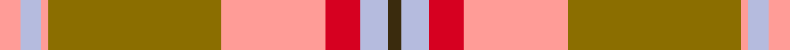

This is one **variant** — a specific cloth: this exact thread count and colourway, with its own
provenance below. It is one weaving of the [sett](/setts/lr3lb3lr1y25lr15r5lb4dy2/) (the scale-free proportion — the
same cloth at any scale or shade), whose colour order is pattern [GWRYGYWY](/stripes/gwrygywy/).

Sourced from register-of-tartans.  It is a [8 stripe tartan](/stripes/stripes8/).

Original link [https://www.tartanregister.gov.uk/tartanDetails.aspx?ref=3512](https://www.tartanregister.gov.uk/tartanDetails.aspx?ref=3512)

2 attestations — the source records this cloth was collapsed from (oldest owns this page)

<ul>
<li>01/12/2001 — Rikaco Morning Dew #2 (register-of-tartans, <a href="https://www.tartanregister.gov.uk/tartanDetails.aspx?ref=3512">record</a>)  <em>An apparent alternative design going under the name of Rikaco Morning Dew. Lochcarron swatch. Colours very poor in this graphic.</em></li>
<li>Dec 2001 — Rikaco Morning Dew 2 (Fashion) (tartans-authority, <a href="https://www.tartanregister.gov.uk/tartanDetails.aspx?ref=6392">record</a>)  <em>An apparent alternative design going under the name of Rikaco Morning Dew. Lochcarron swatch. Colours very poor in this graphic.</em></li>
</ul>

Dataset <small>— provenance for this record, inherited from the source manifest</small>

<dl class="dataset-prov">
<dt>source</dt><dd><a href="/sources/register-of-tartans/">Scottish Register of Tartans</a></dd>
<dt>data captured from</dt><dd><a href="https://github.com/thetartan/tartan-database/blob/master/data/register-of-tartans/data.csv">https://github.com/thetartan/tartan-database/blob/master/data/register-of-tartans/data.csv</a></dd>
<dt>data date</dt><dd>01/12/2001 <small>(this record)</small></dd>
<dt>licence</dt><dd><a href="https://www.tartanregister.gov.uk/copyright">Crown copyright</a></dd>
</dl>

Capture chain <small>— the hands this data passed through, oldest first; each capture carries its own licence</small>

<ol class="capture-chain">
<li><a href="https://www.tartanregister.gov.uk/">Scottish Register of Tartans</a> · <a href="https://www.tartanregister.gov.uk/copyright">Crown copyright</a> <small>the living register — still published by National Records of Scotland</small></li>
<li><a href="https://github.com/thetartan/tartan-database">thetartan/tartan-database</a> <small>2016-2017</small> · <a href="https://creativecommons.org/licenses/by-nc-nd/4.0/">CC BY-NC-ND 4.0</a> <small>Levko Kravets's frozen compilation — the capture we vendored, and where its CC licence text came from</small></li>
<li>this dictionary <small>captured 2026-06-10 · commit 5bf86c7566</small> <small>each re-capture is a git commit to data/sources</small></li>
</ol>

## Register references

External register numbers recorded for this tartan.

- Scottish Register of Tartans: [3512](https://www.tartanregister.gov.uk/tartanDetails.aspx?ref=3512)
- Scottish Tartans Authority (ITI): 6392

## Thread count
LR/6 LB6 LR2 Y50 LR30 R10 LB8 DY/4

One full sett is **222 threads**.

## Palette
<table><thead><tr><th>Colour</th><th>Shade</th><th>OKLCh</th></tr></thead><tbody><tr><td>LB</td><td><code style="background-color:#B5BBDE;">#B5BBDE</code> <small style="color:#888">#B5BBDE</small></td><td><small style="color:#888">oklch(79.9% 0.050 277.6)</small></td></tr><tr><td>Y</td><td><code style="background-color:#8B6E00;">#8B6E00</code> <small style="color:#888">#8B6E00</small></td><td><small style="color:#888">oklch(55.1% 0.113 90.4)</small></td></tr><tr><td>R</td><td><code style="background-color:#D60020;">#D60020</code> <small style="color:#888">#D60020</small></td><td><small style="color:#888">oklch(55.2% 0.224 25.5)</small></td></tr><tr><td>LR</td><td><code style="background-color:#FF9C97;">#FF9C97</code> <small style="color:#888">#FF9C97</small></td><td><small style="color:#888">oklch(79.3% 0.119 23.2)</small></td></tr><tr><td>DY</td><td><code style="background-color:#3A2B0D;">#3A2B0D</code> <small style="color:#888">#3A2B0D</small></td><td><small style="color:#888">oklch(30.0% 0.049 82.0)</small></td></tr></tbody></table>

# Sample pattern

## Nearest tartan variants

The nearest existing variants by ΔTartan distance, with this cloth at the top so the swatches line up against it.

ΔTartan

Threads

Variant

Sett

—

222

<a href="/variants/s8/lr3lb3lr1y25lr15r5lb4dy2~x2/">Rikaco Morning Dew #2</a>

<a href="/ttd/edit/#slug=n5lb5n2r47n18lr2n5g9lb7lr3~x2&amp;base=lr3lb3lr1y25lr15r5lb4dy2~x2" title="compare in the TTD">2.48</a>

396

<a href="/variants/s10/n5lb5n2r47n18lr2n5g9lb7lr3~x2/">Rikaco Red (Fashion)</a>

<a href="/ttd/edit/#slug=n22r2w1lo3r1n6r22lo3r1lr10~x4&amp;base=lr3lb3lr1y25lr15r5lb4dy2~x2" title="compare in the TTD">2.52</a>

440

<a href="/variants/s10/n22r2w1lo3r1n6r22lo3r1lr10~x4/">Glenburnie School</a>

<a href="/ttd/edit/#slug=n5lb5n2r47n18o2n5g9lb7o3~x2&amp;base=lr3lb3lr1y25lr15r5lb4dy2~x2" title="compare in the TTD">2.54</a>

396

<a href="/variants/s10/n5lb5n2r47n18o2n5g9lb7o3~x2/">Rikaco Red</a>

<a href="/ttd/edit/#slug=r26n4r1dp2g1n4g14lb2~x2&amp;base=lr3lb3lr1y25lr15r5lb4dy2~x2" title="compare in the TTD">2.66</a>

160

<a href="/variants/s8/r26n4r1dp2g1n4g14lb2~x2/">Redpath, Robert A (Personal)</a>

<a href="/ttd/edit/#slug=r31g19t27dt1w1y1~x2~t2302222-dt1503227&amp;base=lr3lb3lr1y25lr15r5lb4dy2~x2" title="compare in the TTD">3.27</a>

256

<a href="/variants/s6/r31g19t27dt1w1y1~x2~t2302222-dt1503227/">Glencross (Solway) (Personal)</a>

<a href="/ttd/edit/#slug=o24r24w3g21y2r1y2o6r2~x2&amp;base=lr3lb3lr1y25lr15r5lb4dy2~x2" title="compare in the TTD">3.32</a>

288

<a href="/variants/s9/o24r24w3g21y2r1y2o6r2~x2/">Henry, W.A.</a>

<a href="/ttd/edit/#slug=r6t22r6g20y2r45t2w5~x2&amp;base=lr3lb3lr1y25lr15r5lb4dy2~x2" title="compare in the TTD">3.32</a>

410

<a href="/variants/s8/r6t22r6g20y2r45t2w5~x2/">Elbrick Dress (Personal)</a>

<a href="/ttd/edit/#slug=w3o1r29o16g23db3g3y2~x2&amp;base=lr3lb3lr1y25lr15r5lb4dy2~x2" title="compare in the TTD">3.33</a>

310

<a href="/variants/s8/w3o1r29o16g23db3g3y2~x2/">Etienne, Paschal Tache Sir...</a>

<a href="/ttd/edit/#slug=r2g16ri1r2ri12y1lb1~x2~r1706009-ri2109032&amp;base=lr3lb3lr1y25lr15r5lb4dy2~x2" title="compare in the TTD">3.42</a>

134

<a href="/variants/s7/r2g16ri1r2ri12y1lb1~x2~r1706009-ri2109032/">Spragg (Name)</a>

<a href="/ttd/edit/#slug=r2lo14o14dr1r2dr2t2dr2r20t2~x4&amp;base=lr3lb3lr1y25lr15r5lb4dy2~x2" title="compare in the TTD">3.59</a>

472

<a href="/variants/s10/r2lo14o14dr1r2dr2t2dr2r20t2~x4/">Star Is Born, A</a>

## Neighbour map

Every grey dot is one of 13621 variants placed by the first two principal components of the ΔTartan feature space (42% of its variance). Red is this tartan; blue dots are its nearest — click one to open its page.

<svg viewBox="0 0 640 380" role="img" style="max-width:100%;height:auto;border:1px solid #e0e0e0;border-radius:4px;display:block" xmlns="http://www.w3.org/2000/svg"><image href="/nn/cloud.v1.png" width="640" height="380"/><a href="/variants/s10/n5lb5n2r47n18lr2n5g9lb7lr3~x2/"><circle cx="326.7" cy="134.5" r="4" fill="#3465a4"><title>Rikaco Red (Fashion)</title></circle></a><a href="/variants/s10/n22r2w1lo3r1n6r22lo3r1lr10~x4/"><circle cx="305.6" cy="148.4" r="4" fill="#3465a4"><title>Glenburnie School</title></circle></a><a href="/variants/s10/n5lb5n2r47n18o2n5g9lb7o3~x2/"><circle cx="335.8" cy="137.5" r="4" fill="#3465a4"><title>Rikaco Red</title></circle></a><a href="/variants/s8/r26n4r1dp2g1n4g14lb2~x2/"><circle cx="342.8" cy="136.3" r="4" fill="#3465a4"><title>Redpath, Robert A (Personal)</title></circle></a><a href="/variants/s6/r31g19t27dt1w1y1~x2~t2302222-dt1503227/"><circle cx="287.7" cy="155.0" r="4" fill="#3465a4"><title>Glencross (Solway) (Personal)</title></circle></a><a href="/variants/s9/o24r24w3g21y2r1y2o6r2~x2/"><circle cx="293.8" cy="163.1" r="4" fill="#3465a4"><title>Henry, W.A.</title></circle></a><a href="/variants/s8/r6t22r6g20y2r45t2w5~x2/"><circle cx="320.7" cy="146.3" r="4" fill="#3465a4"><title>Elbrick Dress (Personal)</title></circle></a><a href="/variants/s8/w3o1r29o16g23db3g3y2~x2/"><circle cx="246.5" cy="132.9" r="4" fill="#3465a4"><title>Etienne, Paschal Tache Sir...</title></circle></a><a href="/variants/s7/r2g16ri1r2ri12y1lb1~x2~r1706009-ri2109032/"><circle cx="311.7" cy="165.1" r="4" fill="#3465a4"><title>Spragg (Name)</title></circle></a><a href="/variants/s10/r2lo14o14dr1r2dr2t2dr2r20t2~x4/"><circle cx="294.1" cy="154.2" r="4" fill="#3465a4"><title>Star Is Born, A</title></circle></a><circle cx="321.0" cy="159.5" r="5" fill="#c00000"/><text x="320" y="376" text-anchor="middle" font-size="11" fill="#999">ground</text><text x="11" y="190" text-anchor="middle" font-size="11" fill="#999" transform="rotate(-90 11 190)">complexity</text></svg>

ID: /variants/s8/lr3lb3lr1y25lr15r5lb4dy2~x2/
