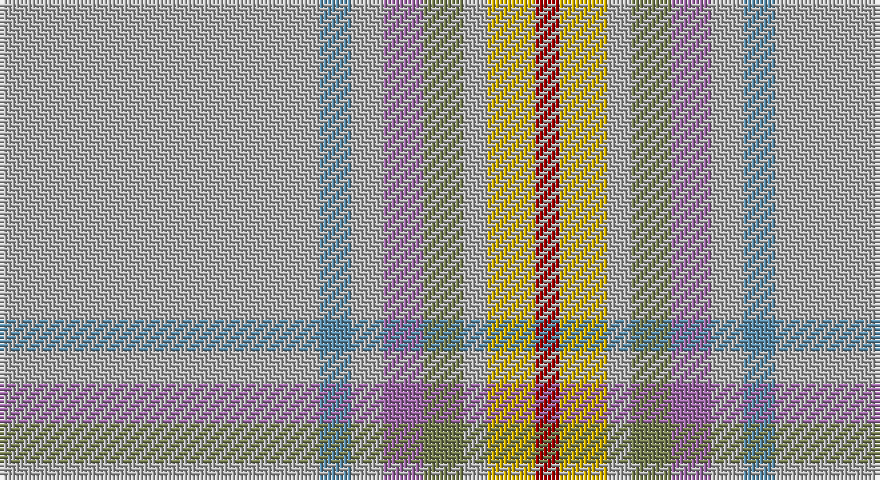

This page is one **sett** — a single exact thread-count. It belongs to the [tartan](/setts/lr40t4lr4m5y5lr3ly6r3/)
(the same proportion at any scale), whose colour order is pattern [RYYGRYBY](/stripes/ryygryby/).

Part of the [Miller Hargreaves](/tartans/miller-hargreaves/) tartan — the named design grouping this sett with its other cloths.

Sourced from register-of-tartans.  It is a [8 stripe tartan](/stripes/stripes8/).

Original link https://www.tartanregister.gov.uk/tartanDetails.aspx?ref=11252

## Register references

External register numbers recorded for this tartan.

- Scottish Register of Tartans: [11252](https://www.tartanregister.gov.uk/tartanDetails.aspx?ref=11252)

## Thread count
N/80 B8 N8 LP10 G10 N6 Y12 DR/6

One full sett is **194 threads**.

## Palette

Palette: <strong>Tartan Register</strong>
<table><thead><tr><th>Colour</th><th>Threads</th><th>Shade</th><th>Base</th><th>OKLCh</th></tr></thead><tbody><tr><td>N/</td><td style="text-align:right;font-variant-numeric:tabular-nums">80</td><td><code style="background-color:#B0B0B0;">#B0B0B0</code> <small style="color:#888">#B0B0B0</small></td><td>Y <code style="background-color:#F2BF00;">#F2BF00</code></td><td><small style="color:#888">oklch(75.7% 0.000 89.9)</small></td></tr><tr><td>B</td><td style="text-align:right;font-variant-numeric:tabular-nums">8</td><td><code style="background-color:#5C8CA8;">#5C8CA8</code> <small style="color:#888">#5C8CA8</small></td><td>B <code style="background-color:#2A418A;">#2A418A</code></td><td><small style="color:#888">oklch(61.7% 0.067 235.0)</small></td></tr><tr><td>N</td><td style="text-align:right;font-variant-numeric:tabular-nums">8</td><td><code style="background-color:#B0B0B0;">#B0B0B0</code> <small style="color:#888">#B0B0B0</small></td><td>Y <code style="background-color:#F2BF00;">#F2BF00</code></td><td><small style="color:#888">oklch(75.7% 0.000 89.9)</small></td></tr><tr><td>LP</td><td style="text-align:right;font-variant-numeric:tabular-nums">10</td><td><code style="background-color:#9C68A4;">#9C68A4</code> <small style="color:#888">#9C68A4</small></td><td>R <code style="background-color:#CC0000;">#CC0000</code></td><td><small style="color:#888">oklch(59.4% 0.107 322.0)</small></td></tr><tr><td>G</td><td style="text-align:right;font-variant-numeric:tabular-nums">10</td><td><code style="background-color:#767E52;">#767E52</code> <small style="color:#888">#767E52</small></td><td>G <code style="background-color:#006100;">#006100</code></td><td><small style="color:#888">oklch(57.5% 0.064 116.8)</small></td></tr><tr><td>N</td><td style="text-align:right;font-variant-numeric:tabular-nums">6</td><td><code style="background-color:#B0B0B0;">#B0B0B0</code> <small style="color:#888">#B0B0B0</small></td><td>Y <code style="background-color:#F2BF00;">#F2BF00</code></td><td><small style="color:#888">oklch(75.7% 0.000 89.9)</small></td></tr><tr><td>Y</td><td style="text-align:right;font-variant-numeric:tabular-nums">12</td><td><code style="background-color:#D8B000;">#D8B000</code> <small style="color:#888">#D8B000</small></td><td>Y <code style="background-color:#F2BF00;">#F2BF00</code></td><td><small style="color:#888">oklch(77.1% 0.158 92.3)</small></td></tr><tr><td>DR/</td><td style="text-align:right;font-variant-numeric:tabular-nums">6</td><td><code style="background-color:#A00000;">#A00000</code> <small style="color:#888">#A00000</small></td><td>R <code style="background-color:#CC0000;">#CC0000</code></td><td><small style="color:#888">oklch(44.3% 0.182 29.2)</small></td></tr></tbody></table>

# Sample pattern

## Nearest tartans

The nearest existing variants by ΔTartan distance, with this tartan at the top so the swatches line up against it.

ΔTartan

Tartan

Sett

—

<a href="/ttd/edit/#slug=lr40t4lr4m5y5lr3ly6r3~x2">Miller Hargreaves (Personal)</a> <a class="nn-out" href="/variants/s8/lr40t4lr4m5y5lr3ly6r3~x2/" title="open its dictionary page">↗</a>

1.68

<a href="/ttd/edit/#slug=o16w1o1k1o8lo4r2w2r2~x4&amp;base=lr40t4lr4m5y5lr3ly6r3~x2">Middleton, City of</a> <a class="nn-out" href="/variants/s9/o16w1o1k1o8lo4r2w2r2~x4/" title="open its dictionary page">↗</a>

1.88

<a href="/ttd/edit/#slug=w1db2lg15db3lg26o24lg3r2lo1~x2&amp;base=lr40t4lr4m5y5lr3ly6r3~x2">Canuck Place</a> <a class="nn-out" href="/variants/s9/w1db2lg15db3lg26o24lg3r2lo1~x2/" title="open its dictionary page">↗</a>

2.06

<a href="/ttd/edit/#slug=y38db4y8o2y4w3y4m14n7y2n4w2~x2&amp;base=lr40t4lr4m5y5lr3ly6r3~x2">Portree, Check</a> <a class="nn-out" href="/variants/s12/y38db4y8o2y4w3y4m14n7y2n4w2~x2/" title="open its dictionary page">↗</a>

2.07

<a href="/ttd/edit/#slug=lb21n4r1o1lb1n1o4y3n1y1lb1~x4&amp;base=lr40t4lr4m5y5lr3ly6r3~x2">Glen Ross (WCWM - 1)</a> <a class="nn-out" href="/variants/s11/lb21n4r1o1lb1n1o4y3n1y1lb1~x4/" title="open its dictionary page">↗</a>

2.07

<a href="/ttd/edit/#slug=o60t5o8ly2o4w2o4g16dy8o2dy4w2~x2&amp;base=lr40t4lr4m5y5lr3ly6r3~x2">Stuart Silver Commemorative Tartan</a> <a class="nn-out" href="/variants/s12/o60t5o8ly2o4w2o4g16dy8o2dy4w2~x2/" title="open its dictionary page">↗</a>

2.11

<a href="/ttd/edit/#slug=y60t5y8ly2y4w2y4g16o8y2o4w2~x2&amp;base=lr40t4lr4m5y5lr3ly6r3~x2">Stuart / Stewart, Silver</a> <a class="nn-out" href="/variants/s12/y60t5y8ly2y4w2y4g16o8y2o4w2~x2/" title="open its dictionary page">↗</a>

2.12

<a href="/ttd/edit/#slug=r2lr2r1lr24o1n3k3lr3o12lr4r1~x2&amp;base=lr40t4lr4m5y5lr3ly6r3~x2">Dabney Grey (Personal)</a> <a class="nn-out" href="/variants/s11/r2lr2r1lr24o1n3k3lr3o12lr4r1~x2/" title="open its dictionary page">↗</a>

2.13

<a href="/ttd/edit/#slug=o38lp4o8dy2o4w3o4r14n7o2n4w2~x2&amp;base=lr40t4lr4m5y5lr3ly6r3~x2">Portree Check (District) Tartan</a> <a class="nn-out" href="/variants/s12/o38lp4o8dy2o4w3o4r14n7o2n4w2~x2/" title="open its dictionary page">↗</a>

2.16

<a href="/ttd/edit/#slug=w2g5t10g20r1ly2ri2ly1~x2&amp;base=lr40t4lr4m5y5lr3ly6r3~x2">Muskoka (District)</a> <a class="nn-out" href="/variants/s8/w2g5t10g20r1ly2ri2ly1~x2/" title="open its dictionary page">↗</a>

2.22

<a href="/ttd/edit/#slug=r4lo40n12o2n12lo30k2lo4k2lo4o2lo3k3~x2&amp;base=lr40t4lr4m5y5lr3ly6r3~x2">Bartlett (Personal)</a> <a class="nn-out" href="/variants/s13/r4lo40n12o2n12lo30k2lo4k2lo4o2lo3k3~x2/" title="open its dictionary page">↗</a>

## Neighbour map

Every grey dot is one of 14360 variants placed by the first two principal components of the ΔTartan feature space (44% of its variance). Red is this tartan; blue dots are its nearest — click one to open its page.

<svg viewBox="0 0 640 380" role="img" style="max-width:100%;height:auto;border:1px solid #e0e0e0;border-radius:4px;display:block" xmlns="http://www.w3.org/2000/svg"><image href="/nn/cloud.v1.png" width="640" height="380"/><a href="/variants/s9/o16w1o1k1o8lo4r2w2r2~x4/"><circle cx="433.4" cy="162.4" r="4" fill="#3465a4"><title>Middleton, City of</title></circle></a><a href="/variants/s9/w1db2lg15db3lg26o24lg3r2lo1~x2/"><circle cx="383.3" cy="137.6" r="4" fill="#3465a4"><title>Canuck Place</title></circle></a><a href="/variants/s12/y38db4y8o2y4w3y4m14n7y2n4w2~x2/"><circle cx="381.4" cy="126.8" r="4" fill="#3465a4"><title>Portree, Check</title></circle></a><a href="/variants/s11/lb21n4r1o1lb1n1o4y3n1y1lb1~x4/"><circle cx="389.1" cy="112.3" r="4" fill="#3465a4"><title>Glen Ross (WCWM - 1)</title></circle></a><a href="/variants/s12/o60t5o8ly2o4w2o4g16dy8o2dy4w2~x2/"><circle cx="456.5" cy="100.7" r="4" fill="#3465a4"><title>Stuart Silver Commemorative Tartan</title></circle></a><a href="/variants/s12/y60t5y8ly2y4w2y4g16o8y2o4w2~x2/"><circle cx="497.1" cy="124.2" r="4" fill="#3465a4"><title>Stuart / Stewart, Silver</title></circle></a><a href="/variants/s11/r2lr2r1lr24o1n3k3lr3o12lr4r1~x2/"><circle cx="393.4" cy="129.9" r="4" fill="#3465a4"><title>Dabney Grey (Personal)</title></circle></a><a href="/variants/s12/o38lp4o8dy2o4w3o4r14n7o2n4w2~x2/"><circle cx="368.9" cy="117.3" r="4" fill="#3465a4"><title>Portree Check (District) Tartan</title></circle></a><a href="/variants/s8/w2g5t10g20r1ly2ri2ly1~x2/"><circle cx="361.0" cy="152.4" r="4" fill="#3465a4"><title>Muskoka (District)</title></circle></a><a href="/variants/s13/r4lo40n12o2n12lo30k2lo4k2lo4o2lo3k3~x2/"><circle cx="453.2" cy="138.9" r="4" fill="#3465a4"><title>Bartlett (Personal)</title></circle></a><circle cx="441.8" cy="158.1" r="5" fill="#c00000"/></svg>

ID: /variants/s8/lr40t4lr4m5y5lr3ly6r3~x2/
