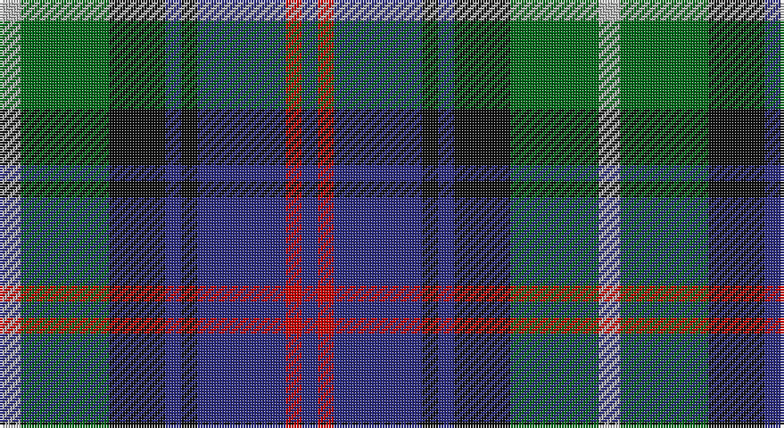

This page is one **sett** — a single exact thread-count. It belongs to the [tartan](/setts/lr8g33k21db6k6db33r6db6/)
(the same proportion at any scale), whose colour order is pattern [BRBKBKGY](/stripes/brbkbkgy/).

Part of the [Royal Highland](/tartans/royal-highland/) tartan — the named design grouping this sett with its other cloths.

Sourced from house-of-tartan.  It is a [8 stripe tartan](/stripes/stripes8/).

Original link http://www.house-of-tartan.scotland.net/house/TartanViewjs.asp?colr=Def&tnam=2054

## Provenance

Earliest known date: March 1992 In 1808 the Highland Society of Scotland used the Universal or Black Watch tartan. This has been incorporated in the new design along with colours to represent the agricultural heritage and interests of the Society. This design includes changes that were made when the first version proved an exact match to the 'Wellington' tartan. The white is 'Barley white'.

## Thread count
N/8 G33 K21 DB6 K6 DB33 R6 DB/6

One full sett is **224 threads**.

## Palette

Palette: <strong>Tartan Register</strong> <small style="color:#888">(4 of 5 colours)</small>
<table><thead><tr><th>Colour</th><th>Threads</th><th>Shade</th><th>Base</th><th>OKLCh</th></tr></thead><tbody><tr><td>N/</td><td style="text-align:right;font-variant-numeric:tabular-nums">8</td><td><code style="background-color:#B8B8B8;">#B8B8B8</code> <small style="color:#888">#B8B8B8</small></td><td>Y <code style="background-color:#F2BF00;">#F2BF00</code></td><td><small style="color:#888">oklch(78.3% 0.000 89.9)</small></td></tr><tr><td>G</td><td style="text-align:right;font-variant-numeric:tabular-nums">33</td><td><code style="background-color:#006818;">#006818</code> <small style="color:#888">#006818</small></td><td>G <code style="background-color:#006100;">#006100</code></td><td><small style="color:#888">oklch(45.0% 0.142 145.0)</small></td></tr><tr><td>K</td><td style="text-align:right;font-variant-numeric:tabular-nums">21</td><td><code style="background-color:#101010;">#101010</code> <small style="color:#888">#101010</small></td><td>K <code style="background-color:#000000;">#000000</code></td><td><small style="color:#888">oklch(17.3% 0.000 89.9)</small></td></tr><tr><td>DB</td><td style="text-align:right;font-variant-numeric:tabular-nums">6</td><td><code style="background-color:#2C2C80;">#2C2C80</code> <small style="color:#888">#2C2C80</small></td><td>B <code style="background-color:#2A418A;">#2A418A</code></td><td><small style="color:#888">oklch(35.0% 0.138 276.6)</small></td></tr><tr><td>K</td><td style="text-align:right;font-variant-numeric:tabular-nums">6</td><td><code style="background-color:#101010;">#101010</code> <small style="color:#888">#101010</small></td><td>K <code style="background-color:#000000;">#000000</code></td><td><small style="color:#888">oklch(17.3% 0.000 89.9)</small></td></tr><tr><td>DB</td><td style="text-align:right;font-variant-numeric:tabular-nums">33</td><td><code style="background-color:#2C2C80;">#2C2C80</code> <small style="color:#888">#2C2C80</small></td><td>B <code style="background-color:#2A418A;">#2A418A</code></td><td><small style="color:#888">oklch(35.0% 0.138 276.6)</small></td></tr><tr><td>R</td><td style="text-align:right;font-variant-numeric:tabular-nums">6</td><td><code style="background-color:#C80000;">#C80000</code> <small style="color:#888">#C80000</small></td><td>R <code style="background-color:#CC0000;">#CC0000</code></td><td><small style="color:#888">oklch(52.3% 0.215 29.2)</small></td></tr><tr><td>DB/</td><td style="text-align:right;font-variant-numeric:tabular-nums">6</td><td><code style="background-color:#2C2C80;">#2C2C80</code> <small style="color:#888">#2C2C80</small></td><td>B <code style="background-color:#2A418A;">#2A418A</code></td><td><small style="color:#888">oklch(35.0% 0.138 276.6)</small></td></tr></tbody></table>

# Sample pattern

## Compared to the master

This cloth is one sett of its design; the master sett (the exemplar the design is anchored on) is below for comparison.

<figure style="margin:0"><figcaption style="color:#888;font-size:smaller">this sett</figcaption></figure>
<figure style="margin:0"><figcaption style="color:#888;font-size:smaller"><a href="/setts/lb4dg17k10dt3k3dt17r3dt3/">master sett →</a></figcaption></figure>

## Nearest tartans

The nearest existing variants by ΔTartan distance, with this tartan at the top so the swatches line up against it.

ΔTartan

Tartan

Sett

—

<a href="/ttd/edit/#slug=lr8g33k21db6k6db33r6db6">Royal Highland Corporate Tartan</a> <a class="nn-out" href="/variants/s8/lr8g33k21db6k6db33r6db6/" title="open its dictionary page">↗</a>

0.68

<a href="/ttd/edit/#slug=k4b21dy10y4k20r6b3~x2&amp;base=lr8g33k21db6k6db33r6db6">Swankie (Personal)</a> <a class="nn-out" href="/variants/s7/k4b21dy10y4k20r6b3~x2/" title="open its dictionary page">↗</a>

0.69

<a href="/ttd/edit/#slug=k3ly3g22db6k17g6db22r3db3~x2&amp;base=lr8g33k21db6k6db33r6db6">Maresh</a> <a class="nn-out" href="/variants/s9/k3ly3g22db6k17g6db22r3db3~x2/" title="open its dictionary page">↗</a>

0.72

<a href="/ttd/edit/#slug=t4g14ly2k14db14k2db3~x2&amp;base=lr8g33k21db6k6db33r6db6">Hogarth of Firhill (Clan)</a> <a class="nn-out" href="/variants/s7/t4g14ly2k14db14k2db3~x2/" title="open its dictionary page">↗</a>

0.76

<a href="/ttd/edit/#slug=t2g6ly1k6db6k1db1~x2&amp;base=lr8g33k21db6k6db33r6db6">Hogarth of Firhill</a> <a class="nn-out" href="/variants/s7/t2g6ly1k6db6k1db1~x2/" title="open its dictionary page">↗</a>

0.77

<a href="/ttd/edit/#slug=g16lb3g3k10db12r2db3~x2&amp;base=lr8g33k21db6k6db33r6db6">MacLean, Donald (Personal)</a> <a class="nn-out" href="/variants/s7/g16lb3g3k10db12r2db3~x2/" title="open its dictionary page">↗</a>

0.79

<a href="/ttd/edit/#slug=b2dg6ly1k6db6k1db1~x2&amp;base=lr8g33k21db6k6db33r6db6">Hogarth of Firhill #2</a> <a class="nn-out" href="/variants/s7/b2dg6ly1k6db6k1db1~x2/" title="open its dictionary page">↗</a>

0.79

<a href="/ttd/edit/#slug=db10r7db31k25dg23k8db7k8ly5~x2&amp;base=lr8g33k21db6k6db33r6db6">MacCallum of Berwick</a> <a class="nn-out" href="/variants/s9/db10r7db31k25dg23k8db7k8ly5~x2/" title="open its dictionary page">↗</a>

0.79

<a href="/ttd/edit/#slug=r3db20g3k20db3g20w3g3~x2&amp;base=lr8g33k21db6k6db33r6db6">MacFrog (Personal)</a> <a class="nn-out" href="/variants/s8/r3db20g3k20db3g20w3g3~x2/" title="open its dictionary page">↗</a>

0.79

<a href="/ttd/edit/#slug=db1r1db6k6dg6w1~x2&amp;base=lr8g33k21db6k6db33r6db6">Wellington</a> <a class="nn-out" href="/variants/s6/db1r1db6k6dg6w1~x2/" title="open its dictionary page">↗</a>

0.82

<a href="/ttd/edit/#slug=g11t3g5r3g5k22db22k5~x2&amp;base=lr8g33k21db6k6db33r6db6">Wood (Personal)</a> <a class="nn-out" href="/variants/s8/g11t3g5r3g5k22db22k5~x2/" title="open its dictionary page">↗</a>

## Neighbour map

Every grey dot is one of 14360 variants placed by the first two principal components of the ΔTartan feature space (44% of its variance). Red is this tartan; blue dots are its nearest — click one to open its page.

<svg viewBox="0 0 640 380" role="img" style="max-width:100%;height:auto;border:1px solid #e0e0e0;border-radius:4px;display:block" xmlns="http://www.w3.org/2000/svg"><image href="/nn/cloud.v1.png" width="640" height="380"/><a href="/variants/s7/k4b21dy10y4k20r6b3~x2/"><circle cx="147.2" cy="214.6" r="4" fill="#3465a4"><title>Swankie (Personal)</title></circle></a><a href="/variants/s9/k3ly3g22db6k17g6db22r3db3~x2/"><circle cx="168.6" cy="203.3" r="4" fill="#3465a4"><title>Maresh</title></circle></a><a href="/variants/s7/t4g14ly2k14db14k2db3~x2/"><circle cx="134.9" cy="222.1" r="4" fill="#3465a4"><title>Hogarth of Firhill (Clan)</title></circle></a><a href="/variants/s7/t2g6ly1k6db6k1db1~x2/"><circle cx="116.2" cy="227.0" r="4" fill="#3465a4"><title>Hogarth of Firhill</title></circle></a><a href="/variants/s7/g16lb3g3k10db12r2db3~x2/"><circle cx="164.3" cy="216.4" r="4" fill="#3465a4"><title>MacLean, Donald (Personal)</title></circle></a><a href="/variants/s7/b2dg6ly1k6db6k1db1~x2/"><circle cx="120.1" cy="230.3" r="4" fill="#3465a4"><title>Hogarth of Firhill #2</title></circle></a><a href="/variants/s9/db10r7db31k25dg23k8db7k8ly5~x2/"><circle cx="159.6" cy="225.1" r="4" fill="#3465a4"><title>MacCallum of Berwick</title></circle></a><a href="/variants/s8/r3db20g3k20db3g20w3g3~x2/"><circle cx="143.5" cy="200.1" r="4" fill="#3465a4"><title>MacFrog (Personal)</title></circle></a><a href="/variants/s6/db1r1db6k6dg6w1~x2/"><circle cx="142.2" cy="237.6" r="4" fill="#3465a4"><title>Wellington</title></circle></a><a href="/variants/s8/g11t3g5r3g5k22db22k5~x2/"><circle cx="172.5" cy="217.9" r="4" fill="#3465a4"><title>Wood (Personal)</title></circle></a><circle cx="146.6" cy="218.9" r="5" fill="#c00000"/></svg>

ID: /variants/s8/lr8g33k21db6k6db33r6db6/
