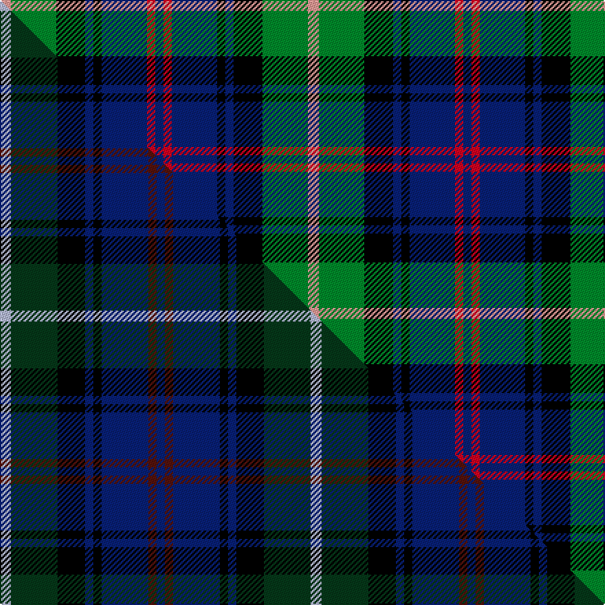

This is one **variant** — a specific cloth: this exact thread count and colourway, with its own
provenance below. It is one weaving of the [sett](/setts/lr8g33k21db6k6db33r6db6/) (the scale-free proportion — the
same cloth at any scale or shade), whose colour order is pattern [BRBKBKGY](/stripes/brbkbkgy/).

Part of the [Royal Highland](/tartans/royal-highland/) tartan — the named design grouping this sett with its other cloths.

Sourced from house-of-tartan.  It is a [8 stripe tartan](/stripes/stripes8/).

Original link [http://www.house-of-tartan.scotland.net/house/TartanViewjs.asp?colr=Def&tnam=2054](http://www.house-of-tartan.scotland.net/house/TartanViewjs.asp?colr=Def&tnam=2054)

## Provenance

Earliest known date: March 1992 In 1808 the Highland Society of Scotland used the Universal or Black Watch tartan. This has been incorporated in the new design along with colours to represent the agricultural heritage and interests of the Society. This design includes changes that were made when the first version proved an exact match to the 'Wellington' tartan. The white is 'Barley white'.

Dataset <small>— provenance for this record, inherited from the source manifest</small>

<dl class="dataset-prov">
<dt>source</dt><dd><a href="/sources/house-of-tartan/">House of Tartan</a></dd>
<dt>data captured from</dt><dd><a href="https://github.com/thetartan/tartan-database/blob/master/data/house-of-tartan/data.csv">https://github.com/thetartan/tartan-database/blob/master/data/house-of-tartan/data.csv</a></dd>
<dt>data date</dt><dd>March 1992 <small>(this record)</small></dd>
<dt>licence</dt><dd><a href="https://creativecommons.org/licenses/by-nc-nd/4.0/">CC BY-NC-ND 4.0</a></dd>
</dl>

Capture chain <small>— the hands this data passed through, oldest first; each capture carries its own licence</small>

<ol class="capture-chain">
<li><a href="http://www.house-of-tartan.scotland.net/">House of Tartan</a> <small>the weaver/retailer's database — the site is now offline; the URL is kept as the ultimate source's identity</small></li>
<li><a href="https://github.com/thetartan/tartan-database">thetartan/tartan-database</a> <small>2016-2017</small> · <a href="https://creativecommons.org/licenses/by-nc-nd/4.0/">CC BY-NC-ND 4.0</a> <small>Levko Kravets's frozen compilation — the capture we vendored, and where its CC licence text came from</small></li>
<li>this dictionary <small>captured 2026-06-10 · commit 5bf86c7566</small> <small>each re-capture is a git commit to data/sources</small></li>
</ol>

## Thread count
LR/8 G33 K21 DB6 K6 DB33 R6 DB/6

One full sett is **224 threads**.

## Palette
<table><thead><tr><th>Colour</th><th>Shade</th><th>OKLCh</th></tr></thead><tbody><tr><td>DB</td><td><code style="background-color:#082077;">#082077</code> <small style="color:#888">#082077</small></td><td><small style="color:#888">oklch(30.0% 0.149 265.1)</small></td></tr><tr><td>G</td><td><code style="background-color:#008B2A;">#008B2A</code> <small style="color:#888">#008B2A</small></td><td><small style="color:#888">oklch(55.4% 0.170 145.9)</small></td></tr><tr><td>K</td><td><code style="background-color:#000000;">#000000</code> <small style="color:#888">#000000</small></td><td><small style="color:#888">oklch(0.0% 0.000 0.0)</small></td></tr><tr><td>LR</td><td><code style="background-color:#FF9C97;">#FF9C97</code> <small style="color:#888">#FF9C97</small></td><td><small style="color:#888">oklch(79.3% 0.119 23.2)</small></td></tr><tr><td>R</td><td><code style="background-color:#D60020;">#D60020</code> <small style="color:#888">#D60020</small></td><td><small style="color:#888">oklch(55.2% 0.224 25.5)</small></td></tr></tbody></table>

# Sample pattern

## Compared to the master

This cloth is one sett of its design; the master sett (the exemplar the design is anchored on) is below for comparison.

Its **ΔTartan distance** from the master is **0.44** — the same measure the nearest-tartans table ranks by (0 is identical; a re-scale of the same cloth is near 0, a recolour or a different proportion further).

<figure class="master-compare" style="margin:0">

this sett
master sett ★

<figcaption style="color:#888;font-size:smaller">One weave of this sett against the <a href="/setts/lb4dg17k10db3k3db17dr3db3/">master sett ★</a>, split on the diagonal: a shared proportion runs seamlessly across it with only the shades shifting; a different proportion breaks on it.</figcaption>
</figure>

## Nearest tartan variants

The nearest existing variants by ΔTartan distance, with this cloth at the top so the swatches line up against it.

ΔTartan

Threads

Variant

Sett

—

224

<a href="/variants/s8/lr8g33k21db6k6db33r6db6/">Royal Highland Corporate Tartan</a>

<a href="/ttd/edit/#slug=db20k10lo3k7dr4k7lo3k8g20~x2&amp;base=lr8g33k21db6k6db33r6db6" title="compare in the TTD">1.81</a>

248

<a href="/variants/s9/db20k10lo3k7dr4k7lo3k8g20~x2/">Scottish Tartan Society</a>

<a href="/ttd/edit/#slug=db5lb4db22k15g22r4g4~x2&amp;base=lr8g33k21db6k6db33r6db6" title="compare in the TTD">1.82</a>

286

<a href="/variants/s7/db5lb4db22k15g22r4g4~x2/">Cairngorm #2</a>

<a href="/ttd/edit/#slug=k4t21dy10y4k20r6t3~x2&amp;base=lr8g33k21db6k6db33r6db6" title="compare in the TTD">1.82</a>

258

<a href="/variants/s7/k4t21dy10y4k20r6t3~x2/">Swankie (Personal)</a>

<a href="/ttd/edit/#slug=db2k2db12k8g11r2~x2&amp;base=lr8g33k21db6k6db33r6db6" title="compare in the TTD">1.83</a>

140

<a href="/variants/s6/db2k2db12k8g11r2~x2/">Murray (Variation) Clan Tartan</a>

<a href="/ttd/edit/#slug=g24k4g6r4g6k19db22w5~x2&amp;base=lr8g33k21db6k6db33r6db6" title="compare in the TTD">1.84</a>

302

<a href="/variants/s8/g24k4g6r4g6k19db22w5~x2/">MacRae, Ancient hunting</a>

<a href="/ttd/edit/#slug=db22r3db2r3db2k17g18ly4~x2&amp;base=lr8g33k21db6k6db33r6db6" title="compare in the TTD">1.89</a>

232

<a href="/variants/s8/db22r3db2r3db2k17g18ly4~x2/">Scotch House 2000 Original</a>

<a href="/ttd/edit/#slug=dr1k1g6k6db6lr1~x4&amp;base=lr8g33k21db6k6db33r6db6" title="compare in the TTD">1.92</a>

160

<a href="/variants/s6/dr1k1g6k6db6lr1~x4/">Gaines Center for the Humanities</a>

<a href="/ttd/edit/#slug=r3db20g3k20db3g20w3g3~x2&amp;base=lr8g33k21db6k6db33r6db6" title="compare in the TTD">1.95</a>

288

<a href="/variants/s8/r3db20g3k20db3g20w3g3~x2/">MacFrog (Personal)</a>

<a href="/ttd/edit/#slug=r4db24k12g14k4lb3~x2&amp;base=lr8g33k21db6k6db33r6db6" title="compare in the TTD">1.95</a>

230

<a href="/variants/s6/r4db24k12g14k4lb3~x2/">MacPhail Hunting #2</a>

<a href="/ttd/edit/#slug=db10r7db31k25g23k8db7k8y5~x2&amp;base=lr8g33k21db6k6db33r6db6" title="compare in the TTD">2.01</a>

466

<a href="/variants/s9/db10r7db31k25g23k8db7k8y5~x2/">MacCallum, of Berwick</a>

## Neighbour map

Every grey dot is one of 13621 variants placed by the first two principal components of the ΔTartan feature space (42% of its variance). Red is this tartan; blue dots are its nearest — click one to open its page.

<svg viewBox="0 0 640 380" role="img" style="max-width:100%;height:auto;border:1px solid #e0e0e0;border-radius:4px;display:block" xmlns="http://www.w3.org/2000/svg"><image href="/nn/cloud.v1.png" width="640" height="380"/><a href="/variants/s9/db20k10lo3k7dr4k7lo3k8g20~x2/"><circle cx="105.7" cy="194.1" r="4" fill="#3465a4"><title>Scottish Tartan Society</title></circle></a><a href="/variants/s7/db5lb4db22k15g22r4g4~x2/"><circle cx="106.6" cy="210.9" r="4" fill="#3465a4"><title>Cairngorm #2</title></circle></a><a href="/variants/s7/k4t21dy10y4k20r6t3~x2/"><circle cx="108.7" cy="195.6" r="4" fill="#3465a4"><title>Swankie (Personal)</title></circle></a><a href="/variants/s6/db2k2db12k8g11r2~x2/"><circle cx="145.6" cy="229.5" r="4" fill="#3465a4"><title>Murray (Variation) Clan Tartan</title></circle></a><a href="/variants/s8/g24k4g6r4g6k19db22w5~x2/"><circle cx="108.4" cy="198.8" r="4" fill="#3465a4"><title>MacRae, Ancient hunting</title></circle></a><a href="/variants/s8/db22r3db2r3db2k17g18ly4~x2/"><circle cx="131.9" cy="163.2" r="4" fill="#3465a4"><title>Scotch House 2000 Original</title></circle></a><a href="/variants/s6/dr1k1g6k6db6lr1~x4/"><circle cx="100.0" cy="213.4" r="4" fill="#3465a4"><title>Gaines Center for the Humanities</title></circle></a><a href="/variants/s8/r3db20g3k20db3g20w3g3~x2/"><circle cx="111.0" cy="184.0" r="4" fill="#3465a4"><title>MacFrog (Personal)</title></circle></a><a href="/variants/s6/r4db24k12g14k4lb3~x2/"><circle cx="132.3" cy="198.9" r="4" fill="#3465a4"><title>MacPhail Hunting #2</title></circle></a><a href="/variants/s9/db10r7db31k25g23k8db7k8y5~x2/"><circle cx="119.8" cy="201.2" r="4" fill="#3465a4"><title>MacCallum, of Berwick</title></circle></a><circle cx="110.6" cy="199.8" r="5" fill="#c00000"/><text x="320" y="376" text-anchor="middle" font-size="11" fill="#999">ground</text><text x="11" y="190" text-anchor="middle" font-size="11" fill="#999" transform="rotate(-90 11 190)">complexity</text></svg>

ID: /variants/s8/lr8g33k21db6k6db33r6db6/
