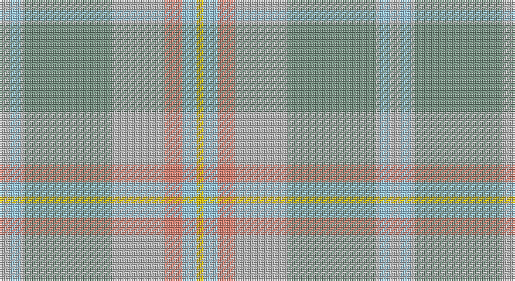

This page is one **sett** — a single exact thread-count. It belongs to the [tartan](/setts/lri3lb3lri1y25lri15lr5lb4ly2/)
(the same proportion at any scale), whose colour order is pattern [YWYGYYWY](/stripes/ywygyywy/).

Sourced from register-of-tartans.  It is a [8 stripe tartan](/stripes/stripes8/).

Original link https://www.tartanregister.gov.uk/tartanDetails.aspx?ref=3512

## Also known as

This cloth is also recorded under:

- Rikaco Morning Dew #2

2 attestations — the source records this cloth was collapsed from (oldest owns this page)

<ul>
<li>01/12/2001 — Rikaco Morning Dew #2 (register-of-tartans, <a href="https://www.tartanregister.gov.uk/tartanDetails.aspx?ref=3512">record</a>)</li>
<li>Dec 2001 — Rikaco Morning Dew 2 (Fashion) (tartans-authority, <a href="http://www.tartansauthority.com/tartan-ferret/display/6392/">record</a>)</li>
</ul>

## Register references

External register numbers recorded for this tartan.

- Scottish Register of Tartans: [3512](https://www.tartanregister.gov.uk/tartanDetails.aspx?ref=3512)
- Scottish Tartans Authority (ITI): 6392

## Thread count
N/6 LB6 N2 LG50 N30 LR10 LB8 Y/4

One full sett is **222 threads**.

## Palette

Palette: <strong>Tartan Register</strong> <small style="color:#888">(3 of 5 colours)</small>
<table><thead><tr><th>Colour</th><th>Threads</th><th>Shade</th><th>Base</th><th>OKLCh</th></tr></thead><tbody><tr><td>N/</td><td style="text-align:right;font-variant-numeric:tabular-nums">6</td><td><code style="background-color:#B8B8B8;">#B8B8B8</code> <small style="color:#888">#B8B8B8</small></td><td>Y <code style="background-color:#F2BF00;">#F2BF00</code></td><td><small style="color:#888">oklch(78.3% 0.000 89.9)</small></td></tr><tr><td>LB</td><td style="text-align:right;font-variant-numeric:tabular-nums">6</td><td><code style="background-color:#98C8E8;">#98C8E8</code> <small style="color:#888">#98C8E8</small></td><td>W <code style="background-color:#F7F7F7;">#F7F7F7</code></td><td><small style="color:#888">oklch(81.0% 0.068 237.9)</small></td></tr><tr><td>N</td><td style="text-align:right;font-variant-numeric:tabular-nums">2</td><td><code style="background-color:#B8B8B8;">#B8B8B8</code> <small style="color:#888">#B8B8B8</small></td><td>Y <code style="background-color:#F2BF00;">#F2BF00</code></td><td><small style="color:#888">oklch(78.3% 0.000 89.9)</small></td></tr><tr><td>LG</td><td style="text-align:right;font-variant-numeric:tabular-nums">50</td><td><code style="background-color:#789484;">#789484</code> <small style="color:#888">#789484</small></td><td>G <code style="background-color:#006100;">#006100</code></td><td><small style="color:#888">oklch(64.0% 0.040 160.0)</small></td></tr><tr><td>N</td><td style="text-align:right;font-variant-numeric:tabular-nums">30</td><td><code style="background-color:#B8B8B8;">#B8B8B8</code> <small style="color:#888">#B8B8B8</small></td><td>Y <code style="background-color:#F2BF00;">#F2BF00</code></td><td><small style="color:#888">oklch(78.3% 0.000 89.9)</small></td></tr><tr><td>LR</td><td style="text-align:right;font-variant-numeric:tabular-nums">10</td><td><code style="background-color:#E08070;">#E08070</code> <small style="color:#888">#E08070</small></td><td>Y <code style="background-color:#F2BF00;">#F2BF00</code></td><td><small style="color:#888">oklch(70.1% 0.122 30.4)</small></td></tr><tr><td>LB</td><td style="text-align:right;font-variant-numeric:tabular-nums">8</td><td><code style="background-color:#98C8E8;">#98C8E8</code> <small style="color:#888">#98C8E8</small></td><td>W <code style="background-color:#F7F7F7;">#F7F7F7</code></td><td><small style="color:#888">oklch(81.0% 0.068 237.9)</small></td></tr><tr><td>Y/</td><td style="text-align:right;font-variant-numeric:tabular-nums">4</td><td><code style="background-color:#E8C000;">#E8C000</code> <small style="color:#888">#E8C000</small></td><td>Y <code style="background-color:#F2BF00;">#F2BF00</code></td><td><small style="color:#888">oklch(81.9% 0.168 93.7)</small></td></tr></tbody></table>

# Sample pattern

## Nearest tartans

The nearest existing variants by ΔTartan distance, with this tartan at the top so the swatches line up against it.

ΔTartan

Tartan

Sett

—

<a href="/ttd/edit/#slug=lri3lb3lri1y25lri15lr5lb4ly2~x2">Rikaco Morning Dew #2</a> <a class="nn-out" href="/variants/s8/lri3lb3lri1y25lri15lr5lb4ly2~x2/" title="open its dictionary page">↗</a>

1.47

<a href="/ttd/edit/#slug=o52ly2n24r3lo26n4~x2&amp;base=lri3lb3lri1y25lri15lr5lb4ly2~x2">Outlander #1</a> <a class="nn-out" href="/variants/s6/o52ly2n24r3lo26n4~x2/" title="open its dictionary page">↗</a>

1.71

<a href="/ttd/edit/#slug=lg10lr8ly1lb5w5lg28lr2ly1lb8w5~x2&amp;base=lri3lb3lri1y25lri15lr5lb4ly2~x2">Banatherton Union</a> <a class="nn-out" href="/variants/s10/lg10lr8ly1lb5w5lg28lr2ly1lb8w5~x2/" title="open its dictionary page">↗</a>

1.78

<a href="/ttd/edit/#slug=y52ly2n24r3lo26n4~x2&amp;base=lri3lb3lri1y25lri15lr5lb4ly2~x2">Outlander #1</a> <a class="nn-out" href="/variants/s6/y52ly2n24r3lo26n4~x2/" title="open its dictionary page">↗</a>

2.01

<a href="/ttd/edit/#slug=y10lo5y54lo2lb32loi54b4loi10&amp;base=lri3lb3lri1y25lri15lr5lb4ly2~x2">Cladish</a> <a class="nn-out" href="/variants/s8/y10lo5y54lo2lb32loi54b4loi10/" title="open its dictionary page">↗</a>

2.23

<a href="/ttd/edit/#slug=k3y3r3y28n28lb2n2~x2&amp;base=lri3lb3lri1y25lri15lr5lb4ly2~x2">Isle of Cumbrae (Corporate)</a> <a class="nn-out" href="/variants/s7/k3y3r3y28n28lb2n2~x2/" title="open its dictionary page">↗</a>

2.33

<a href="/ttd/edit/#slug=w3y36lp6b6lp6b12lp32w3&amp;base=lri3lb3lri1y25lri15lr5lb4ly2~x2">Tenmaya</a> <a class="nn-out" href="/variants/s8/w3y36lp6b6lp6b12lp32w3/" title="open its dictionary page">↗</a>

2.35

<a href="/variants/s10/o5n3o22r3n6ni17r2ni4r2ni4~x2/">Clyde</a>

2.43

<a href="/ttd/edit/#slug=o55yi6y3lb3y3lb3y10yii5y5lr2y3~x2&amp;base=lri3lb3lri1y25lri15lr5lb4ly2~x2">Long Way Down, The (Corporate)</a> <a class="nn-out" href="/variants/s11/o55yi6y3lb3y3lb3y10yii5y5lr2y3~x2/" title="open its dictionary page">↗</a>

2.49

<a href="/variants/s12/y23o4dy6g6y4lb1y4~x4/">Tricor</a>

2.51

<a href="/ttd/edit/#slug=r8y1r1y1r1y25n1y1n1y1n25o7lo6~x2&amp;base=lri3lb3lri1y25lri15lr5lb4ly2~x2">Johansson (Personal)</a> <a class="nn-out" href="/variants/s13/r8y1r1y1r1y25n1y1n1y1n25o7lo6~x2/" title="open its dictionary page">↗</a>

## Neighbour map

Every grey dot is one of 14360 variants placed by the first two principal components of the ΔTartan feature space (44% of its variance). Red is this tartan; blue dots are its nearest — click one to open its page.

<svg viewBox="0 0 640 380" role="img" style="max-width:100%;height:auto;border:1px solid #e0e0e0;border-radius:4px;display:block" xmlns="http://www.w3.org/2000/svg"><image href="/nn/cloud.v1.png" width="640" height="380"/><a href="/variants/s6/o52ly2n24r3lo26n4~x2/"><circle cx="409.1" cy="221.0" r="4" fill="#3465a4"><title>Outlander #1</title></circle></a><a href="/variants/s10/lg10lr8ly1lb5w5lg28lr2ly1lb8w5~x2/"><circle cx="374.9" cy="170.5" r="4" fill="#3465a4"><title>Banatherton Union</title></circle></a><a href="/variants/s6/y52ly2n24r3lo26n4~x2/"><circle cx="424.2" cy="230.2" r="4" fill="#3465a4"><title>Outlander #1</title></circle></a><a href="/variants/s8/y10lo5y54lo2lb32loi54b4loi10/"><circle cx="321.2" cy="175.8" r="4" fill="#3465a4"><title>Cladish</title></circle></a><a href="/variants/s7/k3y3r3y28n28lb2n2~x2/"><circle cx="396.2" cy="221.9" r="4" fill="#3465a4"><title>Isle of Cumbrae (Corporate)</title></circle></a><a href="/variants/s8/w3y36lp6b6lp6b12lp32w3/"><circle cx="341.0" cy="227.7" r="4" fill="#3465a4"><title>Tenmaya</title></circle></a><a href="/variants/s10/o5n3o22r3n6ni17r2ni4r2ni4~x2/"><circle cx="338.3" cy="236.9" r="4" fill="#3465a4"><title>Clyde</title></circle></a><a href="/variants/s11/o55yi6y3lb3y3lb3y10yii5y5lr2y3~x2/"><circle cx="480.3" cy="154.0" r="4" fill="#3465a4"><title>Long Way Down, The (Corporate)</title></circle></a><a href="/variants/s12/y23o4dy6g6y4lb1y4~x4/"><circle cx="384.8" cy="190.3" r="4" fill="#3465a4"><title>Tricor</title></circle></a><a href="/variants/s13/r8y1r1y1r1y25n1y1n1y1n25o7lo6~x2/"><circle cx="348.7" cy="157.5" r="4" fill="#3465a4"><title>Johansson (Personal)</title></circle></a><circle cx="374.3" cy="191.3" r="5" fill="#c00000"/></svg>

ID: /variants/s8/lri3lb3lri1y25lri15lr5lb4ly2~x2/
