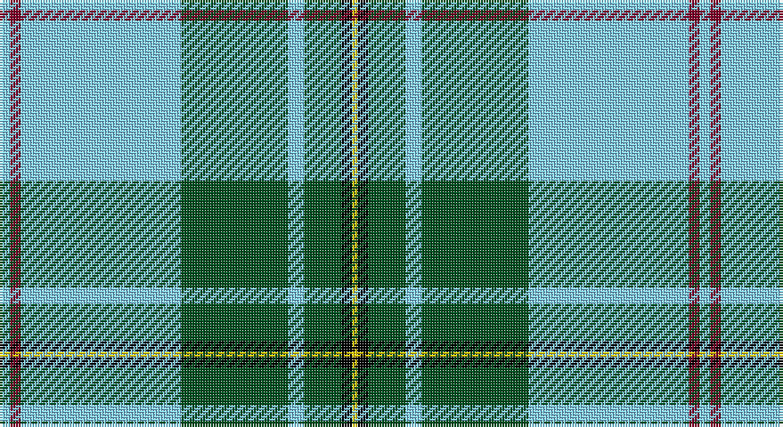

This page is one **sett** — a single exact thread-count. It belongs to the [tartan](/setts/lt2r2lt30dg20lt3dg7k2ly1/)
(the same proportion at any scale), whose colour order is pattern [WRWGWGKY](/stripes/wrwgwgky/).

Sourced from register-of-tartans.  It is a [8 stripe tartan](/stripes/stripes8/).

Original link https://www.tartanregister.gov.uk/tartanDetails.aspx?ref=11614

## Register references

External register numbers recorded for this tartan.

- Scottish Register of Tartans: [11614](https://www.tartanregister.gov.uk/tartanDetails.aspx?ref=11614)

## Thread count
LB/4 DR4 LB60 G40 LB6 G14 K4 Y/2

One full sett is **262 threads**.

## Palette

Palette: <strong>Tartan Register</strong>
<table><thead><tr><th>Colour</th><th>Threads</th><th>Shade</th><th>Base</th><th>OKLCh</th></tr></thead><tbody><tr><td>LB/</td><td style="text-align:right;font-variant-numeric:tabular-nums">4</td><td><code style="background-color:#82CFFD;">#82CFFD</code> <small style="color:#888">#82CFFD</small></td><td>W <code style="background-color:#F7F7F7;">#F7F7F7</code></td><td><small style="color:#888">oklch(82.2% 0.100 236.0)</small></td></tr><tr><td>DR</td><td style="text-align:right;font-variant-numeric:tabular-nums">4</td><td><code style="background-color:#800028;">#800028</code> <small style="color:#888">#800028</small></td><td>R <code style="background-color:#CC0000;">#CC0000</code></td><td><small style="color:#888">oklch(38.2% 0.152 14.5)</small></td></tr><tr><td>LB</td><td style="text-align:right;font-variant-numeric:tabular-nums">60</td><td><code style="background-color:#82CFFD;">#82CFFD</code> <small style="color:#888">#82CFFD</small></td><td>W <code style="background-color:#F7F7F7;">#F7F7F7</code></td><td><small style="color:#888">oklch(82.2% 0.100 236.0)</small></td></tr><tr><td>G</td><td style="text-align:right;font-variant-numeric:tabular-nums">40</td><td><code style="background-color:#005020;">#005020</code> <small style="color:#888">#005020</small></td><td>G <code style="background-color:#006100;">#006100</code></td><td><small style="color:#888">oklch(37.7% 0.105 149.6)</small></td></tr><tr><td>LB</td><td style="text-align:right;font-variant-numeric:tabular-nums">6</td><td><code style="background-color:#82CFFD;">#82CFFD</code> <small style="color:#888">#82CFFD</small></td><td>W <code style="background-color:#F7F7F7;">#F7F7F7</code></td><td><small style="color:#888">oklch(82.2% 0.100 236.0)</small></td></tr><tr><td>G</td><td style="text-align:right;font-variant-numeric:tabular-nums">14</td><td><code style="background-color:#005020;">#005020</code> <small style="color:#888">#005020</small></td><td>G <code style="background-color:#006100;">#006100</code></td><td><small style="color:#888">oklch(37.7% 0.105 149.6)</small></td></tr><tr><td>K</td><td style="text-align:right;font-variant-numeric:tabular-nums">4</td><td><code style="background-color:#000000;">#000000</code> <small style="color:#888">#000000</small></td><td>K <code style="background-color:#000000;">#000000</code></td><td><small style="color:#888">oklch(0.0% 0.000 0.0)</small></td></tr><tr><td>Y/</td><td style="text-align:right;font-variant-numeric:tabular-nums">2</td><td><code style="background-color:#FCCC00;">#FCCC00</code> <small style="color:#888">#FCCC00</small></td><td>Y <code style="background-color:#F2BF00;">#F2BF00</code></td><td><small style="color:#888">oklch(86.2% 0.176 91.5)</small></td></tr></tbody></table>

# Sample pattern

## Nearest tartans

The nearest existing variants by ΔTartan distance, with this tartan at the top so the swatches line up against it.

ΔTartan

Tartan

Sett

—

<a href="/ttd/edit/#slug=lt2r2lt30dg20lt3dg7k2ly1~x2">L'Abeille du Cercle de Fermières Sainte-Geneviève-de-Sainte-Foy</a> <a class="nn-out" href="/variants/s8/lt2r2lt30dg20lt3dg7k2ly1~x2/" title="open its dictionary page">↗</a>

1.30

<a href="/ttd/edit/#slug=k4ly1g2ly1g32lt1g3lt32db3~x2&amp;base=lt2r2lt30dg20lt3dg7k2ly1~x2">McClurg, William Thomas (Personal)</a> <a class="nn-out" href="/variants/s9/k4ly1g2ly1g32lt1g3lt32db3~x2/" title="open its dictionary page">↗</a>

1.60

<a href="/ttd/edit/#slug=ly6dg36w5b4w30b1w2~x2&amp;base=lt2r2lt30dg20lt3dg7k2ly1~x2">Pearce Scotch Plaid 4 (Fashion)</a> <a class="nn-out" href="/variants/s7/ly6dg36w5b4w30b1w2~x2/" title="open its dictionary page">↗</a>

1.60

<a href="/ttd/edit/#slug=w3k1r4g20k3b30w4r2~x2&amp;base=lt2r2lt30dg20lt3dg7k2ly1~x2">Scottish Prison Service (Corporate)</a> <a class="nn-out" href="/variants/s8/w3k1r4g20k3b30w4r2~x2/" title="open its dictionary page">↗</a>

1.61

<a href="/ttd/edit/#slug=k4ly1g2ly1g32lt1g3db32lt3~x2&amp;base=lt2r2lt30dg20lt3dg7k2ly1~x2">McClurg</a> <a class="nn-out" href="/variants/s9/k4ly1g2ly1g32lt1g3db32lt3~x2/" title="open its dictionary page">↗</a>

1.64

<a href="/ttd/edit/#slug=w5db3w25k2w2k16g8k1w4&amp;base=lt2r2lt30dg20lt3dg7k2ly1~x2">Unidentified (shirt fabric)</a> <a class="nn-out" href="/variants/s9/w5db3w25k2w2k16g8k1w4/" title="open its dictionary page">↗</a>

1.64

<a href="/ttd/edit/#slug=lo2db4g60p30w1~x2&amp;base=lt2r2lt30dg20lt3dg7k2ly1~x2">McGuinness, Tam (Personal)</a> <a class="nn-out" href="/variants/s5/lo2db4g60p30w1~x2/" title="open its dictionary page">↗</a>

1.65

<a href="/variants/s8/k5w2ly36t47r3~x2/">Cornish National Day</a>

1.65

<a href="/ttd/edit/#slug=r3g2k9lr2k2lr24ly2lr2ly1~x4&amp;base=lt2r2lt30dg20lt3dg7k2ly1~x2">Bell of the Borders</a> <a class="nn-out" href="/variants/s9/r3g2k9lr2k2lr24ly2lr2ly1~x4/" title="open its dictionary page">↗</a>

1.66

<a href="/ttd/edit/#slug=k3y3lo3y3k12y24k1y3k3w3~x2&amp;base=lt2r2lt30dg20lt3dg7k2ly1~x2">Bruichladdich (Corporate)</a> <a class="nn-out" href="/variants/s10/k3y3lo3y3k12y24k1y3k3w3~x2/" title="open its dictionary page">↗</a>

1.66

<a href="/ttd/edit/#slug=ly21g26db62w2dg2w2&amp;base=lt2r2lt30dg20lt3dg7k2ly1~x2">Nynashamn Whisky Society (Corporate)</a> <a class="nn-out" href="/variants/s6/ly21g26db62w2dg2w2/" title="open its dictionary page">↗</a>

## Neighbour map

Every grey dot is one of 14360 variants placed by the first two principal components of the ΔTartan feature space (44% of its variance). Red is this tartan; blue dots are its nearest — click one to open its page.

<svg viewBox="0 0 640 380" role="img" style="max-width:100%;height:auto;border:1px solid #e0e0e0;border-radius:4px;display:block" xmlns="http://www.w3.org/2000/svg"><image href="/nn/cloud.v1.png" width="640" height="380"/><a href="/variants/s9/k4ly1g2ly1g32lt1g3lt32db3~x2/"><circle cx="277.6" cy="91.3" r="4" fill="#3465a4"><title>McClurg, William Thomas (Personal)</title></circle></a><a href="/variants/s7/ly6dg36w5b4w30b1w2~x2/"><circle cx="268.8" cy="114.9" r="4" fill="#3465a4"><title>Pearce Scotch Plaid 4 (Fashion)</title></circle></a><a href="/variants/s8/w3k1r4g20k3b30w4r2~x2/"><circle cx="251.9" cy="116.2" r="4" fill="#3465a4"><title>Scottish Prison Service (Corporate)</title></circle></a><a href="/variants/s9/k4ly1g2ly1g32lt1g3db32lt3~x2/"><circle cx="275.4" cy="99.8" r="4" fill="#3465a4"><title>McClurg</title></circle></a><a href="/variants/s9/w5db3w25k2w2k16g8k1w4/"><circle cx="277.0" cy="118.1" r="4" fill="#3465a4"><title>Unidentified (shirt fabric)</title></circle></a><a href="/variants/s5/lo2db4g60p30w1~x2/"><circle cx="382.3" cy="113.6" r="4" fill="#3465a4"><title>McGuinness, Tam (Personal)</title></circle></a><a href="/variants/s8/k5w2ly36t47r3~x2/"><circle cx="295.4" cy="139.4" r="4" fill="#3465a4"><title>Cornish National Day</title></circle></a><a href="/variants/s9/r3g2k9lr2k2lr24ly2lr2ly1~x4/"><circle cx="307.9" cy="92.2" r="4" fill="#3465a4"><title>Bell of the Borders</title></circle></a><a href="/variants/s10/k3y3lo3y3k12y24k1y3k3w3~x2/"><circle cx="319.3" cy="124.4" r="4" fill="#3465a4"><title>Bruichladdich (Corporate)</title></circle></a><a href="/variants/s6/ly21g26db62w2dg2w2/"><circle cx="300.4" cy="128.7" r="4" fill="#3465a4"><title>Nynashamn Whisky Society (Corporate)</title></circle></a><circle cx="297.2" cy="107.5" r="5" fill="#c00000"/></svg>

ID: /variants/s8/lt2r2lt30dg20lt3dg7k2ly1~x2/
