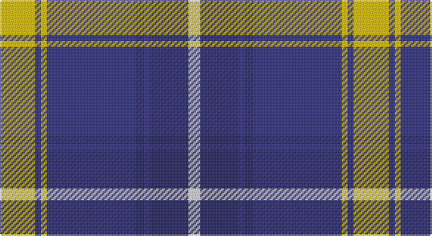

This page is one **sett** — a single exact thread-count. It belongs to the [tartan](/setts/ly12dbi2ly2dbi30db3dbi2db13w4/)
(the same proportion at any scale), whose colour order is pattern [WBBBBYBY](/stripes/wbbbbyby/).

Part of the [Highlands School](/tartans/highlands-school/) tartan — the named design grouping this sett with its other cloths.

Sourced from house-of-tartan.  It is a [8 stripe tartan](/stripes/stripes8/).

Original link http://www.house-of-tartan.scotland.net/house/TartanViewjs.asp?colr=Def&tnam=2109

## Provenance

Earliest known date: 1990 Highlands in North Carolina is the home of the Scottish Tartans Society's Museum Extension. The school tartan was designed by Bob Martin who is a 'Fellow of the Society'. Blue and Gold are the school colours.

## Also known as

This cloth is also recorded under:

- Highlands School,

## Thread count
Y/24 DB4 Y4 DB60 DBa6 DB4 DBa26 LN/8

One full sett is **240 threads**.

## Palette

Palette: <strong>Tartan Register</strong>
<table><thead><tr><th>Colour</th><th>Threads</th><th>Shade</th><th>Base</th><th>OKLCh</th></tr></thead><tbody><tr><td>Y/</td><td style="text-align:right;font-variant-numeric:tabular-nums">24</td><td><code style="background-color:#E8C000;">#E8C000</code> <small style="color:#888">#E8C000</small></td><td>Y <code style="background-color:#F2BF00;">#F2BF00</code></td><td><small style="color:#888">oklch(81.9% 0.168 93.7)</small></td></tr><tr><td>DB</td><td style="text-align:right;font-variant-numeric:tabular-nums">4</td><td><code style="background-color:#2C2C80;">#2C2C80</code> <small style="color:#888">#2C2C80</small></td><td>B <code style="background-color:#2A418A;">#2A418A</code></td><td><small style="color:#888">oklch(35.0% 0.138 276.6)</small></td></tr><tr><td>Y</td><td style="text-align:right;font-variant-numeric:tabular-nums">4</td><td><code style="background-color:#E8C000;">#E8C000</code> <small style="color:#888">#E8C000</small></td><td>Y <code style="background-color:#F2BF00;">#F2BF00</code></td><td><small style="color:#888">oklch(81.9% 0.168 93.7)</small></td></tr><tr><td>DB</td><td style="text-align:right;font-variant-numeric:tabular-nums">60</td><td><code style="background-color:#2C2C80;">#2C2C80</code> <small style="color:#888">#2C2C80</small></td><td>B <code style="background-color:#2A418A;">#2A418A</code></td><td><small style="color:#888">oklch(35.0% 0.138 276.6)</small></td></tr><tr><td>DBa</td><td style="text-align:right;font-variant-numeric:tabular-nums">6</td><td><code style="background-color:#202060;">#202060</code> <small style="color:#888">#202060</small></td><td>B <code style="background-color:#2A418A;">#2A418A</code></td><td><small style="color:#888">oklch(28.9% 0.111 276.9)</small></td></tr><tr><td>DB</td><td style="text-align:right;font-variant-numeric:tabular-nums">4</td><td><code style="background-color:#2C2C80;">#2C2C80</code> <small style="color:#888">#2C2C80</small></td><td>B <code style="background-color:#2A418A;">#2A418A</code></td><td><small style="color:#888">oklch(35.0% 0.138 276.6)</small></td></tr><tr><td>DBa</td><td style="text-align:right;font-variant-numeric:tabular-nums">26</td><td><code style="background-color:#202060;">#202060</code> <small style="color:#888">#202060</small></td><td>B <code style="background-color:#2A418A;">#2A418A</code></td><td><small style="color:#888">oklch(28.9% 0.111 276.9)</small></td></tr><tr><td>LN/</td><td style="text-align:right;font-variant-numeric:tabular-nums">8</td><td><code style="background-color:#E0E0E0;">#E0E0E0</code> <small style="color:#888">#E0E0E0</small></td><td>W <code style="background-color:#F7F7F7;">#F7F7F7</code></td><td><small style="color:#888">oklch(90.7% 0.000 89.9)</small></td></tr></tbody></table>

# Sample pattern

## Compared to the master

This cloth is one sett of its design; the master sett (the exemplar the design is anchored on) is below for comparison.

<figure style="margin:0"><figcaption style="color:#888;font-size:smaller">this sett</figcaption></figure>
<figure style="margin:0"><figcaption style="color:#888;font-size:smaller"><a href="/setts/lo12db2lo2db30dt2db2dt13lb4/">master sett →</a></figcaption></figure>

## Nearest tartans

The nearest existing variants by ΔTartan distance, with this tartan at the top so the swatches line up against it.

ΔTartan

Tartan

Sett

—

<a href="/ttd/edit/#slug=ly12dbi2ly2dbi30db3dbi2db13w4~x2">Highlands School (N. Carolina) Corporate Tartan</a> <a class="nn-out" href="/variants/s8/ly12dbi2ly2dbi30db3dbi2db13w4~x2/" title="open its dictionary page">↗</a>

0.65

<a href="/ttd/edit/#slug=lo12db2lo2db30dt2db2dt13lb4~x2&amp;base=ly12dbi2ly2dbi30db3dbi2db13w4~x2">Highlands School (North Carolina)</a> <a class="nn-out" href="/variants/s8/lo12db2lo2db30dt2db2dt13lb4~x2/" title="open its dictionary page">↗</a>

0.71

<a href="/ttd/edit/#slug=db42lbi2lb2lbi2db5dt12lb32db4~x2&amp;base=ly12dbi2ly2dbi30db3dbi2db13w4~x2">Longniddry Eildon Blue Dress Fancy Tartan</a> <a class="nn-out" href="/variants/s8/db42lbi2lb2lbi2db5dt12lb32db4~x2/" title="open its dictionary page">↗</a>

0.78

<a href="/ttd/edit/#slug=db30lb2k9w3db6w4k3lb6~x2&amp;base=ly12dbi2ly2dbi30db3dbi2db13w4~x2">Detroit Lions</a> <a class="nn-out" href="/variants/s8/db30lb2k9w3db6w4k3lb6~x2/" title="open its dictionary page">↗</a>

0.87

<a href="/ttd/edit/#slug=y12db2y2db30dbi3db2dbi13w4~x2&amp;base=ly12dbi2ly2dbi30db3dbi2db13w4~x2">Highlands School, (North Carolina)</a> <a class="nn-out" href="/variants/s8/y12db2y2db30dbi3db2dbi13w4~x2/" title="open its dictionary page">↗</a>

0.89

<a href="/ttd/edit/#slug=r3db20k6lb5k4lb3k2r1db2~x2&amp;base=ly12dbi2ly2dbi30db3dbi2db13w4~x2">Scottish Knights Templar Int. (Corp)</a> <a class="nn-out" href="/variants/s9/r3db20k6lb5k4lb3k2r1db2~x2/" title="open its dictionary page">↗</a>

0.93

<a href="/ttd/edit/#slug=db30t2w2t2db4ti10w25db4~x2&amp;base=ly12dbi2ly2dbi30db3dbi2db13w4~x2">Eildon/Longniddry Blue Dress Fashion Tartan</a> <a class="nn-out" href="/variants/s8/db30t2w2t2db4ti10w25db4~x2/" title="open its dictionary page">↗</a>

0.95

<a href="/ttd/edit/#slug=dt42lbi2lb2lbi2dt5dti12lb32dt4~x2&amp;base=ly12dbi2ly2dbi30db3dbi2db13w4~x2">Longniddry Blue (Dance)</a> <a class="nn-out" href="/variants/s8/dt42lbi2lb2lbi2dt5dti12lb32dt4~x2/" title="open its dictionary page">↗</a>

1.02

<a href="/ttd/edit/#slug=k9t4k2t4k2t30k9t4db14ly2~x2&amp;base=ly12dbi2ly2dbi30db3dbi2db13w4~x2">Hannay Blue (Fashion?)</a> <a class="nn-out" href="/variants/s10/k9t4k2t4k2t30k9t4db14ly2~x2/" title="open its dictionary page">↗</a>

1.03

<a href="/ttd/edit/#slug=r3dy1w12dy2db2dy2db14w2db2~x2&amp;base=ly12dbi2ly2dbi30db3dbi2db13w4~x2">Lord Arran (Corporate)</a> <a class="nn-out" href="/variants/s9/r3dy1w12dy2db2dy2db14w2db2~x2/" title="open its dictionary page">↗</a>

1.04

<a href="/ttd/edit/#slug=db7r3db26t2db2t26ly4~x2&amp;base=ly12dbi2ly2dbi30db3dbi2db13w4~x2">Int. Police Association (Official)</a> <a class="nn-out" href="/variants/s7/db7r3db26t2db2t26ly4~x2/" title="open its dictionary page">↗</a>

## Neighbour map

Every grey dot is one of 14360 variants placed by the first two principal components of the ΔTartan feature space (44% of its variance). Red is this tartan; blue dots are its nearest — click one to open its page.

<svg viewBox="0 0 640 380" role="img" style="max-width:100%;height:auto;border:1px solid #e0e0e0;border-radius:4px;display:block" xmlns="http://www.w3.org/2000/svg"><image href="/nn/cloud.v1.png" width="640" height="380"/><a href="/variants/s8/lo12db2lo2db30dt2db2dt13lb4~x2/"><circle cx="272.7" cy="161.3" r="4" fill="#3465a4"><title>Highlands School (North Carolina)</title></circle></a><a href="/variants/s8/db42lbi2lb2lbi2db5dt12lb32db4~x2/"><circle cx="288.7" cy="139.6" r="4" fill="#3465a4"><title>Longniddry Eildon Blue Dress Fancy Tartan</title></circle></a><a href="/variants/s8/db30lb2k9w3db6w4k3lb6~x2/"><circle cx="290.8" cy="154.2" r="4" fill="#3465a4"><title>Detroit Lions</title></circle></a><a href="/variants/s8/y12db2y2db30dbi3db2dbi13w4~x2/"><circle cx="279.9" cy="171.4" r="4" fill="#3465a4"><title>Highlands School, (North Carolina)</title></circle></a><a href="/variants/s9/r3db20k6lb5k4lb3k2r1db2~x2/"><circle cx="265.8" cy="146.5" r="4" fill="#3465a4"><title>Scottish Knights Templar Int. (Corp)</title></circle></a><a href="/variants/s8/db30t2w2t2db4ti10w25db4~x2/"><circle cx="243.4" cy="147.6" r="4" fill="#3465a4"><title>Eildon/Longniddry Blue Dress Fashion Tartan</title></circle></a><a href="/variants/s8/dt42lbi2lb2lbi2dt5dti12lb32dt4~x2/"><circle cx="286.6" cy="140.0" r="4" fill="#3465a4"><title>Longniddry Blue (Dance)</title></circle></a><a href="/variants/s10/k9t4k2t4k2t30k9t4db14ly2~x2/"><circle cx="284.3" cy="161.9" r="4" fill="#3465a4"><title>Hannay Blue (Fashion?)</title></circle></a><a href="/variants/s9/r3dy1w12dy2db2dy2db14w2db2~x2/"><circle cx="224.4" cy="144.0" r="4" fill="#3465a4"><title>Lord Arran (Corporate)</title></circle></a><a href="/variants/s7/db7r3db26t2db2t26ly4~x2/"><circle cx="288.1" cy="180.6" r="4" fill="#3465a4"><title>Int. Police Association (Official)</title></circle></a><circle cx="259.8" cy="156.5" r="5" fill="#c00000"/></svg>

ID: /variants/s8/ly12dbi2ly2dbi30db3dbi2db13w4~x2/
