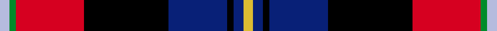
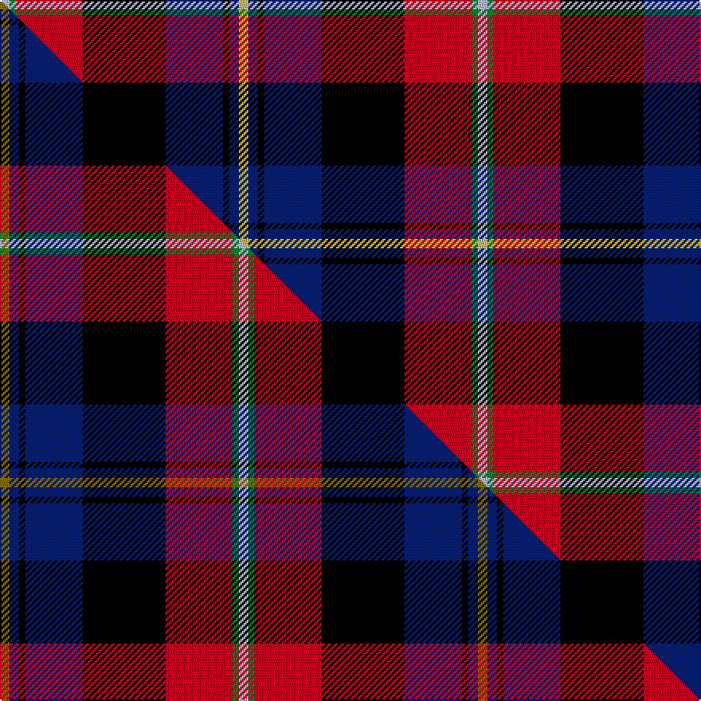

This page is one **sett** — a single exact thread-count. It belongs to the [tartan](/setts/ly3db3k2db18k26r21g2lb3/)
(the same proportion at any scale), whose colour order is pattern [WGRKBKBY](/stripes/wgrkbkby/).

Part of the [Loch Etive](/tartans/loch-etive/) tartan — the named design grouping this sett with its other cloths.

Sourced from tartans-authority.  It is a [8 stripe tartan](/stripes/stripes8/).

Original link http://www.tartansauthority.com/tartan-ferret/display/11056/

## Register references

External register numbers recorded for this tartan.

- Scottish Register of Tartans: [11056](https://www.tartanregister.gov.uk/tartanDetails?ref=11056)
- Scottish Tartans Authority (ITI): 11056

## Thread count
LB/6 G4 R42 K52 DB36 K4 DB6 LY/6

One full sett is **300 threads**.

## Palette
<table><thead><tr><th>Colour</th><th>Shade</th><th>OKLCh</th></tr></thead><tbody><tr><td>DB</td><td><code style="background-color:#082077;">#082077</code> <small style="color:#888">#082077</small></td><td><small style="color:#888">oklch(30.0% 0.149 265.1)</small></td></tr><tr><td>G</td><td><code style="background-color:#008B2A;">#008B2A</code> <small style="color:#888">#008B2A</small></td><td><small style="color:#888">oklch(55.4% 0.170 145.9)</small></td></tr><tr><td>K</td><td><code style="background-color:#000000;">#000000</code> <small style="color:#888">#000000</small></td><td><small style="color:#888">oklch(0.0% 0.000 0.0)</small></td></tr><tr><td>LB</td><td><code style="background-color:#B5BBDE;">#B5BBDE</code> <small style="color:#888">#B5BBDE</small></td><td><small style="color:#888">oklch(79.9% 0.050 277.6)</small></td></tr><tr><td>R</td><td><code style="background-color:#D60020;">#D60020</code> <small style="color:#888">#D60020</small></td><td><small style="color:#888">oklch(55.2% 0.224 25.5)</small></td></tr><tr><td>LY</td><td><code style="background-color:#DCBC32;">#DCBC32</code> <small style="color:#888">#DCBC32</small></td><td><small style="color:#888">oklch(80.0% 0.150 95.2)</small></td></tr></tbody></table>

# Sample pattern

## Compared to the master

This cloth is one sett of its design; the master sett (the exemplar the design is anchored on) is below for comparison.

Its **ΔTartan distance** from the master is **0.02** — the same measure the nearest-tartans table ranks by (0 is identical; a re-scale of the same cloth is near 0, a recolour or a different proportion further).

<figure class="master-compare" style="margin:0">

this sett
master sett ★

<figcaption style="color:#888;font-size:smaller">One weave of this sett against the <a href="/setts/y3db3k2db18k26r21g2lb3/">master sett ★</a>, split on the diagonal: a shared proportion runs seamlessly across it with only the shades shifting; a different proportion breaks on it.</figcaption>
</figure>

## Nearest tartan variants

The nearest existing variants by ΔTartan distance, with this cloth at the top so the swatches line up against it.

ΔTartan

Threads

Variant

Sett

—

300

<a href="/variants/s8/ly3db3k2db18k26r21g2lb3~x2/">Loch Etive</a>

<a href="/ttd/edit/#slug=y3db3k2db18k26r21g2lb3~x2&amp;base=ly3db3k2db18k26r21g2lb3~x2" title="compare in the TTD">0.02</a>

300

<a href="/variants/s8/y3db3k2db18k26r21g2lb3~x2/">Loch Etive</a>

<a href="/ttd/edit/#slug=y3k22r7k2g10k2r7k2db22w3~x2&amp;base=ly3db3k2db18k26r21g2lb3~x2" title="compare in the TTD">1.93</a>

308

<a href="/variants/s10/y3k22r7k2g10k2r7k2db22w3~x2/">Tantallon #2</a>

<a href="/ttd/edit/#slug=n6k2n23k23w2dp24db3r6~x2&amp;base=ly3db3k2db18k26r21g2lb3~x2" title="compare in the TTD">1.94</a>

332

<a href="/variants/s8/n6k2n23k23w2dp24db3r6~x2/">Culloden Grey</a>

<a href="/ttd/edit/#slug=y3k21r7k2g10k2r7k2db21w3~x2&amp;base=ly3db3k2db18k26r21g2lb3~x2" title="compare in the TTD">2.02</a>

300

<a href="/variants/s10/y3k21r7k2g10k2r7k2db21w3~x2/">Tantallon</a>

<a href="/ttd/edit/#slug=r17k5w4k6y5db31k5g6w3~x2&amp;base=ly3db3k2db18k26r21g2lb3~x2" title="compare in the TTD">2.15</a>

288

<a href="/variants/s9/r17k5w4k6y5db31k5g6w3~x2/">Dean/Dundas (Melbourne, Australia) (Personal)</a>

<a href="/ttd/edit/#slug=k4g2w2dp22k16r8k3r4k3dy4k3~x2&amp;base=ly3db3k2db18k26r21g2lb3~x2" title="compare in the TTD">2.28</a>

270

<a href="/variants/s11/k4g2w2dp22k16r8k3r4k3dy4k3~x2/">Hines Snr, Raymond Lee (Personal)</a>

<a href="/ttd/edit/#slug=lb6do1lb2do2lb1do4dp14k4db1k3ly1~x4&amp;base=ly3db3k2db18k26r21g2lb3~x2" title="compare in the TTD">2.29</a>

284

<a href="/variants/s11/lb6do1lb2do2lb1do4dp14k4db1k3ly1~x4/">Wcwm 1873-4</a>

<a href="/ttd/edit/#slug=r17k5w4k6ly5db31k5g6w3~x2&amp;base=ly3db3k2db18k26r21g2lb3~x2" title="compare in the TTD">2.29</a>

288

<a href="/variants/s9/r17k5w4k6ly5db31k5g6w3~x2/">Dean/Dundas (Personal)</a>

<a href="/ttd/edit/#slug=y2dp16k1r5k1lo8k1r5k16lg2~x4&amp;base=ly3db3k2db18k26r21g2lb3~x2" title="compare in the TTD">2.31</a>

440

<a href="/variants/s10/y2dp16k1r5k1lo8k1r5k16lg2~x4/">Tribal</a>

<a href="/ttd/edit/#slug=y2dp16k1r5k1o8k1r5k16g2~x4&amp;base=ly3db3k2db18k26r21g2lb3~x2" title="compare in the TTD">2.31</a>

440

<a href="/variants/s10/y2dp16k1r5k1o8k1r5k16g2~x4/">Tribal #2</a>

## Neighbour map

Every grey dot is one of 13620 variants placed by the first two principal components of the ΔTartan feature space (42% of its variance). Red is this tartan; blue dots are its nearest — click one to open its page.

<svg viewBox="0 0 640 380" role="img" style="max-width:100%;height:auto;border:1px solid #e0e0e0;border-radius:4px;display:block" xmlns="http://www.w3.org/2000/svg"><image href="/nn/cloud.v1.png" width="640" height="380"/><a href="/variants/s8/y3db3k2db18k26r21g2lb3~x2/"><circle cx="125.8" cy="127.1" r="4" fill="#3465a4"><title>Loch Etive</title></circle></a><a href="/variants/s10/y3k22r7k2g10k2r7k2db22w3~x2/"><circle cx="92.0" cy="128.7" r="4" fill="#3465a4"><title>Tantallon #2</title></circle></a><a href="/variants/s8/n6k2n23k23w2dp24db3r6~x2/"><circle cx="126.4" cy="150.7" r="4" fill="#3465a4"><title>Culloden Grey</title></circle></a><a href="/variants/s10/y3k21r7k2g10k2r7k2db21w3~x2/"><circle cx="86.5" cy="132.3" r="4" fill="#3465a4"><title>Tantallon</title></circle></a><a href="/variants/s9/r17k5w4k6y5db31k5g6w3~x2/"><circle cx="102.3" cy="134.2" r="4" fill="#3465a4"><title>Dean/Dundas (Melbourne, Australia) (Personal)</title></circle></a><a href="/variants/s11/k4g2w2dp22k16r8k3r4k3dy4k3~x2/"><circle cx="140.2" cy="118.3" r="4" fill="#3465a4"><title>Hines Snr, Raymond Lee (Personal)</title></circle></a><a href="/variants/s11/lb6do1lb2do2lb1do4dp14k4db1k3ly1~x4/"><circle cx="122.0" cy="114.0" r="4" fill="#3465a4"><title>Wcwm 1873-4</title></circle></a><a href="/variants/s9/r17k5w4k6ly5db31k5g6w3~x2/"><circle cx="98.4" cy="133.1" r="4" fill="#3465a4"><title>Dean/Dundas (Personal)</title></circle></a><a href="/variants/s10/y2dp16k1r5k1lo8k1r5k16lg2~x4/"><circle cx="102.6" cy="106.1" r="4" fill="#3465a4"><title>Tribal</title></circle></a><a href="/variants/s10/y2dp16k1r5k1o8k1r5k16g2~x4/"><circle cx="120.3" cy="111.7" r="4" fill="#3465a4"><title>Tribal #2</title></circle></a><circle cx="121.9" cy="126.0" r="5" fill="#c00000"/><text x="320" y="376" text-anchor="middle" font-size="11" fill="#999">ground</text><text x="11" y="190" text-anchor="middle" font-size="11" fill="#999" transform="rotate(-90 11 190)">complexity</text></svg>

ID: /variants/s8/ly3db3k2db18k26r21g2lb3~x2/
