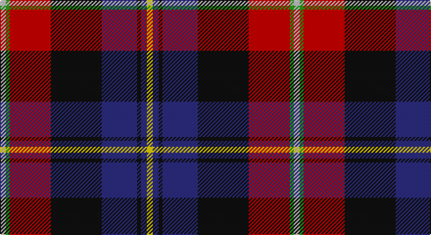

This page is one **sett** — a single exact thread-count. It belongs to the [tartan](/setts/ly3db3k2db18k26r21g2lb3/)
(the same proportion at any scale), whose colour order is pattern [WGRKBKBY](/stripes/wgrkbkby/).

Sourced from tartans-authority.  It is a [8 stripe tartan](/stripes/stripes8/).

Original link http://www.tartansauthority.com/tartan-ferret/display/11056/

## Register references

External register numbers recorded for this tartan.

- Scottish Register of Tartans: [11056](https://www.tartanregister.gov.uk/tartanDetails?ref=11056)
- Scottish Tartans Authority (ITI): 11056

## Thread count
N/6 G4 R42 K52 DB36 K4 DB6 Y/6

One full sett is **300 threads**.

## Palette

Palette: <strong>Tartan Register</strong>
<table><thead><tr><th>Colour</th><th>Threads</th><th>Shade</th><th>Base</th><th>OKLCh</th></tr></thead><tbody><tr><td>N/</td><td style="text-align:right;font-variant-numeric:tabular-nums">6</td><td><code style="background-color:#C0C0C0;">#C0C0C0</code> <small style="color:#888">#C0C0C0</small></td><td>W <code style="background-color:#F7F7F7;">#F7F7F7</code></td><td><small style="color:#888">oklch(80.8% 0.000 89.9)</small></td></tr><tr><td>G</td><td style="text-align:right;font-variant-numeric:tabular-nums">4</td><td><code style="background-color:#289C18;">#289C18</code> <small style="color:#888">#289C18</small></td><td>G <code style="background-color:#006100;">#006100</code></td><td><small style="color:#888">oklch(60.6% 0.191 141.6)</small></td></tr><tr><td>R</td><td style="text-align:right;font-variant-numeric:tabular-nums">42</td><td><code style="background-color:#C80000;">#C80000</code> <small style="color:#888">#C80000</small></td><td>R <code style="background-color:#CC0000;">#CC0000</code></td><td><small style="color:#888">oklch(52.3% 0.215 29.2)</small></td></tr><tr><td>K</td><td style="text-align:right;font-variant-numeric:tabular-nums">52</td><td><code style="background-color:#101010;">#101010</code> <small style="color:#888">#101010</small></td><td>K <code style="background-color:#000000;">#000000</code></td><td><small style="color:#888">oklch(17.3% 0.000 89.9)</small></td></tr><tr><td>DB</td><td style="text-align:right;font-variant-numeric:tabular-nums">36</td><td><code style="background-color:#2C2C80;">#2C2C80</code> <small style="color:#888">#2C2C80</small></td><td>B <code style="background-color:#2A418A;">#2A418A</code></td><td><small style="color:#888">oklch(35.0% 0.138 276.6)</small></td></tr><tr><td>K</td><td style="text-align:right;font-variant-numeric:tabular-nums">4</td><td><code style="background-color:#101010;">#101010</code> <small style="color:#888">#101010</small></td><td>K <code style="background-color:#000000;">#000000</code></td><td><small style="color:#888">oklch(17.3% 0.000 89.9)</small></td></tr><tr><td>DB</td><td style="text-align:right;font-variant-numeric:tabular-nums">6</td><td><code style="background-color:#2C2C80;">#2C2C80</code> <small style="color:#888">#2C2C80</small></td><td>B <code style="background-color:#2A418A;">#2A418A</code></td><td><small style="color:#888">oklch(35.0% 0.138 276.6)</small></td></tr><tr><td>Y/</td><td style="text-align:right;font-variant-numeric:tabular-nums">6</td><td><code style="background-color:#FCCC00;">#FCCC00</code> <small style="color:#888">#FCCC00</small></td><td>Y <code style="background-color:#F2BF00;">#F2BF00</code></td><td><small style="color:#888">oklch(86.2% 0.176 91.5)</small></td></tr></tbody></table>

# Sample pattern

## Nearest tartans

The nearest existing variants by ΔTartan distance, with this tartan at the top so the swatches line up against it.

ΔTartan

Tartan

Sett

—

<a href="/ttd/edit/#slug=ly3db3k2db18k26r21g2lb3~x2">Loch Etive</a> <a class="nn-out" href="/variants/s8/ly3db3k2db18k26r21g2lb3~x2/" title="open its dictionary page">↗</a>

0.26

<a href="/ttd/edit/#slug=w3g2r21k26db18k2db3ly3~x2&amp;base=ly3db3k2db18k26r21g2lb3~x2">Loch Etive</a> <a class="nn-out" href="/variants/s8/w3g2r21k26db18k2db3ly3~x2/" title="open its dictionary page">↗</a>

0.77

<a href="/ttd/edit/#slug=r17k5n4k6ly5db31k5g6n3~x2&amp;base=ly3db3k2db18k26r21g2lb3~x2">Dean/Dundas (Melbourne, Australia) (Personal)</a> <a class="nn-out" href="/variants/s9/r17k5n4k6ly5db31k5g6n3~x2/" title="open its dictionary page">↗</a>

0.82

<a href="/ttd/edit/#slug=r6db3p24w2k23y23k2y6~x2&amp;base=ly3db3k2db18k26r21g2lb3~x2">Culloden, Grey</a> <a class="nn-out" href="/variants/s8/r6db3p24w2k23y23k2y6~x2/" title="open its dictionary page">↗</a>

0.94

<a href="/ttd/edit/#slug=k7dbi4r31db3ly2db27lb4~x2&amp;base=ly3db3k2db18k26r21g2lb3~x2">Wishart Dress (Clan)</a> <a class="nn-out" href="/variants/s7/k7dbi4r31db3ly2db27lb4~x2/" title="open its dictionary page">↗</a>

0.94

<a href="/ttd/edit/#slug=w3db21k2r7k2g10k2r7k21ly3~x2&amp;base=ly3db3k2db18k26r21g2lb3~x2">Tantallon</a> <a class="nn-out" href="/variants/s10/w3db21k2r7k2g10k2r7k21ly3~x2/" title="open its dictionary page">↗</a>

0.97

<a href="/ttd/edit/#slug=k6r2db18lo2g2lo2g10r20db2lb1db6~x2&amp;base=ly3db3k2db18k26r21g2lb3~x2">Aberdeen Asset Management (Corp)</a> <a class="nn-out" href="/variants/s11/k6r2db18lo2g2lo2g10r20db2lb1db6~x2/" title="open its dictionary page">↗</a>

0.97

<a href="/ttd/edit/#slug=k4db12lb3db4g8lo2r24db4r4~x2&amp;base=ly3db3k2db18k26r21g2lb3~x2">MacCreary (Personal)</a> <a class="nn-out" href="/variants/s9/k4db12lb3db4g8lo2r24db4r4~x2/" title="open its dictionary page">↗</a>

0.97

<a href="/ttd/edit/#slug=o6do1o2do2o1do4dp14k4db1k3ly1~x4&amp;base=ly3db3k2db18k26r21g2lb3~x2">Wcwm 1873-4</a> <a class="nn-out" href="/variants/s11/o6do1o2do2o1do4dp14k4db1k3ly1~x4/" title="open its dictionary page">↗</a>

1.00

<a href="/ttd/edit/#slug=r17k5w4k6ly5db31k5g6w3~x2&amp;base=ly3db3k2db18k26r21g2lb3~x2">Dean/Dundas (Personal)</a> <a class="nn-out" href="/variants/s9/r17k5w4k6ly5db31k5g6w3~x2/" title="open its dictionary page">↗</a>

1.01

<a href="/variants/s6/dg3g3r22k5ki22ly2~x2/">Clan MacLeod Society of Scotland, Centenary</a>

## Neighbour map

Every grey dot is one of 14360 variants placed by the first two principal components of the ΔTartan feature space (44% of its variance). Red is this tartan; blue dots are its nearest — click one to open its page.

<svg viewBox="0 0 640 380" role="img" style="max-width:100%;height:auto;border:1px solid #e0e0e0;border-radius:4px;display:block" xmlns="http://www.w3.org/2000/svg"><image href="/nn/cloud.v1.png" width="640" height="380"/><a href="/variants/s8/w3g2r21k26db18k2db3ly3~x2/"><circle cx="152.9" cy="133.1" r="4" fill="#3465a4"><title>Loch Etive</title></circle></a><a href="/variants/s9/r17k5n4k6ly5db31k5g6n3~x2/"><circle cx="132.0" cy="138.3" r="4" fill="#3465a4"><title>Dean/Dundas (Melbourne, Australia) (Personal)</title></circle></a><a href="/variants/s8/r6db3p24w2k23y23k2y6~x2/"><circle cx="119.4" cy="142.0" r="4" fill="#3465a4"><title>Culloden, Grey</title></circle></a><a href="/variants/s7/k7dbi4r31db3ly2db27lb4~x2/"><circle cx="199.4" cy="127.5" r="4" fill="#3465a4"><title>Wishart Dress (Clan)</title></circle></a><a href="/variants/s10/w3db21k2r7k2g10k2r7k21ly3~x2/"><circle cx="118.2" cy="142.2" r="4" fill="#3465a4"><title>Tantallon</title></circle></a><a href="/variants/s11/k6r2db18lo2g2lo2g10r20db2lb1db6~x2/"><circle cx="171.0" cy="107.1" r="4" fill="#3465a4"><title>Aberdeen Asset Management (Corp)</title></circle></a><a href="/variants/s9/k4db12lb3db4g8lo2r24db4r4~x2/"><circle cx="182.0" cy="135.7" r="4" fill="#3465a4"><title>MacCreary (Personal)</title></circle></a><a href="/variants/s11/o6do1o2do2o1do4dp14k4db1k3ly1~x4/"><circle cx="149.8" cy="118.8" r="4" fill="#3465a4"><title>Wcwm 1873-4</title></circle></a><a href="/variants/s9/r17k5w4k6ly5db31k5g6w3~x2/"><circle cx="122.0" cy="132.9" r="4" fill="#3465a4"><title>Dean/Dundas (Personal)</title></circle></a><a href="/variants/s6/dg3g3r22k5ki22ly2~x2/"><circle cx="169.6" cy="155.5" r="4" fill="#3465a4"><title>Clan MacLeod Society of Scotland, Centenary</title></circle></a><circle cx="157.9" cy="136.8" r="5" fill="#c00000"/></svg>

ID: /variants/s8/ly3db3k2db18k26r21g2lb3~x2/
