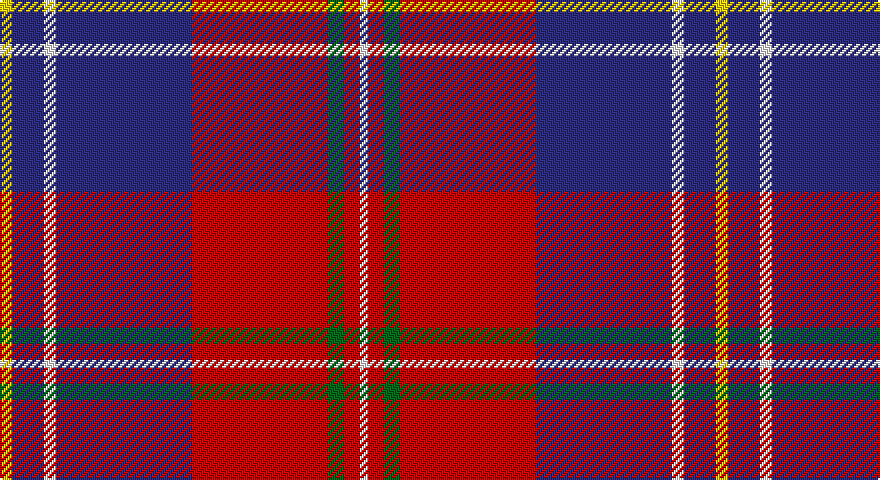

This page is one **sett** — a single exact thread-count. It belongs to the [tartan](/setts/ly3db8w3db34r34g4r4w2/)
(the same proportion at any scale), whose colour order is pattern [WRGRBWBY](/stripes/wrgrbwby/).

Part of the [Manitoba Masonic](/tartans/manitoba-masonic/) tartan — the named design grouping this sett with its other cloths.

Sourced from tartans-authority.  It is a [8 stripe tartan](/stripes/stripes8/).

Original link http://www.tartansauthority.com/tartan-ferret/display/10615/

## Register references

External register numbers recorded for this tartan.

- Scottish Register of Tartans: [10615](https://www.tartanregister.gov.uk/tartanDetails?ref=10615)
- Scottish Tartans Authority (ITI): 10615

## Thread count
Y/6 DB16 W6 DB68 R68 G8 R8 W/4

One full sett is **358 threads**.

## Palette

Palette: <strong>Tartan Register</strong>
<table><thead><tr><th>Colour</th><th>Threads</th><th>Shade</th><th>Base</th><th>OKLCh</th></tr></thead><tbody><tr><td>Y/</td><td style="text-align:right;font-variant-numeric:tabular-nums">6</td><td><code style="background-color:#FCCC00;">#FCCC00</code> <small style="color:#888">#FCCC00</small></td><td>Y <code style="background-color:#F2BF00;">#F2BF00</code></td><td><small style="color:#888">oklch(86.2% 0.176 91.5)</small></td></tr><tr><td>DB</td><td style="text-align:right;font-variant-numeric:tabular-nums">16</td><td><code style="background-color:#2C2C80;">#2C2C80</code> <small style="color:#888">#2C2C80</small></td><td>B <code style="background-color:#2A418A;">#2A418A</code></td><td><small style="color:#888">oklch(35.0% 0.138 276.6)</small></td></tr><tr><td>W</td><td style="text-align:right;font-variant-numeric:tabular-nums">6</td><td><code style="background-color:#FCFCFC;">#FCFCFC</code> <small style="color:#888">#FCFCFC</small></td><td>W <code style="background-color:#F7F7F7;">#F7F7F7</code></td><td><small style="color:#888">oklch(99.1% 0.000 89.9)</small></td></tr><tr><td>DB</td><td style="text-align:right;font-variant-numeric:tabular-nums">68</td><td><code style="background-color:#2C2C80;">#2C2C80</code> <small style="color:#888">#2C2C80</small></td><td>B <code style="background-color:#2A418A;">#2A418A</code></td><td><small style="color:#888">oklch(35.0% 0.138 276.6)</small></td></tr><tr><td>R</td><td style="text-align:right;font-variant-numeric:tabular-nums">68</td><td><code style="background-color:#C80000;">#C80000</code> <small style="color:#888">#C80000</small></td><td>R <code style="background-color:#CC0000;">#CC0000</code></td><td><small style="color:#888">oklch(52.3% 0.215 29.2)</small></td></tr><tr><td>G</td><td style="text-align:right;font-variant-numeric:tabular-nums">8</td><td><code style="background-color:#006818;">#006818</code> <small style="color:#888">#006818</small></td><td>G <code style="background-color:#006100;">#006100</code></td><td><small style="color:#888">oklch(45.0% 0.142 145.0)</small></td></tr><tr><td>R</td><td style="text-align:right;font-variant-numeric:tabular-nums">8</td><td><code style="background-color:#C80000;">#C80000</code> <small style="color:#888">#C80000</small></td><td>R <code style="background-color:#CC0000;">#CC0000</code></td><td><small style="color:#888">oklch(52.3% 0.215 29.2)</small></td></tr><tr><td>W/</td><td style="text-align:right;font-variant-numeric:tabular-nums">4</td><td><code style="background-color:#FCFCFC;">#FCFCFC</code> <small style="color:#888">#FCFCFC</small></td><td>W <code style="background-color:#F7F7F7;">#F7F7F7</code></td><td><small style="color:#888">oklch(99.1% 0.000 89.9)</small></td></tr></tbody></table>

# Sample pattern

## Compared to the master

This cloth is one sett of its design; the master sett (the exemplar the design is anchored on) is below for comparison.

<figure style="margin:0"><figcaption style="color:#888;font-size:smaller">this sett</figcaption></figure>
<figure style="margin:0"><figcaption style="color:#888;font-size:smaller"><a href="/setts/ly3n8w3n34r34g4r4w2/">master sett →</a></figcaption></figure>

## Nearest tartans

The nearest existing variants by ΔTartan distance, with this tartan at the top so the swatches line up against it.

ΔTartan

Tartan

Sett

—

<a href="/ttd/edit/#slug=ly3db8w3db34r34g4r4w2~x2">Manitoba Masonic (Corporate)</a> <a class="nn-out" href="/variants/s8/ly3db8w3db34r34g4r4w2~x2/" title="open its dictionary page">↗</a>

0.89

<a href="/ttd/edit/#slug=r4db36ri35g2ri2g8w4~x2&amp;base=ly3db8w3db34r34g4r4w2~x2">Cherry, John S (Personal)</a> <a class="nn-out" href="/variants/s7/r4db36ri35g2ri2g8w4~x2/" title="open its dictionary page">↗</a>

0.94

<a href="/ttd/edit/#slug=db24w3db4ly6db4w3db15r52db6&amp;base=ly3db8w3db34r34g4r4w2~x2">Mercer, James (Personal)</a> <a class="nn-out" href="/variants/s9/db24w3db4ly6db4w3db15r52db6/" title="open its dictionary page">↗</a>

0.95

<a href="/ttd/edit/#slug=db16w2db3ly4db3w2db10r35db4~x2&amp;base=ly3db8w3db34r34g4r4w2~x2">Mercer Personal Tartan</a> <a class="nn-out" href="/variants/s9/db16w2db3ly4db3w2db10r35db4~x2/" title="open its dictionary page">↗</a>

1.13

<a href="/ttd/edit/#slug=k2dbi2r16db2ly1db13w2~x2&amp;base=ly3db8w3db34r34g4r4w2~x2">Wishart Dress Family Tartan</a> <a class="nn-out" href="/variants/s7/k2dbi2r16db2ly1db13w2~x2/" title="open its dictionary page">↗</a>

1.16

<a href="/ttd/edit/#slug=db26g11r8k2r2w2r4w1r15~x2&amp;base=ly3db8w3db34r34g4r4w2~x2">Royal Scottish Assurance (Corporate)</a> <a class="nn-out" href="/variants/s9/db26g11r8k2r2w2r4w1r15~x2/" title="open its dictionary page">↗</a>

1.16

<a href="/ttd/edit/#slug=r25k1ly2k1ly2k1r10b18w2b12~x2&amp;base=ly3db8w3db34r34g4r4w2~x2">Richardson (Personal?)</a> <a class="nn-out" href="/variants/s10/r25k1ly2k1ly2k1r10b18w2b12~x2/" title="open its dictionary page">↗</a>

1.18

<a href="/ttd/edit/#slug=dt3lo2dt32r28w2r2w2r2w3~x2&amp;base=ly3db8w3db34r34g4r4w2~x2">Sea Dog Bamse, Pride of Norway</a> <a class="nn-out" href="/variants/s9/dt3lo2dt32r28w2r2w2r2w3~x2/" title="open its dictionary page">↗</a>

1.18

<a href="/ttd/edit/#slug=o4dt36r35g2r2g8w4~x2&amp;base=ly3db8w3db34r34g4r4w2~x2">Cherry, John S. (Personal)</a> <a class="nn-out" href="/variants/s7/o4dt36r35g2r2g8w4~x2/" title="open its dictionary page">↗</a>

1.18

<a href="/ttd/edit/#slug=dt50r26k9r4w2lo2r10~x2&amp;base=ly3db8w3db34r34g4r4w2~x2">Java Saint Andrew Society Dress</a> <a class="nn-out" href="/variants/s7/dt50r26k9r4w2lo2r10~x2/" title="open its dictionary page">↗</a>

1.18

<a href="/ttd/edit/#slug=lb12g12k12g24dp75ly4&amp;base=ly3db8w3db34r34g4r4w2~x2">Widows Sons Scotland Dress</a> <a class="nn-out" href="/variants/s6/lb12g12k12g24dp75ly4/" title="open its dictionary page">↗</a>

## Neighbour map

Every grey dot is one of 14360 variants placed by the first two principal components of the ΔTartan feature space (44% of its variance). Red is this tartan; blue dots are its nearest — click one to open its page.

<svg viewBox="0 0 640 380" role="img" style="max-width:100%;height:auto;border:1px solid #e0e0e0;border-radius:4px;display:block" xmlns="http://www.w3.org/2000/svg"><image href="/nn/cloud.v1.png" width="640" height="380"/><a href="/variants/s7/r4db36ri35g2ri2g8w4~x2/"><circle cx="220.2" cy="121.6" r="4" fill="#3465a4"><title>Cherry, John S (Personal)</title></circle></a><a href="/variants/s9/db24w3db4ly6db4w3db15r52db6/"><circle cx="295.7" cy="132.9" r="4" fill="#3465a4"><title>Mercer, James (Personal)</title></circle></a><a href="/variants/s9/db16w2db3ly4db3w2db10r35db4~x2/"><circle cx="300.6" cy="135.3" r="4" fill="#3465a4"><title>Mercer Personal Tartan</title></circle></a><a href="/variants/s7/k2dbi2r16db2ly1db13w2~x2/"><circle cx="225.4" cy="125.0" r="4" fill="#3465a4"><title>Wishart Dress Family Tartan</title></circle></a><a href="/variants/s9/db26g11r8k2r2w2r4w1r15~x2/"><circle cx="242.2" cy="120.3" r="4" fill="#3465a4"><title>Royal Scottish Assurance (Corporate)</title></circle></a><a href="/variants/s10/r25k1ly2k1ly2k1r10b18w2b12~x2/"><circle cx="293.4" cy="109.4" r="4" fill="#3465a4"><title>Richardson (Personal?)</title></circle></a><a href="/variants/s9/dt3lo2dt32r28w2r2w2r2w3~x2/"><circle cx="302.1" cy="129.3" r="4" fill="#3465a4"><title>Sea Dog Bamse, Pride of Norway</title></circle></a><a href="/variants/s7/o4dt36r35g2r2g8w4~x2/"><circle cx="246.2" cy="138.1" r="4" fill="#3465a4"><title>Cherry, John S. (Personal)</title></circle></a><a href="/variants/s7/dt50r26k9r4w2lo2r10~x2/"><circle cx="312.9" cy="135.0" r="4" fill="#3465a4"><title>Java Saint Andrew Society Dress</title></circle></a><a href="/variants/s6/lb12g12k12g24dp75ly4/"><circle cx="297.8" cy="150.4" r="4" fill="#3465a4"><title>Widows Sons Scotland Dress</title></circle></a><circle cx="268.7" cy="126.3" r="5" fill="#c00000"/></svg>

ID: /variants/s8/ly3db8w3db34r34g4r4w2~x2/
