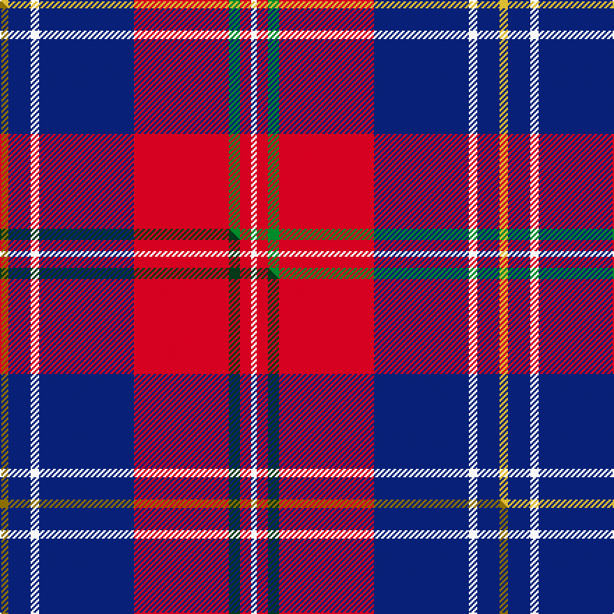

This page is one **sett** — a single exact thread-count. It belongs to the [tartan](/setts/ly3db8w3db34r34g4r4w2/)
(the same proportion at any scale), whose colour order is pattern [WRGRBWBY](/stripes/wrgrbwby/).

Part of the [Manitoba Masonic](/tartans/manitoba-masonic/) tartan — the named design grouping this sett with its other cloths.

Sourced from tartans-authority.  It is a [8 stripe tartan](/stripes/stripes8/).

Original link http://www.tartansauthority.com/tartan-ferret/display/10615/

## Register references

External register numbers recorded for this tartan.

- Scottish Register of Tartans: [10615](https://www.tartanregister.gov.uk/tartanDetails?ref=10615)
- Scottish Tartans Authority (ITI): 10615

## Thread count
LY/6 DB16 W6 DB68 R68 G8 R8 W/4

One full sett is **358 threads**.

## Palette
<table><thead><tr><th>Colour</th><th>Shade</th><th>OKLCh</th></tr></thead><tbody><tr><td>DB</td><td><code style="background-color:#082077;">#082077</code> <small style="color:#888">#082077</small></td><td><small style="color:#888">oklch(30.0% 0.149 265.1)</small></td></tr><tr><td>G</td><td><code style="background-color:#008B2A;">#008B2A</code> <small style="color:#888">#008B2A</small></td><td><small style="color:#888">oklch(55.4% 0.170 145.9)</small></td></tr><tr><td>R</td><td><code style="background-color:#D60020;">#D60020</code> <small style="color:#888">#D60020</small></td><td><small style="color:#888">oklch(55.2% 0.224 25.5)</small></td></tr><tr><td>W</td><td><code style="background-color:#F7F7F7;">#F7F7F7</code> <small style="color:#888">#F7F7F7</small></td><td><small style="color:#888">oklch(97.6% 0.000 89.9)</small></td></tr><tr><td>LY</td><td><code style="background-color:#DCBC32;">#DCBC32</code> <small style="color:#888">#DCBC32</small></td><td><small style="color:#888">oklch(80.0% 0.150 95.2)</small></td></tr></tbody></table>

# Sample pattern

## Compared to the master

This cloth is one sett of its design; the master sett (the exemplar the design is anchored on) is below for comparison.

Its **ΔTartan distance** from the master is **0.05** — the same measure the nearest-tartans table ranks by (0 is identical; a re-scale of the same cloth is near 0, a recolour or a different proportion further).

<figure class="master-compare" style="margin:0">

this sett
master sett ★

<figcaption style="color:#888;font-size:smaller">One weave of this sett against the <a href="/setts/y3db8w3db34r34dg4r4w2/">master sett ★</a>, split on the diagonal: a shared proportion runs seamlessly across it with only the shades shifting; a different proportion breaks on it.</figcaption>
</figure>

## Nearest tartan variants

The nearest existing variants by ΔTartan distance, with this cloth at the top so the swatches line up against it.

ΔTartan

Threads

Variant

Sett

—

358

<a href="/variants/s8/ly3db8w3db34r34g4r4w2~x2/">Manitoba Masonic (Corporate)</a>

<a href="/ttd/edit/#slug=y3db8w3db34r34dg4r4w2~x2&amp;base=ly3db8w3db34r34g4r4w2~x2" title="compare in the TTD">0.05</a>

358

<a href="/variants/s8/y3db8w3db34r34dg4r4w2~x2/">Manitoba Masonic</a>

<a href="/ttd/edit/#slug=r4db36ri35dg2ri2dg8w4~x2~r2309032-ri2510029&amp;base=ly3db8w3db34r34g4r4w2~x2" title="compare in the TTD">1.84</a>

348

<a href="/variants/s7/r4db36ri35dg2ri2dg8w4~x2~r2309032-ri2510029/">Cherry, John S (Personal)</a>

<a href="/ttd/edit/#slug=y2db3w6db15r24db3w2~x2&amp;base=ly3db8w3db34r34g4r4w2~x2" title="compare in the TTD">1.87</a>

212

<a href="/variants/s7/y2db3w6db15r24db3w2~x2/">Fazzolettone (Fashion?)</a>

<a href="/ttd/edit/#slug=ri4db36r35g2r2g8w4~x2~ri2607041-r2109032&amp;base=ly3db8w3db34r34g4r4w2~x2" title="compare in the TTD">2.10</a>

348

<a href="/variants/s7/ri4db36r35g2r2g8w4~x2~ri2607041-r2109032/">Cherry, John S. (Personal)</a>

<a href="/ttd/edit/#slug=db3ly2db32r28w2r2w2r2w3~x2&amp;base=ly3db8w3db34r34g4r4w2~x2" title="compare in the TTD">2.15</a>

292

<a href="/variants/s9/db3ly2db32r28w2r2w2r2w3~x2/">Sea Dog Bamse, Pride of Norway</a>

<a href="/ttd/edit/#slug=db12k3db2r2db2r12w2k1w2~x4&amp;base=ly3db8w3db34r34g4r4w2~x2" title="compare in the TTD">2.24</a>

248

<a href="/variants/s9/db12k3db2r2db2r12w2k1w2~x4/">Ainslie</a>

<a href="/ttd/edit/#slug=db1r16db6y4db6w1~x4&amp;base=ly3db8w3db34r34g4r4w2~x2" title="compare in the TTD">2.26</a>

264

<a href="/variants/s6/db1r16db6y4db6w1~x4/">Superfast Ferries (Corporate)</a>

<a href="/ttd/edit/#slug=r4y2r34db10g4db4lb4db23w3~x2&amp;base=ly3db8w3db34r34g4r4w2~x2" title="compare in the TTD">2.32</a>

338

<a href="/variants/s9/r4y2r34db10g4db4lb4db23w3~x2/">Heirloom Red Alba (Fashion)</a>

<a href="/ttd/edit/#slug=db2r2db28k11r27w2r2~x2&amp;base=ly3db8w3db34r34g4r4w2~x2" title="compare in the TTD">2.33</a>

288

<a href="/variants/s7/db2r2db28k11r27w2r2~x2/">Americana - 1978 #2 (Fashion)</a>

<a href="/ttd/edit/#slug=db4y3db17b6w2do6w2r24do3r4~x2&amp;base=ly3db8w3db34r34g4r4w2~x2" title="compare in the TTD">2.36</a>

268

<a href="/variants/s10/db4y3db17b6w2do6w2r24do3r4~x2/">Asman Family</a>

## Neighbour map

Every grey dot is one of 13620 variants placed by the first two principal components of the ΔTartan feature space (42% of its variance). Red is this tartan; blue dots are its nearest — click one to open its page.

<svg viewBox="0 0 640 380" role="img" style="max-width:100%;height:auto;border:1px solid #e0e0e0;border-radius:4px;display:block" xmlns="http://www.w3.org/2000/svg"><image href="/nn/cloud.v1.png" width="640" height="380"/><a href="/variants/s8/y3db8w3db34r34dg4r4w2~x2/"><circle cx="268.9" cy="136.9" r="4" fill="#3465a4"><title>Manitoba Masonic</title></circle></a><a href="/variants/s7/r4db36ri35dg2ri2dg8w4~x2~r2309032-ri2510029/"><circle cx="232.7" cy="139.4" r="4" fill="#3465a4"><title>Cherry, John S (Personal)</title></circle></a><a href="/variants/s7/y2db3w6db15r24db3w2~x2/"><circle cx="247.1" cy="177.1" r="4" fill="#3465a4"><title>Fazzolettone (Fashion?)</title></circle></a><a href="/variants/s7/ri4db36r35g2r2g8w4~x2~ri2607041-r2109032/"><circle cx="242.3" cy="145.5" r="4" fill="#3465a4"><title>Cherry, John S. (Personal)</title></circle></a><a href="/variants/s9/db3ly2db32r28w2r2w2r2w3~x2/"><circle cx="291.6" cy="134.4" r="4" fill="#3465a4"><title>Sea Dog Bamse, Pride of Norway</title></circle></a><a href="/variants/s9/db12k3db2r2db2r12w2k1w2~x4/"><circle cx="197.8" cy="151.8" r="4" fill="#3465a4"><title>Ainslie</title></circle></a><a href="/variants/s6/db1r16db6y4db6w1~x4/"><circle cx="295.3" cy="185.7" r="4" fill="#3465a4"><title>Superfast Ferries (Corporate)</title></circle></a><a href="/variants/s9/r4y2r34db10g4db4lb4db23w3~x2/"><circle cx="234.1" cy="123.6" r="4" fill="#3465a4"><title>Heirloom Red Alba (Fashion)</title></circle></a><a href="/variants/s7/db2r2db28k11r27w2r2~x2/"><circle cx="226.7" cy="150.0" r="4" fill="#3465a4"><title>Americana - 1978 #2 (Fashion)</title></circle></a><a href="/variants/s10/db4y3db17b6w2do6w2r24do3r4~x2/"><circle cx="181.3" cy="144.1" r="4" fill="#3465a4"><title>Asman Family</title></circle></a><circle cx="263.1" cy="135.6" r="5" fill="#c00000"/><text x="320" y="376" text-anchor="middle" font-size="11" fill="#999">ground</text><text x="11" y="190" text-anchor="middle" font-size="11" fill="#999" transform="rotate(-90 11 190)">complexity</text></svg>

ID: /variants/s8/ly3db8w3db34r34g4r4w2~x2/
