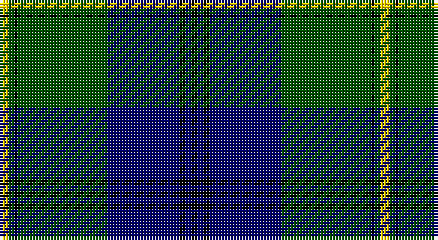

This page is one **sett** — a single exact thread-count. It belongs to the [tartan](/setts/ly3dg2k1dg30db24k2db2k2/)
(the same proportion at any scale), whose colour order is pattern [KBKBGKGY](/stripes/kbkbgkgy/).

Sourced from weddslist.  It is a [8 stripe tartan](/stripes/stripes8/).

Original link http://www.weddslist.com/cgi-bin/tartans/pg.pl?source=rb

## Also known as

This cloth is also recorded under:

- Johnston / Johnstone
- Johnston/Johnstone

2 attestations — the source records this cloth was collapsed from (oldest owns this page)

<ul>
<li>undated — Johnston (weddslist, <a href="http://www.weddslist.com/cgi-bin/tartans/pg.pl?source=rb">record</a>)</li>
<li>undated — Johnston (weddslist, <a href="http://www.weddslist.com/cgi-bin/tartans/pg.pl?source=x">record</a>)</li>
</ul>

## Thread count
Y/3 G2 K1 G30 DB24 K2 DB2 K/2

One full sett is **127 threads**.

## Palette

Palette: <strong>Tartan Register</strong> <small style="color:#888">(3 of 4 colours)</small>
<table><thead><tr><th>Colour</th><th>Threads</th><th>Shade</th><th>Base</th><th>OKLCh</th></tr></thead><tbody><tr><td>Y/</td><td style="text-align:right;font-variant-numeric:tabular-nums">3</td><td><code style="background-color:#FFC800;">#FFC800</code> <small style="color:#888">#FFC800</small></td><td>Y <code style="background-color:#F2BF00;">#F2BF00</code></td><td><small style="color:#888">oklch(85.7% 0.175 88.5)</small></td></tr><tr><td>G</td><td style="text-align:right;font-variant-numeric:tabular-nums">2</td><td><code style="background-color:#004C00;">#004C00</code> <small style="color:#888">#004C00</small></td><td>G <code style="background-color:#006100;">#006100</code></td><td><small style="color:#888">oklch(36.1% 0.123 142.5)</small></td></tr><tr><td>K</td><td style="text-align:right;font-variant-numeric:tabular-nums">1</td><td><code style="background-color:#000000;">#000000</code> <small style="color:#888">#000000</small></td><td>K <code style="background-color:#000000;">#000000</code></td><td><small style="color:#888">oklch(0.0% 0.000 0.0)</small></td></tr><tr><td>G</td><td style="text-align:right;font-variant-numeric:tabular-nums">30</td><td><code style="background-color:#004C00;">#004C00</code> <small style="color:#888">#004C00</small></td><td>G <code style="background-color:#006100;">#006100</code></td><td><small style="color:#888">oklch(36.1% 0.123 142.5)</small></td></tr><tr><td>DB</td><td style="text-align:right;font-variant-numeric:tabular-nums">24</td><td><code style="background-color:#000064;">#000064</code> <small style="color:#888">#000064</small></td><td>B <code style="background-color:#2A418A;">#2A418A</code></td><td><small style="color:#888">oklch(22.7% 0.158 264.1)</small></td></tr><tr><td>K</td><td style="text-align:right;font-variant-numeric:tabular-nums">2</td><td><code style="background-color:#000000;">#000000</code> <small style="color:#888">#000000</small></td><td>K <code style="background-color:#000000;">#000000</code></td><td><small style="color:#888">oklch(0.0% 0.000 0.0)</small></td></tr><tr><td>DB</td><td style="text-align:right;font-variant-numeric:tabular-nums">2</td><td><code style="background-color:#000064;">#000064</code> <small style="color:#888">#000064</small></td><td>B <code style="background-color:#2A418A;">#2A418A</code></td><td><small style="color:#888">oklch(22.7% 0.158 264.1)</small></td></tr><tr><td>K/</td><td style="text-align:right;font-variant-numeric:tabular-nums">2</td><td><code style="background-color:#000000;">#000000</code> <small style="color:#888">#000000</small></td><td>K <code style="background-color:#000000;">#000000</code></td><td><small style="color:#888">oklch(0.0% 0.000 0.0)</small></td></tr></tbody></table>

# Sample pattern

## Nearest tartans

The nearest existing variants by ΔTartan distance, with this tartan at the top so the swatches line up against it.

ΔTartan

Tartan

Sett

—

<a href="/ttd/edit/#slug=ly3dg2k1dg30db24k2db2k2">Johnston</a> <a class="nn-out" href="/variants/s8/ly3dg2k1dg30db24k2db2k2/" title="open its dictionary page">↗</a>

0.69

<a href="/ttd/edit/#slug=ly3dg2k1dg30db24k2db2k2~x2&amp;base=ly3dg2k1dg30db24k2db2k2">Johnston</a> <a class="nn-out" href="/variants/s8/ly3dg2k1dg30db24k2db2k2~x2/" title="open its dictionary page">↗</a>

0.86

<a href="/ttd/edit/#slug=db2g2k1g30db20r2db2r2~x2&amp;base=ly3dg2k1dg30db24k2db2k2">Gretna Green Fashion Tartan</a> <a class="nn-out" href="/variants/s8/db2g2k1g30db20r2db2r2~x2/" title="open its dictionary page">↗</a>

0.93

<a href="/ttd/edit/#slug=db2g2ly1g30db20r2db2r2~x2&amp;base=ly3dg2k1dg30db24k2db2k2">Gretna Green</a> <a class="nn-out" href="/variants/s8/db2g2ly1g30db20r2db2r2~x2/" title="open its dictionary page">↗</a>

1.06

<a href="/ttd/edit/#slug=r3db12k1db1k1db2k12dg30k1dg2~x2&amp;base=ly3dg2k1dg30db24k2db2k2">Armstrong</a> <a class="nn-out" href="/variants/s10/r3db12k1db1k1db2k12dg30k1dg2~x2/" title="open its dictionary page">↗</a>

1.14

<a href="/ttd/edit/#slug=b10k6g42k2g1k2r1k24r2~x2&amp;base=ly3dg2k1dg30db24k2db2k2">Black Thistle</a> <a class="nn-out" href="/variants/s9/b10k6g42k2g1k2r1k24r2~x2/" title="open its dictionary page">↗</a>

1.19

<a href="/ttd/edit/#slug=db4k4db24dg32lb1dg2~x2&amp;base=ly3dg2k1dg30db24k2db2k2">Oliphant</a> <a class="nn-out" href="/variants/s6/db4k4db24dg32lb1dg2~x2/" title="open its dictionary page">↗</a>

1.25

<a href="/ttd/edit/#slug=db64k11r2k4r2k4g32y4~x2&amp;base=ly3dg2k1dg30db24k2db2k2">Sinclair-Brown</a> <a class="nn-out" href="/variants/s8/db64k11r2k4r2k4g32y4~x2/" title="open its dictionary page">↗</a>

1.29

<a href="/ttd/edit/#slug=o2db20r2g3r4g35r1~x2&amp;base=ly3dg2k1dg30db24k2db2k2">Williams, Jodi (Personal)</a> <a class="nn-out" href="/variants/s7/o2db20r2g3r4g35r1~x2/" title="open its dictionary page">↗</a>

1.31

<a href="/ttd/edit/#slug=db72k21g16t3g17t3~x2&amp;base=ly3dg2k1dg30db24k2db2k2">MacRobart</a> <a class="nn-out" href="/variants/s6/db72k21g16t3g17t3~x2/" title="open its dictionary page">↗</a>

1.33

<a href="/ttd/edit/#slug=lr4dg30k1dg1k1dg3k12db10r3~x2&amp;base=ly3dg2k1dg30db24k2db2k2">MacDonnald of ye Ylis</a> <a class="nn-out" href="/variants/s9/lr4dg30k1dg1k1dg3k12db10r3~x2/" title="open its dictionary page">↗</a>

## Neighbour map

Every grey dot is one of 14360 variants placed by the first two principal components of the ΔTartan feature space (44% of its variance). Red is this tartan; blue dots are its nearest — click one to open its page.

<svg viewBox="0 0 640 380" role="img" style="max-width:100%;height:auto;border:1px solid #e0e0e0;border-radius:4px;display:block" xmlns="http://www.w3.org/2000/svg"><image href="/nn/cloud.v1.png" width="640" height="380"/><a href="/variants/s8/ly3dg2k1dg30db24k2db2k2~x2/"><circle cx="354.5" cy="156.4" r="4" fill="#3465a4"><title>Johnston</title></circle></a><a href="/variants/s8/db2g2k1g30db20r2db2r2~x2/"><circle cx="368.6" cy="142.9" r="4" fill="#3465a4"><title>Gretna Green Fashion Tartan</title></circle></a><a href="/variants/s8/db2g2ly1g30db20r2db2r2~x2/"><circle cx="367.0" cy="141.5" r="4" fill="#3465a4"><title>Gretna Green</title></circle></a><a href="/variants/s10/r3db12k1db1k1db2k12dg30k1dg2~x2/"><circle cx="326.7" cy="137.4" r="4" fill="#3465a4"><title>Armstrong</title></circle></a><a href="/variants/s9/b10k6g42k2g1k2r1k24r2~x2/"><circle cx="336.0" cy="119.1" r="4" fill="#3465a4"><title>Black Thistle</title></circle></a><a href="/variants/s6/db4k4db24dg32lb1dg2~x2/"><circle cx="373.3" cy="183.9" r="4" fill="#3465a4"><title>Oliphant</title></circle></a><a href="/variants/s8/db64k11r2k4r2k4g32y4~x2/"><circle cx="312.4" cy="116.1" r="4" fill="#3465a4"><title>Sinclair-Brown</title></circle></a><a href="/variants/s7/o2db20r2g3r4g35r1~x2/"><circle cx="376.0" cy="145.1" r="4" fill="#3465a4"><title>Williams, Jodi (Personal)</title></circle></a><a href="/variants/s6/db72k21g16t3g17t3~x2/"><circle cx="327.4" cy="173.5" r="4" fill="#3465a4"><title>MacRobart</title></circle></a><a href="/variants/s9/lr4dg30k1dg1k1dg3k12db10r3~x2/"><circle cx="304.4" cy="126.0" r="4" fill="#3465a4"><title>MacDonnald of ye Ylis</title></circle></a><circle cx="334.1" cy="146.2" r="5" fill="#c00000"/></svg>

ID: /variants/s8/ly3dg2k1dg30db24k2db2k2/
