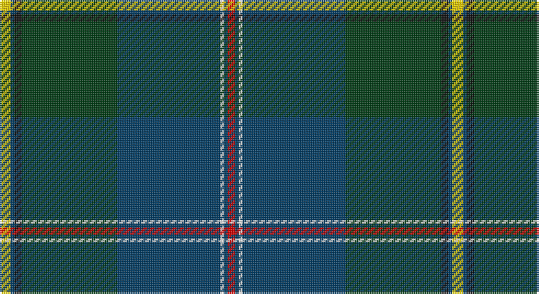

This page is one **sett** — a single exact thread-count. It belongs to the [tartan](/setts/ly3dt1k2dg26dt28w1dt1r2/)
(the same proportion at any scale), whose colour order is pattern [RBWBGKBY](/stripes/rbwbgkby/).

Part of the [Johnston, Diana Hunting](/tartans/johnston-diana-hunting/) tartan — the named design grouping this sett with its other cloths.

Sourced from register-of-tartans.  It is a [8 stripe tartan](/stripes/stripes8/).

Original link https://www.tartanregister.gov.uk/tartanDetails.aspx?ref=11179

## Register references

External register numbers recorded for this tartan.

- Scottish Register of Tartans: [11179](https://www.tartanregister.gov.uk/tartanDetails.aspx?ref=11179)

## Thread count
Y/6 DB2 K4 DG52 DB56 W2 DB2 R/4

One full sett is **246 threads**.

## Palette

Palette: <strong>Tartan Register</strong>
<table><thead><tr><th>Colour</th><th>Threads</th><th>Shade</th><th>Base</th><th>OKLCh</th></tr></thead><tbody><tr><td>Y/</td><td style="text-align:right;font-variant-numeric:tabular-nums">6</td><td><code style="background-color:#FCCC00;">#FCCC00</code> <small style="color:#888">#FCCC00</small></td><td>Y <code style="background-color:#F2BF00;">#F2BF00</code></td><td><small style="color:#888">oklch(86.2% 0.176 91.5)</small></td></tr><tr><td>DB</td><td style="text-align:right;font-variant-numeric:tabular-nums">2</td><td><code style="background-color:#003C64;">#003C64</code> <small style="color:#888">#003C64</small></td><td>B <code style="background-color:#2A418A;">#2A418A</code></td><td><small style="color:#888">oklch(34.5% 0.089 246.0)</small></td></tr><tr><td>K</td><td style="text-align:right;font-variant-numeric:tabular-nums">4</td><td><code style="background-color:#101010;">#101010</code> <small style="color:#888">#101010</small></td><td>K <code style="background-color:#000000;">#000000</code></td><td><small style="color:#888">oklch(17.3% 0.000 89.9)</small></td></tr><tr><td>DG</td><td style="text-align:right;font-variant-numeric:tabular-nums">52</td><td><code style="background-color:#003C14;">#003C14</code> <small style="color:#888">#003C14</small></td><td>G <code style="background-color:#006100;">#006100</code></td><td><small style="color:#888">oklch(31.1% 0.089 148.5)</small></td></tr><tr><td>DB</td><td style="text-align:right;font-variant-numeric:tabular-nums">56</td><td><code style="background-color:#003C64;">#003C64</code> <small style="color:#888">#003C64</small></td><td>B <code style="background-color:#2A418A;">#2A418A</code></td><td><small style="color:#888">oklch(34.5% 0.089 246.0)</small></td></tr><tr><td>W</td><td style="text-align:right;font-variant-numeric:tabular-nums">2</td><td><code style="background-color:#FFFFFF;">#FFFFFF</code> <small style="color:#888">#FFFFFF</small></td><td>W <code style="background-color:#F7F7F7;">#F7F7F7</code></td><td><small style="color:#888">oklch(100.0% 0.000 89.9)</small></td></tr><tr><td>DB</td><td style="text-align:right;font-variant-numeric:tabular-nums">2</td><td><code style="background-color:#003C64;">#003C64</code> <small style="color:#888">#003C64</small></td><td>B <code style="background-color:#2A418A;">#2A418A</code></td><td><small style="color:#888">oklch(34.5% 0.089 246.0)</small></td></tr><tr><td>R/</td><td style="text-align:right;font-variant-numeric:tabular-nums">4</td><td><code style="background-color:#DC0000;">#DC0000</code> <small style="color:#888">#DC0000</small></td><td>R <code style="background-color:#CC0000;">#CC0000</code></td><td><small style="color:#888">oklch(56.2% 0.230 29.2)</small></td></tr></tbody></table>

# Sample pattern

## Nearest tartans

The nearest existing variants by ΔTartan distance, with this tartan at the top so the swatches line up against it.

ΔTartan

Tartan

Sett

—

<a href="/ttd/edit/#slug=ly3dt1k2dg26dt28w1dt1r2~x2">Johnston, Diana Hunting (Personal)</a> <a class="nn-out" href="/variants/s8/ly3dt1k2dg26dt28w1dt1r2~x2/" title="open its dictionary page">↗</a>

0.86

<a href="/ttd/edit/#slug=k2g30k3db4k2dbi18t1k3r2~x2&amp;base=ly3dt1k2dg26dt28w1dt1r2~x2">Lusk (Personal)</a> <a class="nn-out" href="/variants/s9/k2g30k3db4k2dbi18t1k3r2~x2/" title="open its dictionary page">↗</a>

1.05

<a href="/ttd/edit/#slug=dbi3db3dbi1g26dbi10n1dbi3dp5db4lo2~x2&amp;base=ly3dt1k2dg26dt28w1dt1r2~x2">Rikaco Heirloom (Fashion)</a> <a class="nn-out" href="/variants/s10/dbi3db3dbi1g26dbi10n1dbi3dp5db4lo2~x2/" title="open its dictionary page">↗</a>

1.05

<a href="/ttd/edit/#slug=db3t3g30db25dp4r3ly2dp1~x2&amp;base=ly3dt1k2dg26dt28w1dt1r2~x2">Young</a> <a class="nn-out" href="/variants/s8/db3t3g30db25dp4r3ly2dp1~x2/" title="open its dictionary page">↗</a>

1.11

<a href="/ttd/edit/#slug=db31ly4g68w4db31r2k6r2~x2&amp;base=ly3dt1k2dg26dt28w1dt1r2~x2">Inkster (Name)</a> <a class="nn-out" href="/variants/s8/db31ly4g68w4db31r2k6r2~x2/" title="open its dictionary page">↗</a>

1.18

<a href="/ttd/edit/#slug=k3n3k1dg26k10yi1k3dp5n4y2~x2&amp;base=ly3dt1k2dg26dt28w1dt1r2~x2">Rikaco Heirloom</a> <a class="nn-out" href="/variants/s10/k3n3k1dg26k10yi1k3dp5n4y2~x2/" title="open its dictionary page">↗</a>

1.20

<a href="/ttd/edit/#slug=dp23w1o3w1dp12lo9dg40dp3~x2&amp;base=ly3dt1k2dg26dt28w1dt1r2~x2">Pictou County</a> <a class="nn-out" href="/variants/s8/dp23w1o3w1dp12lo9dg40dp3~x2/" title="open its dictionary page">↗</a>

1.20

<a href="/ttd/edit/#slug=dg3w2dg39k3t3k3dg3k20g10r2~x2&amp;base=ly3dt1k2dg26dt28w1dt1r2~x2">Zorra Caledonian Society (Corporate</a> <a class="nn-out" href="/variants/s10/dg3w2dg39k3t3k3dg3k20g10r2~x2/" title="open its dictionary page">↗</a>

1.21

<a href="/ttd/edit/#slug=ly3db1k2g26db28w1db1r2~x2&amp;base=ly3dt1k2dg26dt28w1dt1r2~x2">Johnston, Diana Hunting (Personal)</a> <a class="nn-out" href="/variants/s8/ly3db1k2g26db28w1db1r2~x2/" title="open its dictionary page">↗</a>

1.21

<a href="/ttd/edit/#slug=db4w1k2db25k12b1k2g16k2r1~x2&amp;base=ly3dt1k2dg26dt28w1dt1r2~x2">Sidey Family Tartan (Name)</a> <a class="nn-out" href="/variants/s10/db4w1k2db25k12b1k2g16k2r1~x2/" title="open its dictionary page">↗</a>

1.23

<a href="/ttd/edit/#slug=ly3dg5k2dg5w1dg17dt4r1dt22w2~x2&amp;base=ly3dt1k2dg26dt28w1dt1r2~x2">McAvoy (Personal)</a> <a class="nn-out" href="/variants/s10/ly3dg5k2dg5w1dg17dt4r1dt22w2~x2/" title="open its dictionary page">↗</a>

## Neighbour map

Every grey dot is one of 14360 variants placed by the first two principal components of the ΔTartan feature space (44% of its variance). Red is this tartan; blue dots are its nearest — click one to open its page.

<svg viewBox="0 0 640 380" role="img" style="max-width:100%;height:auto;border:1px solid #e0e0e0;border-radius:4px;display:block" xmlns="http://www.w3.org/2000/svg"><image href="/nn/cloud.v1.png" width="640" height="380"/><a href="/variants/s9/k2g30k3db4k2dbi18t1k3r2~x2/"><circle cx="290.8" cy="120.6" r="4" fill="#3465a4"><title>Lusk (Personal)</title></circle></a><a href="/variants/s10/dbi3db3dbi1g26dbi10n1dbi3dp5db4lo2~x2/"><circle cx="276.0" cy="124.3" r="4" fill="#3465a4"><title>Rikaco Heirloom (Fashion)</title></circle></a><a href="/variants/s8/db3t3g30db25dp4r3ly2dp1~x2/"><circle cx="268.4" cy="117.6" r="4" fill="#3465a4"><title>Young</title></circle></a><a href="/variants/s8/db31ly4g68w4db31r2k6r2~x2/"><circle cx="294.7" cy="115.1" r="4" fill="#3465a4"><title>Inkster (Name)</title></circle></a><a href="/variants/s10/k3n3k1dg26k10yi1k3dp5n4y2~x2/"><circle cx="286.7" cy="133.9" r="4" fill="#3465a4"><title>Rikaco Heirloom</title></circle></a><a href="/variants/s8/dp23w1o3w1dp12lo9dg40dp3~x2/"><circle cx="294.1" cy="124.6" r="4" fill="#3465a4"><title>Pictou County</title></circle></a><a href="/variants/s10/dg3w2dg39k3t3k3dg3k20g10r2~x2/"><circle cx="317.1" cy="142.1" r="4" fill="#3465a4"><title>Zorra Caledonian Society (Corporate</title></circle></a><a href="/variants/s8/ly3db1k2g26db28w1db1r2~x2/"><circle cx="293.0" cy="107.2" r="4" fill="#3465a4"><title>Johnston, Diana Hunting (Personal)</title></circle></a><a href="/variants/s10/db4w1k2db25k12b1k2g16k2r1~x2/"><circle cx="275.0" cy="130.1" r="4" fill="#3465a4"><title>Sidey Family Tartan (Name)</title></circle></a><a href="/variants/s10/ly3dg5k2dg5w1dg17dt4r1dt22w2~x2/"><circle cx="258.9" cy="129.0" r="4" fill="#3465a4"><title>McAvoy (Personal)</title></circle></a><circle cx="318.8" cy="125.9" r="5" fill="#c00000"/></svg>

ID: /variants/s8/ly3dt1k2dg26dt28w1dt1r2~x2/
