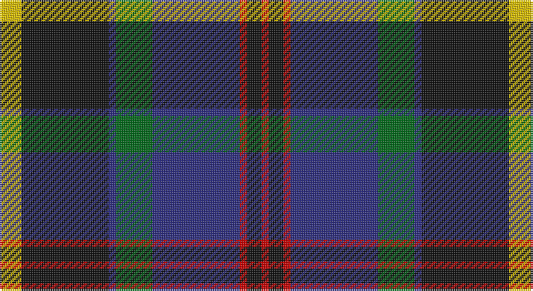

This page is one **sett** — a single exact thread-count. It belongs to the [tartan](/setts/ly3k12db1g5db12r1k2r1/)
(the same proportion at any scale), whose colour order is pattern [RKRBGBKY](/stripes/rkrbgbky/).

Sourced from register-of-tartans.  It is a [8 stripe tartan](/stripes/stripes8/).

Original link https://www.tartanregister.gov.uk/tartanDetails.aspx?ref=3650

2 attestations — the source records this cloth was collapsed from (oldest owns this page)

<ul>
<li>01/07/2006 — Sandberg of Greenock (Personal) (register-of-tartans, <a href="https://www.tartanregister.gov.uk/tartanDetails.aspx?ref=3650">record</a>)</li>
<li>2006 July — Sandberg of Greenock (Personal) (tartans-authority, <a href="http://www.tartansauthority.com/tartan-ferret/display/6974/">record</a>)</li>
</ul>

## Register references

External register numbers recorded for this tartan.

- Scottish Register of Tartans: [3650](https://www.tartanregister.gov.uk/tartanDetails.aspx?ref=3650)
- Scottish Tartans Authority (ITI): 6974

## Thread count
Y/12 K48 DB4 G20 DB48 R4 K8 R/4

One full sett is **280 threads**.

## Palette

Palette: <strong>Tartan Register</strong>
<table><thead><tr><th>Colour</th><th>Threads</th><th>Shade</th><th>Base</th><th>OKLCh</th></tr></thead><tbody><tr><td>Y/</td><td style="text-align:right;font-variant-numeric:tabular-nums">12</td><td><code style="background-color:#E8C000;">#E8C000</code> <small style="color:#888">#E8C000</small></td><td>Y <code style="background-color:#F2BF00;">#F2BF00</code></td><td><small style="color:#888">oklch(81.9% 0.168 93.7)</small></td></tr><tr><td>K</td><td style="text-align:right;font-variant-numeric:tabular-nums">48</td><td><code style="background-color:#101010;">#101010</code> <small style="color:#888">#101010</small></td><td>K <code style="background-color:#000000;">#000000</code></td><td><small style="color:#888">oklch(17.3% 0.000 89.9)</small></td></tr><tr><td>DB</td><td style="text-align:right;font-variant-numeric:tabular-nums">4</td><td><code style="background-color:#2C2C80;">#2C2C80</code> <small style="color:#888">#2C2C80</small></td><td>B <code style="background-color:#2A418A;">#2A418A</code></td><td><small style="color:#888">oklch(35.0% 0.138 276.6)</small></td></tr><tr><td>G</td><td style="text-align:right;font-variant-numeric:tabular-nums">20</td><td><code style="background-color:#006818;">#006818</code> <small style="color:#888">#006818</small></td><td>G <code style="background-color:#006100;">#006100</code></td><td><small style="color:#888">oklch(45.0% 0.142 145.0)</small></td></tr><tr><td>DB</td><td style="text-align:right;font-variant-numeric:tabular-nums">48</td><td><code style="background-color:#2C2C80;">#2C2C80</code> <small style="color:#888">#2C2C80</small></td><td>B <code style="background-color:#2A418A;">#2A418A</code></td><td><small style="color:#888">oklch(35.0% 0.138 276.6)</small></td></tr><tr><td>R</td><td style="text-align:right;font-variant-numeric:tabular-nums">4</td><td><code style="background-color:#C80000;">#C80000</code> <small style="color:#888">#C80000</small></td><td>R <code style="background-color:#CC0000;">#CC0000</code></td><td><small style="color:#888">oklch(52.3% 0.215 29.2)</small></td></tr><tr><td>K</td><td style="text-align:right;font-variant-numeric:tabular-nums">8</td><td><code style="background-color:#101010;">#101010</code> <small style="color:#888">#101010</small></td><td>K <code style="background-color:#000000;">#000000</code></td><td><small style="color:#888">oklch(17.3% 0.000 89.9)</small></td></tr><tr><td>R/</td><td style="text-align:right;font-variant-numeric:tabular-nums">4</td><td><code style="background-color:#C80000;">#C80000</code> <small style="color:#888">#C80000</small></td><td>R <code style="background-color:#CC0000;">#CC0000</code></td><td><small style="color:#888">oklch(52.3% 0.215 29.2)</small></td></tr></tbody></table>

# Sample pattern

## Nearest tartans

The nearest existing variants by ΔTartan distance, with this tartan at the top so the swatches line up against it.

ΔTartan

Tartan

Sett

—

<a href="/ttd/edit/#slug=ly3k12db1g5db12r1k2r1~x4">Sandberg of Greenock (Personal)</a> <a class="nn-out" href="/variants/s8/ly3k12db1g5db12r1k2r1~x4/" title="open its dictionary page">↗</a>

0.57

<a href="/ttd/edit/#slug=db22r3db2r3db2k17o18dg4~x2&amp;base=ly3k12db1g5db12r1k2r1~x4">Scotch House 2000, antique</a> <a class="nn-out" href="/variants/s8/db22r3db2r3db2k17o18dg4~x2/" title="open its dictionary page">↗</a>

0.60

<a href="/ttd/edit/#slug=g14k2g4r2g4k14dp15k1w3~x2&amp;base=ly3k12db1g5db12r1k2r1~x4">MacRae Hunting #2</a> <a class="nn-out" href="/variants/s9/g14k2g4r2g4k14dp15k1w3~x2/" title="open its dictionary page">↗</a>

0.67

<a href="/ttd/edit/#slug=r2k9g12db8r1db1w1~x4&amp;base=ly3k12db1g5db12r1k2r1~x4">Genet, Citizen (Commem)</a> <a class="nn-out" href="/variants/s7/r2k9g12db8r1db1w1~x4/" title="open its dictionary page">↗</a>

0.77

<a href="/ttd/edit/#slug=db24k2db2r2db2k20g16ly2g2ly3~x2&amp;base=ly3k12db1g5db12r1k2r1~x4">Watson (Name)</a> <a class="nn-out" href="/variants/s10/db24k2db2r2db2k20g16ly2g2ly3~x2/" title="open its dictionary page">↗</a>

0.78

<a href="/ttd/edit/#slug=r1k1g7k5db10k1ly1~x2&amp;base=ly3k12db1g5db12r1k2r1~x4">MacLeod Small Clan Tartan</a> <a class="nn-out" href="/variants/s7/r1k1g7k5db10k1ly1~x2/" title="open its dictionary page">↗</a>

0.79

<a href="/variants/s9/r2g10ki12db1k2db14ki1db1g2~x2/">McWilliams Wedding (Personal)</a>

0.80

<a href="/ttd/edit/#slug=db5k10db48k72w12dg48r5&amp;base=ly3k12db1g5db12r1k2r1~x4">Colquhoun (Clan)</a> <a class="nn-out" href="/variants/s7/db5k10db48k72w12dg48r5/" title="open its dictionary page">↗</a>

0.81

<a href="/ttd/edit/#slug=r3g2r6g20k15g3db18w2~x2&amp;base=ly3k12db1g5db12r1k2r1~x4">Curry (Personal)</a> <a class="nn-out" href="/variants/s8/r3g2r6g20k15g3db18w2~x2/" title="open its dictionary page">↗</a>

0.86

<a href="/ttd/edit/#slug=r6db2g5db18g10db2k28db2g10lo3~x2&amp;base=ly3k12db1g5db12r1k2r1~x4">Ofally, County</a> <a class="nn-out" href="/variants/s10/r6db2g5db18g10db2k28db2g10lo3~x2/" title="open its dictionary page">↗</a>

0.87

<a href="/ttd/edit/#slug=r6db3r3db32k30g30ly3r3~x2&amp;base=ly3k12db1g5db12r1k2r1~x4">MacDonald of Borrodale (Clan)</a> <a class="nn-out" href="/variants/s8/r6db3r3db32k30g30ly3r3~x2/" title="open its dictionary page">↗</a>

## Neighbour map

Every grey dot is one of 14360 variants placed by the first two principal components of the ΔTartan feature space (44% of its variance). Red is this tartan; blue dots are its nearest — click one to open its page.

<svg viewBox="0 0 640 380" role="img" style="max-width:100%;height:auto;border:1px solid #e0e0e0;border-radius:4px;display:block" xmlns="http://www.w3.org/2000/svg"><image href="/nn/cloud.v1.png" width="640" height="380"/><a href="/variants/s8/db22r3db2r3db2k17o18dg4~x2/"><circle cx="167.6" cy="175.1" r="4" fill="#3465a4"><title>Scotch House 2000, antique</title></circle></a><a href="/variants/s9/g14k2g4r2g4k14dp15k1w3~x2/"><circle cx="183.5" cy="166.4" r="4" fill="#3465a4"><title>MacRae Hunting #2</title></circle></a><a href="/variants/s7/r2k9g12db8r1db1w1~x4/"><circle cx="170.8" cy="184.1" r="4" fill="#3465a4"><title>Genet, Citizen (Commem)</title></circle></a><a href="/variants/s10/db24k2db2r2db2k20g16ly2g2ly3~x2/"><circle cx="193.7" cy="154.9" r="4" fill="#3465a4"><title>Watson (Name)</title></circle></a><a href="/variants/s7/r1k1g7k5db10k1ly1~x2/"><circle cx="196.2" cy="195.4" r="4" fill="#3465a4"><title>MacLeod Small Clan Tartan</title></circle></a><a href="/variants/s9/r2g10ki12db1k2db14ki1db1g2~x2/"><circle cx="197.3" cy="166.7" r="4" fill="#3465a4"><title>McWilliams Wedding (Personal)</title></circle></a><a href="/variants/s7/db5k10db48k72w12dg48r5/"><circle cx="207.4" cy="182.7" r="4" fill="#3465a4"><title>Colquhoun (Clan)</title></circle></a><a href="/variants/s8/r3g2r6g20k15g3db18w2~x2/"><circle cx="163.4" cy="188.8" r="4" fill="#3465a4"><title>Curry (Personal)</title></circle></a><a href="/variants/s10/r6db2g5db18g10db2k28db2g10lo3~x2/"><circle cx="171.7" cy="164.8" r="4" fill="#3465a4"><title>Ofally, County</title></circle></a><a href="/variants/s8/r6db3r3db32k30g30ly3r3~x2/"><circle cx="138.3" cy="168.4" r="4" fill="#3465a4"><title>MacDonald of Borrodale (Clan)</title></circle></a><circle cx="188.0" cy="170.7" r="5" fill="#c00000"/></svg>

ID: /variants/s8/ly3k12db1g5db12r1k2r1~x4/
