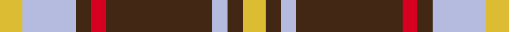

This is one **variant** — a specific cloth: this exact thread count and colourway, with its own
provenance below. It is one weaving of the [sett](/setts/ly3lb7do2r2do14lb2do2ly3/) (the scale-free proportion — the
same cloth at any scale or shade), whose colour order is pattern [YBWBRBWY](/stripes/ybwbrbwy/).

Part of the [Daks](/tartans/d/da/daks-10/) tartan — the named design grouping this sett with its other cloths.

Sourced from register-of-tartans.  It is a [8 stripe tartan](/stripes/stripes8/).

Original link [https://www.tartanregister.gov.uk/tartanDetails.aspx?ref=865](https://www.tartanregister.gov.uk/tartanDetails.aspx?ref=865)

Dataset <small>— provenance for this record, inherited from the source manifest</small>

<dl class="dataset-prov">
<dt>source</dt><dd><a href="/sources/register-of-tartans/">Scottish Register of Tartans</a></dd>
<dt>data captured from</dt><dd><a href="https://github.com/thetartan/tartan-database/blob/master/data/register-of-tartans/data.csv">https://github.com/thetartan/tartan-database/blob/master/data/register-of-tartans/data.csv</a></dd>
<dt>data date</dt><dd>2002 <small>(this record)</small></dd>
<dt>licence</dt><dd><a href="https://www.tartanregister.gov.uk/copyright">Crown copyright</a></dd>
</dl>

Capture chain <small>— the hands this data passed through, oldest first; each capture carries its own licence</small>

<ol class="capture-chain">
<li><a href="https://www.tartanregister.gov.uk/">Scottish Register of Tartans</a> · <a href="https://www.tartanregister.gov.uk/copyright">Crown copyright</a> <small>the living register — still published by National Records of Scotland</small></li>
<li><a href="https://github.com/thetartan/tartan-database">thetartan/tartan-database</a> <small>2016-2017</small> · <a href="https://creativecommons.org/licenses/by-nc-nd/4.0/">CC BY-NC-ND 4.0</a> <small>Levko Kravets's frozen compilation — the capture we vendored, and where its CC licence text came from</small></li>
<li>this dictionary <small>captured 2026-06-10 · commit 5bf86c7566</small> <small>each re-capture is a git commit to data/sources</small></li>
</ol>

## Register references

External register numbers recorded for this tartan.

- Scottish Register of Tartans: [865](https://www.tartanregister.gov.uk/tartanDetails.aspx?ref=865)
- Scottish Tartans Authority (ITI): 1727
- Scottish Tartans World Register: 1727

## Thread count
LY/6 LB14 DO4 R4 DO28 LB4 DO4 LY/6

One full sett is **128 threads**.

## Palette
<table><thead><tr><th>Colour</th><th>Shade</th><th>OKLCh</th></tr></thead><tbody><tr><td>LB</td><td><code style="background-color:#B5BBDE;">#B5BBDE</code> <small style="color:#888">#B5BBDE</small></td><td><small style="color:#888">oklch(79.9% 0.050 277.6)</small></td></tr><tr><td>DO</td><td><code style="background-color:#412714;">#412714</code> <small style="color:#888">#412714</small></td><td><small style="color:#888">oklch(30.1% 0.050 55.7)</small></td></tr><tr><td>LY</td><td><code style="background-color:#DCBC32;">#DCBC32</code> <small style="color:#888">#DCBC32</small></td><td><small style="color:#888">oklch(80.0% 0.150 95.2)</small></td></tr><tr><td>R</td><td><code style="background-color:#D60020;">#D60020</code> <small style="color:#888">#D60020</small></td><td><small style="color:#888">oklch(55.2% 0.224 25.5)</small></td></tr></tbody></table>

# Sample pattern

## Nearest tartan variants

The nearest existing variants by ΔTartan distance, with this cloth at the top so the swatches line up against it.

ΔTartan

Threads

Variant

Sett

—

128

<a href="/variants/s8/ly3lb7do2r2do14lb2do2ly3~x2/">Daks (Blue Loden)</a>

<a href="/ttd/edit/#slug=r3w2r9dt15w2dt15lr9r2lr3~x2~dt0900000-lr3200000&amp;base=ly3lb7do2r2do14lb2do2ly3~x2" title="compare in the TTD">2.01</a>

228

<a href="/variants/s9/r3w2r9dt15w2dt15lb9r2lb3~x2~dt0900000-lb3200000/">Dogrobes</a>

<a href="/ttd/edit/#slug=o5lb13do4r4do27lb3do4o5&amp;base=ly3lb7do2r2do14lb2do2ly3~x2" title="compare in the TTD">2.30</a>

120

<a href="/variants/s8/o5lb13do4r4do27lb3do4o5/">Daks, Blue Loden</a>

<a href="/ttd/edit/#slug=g3r9lb1g9r1g1r9db9r1~x4&amp;base=ly3lb7do2r2do14lb2do2ly3~x2" title="compare in the TTD">2.39</a>

328

<a href="/variants/s9/g3r9lb1g9r1g1r9db9r1~x4/">Convention of the Baronage (Corp)</a>

<a href="/ttd/edit/#slug=g3r9lb1g9r1g1r8db9r1~x4&amp;base=ly3lb7do2r2do14lb2do2ly3~x2" title="compare in the TTD">2.42</a>

320

<a href="/variants/s9/g3r9lb1g9r1g1r8db9r1~x4/">Baronage</a>

<a href="/ttd/edit/#slug=r1dg1lp1lb7dg7lp1dg1lp1~x6&amp;base=ly3lb7do2r2do14lb2do2ly3~x2" title="compare in the TTD">2.72</a>

228

<a href="/variants/s8/r1dg1lp1lb7dg7lp1dg1lp1~x6/">Beck-McSorley</a>

<a href="/ttd/edit/#slug=r1w1r6db3r1g6r1g6r6db1r1w1~x2&amp;base=ly3lb7do2r2do14lb2do2ly3~x2" title="compare in the TTD">2.74</a>

132

<a href="/variants/s12/r1w1r6db3r1g6r1g6r6db1r1w1~x2/">MacQuarrie SM</a>

<a href="/ttd/edit/#slug=r4lb3r32db30r4g32r3g32r3g3~x2&amp;base=ly3lb7do2r2do14lb2do2ly3~x2" title="compare in the TTD">2.84</a>

570

<a href="/variants/s10/r4lb3r32db30r4g32r3g32r3g3~x2/">Unidentified Plaid #15</a>

<a href="/ttd/edit/#slug=r2db12r2g11r4db5g2r24w2~x2&amp;base=ly3lb7do2r2do14lb2do2ly3~x2" title="compare in the TTD">2.97</a>

248

<a href="/variants/s9/r2db12r2g11r4db5g2r24w2~x2/">Fraser Gathering, Red (1997)</a>

<a href="/ttd/edit/#slug=r1lb1r6db3r1g6r1g6r6db1r1lb1~x2&amp;base=ly3lb7do2r2do14lb2do2ly3~x2" title="compare in the TTD">3.00</a>

132

<a href="/variants/s12/r1lb1r6db3r1g6r1g6r6db1r1lb1~x2/">MacQuarrie</a>

<a href="/ttd/edit/#slug=r1lb1r6db3r1g6r1g6r6db1r1lb1&amp;base=ly3lb7do2r2do14lb2do2ly3~x2" title="compare in the TTD">3.00</a>

66

<a href="/variants/s12/r1lb1r6db3r1g6r1g6r6db1r1lb1/">MacQuarrie SM</a>

## Neighbour map

Every grey dot is one of 13656 variants placed by the first two principal components of the ΔTartan feature space (42% of its variance). Red is this tartan; blue dots are its nearest — click one to open its page. The map is a flat projection of a many-dimensional space — [how to read it](/posts/neighbourhood-maps/).

<svg viewBox="0 0 640 380" role="img" style="max-width:100%;height:auto;border:1px solid #e0e0e0;border-radius:4px;display:block" xmlns="http://www.w3.org/2000/svg"><image href="/nn/cloud.v1.png" width="640" height="380"/><a href="/variants/s9/r3w2r9dt15w2dt15lb9r2lb3~x2~dt0900000-lb3200000/"><circle cx="220.5" cy="201.8" r="4" fill="#3465a4"><title>Dogrobes</title></circle></a><a href="/variants/s8/o5lb13do4r4do27lb3do4o5/"><circle cx="282.1" cy="189.4" r="4" fill="#3465a4"><title>Daks, Blue Loden</title></circle></a><a href="/variants/s9/g3r9lb1g9r1g1r9db9r1~x4/"><circle cx="245.4" cy="200.8" r="4" fill="#3465a4"><title>Convention of the Baronage (Corp)</title></circle></a><a href="/variants/s9/g3r9lb1g9r1g1r8db9r1~x4/"><circle cx="238.7" cy="201.8" r="4" fill="#3465a4"><title>Baronage</title></circle></a><a href="/variants/s8/r1dg1lp1lb7dg7lp1dg1lp1~x6/"><circle cx="225.4" cy="196.4" r="4" fill="#3465a4"><title>Beck-McSorley</title></circle></a><a href="/variants/s12/r1w1r6db3r1g6r1g6r6db1r1w1~x2/"><circle cx="226.5" cy="202.2" r="4" fill="#3465a4"><title>MacQuarrie SM</title></circle></a><a href="/variants/s10/r4lb3r32db30r4g32r3g32r3g3~x2/"><circle cx="253.0" cy="184.1" r="4" fill="#3465a4"><title>Unidentified Plaid #15</title></circle></a><a href="/variants/s9/r2db12r2g11r4db5g2r24w2~x2/"><circle cx="273.7" cy="169.7" r="4" fill="#3465a4"><title>Fraser Gathering, Red (1997)</title></circle></a><a href="/variants/s12/r1lb1r6db3r1g6r1g6r6db1r1lb1~x2/"><circle cx="237.2" cy="205.6" r="4" fill="#3465a4"><title>MacQuarrie</title></circle></a><a href="/variants/s12/r1lb1r6db3r1g6r1g6r6db1r1lb1/"><circle cx="237.2" cy="205.6" r="4" fill="#3465a4"><title>MacQuarrie SM</title></circle></a><circle cx="247.1" cy="203.2" r="5" fill="#c00000"/><text x="320" y="376" text-anchor="middle" font-size="11" fill="#999">ground</text><text x="11" y="190" text-anchor="middle" font-size="11" fill="#999" transform="rotate(-90 11 190)">complexity</text></svg>

ID: /variants/s8/ly3lb7do2r2do14lb2do2ly3~x2/
