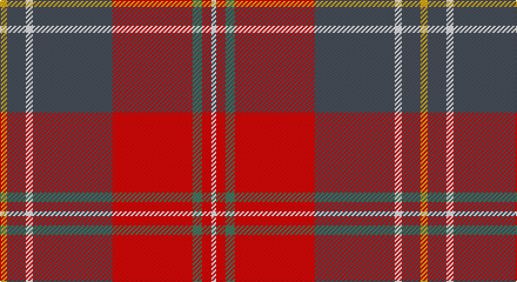

This page is one **sett** — a single exact thread-count. It belongs to the [tartan](/setts/ly3n8w3n34r34g4r4w2/)
(the same proportion at any scale), whose colour order is pattern [WRGRBWBY](/stripes/wrgrbwby/).

Part of the [Manitoba Masonic](/tartans/manitoba-masonic/) tartan — the named design grouping this sett with its other cloths.

Sourced from register-of-tartans.  It is a [8 stripe tartan](/stripes/stripes8/).

Original link https://www.tartanregister.gov.uk/tartanDetails.aspx?ref=10615

## Register references

External register numbers recorded for this tartan.

- Scottish Register of Tartans: [10615](https://www.tartanregister.gov.uk/tartanDetails.aspx?ref=10615)

## Thread count
Y/6 N16 W6 N68 R68 G8 R8 W/4

One full sett is **358 threads**.

## Palette

Palette: <strong>Tartan Register</strong> <small style="color:#888">(1 of 5 colours)</small>
<table><thead><tr><th>Colour</th><th>Threads</th><th>Shade</th><th>Base</th><th>OKLCh</th></tr></thead><tbody><tr><td>Y/</td><td style="text-align:right;font-variant-numeric:tabular-nums">6</td><td><code style="background-color:#E2A81A;">#E2A81A</code> <small style="color:#888">#E2A81A</small></td><td>Y <code style="background-color:#F2BF00;">#F2BF00</code></td><td><small style="color:#888">oklch(76.6% 0.152 82.6)</small></td></tr><tr><td>N</td><td style="text-align:right;font-variant-numeric:tabular-nums">16</td><td><code style="background-color:#474F5A;">#474F5A</code> <small style="color:#888">#474F5A</small></td><td>B <code style="background-color:#2A418A;">#2A418A</code></td><td><small style="color:#888">oklch(42.5% 0.021 256.4)</small></td></tr><tr><td>W</td><td style="text-align:right;font-variant-numeric:tabular-nums">6</td><td><code style="background-color:#FFFFFF;">#FFFFFF</code> <small style="color:#888">#FFFFFF</small></td><td>W <code style="background-color:#F7F7F7;">#F7F7F7</code></td><td><small style="color:#888">oklch(100.0% 0.000 89.9)</small></td></tr><tr><td>N</td><td style="text-align:right;font-variant-numeric:tabular-nums">68</td><td><code style="background-color:#474F5A;">#474F5A</code> <small style="color:#888">#474F5A</small></td><td>B <code style="background-color:#2A418A;">#2A418A</code></td><td><small style="color:#888">oklch(42.5% 0.021 256.4)</small></td></tr><tr><td>R</td><td style="text-align:right;font-variant-numeric:tabular-nums">68</td><td><code style="background-color:#E50908;">#E50908</code> <small style="color:#888">#E50908</small></td><td>R <code style="background-color:#CC0000;">#CC0000</code></td><td><small style="color:#888">oklch(58.1% 0.235 29.0)</small></td></tr><tr><td>G</td><td style="text-align:right;font-variant-numeric:tabular-nums">8</td><td><code style="background-color:#46785E;">#46785E</code> <small style="color:#888">#46785E</small></td><td>G <code style="background-color:#006100;">#006100</code></td><td><small style="color:#888">oklch(52.9% 0.069 160.1)</small></td></tr><tr><td>R</td><td style="text-align:right;font-variant-numeric:tabular-nums">8</td><td><code style="background-color:#E50908;">#E50908</code> <small style="color:#888">#E50908</small></td><td>R <code style="background-color:#CC0000;">#CC0000</code></td><td><small style="color:#888">oklch(58.1% 0.235 29.0)</small></td></tr><tr><td>W/</td><td style="text-align:right;font-variant-numeric:tabular-nums">4</td><td><code style="background-color:#FFFFFF;">#FFFFFF</code> <small style="color:#888">#FFFFFF</small></td><td>W <code style="background-color:#F7F7F7;">#F7F7F7</code></td><td><small style="color:#888">oklch(100.0% 0.000 89.9)</small></td></tr></tbody></table>

# Sample pattern

## Nearest tartans

The nearest existing variants by ΔTartan distance, with this tartan at the top so the swatches line up against it.

ΔTartan

Tartan

Sett

—

<a href="/ttd/edit/#slug=ly3n8w3n34r34g4r4w2~x2">Manitoba Masonic</a> <a class="nn-out" href="/variants/s8/ly3n8w3n34r34g4r4w2~x2/" title="open its dictionary page">↗</a>

0.84

<a href="/ttd/edit/#slug=r6b22r6g20ly2r45b2w5~x2&amp;base=ly3n8w3n34r34g4r4w2~x2">Elbrick Dress (Personal)</a> <a class="nn-out" href="/variants/s8/r6b22r6g20ly2r45b2w5~x2/" title="open its dictionary page">↗</a>

1.00

<a href="/ttd/edit/#slug=n8w3n25k3n4k8r31ly2r5~x2&amp;base=ly3n8w3n34r34g4r4w2~x2">Caledon (Corporate)</a> <a class="nn-out" href="/variants/s9/n8w3n25k3n4k8r31ly2r5~x2/" title="open its dictionary page">↗</a>

1.10

<a href="/ttd/edit/#slug=r25k1ly2k1ly2k1r10b18w2b12~x2&amp;base=ly3n8w3n34r34g4r4w2~x2">Richardson (Personal?)</a> <a class="nn-out" href="/variants/s10/r25k1ly2k1ly2k1r10b18w2b12~x2/" title="open its dictionary page">↗</a>

1.12

<a href="/ttd/edit/#slug=r27y4k4y4k4t6lo1~x4&amp;base=ly3n8w3n34r34g4r4w2~x2">MacLeay</a> <a class="nn-out" href="/variants/s7/r27y4k4y4k4t6lo1~x4/" title="open its dictionary page">↗</a>

1.14

<a href="/ttd/edit/#slug=o4dt36r35g2r2g8w4~x2&amp;base=ly3n8w3n34r34g4r4w2~x2">Cherry, John S. (Personal)</a> <a class="nn-out" href="/variants/s7/o4dt36r35g2r2g8w4~x2/" title="open its dictionary page">↗</a>

1.16

<a href="/ttd/edit/#slug=n22r2w1lo3r1n6r22lo3r1w10~x4&amp;base=ly3n8w3n34r34g4r4w2~x2">Glenburnie School</a> <a class="nn-out" href="/variants/s10/n22r2w1lo3r1n6r22lo3r1w10~x4/" title="open its dictionary page">↗</a>

1.19

<a href="/ttd/edit/#slug=lb6r5lb9db2b3db2o36r2o4r2~x2&amp;base=ly3n8w3n34r34g4r4w2~x2">Outpost Club</a> <a class="nn-out" href="/variants/s10/lb6r5lb9db2b3db2o36r2o4r2~x2/" title="open its dictionary page">↗</a>

1.20

<a href="/ttd/edit/#slug=ri2dg16r1ri2r12ly1y1~x2&amp;base=ly3n8w3n34r34g4r4w2~x2">Spragg, Andrew</a> <a class="nn-out" href="/variants/s7/ri2dg16r1ri2r12ly1y1~x2/" title="open its dictionary page">↗</a>

1.20

<a href="/ttd/edit/#slug=t4g3t9dt14ly8dt2r35ri2r3~x2&amp;base=ly3n8w3n34r34g4r4w2~x2">Hogeboom (Personal)</a> <a class="nn-out" href="/variants/s9/t4g3t9dt14ly8dt2r35ri2r3~x2/" title="open its dictionary page">↗</a>

1.21

<a href="/ttd/edit/#slug=n47r8k22r7lb3r24n9r10lo3~x2&amp;base=ly3n8w3n34r34g4r4w2~x2">Ulster Ancestry (Fashion)</a> <a class="nn-out" href="/variants/s9/n47r8k22r7lb3r24n9r10lo3~x2/" title="open its dictionary page">↗</a>

## Neighbour map

Every grey dot is one of 14360 variants placed by the first two principal components of the ΔTartan feature space (44% of its variance). Red is this tartan; blue dots are its nearest — click one to open its page.

<svg viewBox="0 0 640 380" role="img" style="max-width:100%;height:auto;border:1px solid #e0e0e0;border-radius:4px;display:block" xmlns="http://www.w3.org/2000/svg"><image href="/nn/cloud.v1.png" width="640" height="380"/><a href="/variants/s8/r6b22r6g20ly2r45b2w5~x2/"><circle cx="307.7" cy="128.6" r="4" fill="#3465a4"><title>Elbrick Dress (Personal)</title></circle></a><a href="/variants/s9/n8w3n25k3n4k8r31ly2r5~x2/"><circle cx="245.9" cy="142.2" r="4" fill="#3465a4"><title>Caledon (Corporate)</title></circle></a><a href="/variants/s10/r25k1ly2k1ly2k1r10b18w2b12~x2/"><circle cx="293.4" cy="109.4" r="4" fill="#3465a4"><title>Richardson (Personal?)</title></circle></a><a href="/variants/s7/r27y4k4y4k4t6lo1~x4/"><circle cx="324.3" cy="117.2" r="4" fill="#3465a4"><title>MacLeay</title></circle></a><a href="/variants/s7/o4dt36r35g2r2g8w4~x2/"><circle cx="246.2" cy="138.1" r="4" fill="#3465a4"><title>Cherry, John S. (Personal)</title></circle></a><a href="/variants/s10/n22r2w1lo3r1n6r22lo3r1w10~x4/"><circle cx="234.1" cy="104.6" r="4" fill="#3465a4"><title>Glenburnie School</title></circle></a><a href="/variants/s10/lb6r5lb9db2b3db2o36r2o4r2~x2/"><circle cx="328.6" cy="104.9" r="4" fill="#3465a4"><title>Outpost Club</title></circle></a><a href="/variants/s7/ri2dg16r1ri2r12ly1y1~x2/"><circle cx="301.7" cy="154.5" r="4" fill="#3465a4"><title>Spragg, Andrew</title></circle></a><a href="/variants/s9/t4g3t9dt14ly8dt2r35ri2r3~x2/"><circle cx="235.6" cy="104.4" r="4" fill="#3465a4"><title>Hogeboom (Personal)</title></circle></a><a href="/variants/s9/n47r8k22r7lb3r24n9r10lo3~x2/"><circle cx="253.2" cy="156.3" r="4" fill="#3465a4"><title>Ulster Ancestry (Fashion)</title></circle></a><circle cx="288.1" cy="130.8" r="5" fill="#c00000"/></svg>

ID: /variants/s8/ly3n8w3n34r34g4r4w2~x2/
