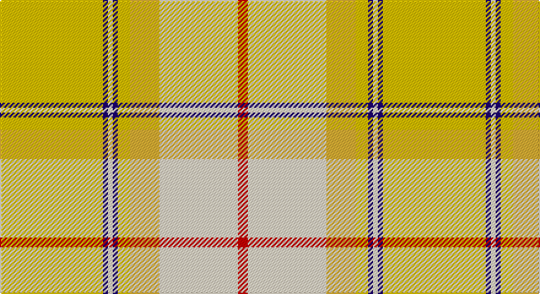

This page is one **sett** — a single exact thread-count. It belongs to the [tartan](/setts/ly42db2w2db2ly5lyi12w32r4/)
(the same proportion at any scale), whose colour order is pattern [RWYYBWBY](/stripes/rwyybwby/).

Sourced from tartans-authority.  It is a [8 stripe tartan](/stripes/stripes8/).

Original link http://www.tartansauthority.com/tartan-ferret/display/7606/

## Provenance

Earliest known date: March 2008 One of a series of dancer's tartans for the House of Edgar's in-house collection designed by Kirsty Anderson.

## Also known as

This cloth is also recorded under:

- Comrie, Gold

3 attestations — the source records this cloth was collapsed from (oldest owns this page)

<ul>
<li>March 2008 — Comrie, Gold (Dance) (tartans-authority, <a href="http://www.tartansauthority.com/tartan-ferret/display/7606/">record</a>)</li>
<li>undated — Comrie Gold (register-of-tartans, <a href="https://www.tartanregister.gov.uk/tartanDetails.aspx?ref=5630">record</a>)</li>
<li>undated — Comrie Gold Fashion Tartan (house-of-tartan, <a href="http://www.house-of-tartan.scotland.net/house/TartanViewjs.asp?colr=Def&tnam=7606">record</a>)</li>
</ul>

## Register references

External register numbers recorded for this tartan.

- Scottish Register of Tartans: [5630](https://www.tartanregister.gov.uk/tartanDetails.aspx?ref=5630)
- Scottish Tartans Authority (ITI): 7606

## Thread count
Y/84 DB4 W4 DB4 Y10 Ya24 W64 R/8

One full sett is **312 threads**.

## Palette

Palette: <strong>Tartan Register</strong> <small style="color:#888">(4 of 5 colours)</small>
<table><thead><tr><th>Colour</th><th>Threads</th><th>Shade</th><th>Base</th><th>OKLCh</th></tr></thead><tbody><tr><td>Y/</td><td style="text-align:right;font-variant-numeric:tabular-nums">84</td><td><code style="background-color:#E8C000;">#E8C000</code> <small style="color:#888">#E8C000</small></td><td>Y <code style="background-color:#F2BF00;">#F2BF00</code></td><td><small style="color:#888">oklch(81.9% 0.168 93.7)</small></td></tr><tr><td>DB</td><td style="text-align:right;font-variant-numeric:tabular-nums">4</td><td><code style="background-color:#1C0070;">#1C0070</code> <small style="color:#888">#1C0070</small></td><td>B <code style="background-color:#2A418A;">#2A418A</code></td><td><small style="color:#888">oklch(26.3% 0.162 277.1)</small></td></tr><tr><td>W</td><td style="text-align:right;font-variant-numeric:tabular-nums">4</td><td><code style="background-color:#F0E0C8;">#F0E0C8</code> <small style="color:#888">#F0E0C8</small></td><td>W <code style="background-color:#F7F7F7;">#F7F7F7</code></td><td><small style="color:#888">oklch(91.3% 0.036 78.1)</small></td></tr><tr><td>DB</td><td style="text-align:right;font-variant-numeric:tabular-nums">4</td><td><code style="background-color:#1C0070;">#1C0070</code> <small style="color:#888">#1C0070</small></td><td>B <code style="background-color:#2A418A;">#2A418A</code></td><td><small style="color:#888">oklch(26.3% 0.162 277.1)</small></td></tr><tr><td>Y</td><td style="text-align:right;font-variant-numeric:tabular-nums">10</td><td><code style="background-color:#E8C000;">#E8C000</code> <small style="color:#888">#E8C000</small></td><td>Y <code style="background-color:#F2BF00;">#F2BF00</code></td><td><small style="color:#888">oklch(81.9% 0.168 93.7)</small></td></tr><tr><td>Ya</td><td style="text-align:right;font-variant-numeric:tabular-nums">24</td><td><code style="background-color:#ECB034;">#ECB034</code> <small style="color:#888">#ECB034</small></td><td>Y <code style="background-color:#F2BF00;">#F2BF00</code></td><td><small style="color:#888">oklch(79.3% 0.148 80.8)</small></td></tr><tr><td>W</td><td style="text-align:right;font-variant-numeric:tabular-nums">64</td><td><code style="background-color:#F0E0C8;">#F0E0C8</code> <small style="color:#888">#F0E0C8</small></td><td>W <code style="background-color:#F7F7F7;">#F7F7F7</code></td><td><small style="color:#888">oklch(91.3% 0.036 78.1)</small></td></tr><tr><td>R/</td><td style="text-align:right;font-variant-numeric:tabular-nums">8</td><td><code style="background-color:#C80000;">#C80000</code> <small style="color:#888">#C80000</small></td><td>R <code style="background-color:#CC0000;">#CC0000</code></td><td><small style="color:#888">oklch(52.3% 0.215 29.2)</small></td></tr></tbody></table>

# Sample pattern

## Nearest tartans

The nearest existing variants by ΔTartan distance, with this tartan at the top so the swatches line up against it.

ΔTartan

Tartan

Sett

—

<a href="/ttd/edit/#slug=ly42db2w2db2ly5lyi12w32r4~x2">Comrie, Gold (Dance)</a> <a class="nn-out" href="/variants/s8/ly42db2w2db2ly5lyi12w32r4~x2/" title="open its dictionary page">↗</a>

1.45

<a href="/ttd/edit/#slug=lo32r2ly3k3r2lo3ly3lo3lyi3lo3lyi32~x2&amp;base=ly42db2w2db2ly5lyi12w32r4~x2">Glen Talloch</a> <a class="nn-out" href="/variants/s11/lo32r2ly3k3r2lo3ly3lo3lyi3lo3lyi32~x2/" title="open its dictionary page">↗</a>

1.79

<a href="/ttd/edit/#slug=lb40dp5lb6ly26o13lb9dy3~x2&amp;base=ly42db2w2db2ly5lyi12w32r4~x2">de Meuron Dress (Family)</a> <a class="nn-out" href="/variants/s7/lb40dp5lb6ly26o13lb9dy3~x2/" title="open its dictionary page">↗</a>

1.88

<a href="/ttd/edit/#slug=lb12loi1dy1lo1loi22lo1dy6loi4dy3loi2lo12loi2~x4&amp;base=ly42db2w2db2ly5lyi12w32r4~x2">Wcwm 969-2</a> <a class="nn-out" href="/variants/s12/lb12loi1dy1lo1loi22lo1dy6loi4dy3loi2lo12loi2~x4/" title="open its dictionary page">↗</a>

1.90

<a href="/ttd/edit/#slug=y2w19lr2w2y3w3y3lr6ly25w2~x2&amp;base=ly42db2w2db2ly5lyi12w32r4~x2">Llama (Fashion)</a> <a class="nn-out" href="/variants/s10/y2w19lr2w2y3w3y3lr6ly25w2~x2/" title="open its dictionary page">↗</a>

2.08

<a href="/ttd/edit/#slug=k3o29lo2o2lo4o2lo20ly1lo2ly10w3~x2&amp;base=ly42db2w2db2ly5lyi12w32r4~x2">Shenzhen (Sports)</a> <a class="nn-out" href="/variants/s11/k3o29lo2o2lo4o2lo20ly1lo2ly10w3~x2/" title="open its dictionary page">↗</a>

2.18

<a href="/ttd/edit/#slug=y6db2y1w17y1db2y16lo27dg2~x2&amp;base=ly42db2w2db2ly5lyi12w32r4~x2">Rutlin (Personal)</a> <a class="nn-out" href="/variants/s9/y6db2y1w17y1db2y16lo27dg2~x2/" title="open its dictionary page">↗</a>

2.33

<a href="/ttd/edit/#slug=lp6w2lp25dy2w9lgi2lg4lgi2w9lgi2lg15dy2lg2dy4~x2&amp;base=ly42db2w2db2ly5lyi12w32r4~x2">Sakura (Japanese Four Seasons)</a> <a class="nn-out" href="/variants/s14/lp6w2lp25dy2w9lgi2lg4lgi2w9lgi2lg15dy2lg2dy4~x2/" title="open its dictionary page">↗</a>

2.34

<a href="/ttd/edit/#slug=r2lt1r1lt11lg16g1w1~x2&amp;base=ly42db2w2db2ly5lyi12w32r4~x2">Gift of Life Michigan</a> <a class="nn-out" href="/variants/s7/r2lt1r1lt11lg16g1w1~x2/" title="open its dictionary page">↗</a>

2.34

<a href="/ttd/edit/#slug=g4o1lo29o6w13o13w6o13w13o6lo29o1t4~x2&amp;base=ly42db2w2db2ly5lyi12w32r4~x2">Delta Dental Association (Corporate)</a> <a class="nn-out" href="/variants/s13/g4o1lo29o6w13o13w6o13w13o6lo29o1t4~x2/" title="open its dictionary page">↗</a>

2.38

<a href="/ttd/edit/#slug=lo15g6lo1r1lo1g6lo15y2lo1y6w1~x4&amp;base=ly42db2w2db2ly5lyi12w32r4~x2">Connacht (District) (Smith)</a> <a class="nn-out" href="/variants/s11/lo15g6lo1r1lo1g6lo15y2lo1y6w1~x4/" title="open its dictionary page">↗</a>

## Neighbour map

Every grey dot is one of 14360 variants placed by the first two principal components of the ΔTartan feature space (44% of its variance). Red is this tartan; blue dots are its nearest — click one to open its page.

<svg viewBox="0 0 640 380" role="img" style="max-width:100%;height:auto;border:1px solid #e0e0e0;border-radius:4px;display:block" xmlns="http://www.w3.org/2000/svg"><image href="/nn/cloud.v1.png" width="640" height="380"/><a href="/variants/s11/lo32r2ly3k3r2lo3ly3lo3lyi3lo3lyi32~x2/"><circle cx="284.2" cy="103.2" r="4" fill="#3465a4"><title>Glen Talloch</title></circle></a><a href="/variants/s7/lb40dp5lb6ly26o13lb9dy3~x2/"><circle cx="285.4" cy="166.7" r="4" fill="#3465a4"><title>de Meuron Dress (Family)</title></circle></a><a href="/variants/s12/lb12loi1dy1lo1loi22lo1dy6loi4dy3loi2lo12loi2~x4/"><circle cx="322.3" cy="146.4" r="4" fill="#3465a4"><title>Wcwm 969-2</title></circle></a><a href="/variants/s10/y2w19lr2w2y3w3y3lr6ly25w2~x2/"><circle cx="265.0" cy="156.0" r="4" fill="#3465a4"><title>Llama (Fashion)</title></circle></a><a href="/variants/s11/k3o29lo2o2lo4o2lo20ly1lo2ly10w3~x2/"><circle cx="302.1" cy="101.7" r="4" fill="#3465a4"><title>Shenzhen (Sports)</title></circle></a><a href="/variants/s9/y6db2y1w17y1db2y16lo27dg2~x2/"><circle cx="251.6" cy="128.2" r="4" fill="#3465a4"><title>Rutlin (Personal)</title></circle></a><a href="/variants/s14/lp6w2lp25dy2w9lgi2lg4lgi2w9lgi2lg15dy2lg2dy4~x2/"><circle cx="193.8" cy="136.2" r="4" fill="#3465a4"><title>Sakura (Japanese Four Seasons)</title></circle></a><a href="/variants/s7/r2lt1r1lt11lg16g1w1~x2/"><circle cx="306.8" cy="154.5" r="4" fill="#3465a4"><title>Gift of Life Michigan</title></circle></a><a href="/variants/s13/g4o1lo29o6w13o13w6o13w13o6lo29o1t4~x2/"><circle cx="251.5" cy="128.3" r="4" fill="#3465a4"><title>Delta Dental Association (Corporate)</title></circle></a><a href="/variants/s11/lo15g6lo1r1lo1g6lo15y2lo1y6w1~x4/"><circle cx="361.6" cy="156.3" r="4" fill="#3465a4"><title>Connacht (District) (Smith)</title></circle></a><circle cx="299.2" cy="130.1" r="5" fill="#c00000"/></svg>

ID: /variants/s8/ly42db2w2db2ly5lyi12w32r4~x2/
