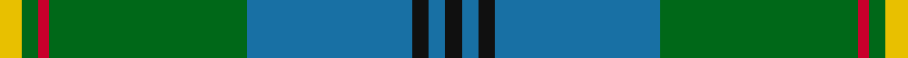
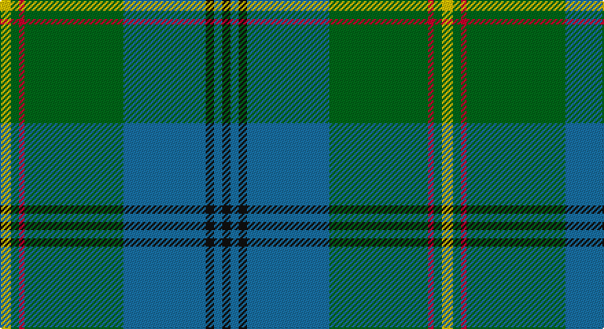

This page is one **sett** — a single exact thread-count. It belongs to the [tartan](/setts/ly4g3r2g36b30k3b3k3/)
(the same proportion at any scale), whose colour order is pattern [KBKBGRGY](/stripes/kbkbgrgy/).

Sourced from register-of-tartans.  It is a [8 stripe tartan](/stripes/stripes8/).

Original link https://www.tartanregister.gov.uk/tartanDetails.aspx?ref=4862

## Also known as

This cloth is also recorded under:

- Chartered Accountants of Scotland (C

2 attestations — the source records this cloth was collapsed from (oldest owns this page)

<ul>
<li>undated — Chartered Accountants of Scotland (register-of-tartans, <a href="https://www.tartanregister.gov.uk/tartanDetails.aspx?ref=4862">record</a>)</li>
<li>Unknown — Chartered Accountants of Scotland (C (tartans-authority, <a href="http://www.tartansauthority.com/tartan-ferret/display/3950/">record</a>)</li>
</ul>

## Register references

External register numbers recorded for this tartan.

- Scottish Register of Tartans: [4862](https://www.tartanregister.gov.uk/tartanDetails.aspx?ref=4862)
- Scottish Tartans Authority (ITI): 3950

## Thread count
Y/8 G6 R4 G72 B60 K6 B6 K/6

One full sett is **322 threads**.

## Palette

Palette: <strong>Tartan Register</strong>
<table><thead><tr><th>Colour</th><th>Threads</th><th>Shade</th><th>Base</th><th>OKLCh</th></tr></thead><tbody><tr><td>Y/</td><td style="text-align:right;font-variant-numeric:tabular-nums">8</td><td><code style="background-color:#E8C000;">#E8C000</code> <small style="color:#888">#E8C000</small></td><td>Y <code style="background-color:#F2BF00;">#F2BF00</code></td><td><small style="color:#888">oklch(81.9% 0.168 93.7)</small></td></tr><tr><td>G</td><td style="text-align:right;font-variant-numeric:tabular-nums">6</td><td><code style="background-color:#006818;">#006818</code> <small style="color:#888">#006818</small></td><td>G <code style="background-color:#006100;">#006100</code></td><td><small style="color:#888">oklch(45.0% 0.142 145.0)</small></td></tr><tr><td>R</td><td style="text-align:right;font-variant-numeric:tabular-nums">4</td><td><code style="background-color:#C8002C;">#C8002C</code> <small style="color:#888">#C8002C</small></td><td>R <code style="background-color:#CC0000;">#CC0000</code></td><td><small style="color:#888">oklch(52.6% 0.212 22.0)</small></td></tr><tr><td>G</td><td style="text-align:right;font-variant-numeric:tabular-nums">72</td><td><code style="background-color:#006818;">#006818</code> <small style="color:#888">#006818</small></td><td>G <code style="background-color:#006100;">#006100</code></td><td><small style="color:#888">oklch(45.0% 0.142 145.0)</small></td></tr><tr><td>B</td><td style="text-align:right;font-variant-numeric:tabular-nums">60</td><td><code style="background-color:#1870A4;">#1870A4</code> <small style="color:#888">#1870A4</small></td><td>B <code style="background-color:#2A418A;">#2A418A</code></td><td><small style="color:#888">oklch(52.2% 0.113 241.2)</small></td></tr><tr><td>K</td><td style="text-align:right;font-variant-numeric:tabular-nums">6</td><td><code style="background-color:#101010;">#101010</code> <small style="color:#888">#101010</small></td><td>K <code style="background-color:#000000;">#000000</code></td><td><small style="color:#888">oklch(17.3% 0.000 89.9)</small></td></tr><tr><td>B</td><td style="text-align:right;font-variant-numeric:tabular-nums">6</td><td><code style="background-color:#1870A4;">#1870A4</code> <small style="color:#888">#1870A4</small></td><td>B <code style="background-color:#2A418A;">#2A418A</code></td><td><small style="color:#888">oklch(52.2% 0.113 241.2)</small></td></tr><tr><td>K/</td><td style="text-align:right;font-variant-numeric:tabular-nums">6</td><td><code style="background-color:#101010;">#101010</code> <small style="color:#888">#101010</small></td><td>K <code style="background-color:#000000;">#000000</code></td><td><small style="color:#888">oklch(17.3% 0.000 89.9)</small></td></tr></tbody></table>

# Sample pattern

## Nearest tartans

The nearest existing variants by ΔTartan distance, with this tartan at the top so the swatches line up against it.

ΔTartan

Tartan

Sett

—

<a href="/ttd/edit/#slug=ly4g3r2g36b30k3b3k3~x2">Chartered Accountants of Scotland</a> <a class="nn-out" href="/variants/s8/ly4g3r2g36b30k3b3k3~x2/" title="open its dictionary page">↗</a>

0.65

<a href="/ttd/edit/#slug=r4k2g36k2b18ly3b18k2~x2&amp;base=ly4g3r2g36b30k3b3k3~x2">Fox Hunting</a> <a class="nn-out" href="/variants/s8/r4k2g36k2b18ly3b18k2~x2/" title="open its dictionary page">↗</a>

0.97

<a href="/ttd/edit/#slug=db3r3db36g17ly2g21w2r3~x2&amp;base=ly4g3r2g36b30k3b3k3~x2">Singh</a> <a class="nn-out" href="/variants/s8/db3r3db36g17ly2g21w2r3~x2/" title="open its dictionary page">↗</a>

1.09

<a href="/ttd/edit/#slug=t24k2r2t2db12g28r4g5t3g3~x2&amp;base=ly4g3r2g36b30k3b3k3~x2">Downie (Name)</a> <a class="nn-out" href="/variants/s10/t24k2r2t2db12g28r4g5t3g3~x2/" title="open its dictionary page">↗</a>

1.21

<a href="/ttd/edit/#slug=g2r2t21db2t2db6t2db2g33r2t2~x2&amp;base=ly4g3r2g36b30k3b3k3~x2">Maine State District Tartan</a> <a class="nn-out" href="/variants/s11/g2r2t21db2t2db6t2db2g33r2t2~x2/" title="open its dictionary page">↗</a>

1.22

<a href="/ttd/edit/#slug=g16k1t2k1g3k5n12k1ly1k3~x4&amp;base=ly4g3r2g36b30k3b3k3~x2">Hope-Vere (Lochcarron)</a> <a class="nn-out" href="/variants/s10/g16k1t2k1g3k5n12k1ly1k3~x4/" title="open its dictionary page">↗</a>

1.22

<a href="/ttd/edit/#slug=g18w1g4w1ly4dg1ly2dg12r2dg4~x2&amp;base=ly4g3r2g36b30k3b3k3~x2">Michigan, State of</a> <a class="nn-out" href="/variants/s10/g18w1g4w1ly4dg1ly2dg12r2dg4~x2/" title="open its dictionary page">↗</a>

1.25

<a href="/ttd/edit/#slug=k3g36db28r2db2ly3~x2&amp;base=ly4g3r2g36b30k3b3k3~x2">Carmichael</a> <a class="nn-out" href="/variants/s6/k3g36db28r2db2ly3~x2/" title="open its dictionary page">↗</a>

1.25

<a href="/ttd/edit/#slug=r2t1r1t11g16dg1w1~x2&amp;base=ly4g3r2g36b30k3b3k3~x2">Gift of Life Michigan (Corporate)</a> <a class="nn-out" href="/variants/s7/r2t1r1t11g16dg1w1~x2/" title="open its dictionary page">↗</a>

1.25

<a href="/ttd/edit/#slug=w9dg2g2w3g18k2dg33lo2~x2&amp;base=ly4g3r2g36b30k3b3k3~x2">New World Irish (Fashion)</a> <a class="nn-out" href="/variants/s8/w9dg2g2w3g18k2dg33lo2~x2/" title="open its dictionary page">↗</a>

1.30

<a href="/ttd/edit/#slug=g28r2g2r2g8db24y3r2~x2&amp;base=ly4g3r2g36b30k3b3k3~x2">Leatherneck, U.S.Marine Corps</a> <a class="nn-out" href="/variants/s8/g28r2g2r2g8db24y3r2~x2/" title="open its dictionary page">↗</a>

## Neighbour map

Every grey dot is one of 14360 variants placed by the first two principal components of the ΔTartan feature space (44% of its variance). Red is this tartan; blue dots are its nearest — click one to open its page.

<svg viewBox="0 0 640 380" role="img" style="max-width:100%;height:auto;border:1px solid #e0e0e0;border-radius:4px;display:block" xmlns="http://www.w3.org/2000/svg"><image href="/nn/cloud.v1.png" width="640" height="380"/><a href="/variants/s8/r4k2g36k2b18ly3b18k2~x2/"><circle cx="270.9" cy="163.7" r="4" fill="#3465a4"><title>Fox Hunting</title></circle></a><a href="/variants/s8/db3r3db36g17ly2g21w2r3~x2/"><circle cx="281.0" cy="157.0" r="4" fill="#3465a4"><title>Singh</title></circle></a><a href="/variants/s10/t24k2r2t2db12g28r4g5t3g3~x2/"><circle cx="243.5" cy="160.6" r="4" fill="#3465a4"><title>Downie (Name)</title></circle></a><a href="/variants/s11/g2r2t21db2t2db6t2db2g33r2t2~x2/"><circle cx="316.6" cy="153.1" r="4" fill="#3465a4"><title>Maine State District Tartan</title></circle></a><a href="/variants/s10/g16k1t2k1g3k5n12k1ly1k3~x4/"><circle cx="253.3" cy="163.8" r="4" fill="#3465a4"><title>Hope-Vere (Lochcarron)</title></circle></a><a href="/variants/s10/g18w1g4w1ly4dg1ly2dg12r2dg4~x2/"><circle cx="268.2" cy="148.6" r="4" fill="#3465a4"><title>Michigan, State of</title></circle></a><a href="/variants/s6/k3g36db28r2db2ly3~x2/"><circle cx="296.0" cy="164.0" r="4" fill="#3465a4"><title>Carmichael</title></circle></a><a href="/variants/s7/r2t1r1t11g16dg1w1~x2/"><circle cx="289.0" cy="156.9" r="4" fill="#3465a4"><title>Gift of Life Michigan (Corporate)</title></circle></a><a href="/variants/s8/w9dg2g2w3g18k2dg33lo2~x2/"><circle cx="269.8" cy="150.2" r="4" fill="#3465a4"><title>New World Irish (Fashion)</title></circle></a><a href="/variants/s8/g28r2g2r2g8db24y3r2~x2/"><circle cx="340.8" cy="187.4" r="4" fill="#3465a4"><title>Leatherneck, U.S.Marine Corps</title></circle></a><circle cx="303.9" cy="159.7" r="5" fill="#c00000"/></svg>

ID: /variants/s8/ly4g3r2g36b30k3b3k3~x2/
