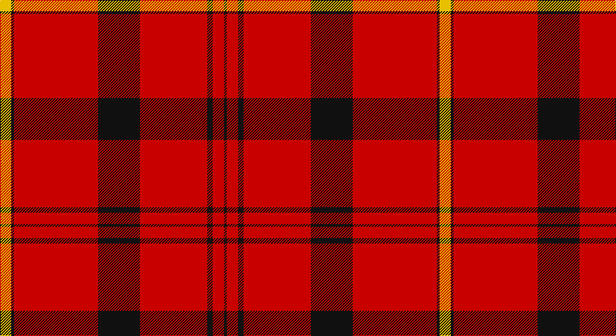

This page is one **sett** — a single exact thread-count. It belongs to the [tartan](/setts/ly4k1r30k15r24k2r4k1/)
(the same proportion at any scale), whose colour order is pattern [KRKRKRKY](/stripes/krkrkrky/).

Part of the [Oilmens](/tartans/oilmens/) tartan — the named design grouping this sett with its other cloths.

Sourced from tartans-authority.  It is a [8 stripe tartan](/stripes/stripes8/).

Original link http://www.tartansauthority.com/tartan-ferret/display/3843/

## Provenance

Earliest known date: pre 1992 Genuinely asymmetrical design by Don Barkwell. No further details.

## Also known as

This cloth is also recorded under:

- Barkwell, The

3 attestations — the source records this cloth was collapsed from (oldest owns this page)

<ul>
<li>pre 2002 — Oilmens (Corporate) (tartans-authority, <a href="http://www.tartansauthority.com/tartan-ferret/display/3843/">record</a>)</li>
<li>undated — Barkwell, The (weddslist, <a href="http://www.weddslist.com/cgi-bin/tartans/pg.pl?source=sts">record</a>)</li>
<li>undated — Oilmens Corporate Tartan (house-of-tartan, <a href="http://www.house-of-tartan.scotland.net/house/TartanViewjs.asp?colr=Def&tnam=2044">record</a>)</li>
</ul>

## Register references

External register numbers recorded for this tartan.

- Scottish Tartans Authority (ITI): 3843

## Thread count
Y/16 K4 R120 K60 R96 K8 R16 K/4

One full sett is **628 threads**.

## Palette

Palette: <strong>Tartan Register</strong>
<table><thead><tr><th>Colour</th><th>Threads</th><th>Shade</th><th>Base</th><th>OKLCh</th></tr></thead><tbody><tr><td>Y/</td><td style="text-align:right;font-variant-numeric:tabular-nums">16</td><td><code style="background-color:#E8C000;">#E8C000</code> <small style="color:#888">#E8C000</small></td><td>Y <code style="background-color:#F2BF00;">#F2BF00</code></td><td><small style="color:#888">oklch(81.9% 0.168 93.7)</small></td></tr><tr><td>K</td><td style="text-align:right;font-variant-numeric:tabular-nums">4</td><td><code style="background-color:#101010;">#101010</code> <small style="color:#888">#101010</small></td><td>K <code style="background-color:#000000;">#000000</code></td><td><small style="color:#888">oklch(17.3% 0.000 89.9)</small></td></tr><tr><td>R</td><td style="text-align:right;font-variant-numeric:tabular-nums">120</td><td><code style="background-color:#C80000;">#C80000</code> <small style="color:#888">#C80000</small></td><td>R <code style="background-color:#CC0000;">#CC0000</code></td><td><small style="color:#888">oklch(52.3% 0.215 29.2)</small></td></tr><tr><td>K</td><td style="text-align:right;font-variant-numeric:tabular-nums">60</td><td><code style="background-color:#101010;">#101010</code> <small style="color:#888">#101010</small></td><td>K <code style="background-color:#000000;">#000000</code></td><td><small style="color:#888">oklch(17.3% 0.000 89.9)</small></td></tr><tr><td>R</td><td style="text-align:right;font-variant-numeric:tabular-nums">96</td><td><code style="background-color:#C80000;">#C80000</code> <small style="color:#888">#C80000</small></td><td>R <code style="background-color:#CC0000;">#CC0000</code></td><td><small style="color:#888">oklch(52.3% 0.215 29.2)</small></td></tr><tr><td>K</td><td style="text-align:right;font-variant-numeric:tabular-nums">8</td><td><code style="background-color:#101010;">#101010</code> <small style="color:#888">#101010</small></td><td>K <code style="background-color:#000000;">#000000</code></td><td><small style="color:#888">oklch(17.3% 0.000 89.9)</small></td></tr><tr><td>R</td><td style="text-align:right;font-variant-numeric:tabular-nums">16</td><td><code style="background-color:#C80000;">#C80000</code> <small style="color:#888">#C80000</small></td><td>R <code style="background-color:#CC0000;">#CC0000</code></td><td><small style="color:#888">oklch(52.3% 0.215 29.2)</small></td></tr><tr><td>K/</td><td style="text-align:right;font-variant-numeric:tabular-nums">4</td><td><code style="background-color:#101010;">#101010</code> <small style="color:#888">#101010</small></td><td>K <code style="background-color:#000000;">#000000</code></td><td><small style="color:#888">oklch(17.3% 0.000 89.9)</small></td></tr></tbody></table>

# Sample pattern

## Compared to the master

This cloth is one sett of its design; the master sett (the exemplar the design is anchored on) is below for comparison.

<figure style="margin:0"><figcaption style="color:#888;font-size:smaller">this sett</figcaption></figure>
<figure style="margin:0"><figcaption style="color:#888;font-size:smaller"><a href="/setts/r4k2r24k15r30k1ly4k1r30k15r24k2r4k1/">master sett →</a></figcaption></figure>

## Nearest tartans

The nearest existing variants by ΔTartan distance, with this tartan at the top so the swatches line up against it.

ΔTartan

Tartan

Sett

—

<a href="/ttd/edit/#slug=ly4k1r30k15r24k2r4k1~x4">Oilmens (Corporate)</a> <a class="nn-out" href="/variants/s8/ly4k1r30k15r24k2r4k1~x4/" title="open its dictionary page">↗</a>

1.10

<a href="/ttd/edit/#slug=r18g1k5g1k1g1r9~x2&amp;base=ly4k1r30k15r24k2r4k1~x4">Duke of Sussex</a> <a class="nn-out" href="/variants/s7/r18g1k5g1k1g1r9~x2/" title="open its dictionary page">↗</a>

1.12

<a href="/ttd/edit/#slug=r20k1ly3k1r60k30r48k4~x2&amp;base=ly4k1r30k15r24k2r4k1~x4">Barkwell (Personal)</a> <a class="nn-out" href="/variants/s8/r20k1ly3k1r60k30r48k4~x2/" title="open its dictionary page">↗</a>

1.15

<a href="/variants/s8/k22w1k12r43w1~x2/">Knights Templar Hunting</a>

1.22

<a href="/ttd/edit/#slug=r4k2r24k15r30k1ly4k1r30k15r24k2r4k1~x4&amp;base=ly4k1r30k15r24k2r4k1~x4">Oilmens</a> <a class="nn-out" href="/variants/s14/r4k2r24k15r30k1ly4k1r30k15r24k2r4k1~x4/" title="open its dictionary page">↗</a>

1.23

<a href="/ttd/edit/#slug=r58ly3r6dg16r12dg16r6&amp;base=ly4k1r30k15r24k2r4k1~x4">Cameron Ancient</a> <a class="nn-out" href="/variants/s7/r58ly3r6dg16r12dg16r6/" title="open its dictionary page">↗</a>

1.24

<a href="/ttd/edit/#slug=r51o2r6k10r2k4o3k3~x2&amp;base=ly4k1r30k15r24k2r4k1~x4">Virgin</a> <a class="nn-out" href="/variants/s8/r51o2r6k10r2k4o3k3~x2/" title="open its dictionary page">↗</a>

1.42

<a href="/ttd/edit/#slug=r3dg16r4k6r28dg1r3~x2&amp;base=ly4k1r30k15r24k2r4k1~x4">Maxwell Ancient</a> <a class="nn-out" href="/variants/s7/r3dg16r4k6r28dg1r3~x2/" title="open its dictionary page">↗</a>

1.43

<a href="/ttd/edit/#slug=k4r4ly2r41k4r4k12w2~x2&amp;base=ly4k1r30k15r24k2r4k1~x4">Aberdeen Football Club (2002)</a> <a class="nn-out" href="/variants/s8/k4r4ly2r41k4r4k12w2~x2/" title="open its dictionary page">↗</a>

1.51

<a href="/ttd/edit/#slug=r5db10r5dg5r25ly1~x4&amp;base=ly4k1r30k15r24k2r4k1~x4">AON</a> <a class="nn-out" href="/variants/s6/r5db10r5dg5r25ly1~x4/" title="open its dictionary page">↗</a>

1.53

<a href="/ttd/edit/#slug=g4r32db9r6db2r3db2r12w3~x2&amp;base=ly4k1r30k15r24k2r4k1~x4">Rose</a> <a class="nn-out" href="/variants/s9/g4r32db9r6db2r3db2r12w3~x2/" title="open its dictionary page">↗</a>

## Neighbour map

Every grey dot is one of 14360 variants placed by the first two principal components of the ΔTartan feature space (44% of its variance). Red is this tartan; blue dots are its nearest — click one to open its page.

<svg viewBox="0 0 640 380" role="img" style="max-width:100%;height:auto;border:1px solid #e0e0e0;border-radius:4px;display:block" xmlns="http://www.w3.org/2000/svg"><image href="/nn/cloud.v1.png" width="640" height="380"/><a href="/variants/s7/r18g1k5g1k1g1r9~x2/"><circle cx="486.9" cy="155.9" r="4" fill="#3465a4"><title>Duke of Sussex</title></circle></a><a href="/variants/s8/r20k1ly3k1r60k30r48k4~x2/"><circle cx="559.2" cy="132.6" r="4" fill="#3465a4"><title>Barkwell (Personal)</title></circle></a><a href="/variants/s8/k22w1k12r43w1~x2/"><circle cx="448.6" cy="136.8" r="4" fill="#3465a4"><title>Knights Templar Hunting</title></circle></a><a href="/variants/s14/r4k2r24k15r30k1ly4k1r30k15r24k2r4k1~x4/"><circle cx="500.5" cy="129.4" r="4" fill="#3465a4"><title>Oilmens</title></circle></a><a href="/variants/s7/r58ly3r6dg16r12dg16r6/"><circle cx="487.3" cy="173.3" r="4" fill="#3465a4"><title>Cameron Ancient</title></circle></a><a href="/variants/s8/r51o2r6k10r2k4o3k3~x2/"><circle cx="516.5" cy="117.3" r="4" fill="#3465a4"><title>Virgin</title></circle></a><a href="/variants/s7/r3dg16r4k6r28dg1r3~x2/"><circle cx="427.3" cy="156.4" r="4" fill="#3465a4"><title>Maxwell Ancient</title></circle></a><a href="/variants/s8/k4r4ly2r41k4r4k12w2~x2/"><circle cx="433.9" cy="116.1" r="4" fill="#3465a4"><title>Aberdeen Football Club (2002)</title></circle></a><a href="/variants/s6/r5db10r5dg5r25ly1~x4/"><circle cx="452.5" cy="166.3" r="4" fill="#3465a4"><title>AON</title></circle></a><a href="/variants/s9/g4r32db9r6db2r3db2r12w3~x2/"><circle cx="461.9" cy="145.7" r="4" fill="#3465a4"><title>Rose</title></circle></a><circle cx="491.9" cy="144.2" r="5" fill="#c00000"/></svg>

ID: /variants/s8/ly4k1r30k15r24k2r4k1~x4/
