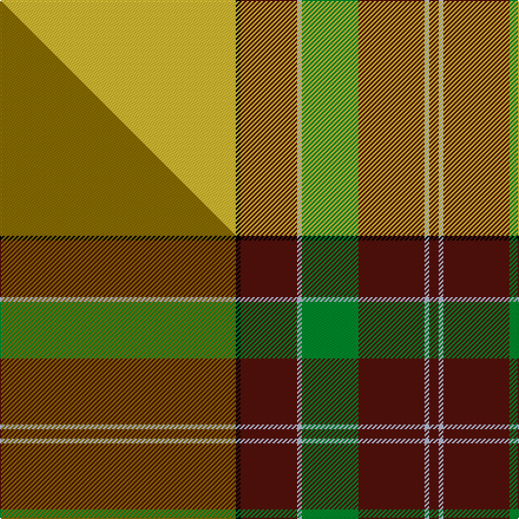

This is one **variant** — a specific cloth: this exact thread count and colourway, with its own
provenance below. It is one weaving of the [sett](/setts/ly50k1dr12lb1g12dr14lb1dr2/) (the scale-free proportion — the
same cloth at any scale or shade), whose colour order is pattern [BWBGWBKY](/stripes/bwbgwbky/).

Part of the [MacByrd](/tartans/m/ma/macbyrd/) tartan — the named design grouping this sett with its other cloths.

Sourced from tartans-authority.  It is a [8 stripe tartan](/stripes/stripes8/).

Original link [https://www.tartanregister.gov.uk/tartanDetails.aspx?ref=3323](https://www.tartanregister.gov.uk/tartanDetails.aspx?ref=3323)

Dataset <small>— provenance for this record, inherited from the source manifest</small>

<dl class="dataset-prov">
<dt>source</dt><dd><a href="/sources/tartans-authority/">Scottish Tartans Authority</a></dd>
<dt>data captured from</dt><dd><a href="https://github.com/thetartan/tartan-database/blob/master/data/tartans-authority/data.csv">https://github.com/thetartan/tartan-database/blob/master/data/tartans-authority/data.csv</a></dd>
<dt>data date</dt><dd>pre 1984 <small>(this record)</small></dd>
<dt>licence</dt><dd><a href="https://creativecommons.org/licenses/by-nc-nd/4.0/">CC BY-NC-ND 4.0</a></dd>
</dl>

Capture chain <small>— the hands this data passed through, oldest first; each capture carries its own licence</small>

<ol class="capture-chain">
<li><a href="https://www.tartansauthority.com/">Scottish Tartans Authority</a> <small>the heritage body's archive — its tartan-ferret record browser is retired (links repaired to the SRT, above)</small></li>
<li><a href="https://github.com/thetartan/tartan-database">thetartan/tartan-database</a> <small>2016-2017</small> · <a href="https://creativecommons.org/licenses/by-nc-nd/4.0/">CC BY-NC-ND 4.0</a> <small>Levko Kravets's frozen compilation — the capture we vendored, and where its CC licence text came from</small></li>
<li>this dictionary <small>captured 2026-06-10 · commit 5bf86c7566</small> <small>each re-capture is a git commit to data/sources</small></li>
</ol>

## Register references

External register numbers recorded for this tartan.

- Scottish Tartans Authority (ITI): 3323

## Thread count
LY/200 K4 DR48 LB4 G48 DR56 LB4 DR/8

One full sett is **536 threads**.

## Palette
<table><thead><tr><th>Colour</th><th>Shade</th><th>OKLCh</th></tr></thead><tbody><tr><td>DR</td><td><code style="background-color:#55120C;">#55120C</code> <small style="color:#888">#55120C</small></td><td><small style="color:#888">oklch(30.0% 0.099 29.3)</small></td></tr><tr><td>G</td><td><code style="background-color:#008B2A;">#008B2A</code> <small style="color:#888">#008B2A</small></td><td><small style="color:#888">oklch(55.4% 0.170 145.9)</small></td></tr><tr><td>K</td><td><code style="background-color:#000000;">#000000</code> <small style="color:#888">#000000</small></td><td><small style="color:#888">oklch(0.0% 0.000 0.0)</small></td></tr><tr><td>LY</td><td><code style="background-color:#DCBC32;">#DCBC32</code> <small style="color:#888">#DCBC32</small></td><td><small style="color:#888">oklch(80.0% 0.150 95.2)</small></td></tr><tr><td>LB</td><td><code style="background-color:#B5BBDE;">#B5BBDE</code> <small style="color:#888">#B5BBDE</small></td><td><small style="color:#888">oklch(79.9% 0.050 277.6)</small></td></tr></tbody></table>

# Sample pattern

## Compared to the master

This cloth is one sett of its design; the master sett (the exemplar the design is anchored on) is below for comparison.

Its **ΔTartan distance** from the master is **0.19** — the same measure the nearest-tartans table ranks by (0 is identical; a re-scale of the same cloth is near 0, a recolour or a different proportion further).

<figure class="master-compare" style="margin:0">

this sett
master sett ★

<figcaption style="color:#888;font-size:smaller">One weave of this sett against the <a href="/setts/y50k1dr12lb1g12dr14lb1dr2/">master sett ★</a>, split on the diagonal: a shared proportion runs seamlessly across it with only the shades shifting; a different proportion breaks on it.</figcaption>
</figure>

## Nearest tartan variants

The nearest existing variants by ΔTartan distance, with this cloth at the top so the swatches line up against it.

ΔTartan

Threads

Variant

Sett

—

536

<a href="/variants/s8/ly50k1dr12lb1g12dr14lb1dr2~x4/">MacByrd (Personal)</a>

<a href="/ttd/edit/#slug=ly57k1r12w1g12r14w1r2~x2&amp;base=ly50k1dr12lb1g12dr14lb1dr2~x4" title="compare in the TTD">0.80</a>

282

<a href="/variants/s8/ly57k1r12w1g12r14w1r2~x2/">MacBrair Hunting</a>

<a href="/ttd/edit/#slug=g18w3y1r2y1r3y1r10~x4&amp;base=ly50k1dr12lb1g12dr14lb1dr2~x4" title="compare in the TTD">2.16</a>

200

<a href="/variants/s8/g18w3y1r2y1r3y1r10~x4/">Brisbane (Artefact)</a>

<a href="/ttd/edit/#slug=r3w5dy16ly2dy1ly40w6n3r2~x4&amp;base=ly50k1dr12lb1g12dr14lb1dr2~x4" title="compare in the TTD">2.34</a>

604

<a href="/variants/s9/r3w5dy16ly2dy1ly40w6n3r2~x4/">Bell's Whisky (Corporate)</a>

<a href="/ttd/edit/#slug=r3w5dy16ly2dy1ly40w6o3r2~x4~ly2705081-o2500000&amp;base=ly50k1dr12lb1g12dr14lb1dr2~x4" title="compare in the TTD">2.46</a>

604

<a href="/variants/s9/r3w5dy16ly2dy1ly40w6o3r2~x4~ly2705081-o2500000/">Bell's Whisky</a>

<a href="/ttd/edit/#slug=ly36k3r6k3dy10r5dy3y4k1ly2~x2&amp;base=ly50k1dr12lb1g12dr14lb1dr2~x4" title="compare in the TTD">2.59</a>

216

<a href="/variants/s10/ly36k3r6k3dy10r5dy3y4k1ly2~x2/">Mead (Tennessee) Hunting (Personal)</a>

<a href="/ttd/edit/#slug=lo32k6r1lr1r1k4dg8lo1dg3~x4&amp;base=ly50k1dr12lb1g12dr14lb1dr2~x4" title="compare in the TTD">3.23</a>

316

<a href="/variants/s9/lo32k6r1lr1r1k4dg8lo1dg3~x4/">Durango</a>

<a href="/ttd/edit/#slug=k2r2k2r24g31k1g2y2~x2&amp;base=ly50k1dr12lb1g12dr14lb1dr2~x4" title="compare in the TTD">3.29</a>

256

<a href="/variants/s8/k2r2k2r24g31k1g2y2~x2/">Gleneil</a>

<a href="/ttd/edit/#slug=ly62dr12g1dgi4dg2dgi4g1dr12dg12~x2~g2408144-dgi1806142&amp;base=ly50k1dr12lb1g12dr14lb1dr2~x4" title="compare in the TTD">3.38</a>

292

<a href="/variants/s9/ly62dr12g1dgi4dg2dgi4g1dr12dg12~x2~g2408144-dgi1806142/">Roast Den, The</a>

<a href="/ttd/edit/#slug=g71k4r4db9r4db4r36db4w4&amp;base=ly50k1dr12lb1g12dr14lb1dr2~x4" title="compare in the TTD">3.53</a>

205

<a href="/variants/s9/g71k4r4db9r4db4r36db4w4/">Rattray Family Tartan</a>

<a href="/ttd/edit/#slug=g71k4r4db9r4db4r36db4w4~x2&amp;base=ly50k1dr12lb1g12dr14lb1dr2~x4" title="compare in the TTD">3.53</a>

410

<a href="/variants/s9/g71k4r4db9r4db4r36db4w4~x2/">Rattay</a>

## Neighbour map

Every grey dot is one of 13621 variants placed by the first two principal components of the ΔTartan feature space (42% of its variance). Red is this tartan; blue dots are its nearest — click one to open its page.

<svg viewBox="0 0 640 380" role="img" style="max-width:100%;height:auto;border:1px solid #e0e0e0;border-radius:4px;display:block" xmlns="http://www.w3.org/2000/svg"><image href="/nn/cloud.v1.png" width="640" height="380"/><a href="/variants/s8/ly57k1r12w1g12r14w1r2~x2/"><circle cx="366.1" cy="81.6" r="4" fill="#3465a4"><title>MacBrair Hunting</title></circle></a><a href="/variants/s8/g18w3y1r2y1r3y1r10~x4/"><circle cx="308.2" cy="162.5" r="4" fill="#3465a4"><title>Brisbane (Artefact)</title></circle></a><a href="/variants/s9/r3w5dy16ly2dy1ly40w6n3r2~x4/"><circle cx="306.1" cy="91.0" r="4" fill="#3465a4"><title>Bell's Whisky (Corporate)</title></circle></a><a href="/variants/s9/r3w5dy16ly2dy1ly40w6o3r2~x4~ly2705081-o2500000/"><circle cx="323.2" cy="93.8" r="4" fill="#3465a4"><title>Bell's Whisky</title></circle></a><a href="/variants/s10/ly36k3r6k3dy10r5dy3y4k1ly2~x2/"><circle cx="250.9" cy="70.2" r="4" fill="#3465a4"><title>Mead (Tennessee) Hunting (Personal)</title></circle></a><a href="/variants/s9/lo32k6r1lr1r1k4dg8lo1dg3~x4/"><circle cx="288.5" cy="66.9" r="4" fill="#3465a4"><title>Durango</title></circle></a><a href="/variants/s8/k2r2k2r24g31k1g2y2~x2/"><circle cx="315.1" cy="107.4" r="4" fill="#3465a4"><title>Gleneil</title></circle></a><a href="/variants/s9/ly62dr12g1dgi4dg2dgi4g1dr12dg12~x2~g2408144-dgi1806142/"><circle cx="353.0" cy="91.2" r="4" fill="#3465a4"><title>Roast Den, The</title></circle></a><a href="/variants/s9/g71k4r4db9r4db4r36db4w4/"><circle cx="266.4" cy="109.3" r="4" fill="#3465a4"><title>Rattray Family Tartan</title></circle></a><a href="/variants/s9/g71k4r4db9r4db4r36db4w4~x2/"><circle cx="266.4" cy="109.3" r="4" fill="#3465a4"><title>Rattay</title></circle></a><circle cx="310.5" cy="80.2" r="5" fill="#c00000"/><text x="320" y="376" text-anchor="middle" font-size="11" fill="#999">ground</text><text x="11" y="190" text-anchor="middle" font-size="11" fill="#999" transform="rotate(-90 11 190)">complexity</text></svg>

ID: /variants/s8/ly50k1dr12lb1g12dr14lb1dr2~x4/
