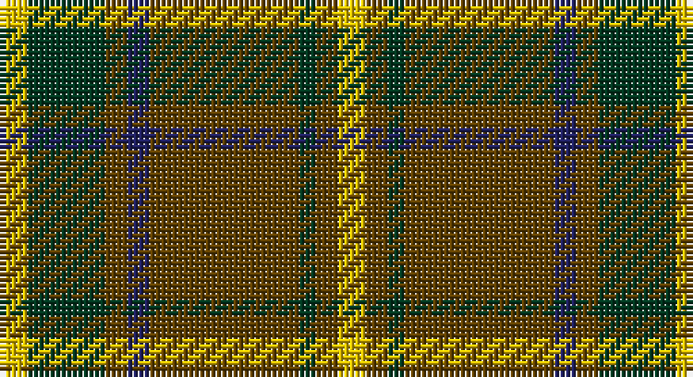

This page is one **sett** — a single exact thread-count. It belongs to the [tartan](/setts/ly5dg14dy4db4dy27dg3dy4ly5/)
(the same proportion at any scale), whose colour order is pattern [YGGBGGGY](/stripes/yggbgggy/).

Part of the [Invertere](/tartans/invertere/) tartan — the named design grouping this sett with its other cloths.

Sourced from house-of-tartan.  It is a [8 stripe tartan](/stripes/stripes8/).

Original link http://www.house-of-tartan.scotland.net/house/TartanViewjs.asp?colr=Def&tnam=1882

## Provenance

Earliest known date: 1988 Overstripes are yellow in warp

## Also known as

This cloth is also recorded under:

- Invertere,

## Thread count
Y/5 DG14 T4 DB4 T27 DG3 T4 Y/5

One full sett is **122 threads**.

## Palette

Palette: <strong>Tartan Register</strong>
<table><thead><tr><th>Colour</th><th>Threads</th><th>Shade</th><th>Base</th><th>OKLCh</th></tr></thead><tbody><tr><td>Y/</td><td style="text-align:right;font-variant-numeric:tabular-nums">5</td><td><code style="background-color:#E8C000;">#E8C000</code> <small style="color:#888">#E8C000</small></td><td>Y <code style="background-color:#F2BF00;">#F2BF00</code></td><td><small style="color:#888">oklch(81.9% 0.168 93.7)</small></td></tr><tr><td>DG</td><td style="text-align:right;font-variant-numeric:tabular-nums">14</td><td><code style="background-color:#003820;">#003820</code> <small style="color:#888">#003820</small></td><td>G <code style="background-color:#006100;">#006100</code></td><td><small style="color:#888">oklch(30.0% 0.070 158.3)</small></td></tr><tr><td>T</td><td style="text-align:right;font-variant-numeric:tabular-nums">4</td><td><code style="background-color:#604000;">#604000</code> <small style="color:#888">#604000</small></td><td>G <code style="background-color:#006100;">#006100</code></td><td><small style="color:#888">oklch(39.8% 0.083 76.8)</small></td></tr><tr><td>DB</td><td style="text-align:right;font-variant-numeric:tabular-nums">4</td><td><code style="background-color:#202060;">#202060</code> <small style="color:#888">#202060</small></td><td>B <code style="background-color:#2A418A;">#2A418A</code></td><td><small style="color:#888">oklch(28.9% 0.111 276.9)</small></td></tr><tr><td>T</td><td style="text-align:right;font-variant-numeric:tabular-nums">27</td><td><code style="background-color:#604000;">#604000</code> <small style="color:#888">#604000</small></td><td>G <code style="background-color:#006100;">#006100</code></td><td><small style="color:#888">oklch(39.8% 0.083 76.8)</small></td></tr><tr><td>DG</td><td style="text-align:right;font-variant-numeric:tabular-nums">3</td><td><code style="background-color:#003820;">#003820</code> <small style="color:#888">#003820</small></td><td>G <code style="background-color:#006100;">#006100</code></td><td><small style="color:#888">oklch(30.0% 0.070 158.3)</small></td></tr><tr><td>T</td><td style="text-align:right;font-variant-numeric:tabular-nums">4</td><td><code style="background-color:#604000;">#604000</code> <small style="color:#888">#604000</small></td><td>G <code style="background-color:#006100;">#006100</code></td><td><small style="color:#888">oklch(39.8% 0.083 76.8)</small></td></tr><tr><td>Y/</td><td style="text-align:right;font-variant-numeric:tabular-nums">5</td><td><code style="background-color:#E8C000;">#E8C000</code> <small style="color:#888">#E8C000</small></td><td>Y <code style="background-color:#F2BF00;">#F2BF00</code></td><td><small style="color:#888">oklch(81.9% 0.168 93.7)</small></td></tr></tbody></table>

# Sample pattern

## Compared to the master

This cloth is one sett of its design; the master sett (the exemplar the design is anchored on) is below for comparison.

<figure style="margin:0"><figcaption style="color:#888;font-size:smaller">this sett</figcaption></figure>
<figure style="margin:0"><figcaption style="color:#888;font-size:smaller"><a href="/setts/dg6lo2db2lo11dg2lo2m3lo2dg2lo11db2lo2dg6m3/">master sett →</a></figcaption></figure>

## Nearest tartans

The nearest existing variants by ΔTartan distance, with this tartan at the top so the swatches line up against it.

ΔTartan

Tartan

Sett

—

<a href="/ttd/edit/#slug=ly5dg14dy4db4dy27dg3dy4ly5">Invertere Corporate Tartan</a> <a class="nn-out" href="/variants/s8/ly5dg14dy4db4dy27dg3dy4ly5/" title="open its dictionary page">↗</a>

0.72

<a href="/ttd/edit/#slug=r3k2r3g12r3w1r1g1~x4&amp;base=ly5dg14dy4db4dy27dg3dy4ly5">MacCall/McCall</a> <a class="nn-out" href="/variants/s8/r3k2r3g12r3w1r1g1~x4/" title="open its dictionary page">↗</a>

0.78

<a href="/ttd/edit/#slug=k4lo15dg5k3dg7k3dg30r20dg3~x2&amp;base=ly5dg14dy4db4dy27dg3dy4ly5">MacKillen</a> <a class="nn-out" href="/variants/s9/k4lo15dg5k3dg7k3dg30r20dg3~x2/" title="open its dictionary page">↗</a>

0.87

<a href="/ttd/edit/#slug=ly5dg14o4db4o27dg3o4ly5~x2&amp;base=ly5dg14dy4db4dy27dg3dy4ly5">Invertere</a> <a class="nn-out" href="/variants/s8/ly5dg14o4db4o27dg3o4ly5~x2/" title="open its dictionary page">↗</a>

0.90

<a href="/ttd/edit/#slug=dg13ly2dg2ly2dg4r10g2r2~x4&amp;base=ly5dg14dy4db4dy27dg3dy4ly5">Oakwood</a> <a class="nn-out" href="/variants/s8/dg13ly2dg2ly2dg4r10g2r2~x4/" title="open its dictionary page">↗</a>

1.02

<a href="/ttd/edit/#slug=r4t3r32db30r4g32r3g32r3g3~x2&amp;base=ly5dg14dy4db4dy27dg3dy4ly5">Unidentified Plaid 6</a> <a class="nn-out" href="/variants/s10/r4t3r32db30r4g32r3g32r3g3~x2/" title="open its dictionary page">↗</a>

1.02

<a href="/ttd/edit/#slug=ly5g14dy4db4dy27g3dy4ly5~x2&amp;base=ly5dg14dy4db4dy27dg3dy4ly5">Invertere (Daks #2) (Fashion)</a> <a class="nn-out" href="/variants/s8/ly5g14dy4db4dy27g3dy4ly5~x2/" title="open its dictionary page">↗</a>

1.06

<a href="/ttd/edit/#slug=r6dg4do14w4do7dg30lo4~x2&amp;base=ly5dg14dy4db4dy27dg3dy4ly5">Newfoundland (District)</a> <a class="nn-out" href="/variants/s7/r6dg4do14w4do7dg30lo4~x2/" title="open its dictionary page">↗</a>

1.14

<a href="/ttd/edit/#slug=r6g4do14w4do7g30lo4~x2&amp;base=ly5dg14dy4db4dy27dg3dy4ly5">Newfoundland</a> <a class="nn-out" href="/variants/s7/r6g4do14w4do7g30lo4~x2/" title="open its dictionary page">↗</a>

1.17

<a href="/ttd/edit/#slug=t2dg1t1dg12r2dg1ri6ly2~x2&amp;base=ly5dg14dy4db4dy27dg3dy4ly5">Manitoba Red</a> <a class="nn-out" href="/variants/s8/t2dg1t1dg12r2dg1ri6ly2~x2/" title="open its dictionary page">↗</a>

1.17

<a href="/ttd/edit/#slug=r3g8r2g18m5g3dr3g3dr16g3dr3g3~x2&amp;base=ly5dg14dy4db4dy27dg3dy4ly5">Dublin</a> <a class="nn-out" href="/variants/s12/r3g8r2g18m5g3dr3g3dr16g3dr3g3~x2/" title="open its dictionary page">↗</a>

## Neighbour map

Every grey dot is one of 14360 variants placed by the first two principal components of the ΔTartan feature space (44% of its variance). Red is this tartan; blue dots are its nearest — click one to open its page.

<svg viewBox="0 0 640 380" role="img" style="max-width:100%;height:auto;border:1px solid #e0e0e0;border-radius:4px;display:block" xmlns="http://www.w3.org/2000/svg"><image href="/nn/cloud.v1.png" width="640" height="380"/><a href="/variants/s8/r3k2r3g12r3w1r1g1~x4/"><circle cx="307.1" cy="183.3" r="4" fill="#3465a4"><title>MacCall/McCall</title></circle></a><a href="/variants/s9/k4lo15dg5k3dg7k3dg30r20dg3~x2/"><circle cx="268.8" cy="197.1" r="4" fill="#3465a4"><title>MacKillen</title></circle></a><a href="/variants/s8/ly5dg14o4db4o27dg3o4ly5~x2/"><circle cx="270.4" cy="189.7" r="4" fill="#3465a4"><title>Invertere</title></circle></a><a href="/variants/s8/dg13ly2dg2ly2dg4r10g2r2~x4/"><circle cx="278.1" cy="217.6" r="4" fill="#3465a4"><title>Oakwood</title></circle></a><a href="/variants/s10/r4t3r32db30r4g32r3g32r3g3~x2/"><circle cx="260.7" cy="183.6" r="4" fill="#3465a4"><title>Unidentified Plaid 6</title></circle></a><a href="/variants/s8/ly5g14dy4db4dy27g3dy4ly5~x2/"><circle cx="277.8" cy="195.0" r="4" fill="#3465a4"><title>Invertere (Daks #2) (Fashion)</title></circle></a><a href="/variants/s7/r6dg4do14w4do7dg30lo4~x2/"><circle cx="237.0" cy="200.4" r="4" fill="#3465a4"><title>Newfoundland (District)</title></circle></a><a href="/variants/s7/r6g4do14w4do7g30lo4~x2/"><circle cx="232.5" cy="197.7" r="4" fill="#3465a4"><title>Newfoundland</title></circle></a><a href="/variants/s8/t2dg1t1dg12r2dg1ri6ly2~x2/"><circle cx="273.5" cy="164.5" r="4" fill="#3465a4"><title>Manitoba Red</title></circle></a><a href="/variants/s12/r3g8r2g18m5g3dr3g3dr16g3dr3g3~x2/"><circle cx="291.5" cy="193.2" r="4" fill="#3465a4"><title>Dublin</title></circle></a><circle cx="288.9" cy="202.4" r="5" fill="#c00000"/></svg>

ID: /variants/s8/ly5dg14dy4db4dy27dg3dy4ly5/
