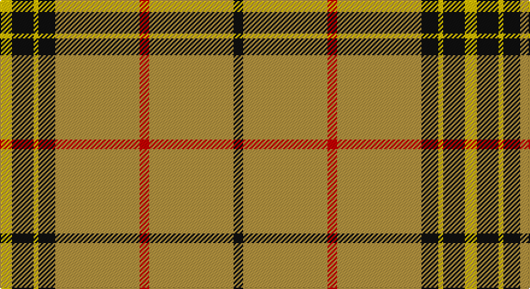

This page is one **sett** — a single exact thread-count. It belongs to the [tartan](/setts/ly5k9ly2k7lo35r4lo35k4/)
(the same proportion at any scale), whose colour order is pattern [KYRYKYKY](/stripes/kyrykyky/).

Part of the [Wilbers](/tartans/wilbers/) tartan — the named design grouping this sett with its other cloths.

Sourced from register-of-tartans.  It is a [8 stripe tartan](/stripes/stripes8/).

Original link https://www.tartanregister.gov.uk/tartanDetails.aspx?ref=5274

## Also known as

This cloth is also recorded under:

- Wilbers #2

2 attestations — the source records this cloth was collapsed from (oldest owns this page)

<ul>
<li>01/01/2007 — Wilbers (register-of-tartans, <a href="https://www.tartanregister.gov.uk/tartanDetails.aspx?ref=5274">record</a>)</li>
<li>pre 2007 — Wilbers (Personal) (tartans-authority, <a href="http://www.tartansauthority.com/tartan-ferret/display/7151/">record</a>)</li>
</ul>

## Register references

External register numbers recorded for this tartan.

- Scottish Register of Tartans: [5274](https://www.tartanregister.gov.uk/tartanDetails.aspx?ref=5274)
- Scottish Tartans Authority (ITI): 7151

## Thread count
Y/10 K18 Y4 K14 DO70 R8 DO70 K/8

One full sett is **386 threads**.

## Palette

Palette: <strong>Tartan Register</strong> <small style="color:#888">(3 of 4 colours)</small>
<table><thead><tr><th>Colour</th><th>Threads</th><th>Shade</th><th>Base</th><th>OKLCh</th></tr></thead><tbody><tr><td>Y/</td><td style="text-align:right;font-variant-numeric:tabular-nums">10</td><td><code style="background-color:#E8C000;">#E8C000</code> <small style="color:#888">#E8C000</small></td><td>Y <code style="background-color:#F2BF00;">#F2BF00</code></td><td><small style="color:#888">oklch(81.9% 0.168 93.7)</small></td></tr><tr><td>K</td><td style="text-align:right;font-variant-numeric:tabular-nums">18</td><td><code style="background-color:#101010;">#101010</code> <small style="color:#888">#101010</small></td><td>K <code style="background-color:#000000;">#000000</code></td><td><small style="color:#888">oklch(17.3% 0.000 89.9)</small></td></tr><tr><td>Y</td><td style="text-align:right;font-variant-numeric:tabular-nums">4</td><td><code style="background-color:#E8C000;">#E8C000</code> <small style="color:#888">#E8C000</small></td><td>Y <code style="background-color:#F2BF00;">#F2BF00</code></td><td><small style="color:#888">oklch(81.9% 0.168 93.7)</small></td></tr><tr><td>K</td><td style="text-align:right;font-variant-numeric:tabular-nums">14</td><td><code style="background-color:#101010;">#101010</code> <small style="color:#888">#101010</small></td><td>K <code style="background-color:#000000;">#000000</code></td><td><small style="color:#888">oklch(17.3% 0.000 89.9)</small></td></tr><tr><td>DO</td><td style="text-align:right;font-variant-numeric:tabular-nums">70</td><td><code style="background-color:#B49440;">#B49440</code> <small style="color:#888">#B49440</small></td><td>Y <code style="background-color:#F2BF00;">#F2BF00</code></td><td><small style="color:#888">oklch(68.0% 0.109 88.2)</small></td></tr><tr><td>R</td><td style="text-align:right;font-variant-numeric:tabular-nums">8</td><td><code style="background-color:#C80000;">#C80000</code> <small style="color:#888">#C80000</small></td><td>R <code style="background-color:#CC0000;">#CC0000</code></td><td><small style="color:#888">oklch(52.3% 0.215 29.2)</small></td></tr><tr><td>DO</td><td style="text-align:right;font-variant-numeric:tabular-nums">70</td><td><code style="background-color:#B49440;">#B49440</code> <small style="color:#888">#B49440</small></td><td>Y <code style="background-color:#F2BF00;">#F2BF00</code></td><td><small style="color:#888">oklch(68.0% 0.109 88.2)</small></td></tr><tr><td>K/</td><td style="text-align:right;font-variant-numeric:tabular-nums">8</td><td><code style="background-color:#101010;">#101010</code> <small style="color:#888">#101010</small></td><td>K <code style="background-color:#000000;">#000000</code></td><td><small style="color:#888">oklch(17.3% 0.000 89.9)</small></td></tr></tbody></table>

# Sample pattern

## Nearest tartans

The nearest existing variants by ΔTartan distance, with this tartan at the top so the swatches line up against it.

ΔTartan

Tartan

Sett

—

<a href="/ttd/edit/#slug=ly5k9ly2k7lo35r4lo35k4~x2">Wilbers</a> <a class="nn-out" href="/variants/s8/ly5k9ly2k7lo35r4lo35k4~x2/" title="open its dictionary page">↗</a>

1.20

<a href="/ttd/edit/#slug=w3k5lo3r3lo32k2lo3~x2&amp;base=ly5k9ly2k7lo35r4lo35k4~x2">Bro-Dreger</a> <a class="nn-out" href="/variants/s7/w3k5lo3r3lo32k2lo3~x2/" title="open its dictionary page">↗</a>

1.34

<a href="/ttd/edit/#slug=dy6r2dy42db2dy5w16dy5db2~x2&amp;base=ly5k9ly2k7lo35r4lo35k4~x2">Glenlivet Dress Reproduction (Corp)</a> <a class="nn-out" href="/variants/s8/dy6r2dy42db2dy5w16dy5db2~x2/" title="open its dictionary page">↗</a>

1.47

<a href="/ttd/edit/#slug=ly5k9ly2k7o10r4o35k4~x2&amp;base=ly5k9ly2k7lo35r4lo35k4~x2">Wilbers #2 (Personal)</a> <a class="nn-out" href="/variants/s8/ly5k9ly2k7o10r4o35k4~x2/" title="open its dictionary page">↗</a>

1.56

<a href="/ttd/edit/#slug=lg60r7w10dg16lg15w3lg15~x2&amp;base=ly5k9ly2k7lo35r4lo35k4~x2">Deer Park (Loton) (Personal)</a> <a class="nn-out" href="/variants/s7/lg60r7w10dg16lg15w3lg15~x2/" title="open its dictionary page">↗</a>

1.60

<a href="/ttd/edit/#slug=lo5r6k5r6lo36db3lo2k1~x2&amp;base=ly5k9ly2k7lo35r4lo35k4~x2">Lermontov Bicentenary</a> <a class="nn-out" href="/variants/s8/lo5r6k5r6lo36db3lo2k1~x2/" title="open its dictionary page">↗</a>

1.66

<a href="/ttd/edit/#slug=ly1k4ly1k4ly11r1ly1~x4&amp;base=ly5k9ly2k7lo35r4lo35k4~x2">Baileville (Personal)</a> <a class="nn-out" href="/variants/s7/ly1k4ly1k4ly11r1ly1~x4/" title="open its dictionary page">↗</a>

1.68

<a href="/ttd/edit/#slug=lo5r6k5r6lo36b3lo2k1~x2&amp;base=ly5k9ly2k7lo35r4lo35k4~x2">Lermontov Bicentenary</a> <a class="nn-out" href="/variants/s8/lo5r6k5r6lo36b3lo2k1~x2/" title="open its dictionary page">↗</a>

1.69

<a href="/ttd/edit/#slug=w16dy5db2dy42r2dy6r2dy42db2dy5w16dy5db2dy5~x2&amp;base=ly5k9ly2k7lo35r4lo35k4~x2">Glenlivet Dress Reproduction</a> <a class="nn-out" href="/variants/s14/w16dy5db2dy42r2dy6r2dy42db2dy5w16dy5db2dy5~x2/" title="open its dictionary page">↗</a>

1.70

<a href="/ttd/edit/#slug=o38w9o3dr9w3~x2&amp;base=ly5k9ly2k7lo35r4lo35k4~x2">Loch Tummel</a> <a class="nn-out" href="/variants/s5/o38w9o3dr9w3~x2/" title="open its dictionary page">↗</a>

1.70

<a href="/ttd/edit/#slug=w15dy15w15dy80r6&amp;base=ly5k9ly2k7lo35r4lo35k4~x2">Coca Cola (Corporate)</a> <a class="nn-out" href="/variants/s5/w15dy15w15dy80r6/" title="open its dictionary page">↗</a>

## Neighbour map

Every grey dot is one of 14360 variants placed by the first two principal components of the ΔTartan feature space (44% of its variance). Red is this tartan; blue dots are its nearest — click one to open its page.

<svg viewBox="0 0 640 380" role="img" style="max-width:100%;height:auto;border:1px solid #e0e0e0;border-radius:4px;display:block" xmlns="http://www.w3.org/2000/svg"><image href="/nn/cloud.v1.png" width="640" height="380"/><a href="/variants/s7/w3k5lo3r3lo32k2lo3~x2/"><circle cx="467.8" cy="144.4" r="4" fill="#3465a4"><title>Bro-Dreger</title></circle></a><a href="/variants/s8/dy6r2dy42db2dy5w16dy5db2~x2/"><circle cx="451.4" cy="136.5" r="4" fill="#3465a4"><title>Glenlivet Dress Reproduction (Corp)</title></circle></a><a href="/variants/s8/ly5k9ly2k7o10r4o35k4~x2/"><circle cx="329.8" cy="141.9" r="4" fill="#3465a4"><title>Wilbers #2 (Personal)</title></circle></a><a href="/variants/s7/lg60r7w10dg16lg15w3lg15~x2/"><circle cx="428.4" cy="168.6" r="4" fill="#3465a4"><title>Deer Park (Loton) (Personal)</title></circle></a><a href="/variants/s8/lo5r6k5r6lo36db3lo2k1~x2/"><circle cx="436.3" cy="103.4" r="4" fill="#3465a4"><title>Lermontov Bicentenary</title></circle></a><a href="/variants/s7/ly1k4ly1k4ly11r1ly1~x4/"><circle cx="334.4" cy="174.5" r="4" fill="#3465a4"><title>Baileville (Personal)</title></circle></a><a href="/variants/s8/lo5r6k5r6lo36b3lo2k1~x2/"><circle cx="446.7" cy="108.8" r="4" fill="#3465a4"><title>Lermontov Bicentenary</title></circle></a><a href="/variants/s14/w16dy5db2dy42r2dy6r2dy42db2dy5w16dy5db2dy5~x2/"><circle cx="436.5" cy="114.4" r="4" fill="#3465a4"><title>Glenlivet Dress Reproduction</title></circle></a><a href="/variants/s5/o38w9o3dr9w3~x2/"><circle cx="406.8" cy="198.6" r="4" fill="#3465a4"><title>Loch Tummel</title></circle></a><a href="/variants/s5/w15dy15w15dy80r6/"><circle cx="444.0" cy="198.1" r="4" fill="#3465a4"><title>Coca Cola (Corporate)</title></circle></a><circle cx="398.5" cy="150.5" r="5" fill="#c00000"/></svg>

ID: /variants/s8/ly5k9ly2k7lo35r4lo35k4~x2/
