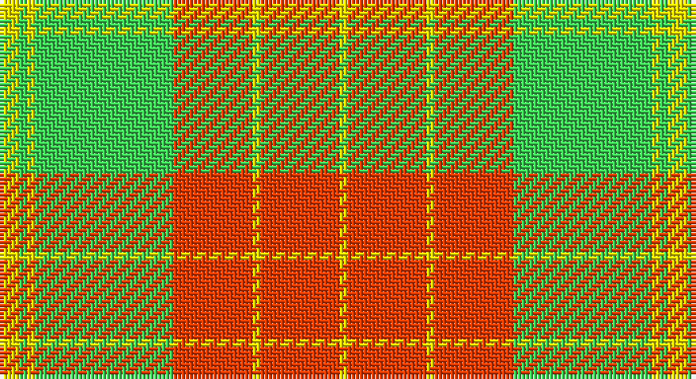

This page is one **sett** — a single exact thread-count. It belongs to the [tartan](/setts/ly5lg2ly2lg35r20ly2r20ly2/)
(the same proportion at any scale), whose colour order is pattern [YRYRYYYY](/stripes/yryryyyy/).

Sourced from register-of-tartans.  It is a [8 stripe tartan](/stripes/stripes8/).

Original link https://www.tartanregister.gov.uk/tartanDetails.aspx?ref=3307

## Also known as

This cloth is also recorded under:

- PeachyKeen

2 attestations — the source records this cloth was collapsed from (oldest owns this page)

<ul>
<li>01/06/2007 — PeachyKeen (register-of-tartans, <a href="https://www.tartanregister.gov.uk/tartanDetails.aspx?ref=3307">record</a>)</li>
<li>June 2007 — Peachy Keen (Corporate) (tartans-authority, <a href="http://www.tartansauthority.com/tartan-ferret/display/7208/">record</a>)</li>
</ul>

## Register references

External register numbers recorded for this tartan.

- Scottish Register of Tartans: [3307](https://www.tartanregister.gov.uk/tartanDetails.aspx?ref=3307)
- Scottish Tartans Authority (ITI): 7208

## Thread count
Y/5 LG2 Y2 LG35 R20 Y2 R20 Y/2

One full sett is **169 threads**.

## Palette

Palette: <strong>custom</strong>
<table><thead><tr><th>Colour</th><th>Threads</th><th>Shade</th><th>Base</th><th>OKLCh</th></tr></thead><tbody><tr><td>Y/</td><td style="text-align:right;font-variant-numeric:tabular-nums">5</td><td><code style="background-color:#FCE800;">#FCE800</code> <small style="color:#888">#FCE800</small></td><td>Y <code style="background-color:#F2BF00;">#F2BF00</code></td><td><small style="color:#888">oklch(91.8% 0.193 103.2)</small></td></tr><tr><td>LG</td><td style="text-align:right;font-variant-numeric:tabular-nums">2</td><td><code style="background-color:#3CD454;">#3CD454</code> <small style="color:#888">#3CD454</small></td><td>Y <code style="background-color:#F2BF00;">#F2BF00</code></td><td><small style="color:#888">oklch(76.5% 0.212 145.5)</small></td></tr><tr><td>Y</td><td style="text-align:right;font-variant-numeric:tabular-nums">2</td><td><code style="background-color:#FCE800;">#FCE800</code> <small style="color:#888">#FCE800</small></td><td>Y <code style="background-color:#F2BF00;">#F2BF00</code></td><td><small style="color:#888">oklch(91.8% 0.193 103.2)</small></td></tr><tr><td>LG</td><td style="text-align:right;font-variant-numeric:tabular-nums">35</td><td><code style="background-color:#3CD454;">#3CD454</code> <small style="color:#888">#3CD454</small></td><td>Y <code style="background-color:#F2BF00;">#F2BF00</code></td><td><small style="color:#888">oklch(76.5% 0.212 145.5)</small></td></tr><tr><td>R</td><td style="text-align:right;font-variant-numeric:tabular-nums">20</td><td><code style="background-color:#FC3C00;">#FC3C00</code> <small style="color:#888">#FC3C00</small></td><td>R <code style="background-color:#CC0000;">#CC0000</code></td><td><small style="color:#888">oklch(64.8% 0.233 34.0)</small></td></tr><tr><td>Y</td><td style="text-align:right;font-variant-numeric:tabular-nums">2</td><td><code style="background-color:#FCE800;">#FCE800</code> <small style="color:#888">#FCE800</small></td><td>Y <code style="background-color:#F2BF00;">#F2BF00</code></td><td><small style="color:#888">oklch(91.8% 0.193 103.2)</small></td></tr><tr><td>R</td><td style="text-align:right;font-variant-numeric:tabular-nums">20</td><td><code style="background-color:#FC3C00;">#FC3C00</code> <small style="color:#888">#FC3C00</small></td><td>R <code style="background-color:#CC0000;">#CC0000</code></td><td><small style="color:#888">oklch(64.8% 0.233 34.0)</small></td></tr><tr><td>Y/</td><td style="text-align:right;font-variant-numeric:tabular-nums">2</td><td><code style="background-color:#FCE800;">#FCE800</code> <small style="color:#888">#FCE800</small></td><td>Y <code style="background-color:#F2BF00;">#F2BF00</code></td><td><small style="color:#888">oklch(91.8% 0.193 103.2)</small></td></tr></tbody></table>

# Sample pattern

## Nearest tartans

The nearest existing variants by ΔTartan distance, with this tartan at the top so the swatches line up against it.

ΔTartan

Tartan

Sett

—

<a href="/ttd/edit/#slug=ly5lg2ly2lg35r20ly2r20ly2">PeachyKeen</a> <a class="nn-out" href="/variants/s8/ly5lg2ly2lg35r20ly2r20ly2/" title="open its dictionary page">↗</a>

1.60

<a href="/ttd/edit/#slug=ly28k2ly28k2ly2k2lo29k2r2k2~x2&amp;base=ly5lg2ly2lg35r20ly2r20ly2">Ulster Irish District Tartan</a> <a class="nn-out" href="/variants/s10/ly28k2ly28k2ly2k2lo29k2r2k2~x2/" title="open its dictionary page">↗</a>

1.62

<a href="/ttd/edit/#slug=r1g14r1g1r14g1w1~x2&amp;base=ly5lg2ly2lg35r20ly2r20ly2">MacKintosh Fragment</a> <a class="nn-out" href="/variants/s7/r1g14r1g1r14g1w1~x2/" title="open its dictionary page">↗</a>

1.67

<a href="/ttd/edit/#slug=ly30r2ly2k5ly3y2ly3y22ly3k2ly3~x2&amp;base=ly5lg2ly2lg35r20ly2r20ly2">Dunbarton (Quebec)</a> <a class="nn-out" href="/variants/s11/ly30r2ly2k5ly3y2ly3y22ly3k2ly3~x2/" title="open its dictionary page">↗</a>

1.80

<a href="/ttd/edit/#slug=db4ly1r12ly2r2ly12r1ly4~x4&amp;base=ly5lg2ly2lg35r20ly2r20ly2">Glassary #3</a> <a class="nn-out" href="/variants/s8/db4ly1r12ly2r2ly12r1ly4~x4/" title="open its dictionary page">↗</a>

1.84

<a href="/ttd/edit/#slug=o15k1ly2db3o2k1ly15~x4&amp;base=ly5lg2ly2lg35r20ly2r20ly2">Scrymgeour Family Tartan</a> <a class="nn-out" href="/variants/s7/o15k1ly2db3o2k1ly15~x4/" title="open its dictionary page">↗</a>

1.89

<a href="/ttd/edit/#slug=g5ly5g5ly35ri44r3ri3~x2&amp;base=ly5lg2ly2lg35r20ly2r20ly2">Fernandes (Personal)</a> <a class="nn-out" href="/variants/s7/g5ly5g5ly35ri44r3ri3~x2/" title="open its dictionary page">↗</a>

1.94

<a href="/ttd/edit/#slug=r3g3ly1r18w1g21ly1g1ly3~x2&amp;base=ly5lg2ly2lg35r20ly2r20ly2">MacDonald of Kingsburgh</a> <a class="nn-out" href="/variants/s9/r3g3ly1r18w1g21ly1g1ly3~x2/" title="open its dictionary page">↗</a>

1.99

<a href="/ttd/edit/#slug=ly30r2ly2k5ly3dy2ly3dy22ly3k2ly3~x2&amp;base=ly5lg2ly2lg35r20ly2r20ly2">Dunbarton Trade Tartan</a> <a class="nn-out" href="/variants/s11/ly30r2ly2k5ly3dy2ly3dy22ly3k2ly3~x2/" title="open its dictionary page">↗</a>

2.01

<a href="/ttd/edit/#slug=ly30r2ly2k5ly3o2ly3o22ly3k2ly3~x2&amp;base=ly5lg2ly2lg35r20ly2r20ly2">Dunbarton</a> <a class="nn-out" href="/variants/s11/ly30r2ly2k5ly3o2ly3o22ly3k2ly3~x2/" title="open its dictionary page">↗</a>

2.02

<a href="/ttd/edit/#slug=g4ly20ly3ly2ly3ly20g24ly3g2ly3g24ly4&amp;base=ly5lg2ly2lg35r20ly2r20ly2">Meredith (Welsh Name)</a> <a class="nn-out" href="/variants/s12/g4ly20ly3ly2ly3ly20g24ly3g2ly3g24ly4/" title="open its dictionary page">↗</a>

## Neighbour map

Every grey dot is one of 14360 variants placed by the first two principal components of the ΔTartan feature space (44% of its variance). Red is this tartan; blue dots are its nearest — click one to open its page.

<svg viewBox="0 0 640 380" role="img" style="max-width:100%;height:auto;border:1px solid #e0e0e0;border-radius:4px;display:block" xmlns="http://www.w3.org/2000/svg"><image href="/nn/cloud.v1.png" width="640" height="380"/><a href="/variants/s10/ly28k2ly28k2ly2k2lo29k2r2k2~x2/"><circle cx="335.9" cy="131.6" r="4" fill="#3465a4"><title>Ulster Irish District Tartan</title></circle></a><a href="/variants/s7/r1g14r1g1r14g1w1~x2/"><circle cx="357.7" cy="170.0" r="4" fill="#3465a4"><title>MacKintosh Fragment</title></circle></a><a href="/variants/s11/ly30r2ly2k5ly3y2ly3y22ly3k2ly3~x2/"><circle cx="331.1" cy="120.4" r="4" fill="#3465a4"><title>Dunbarton (Quebec)</title></circle></a><a href="/variants/s8/db4ly1r12ly2r2ly12r1ly4~x4/"><circle cx="296.7" cy="172.1" r="4" fill="#3465a4"><title>Glassary #3</title></circle></a><a href="/variants/s7/o15k1ly2db3o2k1ly15~x4/"><circle cx="266.4" cy="146.3" r="4" fill="#3465a4"><title>Scrymgeour Family Tartan</title></circle></a><a href="/variants/s7/g5ly5g5ly35ri44r3ri3~x2/"><circle cx="283.3" cy="143.7" r="4" fill="#3465a4"><title>Fernandes (Personal)</title></circle></a><a href="/variants/s9/r3g3ly1r18w1g21ly1g1ly3~x2/"><circle cx="324.7" cy="131.2" r="4" fill="#3465a4"><title>MacDonald of Kingsburgh</title></circle></a><a href="/variants/s11/ly30r2ly2k5ly3dy2ly3dy22ly3k2ly3~x2/"><circle cx="316.6" cy="114.7" r="4" fill="#3465a4"><title>Dunbarton Trade Tartan</title></circle></a><a href="/variants/s11/ly30r2ly2k5ly3o2ly3o22ly3k2ly3~x2/"><circle cx="312.5" cy="110.7" r="4" fill="#3465a4"><title>Dunbarton</title></circle></a><a href="/variants/s12/g4ly20ly3ly2ly3ly20g24ly3g2ly3g24ly4/"><circle cx="282.3" cy="174.0" r="4" fill="#3465a4"><title>Meredith (Welsh Name)</title></circle></a><circle cx="301.0" cy="154.6" r="5" fill="#c00000"/></svg>

ID: /variants/s8/ly5lg2ly2lg35r20ly2r20ly2/
