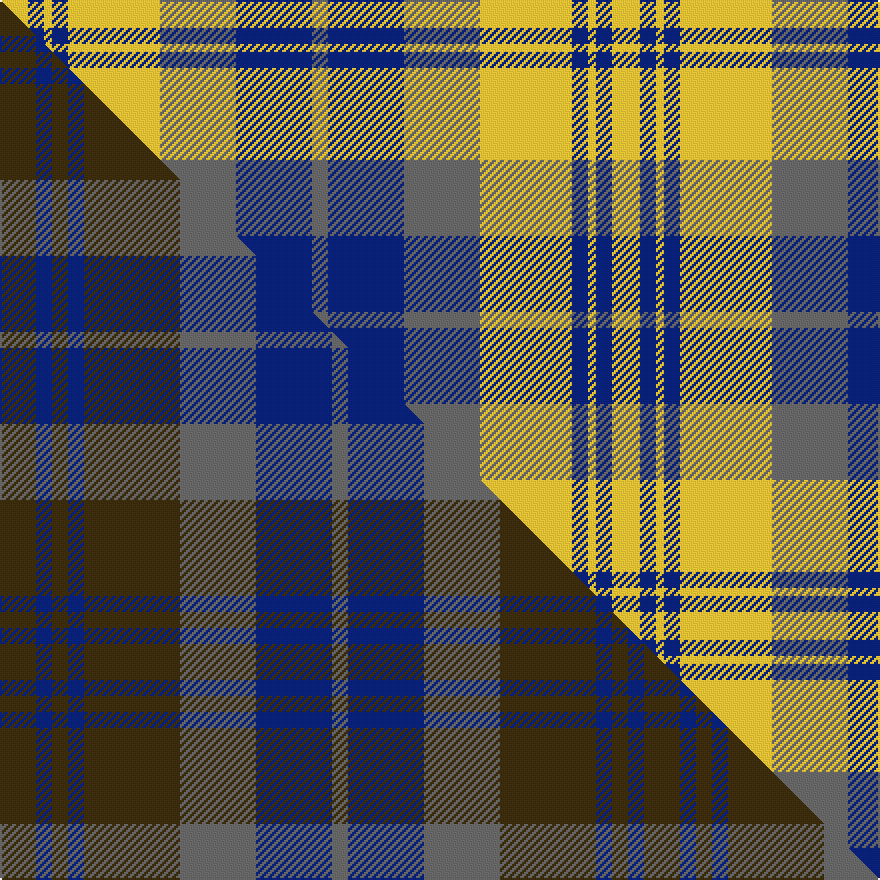

This is one **variant** — a specific cloth: this exact thread count and colourway, with its own
provenance below. It is one weaving of the [sett](/setts/ly7db4ly2db4ly23n19db19n4/) (the scale-free proportion — the
same cloth at any scale or shade), whose colour order is pattern [BBBYBYBY](/stripes/bbbybyby/).

Part of the [Chindecella Gorse](/tartans/chindecella-gorse/) tartan — the named design grouping this sett with its other cloths.

Sourced from tartans-authority.  It is a [8 stripe tartan](/stripes/stripes8/).

Original link [https://www.tartanregister.gov.uk/tartanDetails.aspx?ref=10254](https://www.tartanregister.gov.uk/tartanDetails.aspx?ref=10254)

Dataset <small>— provenance for this record, inherited from the source manifest</small>

<dl class="dataset-prov">
<dt>source</dt><dd><a href="/sources/tartans-authority/">Scottish Tartans Authority</a></dd>
<dt>data captured from</dt><dd><a href="https://github.com/thetartan/tartan-database/blob/master/data/tartans-authority/data.csv">https://github.com/thetartan/tartan-database/blob/master/data/tartans-authority/data.csv</a></dd>
<dt>data date</dt><dd>14th July 2010 <small>(this record)</small></dd>
<dt>licence</dt><dd><a href="https://creativecommons.org/licenses/by-nc-nd/4.0/">CC BY-NC-ND 4.0</a></dd>
</dl>

Capture chain <small>— the hands this data passed through, oldest first; each capture carries its own licence</small>

<ol class="capture-chain">
<li><a href="https://www.tartansauthority.com/">Scottish Tartans Authority</a> <small>the heritage body's archive — its tartan-ferret record browser is retired (links repaired to the SRT, above)</small></li>
<li><a href="https://github.com/thetartan/tartan-database">thetartan/tartan-database</a> <small>2016-2017</small> · <a href="https://creativecommons.org/licenses/by-nc-nd/4.0/">CC BY-NC-ND 4.0</a> <small>Levko Kravets's frozen compilation — the capture we vendored, and where its CC licence text came from</small></li>
<li>this dictionary <small>captured 2026-06-10 · commit 5bf86c7566</small> <small>each re-capture is a git commit to data/sources</small></li>
</ol>

## Register references

External register numbers recorded for this tartan.

- Scottish Register of Tartans: [10254](https://www.tartanregister.gov.uk/tartanDetails?ref=10254)
- Scottish Tartans Authority (ITI): 10254

## Thread count
LY/14 DB8 LY4 DB8 LY46 N38 DB38 N/8

One full sett is **306 threads**.

## Palette
<table><thead><tr><th>Colour</th><th>Shade</th><th>OKLCh</th></tr></thead><tbody><tr><td>DB</td><td><code style="background-color:#082077;">#082077</code> <small style="color:#888">#082077</small></td><td><small style="color:#888">oklch(30.0% 0.149 265.1)</small></td></tr><tr><td>LY</td><td><code style="background-color:#DCBC32;">#DCBC32</code> <small style="color:#888">#DCBC32</small></td><td><small style="color:#888">oklch(80.0% 0.150 95.2)</small></td></tr><tr><td>N</td><td><code style="background-color:#636363;">#636363</code> <small style="color:#888">#636363</small></td><td><small style="color:#888">oklch(50.0% 0.000 89.9)</small></td></tr></tbody></table>

# Sample pattern

## Compared to the master

This cloth is one sett of its design; the master sett (the exemplar the design is anchored on) is below for comparison.

Its **ΔTartan distance** from the master is **0.65** — the same measure the nearest-tartans table ranks by (0 is identical; a re-scale of the same cloth is near 0, a recolour or a different proportion further).

<figure class="master-compare" style="margin:0">

this sett
master sett ★

<figcaption style="color:#888;font-size:smaller">One weave of this sett against the <a href="/setts/dy9db4dy4db4dy24n19db19n4/">master sett ★</a>, split on the diagonal: a shared proportion runs seamlessly across it with only the shades shifting; a different proportion breaks on it.</figcaption>
</figure>

## Nearest tartan variants

The nearest existing variants by ΔTartan distance, with this cloth at the top so the swatches line up against it.

ΔTartan

Threads

Variant

Sett

—

306

<a href="/variants/s8/ly7db4ly2db4ly23n19db19n4~x2/">Chindecella Gorse (Personal)</a>

<a href="/ttd/edit/#slug=n9do1n1do1n1do7w7do2~x4&amp;base=ly7db4ly2db4ly23n19db19n4~x2" title="compare in the TTD">1.48</a>

188

<a href="/variants/s8/n9do1n1do1n1do7w7do2~x4/">Grey Watch, Dress</a>

<a href="/ttd/edit/#slug=ly6n2ly2n2ly18n13db13n2~x2&amp;base=ly7db4ly2db4ly23n19db19n4~x2" title="compare in the TTD">2.38</a>

216

<a href="/variants/s8/ly6n2ly2n2ly18n13db13n2~x2/">Heil, Rudiger (Personal)</a>

<a href="/ttd/edit/#slug=n12dt2n2dt2n2dt10w12dt3~x2~n1900000-dt0900000&amp;base=ly7db4ly2db4ly23n19db19n4~x2" title="compare in the TTD">2.48</a>

150

<a href="/variants/s8/n12dt2n2dt2n2dt10w12dt3~x2~n1900000-dt0900000/">Grey Watch Dress (Fashion)</a>

<a href="/ttd/edit/#slug=db2ly21db11dbi21db1~x2~db1004274-dbi1404245&amp;base=ly7db4ly2db4ly23n19db19n4~x2" title="compare in the TTD">3.00</a>

218

<a href="/variants/s5/db2ly21db11dbi21db1~x2~db1004274-dbi1404245/">St. Matthews Check (School)</a>

<a href="/ttd/edit/#slug=n12dt2n2dt2n2dt10w12dt3w12dt10n12dt2n2~x2&amp;base=ly7db4ly2db4ly23n19db19n4~x2" title="compare in the TTD">3.18</a>

304

<a href="/variants/s13/n12dt2n2dt2n2dt10w12dt3w12dt10n12dt2n2~x2/">Grey Watch Dress (1989)</a>

<a href="/ttd/edit/#slug=g4lb31g7dr14g11dr3~x2&amp;base=ly7db4ly2db4ly23n19db19n4~x2" title="compare in the TTD">3.25</a>

266

<a href="/variants/s6/g4lb31g7dr14g11dr3~x2/">Gleneagles USA (Dalgleish)</a>

<a href="/ttd/edit/#slug=dy22do3dy3do3dy3do9lb28do3lb6~x2&amp;base=ly7db4ly2db4ly23n19db19n4~x2" title="compare in the TTD">3.37</a>

264

<a href="/variants/s9/dy22do3dy3do3dy3do9lb28do3lb6~x2/">Kildonan Brown (Fashion)</a>

<a href="/ttd/edit/#slug=db3y2db30y19ly14y2ly3~x2&amp;base=ly7db4ly2db4ly23n19db19n4~x2" title="compare in the TTD">3.40</a>

280

<a href="/variants/s7/db3y2db30y19ly14y2ly3~x2/">Bannockbane Brown #2</a>

<a href="/ttd/edit/#slug=lg22db3lg3db3lg3db9lb22db3lb6~x2&amp;base=ly7db4ly2db4ly23n19db19n4~x2" title="compare in the TTD">3.42</a>

240

<a href="/variants/s9/lg22db3lg3db3lg3db9lb22db3lb6~x2/">Lochearn (Fashion)</a>

<a href="/ttd/edit/#slug=dg3ly2dg14ly1w10n14ly2n3~x2&amp;base=ly7db4ly2db4ly23n19db19n4~x2" title="compare in the TTD">3.51</a>

184

<a href="/variants/s8/dg3ly2dg14ly1w10n14ly2n3~x2/">Bannockbane Hunting (MacBean and Bishop)</a>

## Neighbour map

Every grey dot is one of 13621 variants placed by the first two principal components of the ΔTartan feature space (42% of its variance). Red is this tartan; blue dots are its nearest — click one to open its page.

<svg viewBox="0 0 640 380" role="img" style="max-width:100%;height:auto;border:1px solid #e0e0e0;border-radius:4px;display:block" xmlns="http://www.w3.org/2000/svg"><image href="/nn/cloud.v1.png" width="640" height="380"/><a href="/variants/s8/n9do1n1do1n1do7w7do2~x4/"><circle cx="261.5" cy="241.6" r="4" fill="#3465a4"><title>Grey Watch, Dress</title></circle></a><a href="/variants/s8/ly6n2ly2n2ly18n13db13n2~x2/"><circle cx="292.0" cy="249.5" r="4" fill="#3465a4"><title>Heil, Rudiger (Personal)</title></circle></a><a href="/variants/s8/n12dt2n2dt2n2dt10w12dt3~x2~n1900000-dt0900000/"><circle cx="227.3" cy="260.8" r="4" fill="#3465a4"><title>Grey Watch Dress (Fashion)</title></circle></a><a href="/variants/s5/db2ly21db11dbi21db1~x2~db1004274-dbi1404245/"><circle cx="286.3" cy="239.6" r="4" fill="#3465a4"><title>St. Matthews Check (School)</title></circle></a><a href="/variants/s13/n12dt2n2dt2n2dt10w12dt3w12dt10n12dt2n2~x2/"><circle cx="210.1" cy="253.3" r="4" fill="#3465a4"><title>Grey Watch Dress (1989)</title></circle></a><a href="/variants/s6/g4lb31g7dr14g11dr3~x2/"><circle cx="279.4" cy="246.2" r="4" fill="#3465a4"><title>Gleneagles USA (Dalgleish)</title></circle></a><a href="/variants/s9/dy22do3dy3do3dy3do9lb28do3lb6~x2/"><circle cx="268.3" cy="212.9" r="4" fill="#3465a4"><title>Kildonan Brown (Fashion)</title></circle></a><a href="/variants/s7/db3y2db30y19ly14y2ly3~x2/"><circle cx="295.5" cy="208.6" r="4" fill="#3465a4"><title>Bannockbane Brown #2</title></circle></a><a href="/variants/s9/lg22db3lg3db3lg3db9lb22db3lb6~x2/"><circle cx="262.4" cy="253.3" r="4" fill="#3465a4"><title>Lochearn (Fashion)</title></circle></a><a href="/variants/s8/dg3ly2dg14ly1w10n14ly2n3~x2/"><circle cx="206.0" cy="205.4" r="4" fill="#3465a4"><title>Bannockbane Hunting (MacBean and Bishop)</title></circle></a><circle cx="266.0" cy="244.7" r="5" fill="#c00000"/><text x="320" y="376" text-anchor="middle" font-size="11" fill="#999">ground</text><text x="11" y="190" text-anchor="middle" font-size="11" fill="#999" transform="rotate(-90 11 190)">complexity</text></svg>

ID: /variants/s8/ly7db4ly2db4ly23n19db19n4~x2/
