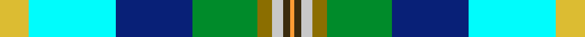

This is one **variant** — a specific cloth: this exact thread count and colourway, with its own
provenance below. It is one weaving of the [sett](/setts/ly8lt24db21g18y4lb3dy2lo1/) (the scale-free proportion — the
same cloth at any scale or shade), whose colour order is pattern [YGWGGBWY](/stripes/ygwggbwy/).

Part of the [Philpotts, Brian](/tartans/p/ph/philpotts-brian-2/) tartan — the named design grouping this sett with its other cloths.

Sourced from register-of-tartans.  It is a [8 stripe tartan](/stripes/stripes8/).

Original link [https://www.tartanregister.gov.uk/tartanDetails.aspx?ref=10931](https://www.tartanregister.gov.uk/tartanDetails.aspx?ref=10931)

Dataset <small>— provenance for this record, inherited from the source manifest</small>

<dl class="dataset-prov">
<dt>source</dt><dd><a href="/sources/register-of-tartans/">Scottish Register of Tartans</a></dd>
<dt>data captured from</dt><dd><a href="https://github.com/thetartan/tartan-database/blob/master/data/register-of-tartans/data.csv">https://github.com/thetartan/tartan-database/blob/master/data/register-of-tartans/data.csv</a></dd>
<dt>data date</dt><dd>09/10/2013 <small>(this record)</small></dd>
<dt>licence</dt><dd><a href="https://www.tartanregister.gov.uk/copyright">Crown copyright</a></dd>
</dl>

Capture chain <small>— the hands this data passed through, oldest first; each capture carries its own licence</small>

<ol class="capture-chain">
<li><a href="https://www.tartanregister.gov.uk/">Scottish Register of Tartans</a> · <a href="https://www.tartanregister.gov.uk/copyright">Crown copyright</a> <small>the living register — still published by National Records of Scotland</small></li>
<li><a href="https://github.com/thetartan/tartan-database">thetartan/tartan-database</a> <small>2016-2017</small> · <a href="https://creativecommons.org/licenses/by-nc-nd/4.0/">CC BY-NC-ND 4.0</a> <small>Levko Kravets's frozen compilation — the capture we vendored, and where its CC licence text came from</small></li>
<li>this dictionary <small>captured 2026-06-10 · commit 5bf86c7566</small> <small>each re-capture is a git commit to data/sources</small></li>
</ol>

## Register references

External register numbers recorded for this tartan.

- Scottish Register of Tartans: [10931](https://www.tartanregister.gov.uk/tartanDetails.aspx?ref=10931)

## Thread count
LY/16 LT48 DB42 G36 Y8 LB6 DY4 LO/2

One full sett is **306 threads**.

## Palette
<table><thead><tr><th>Colour</th><th>Shade</th><th>OKLCh</th></tr></thead><tbody><tr><td>DB</td><td><code style="background-color:#082077;">#082077</code> <small style="color:#888">#082077</small></td><td><small style="color:#888">oklch(30.0% 0.149 265.1)</small></td></tr><tr><td>LT</td><td><code style="background-color:#00FCFC;">#00FCFC</code> <small style="color:#888">#00FCFC</small></td><td><small style="color:#888">oklch(89.7% 0.153 194.8)</small></td></tr><tr><td>G</td><td><code style="background-color:#008B2A;">#008B2A</code> <small style="color:#888">#008B2A</small></td><td><small style="color:#888">oklch(55.4% 0.170 145.9)</small></td></tr><tr><td>LO</td><td><code style="background-color:#FF9C34;">#FF9C34</code> <small style="color:#888">#FF9C34</small></td><td><small style="color:#888">oklch(77.9% 0.161 61.8)</small></td></tr><tr><td>LB</td><td><code style="background-color:#C8C8C8;">#C8C8C8</code> <small style="color:#888">#C8C8C8</small></td><td><small style="color:#888">oklch(83.3% 0.000 89.9)</small></td></tr><tr><td>DY</td><td><code style="background-color:#3A2B0D;">#3A2B0D</code> <small style="color:#888">#3A2B0D</small></td><td><small style="color:#888">oklch(30.0% 0.049 82.0)</small></td></tr><tr><td>LY</td><td><code style="background-color:#DCBC32;">#DCBC32</code> <small style="color:#888">#DCBC32</small></td><td><small style="color:#888">oklch(80.0% 0.150 95.2)</small></td></tr><tr><td>Y</td><td><code style="background-color:#8B6E00;">#8B6E00</code> <small style="color:#888">#8B6E00</small></td><td><small style="color:#888">oklch(55.1% 0.113 90.4)</small></td></tr></tbody></table>

# Sample pattern

## Nearest tartan variants

The nearest existing variants by ΔTartan distance, with this cloth at the top so the swatches line up against it.

ΔTartan

Threads

Variant

Sett

—

306

<a href="/variants/s8/ly8lt24db21g18y4lb3dy2lo1~x2~lt3606199-lb3300000/">Philpotts, Brian</a>

<a href="/ttd/edit/#slug=y8t24db21g18lo4lri3dy2lr1~x2~t2405244-lri3200000&amp;base=ly8lt24db21g18y4lb3dy2lo1~x2~lt3606199-lb3300000" title="compare in the TTD">2.38</a>

306

<a href="/variants/s8/y8t24db21g18lo4lb3dy2lr1~x2~t2405244-lb3200000/">Philpotts, Brian</a>

<a href="/ttd/edit/#slug=dg18g6dy3w1dy3w1lb6db6~x2~dg1806142-g2408144&amp;base=ly8lt24db21g18y4lb3dy2lo1~x2~lt3606199-lb3300000" title="compare in the TTD">3.30</a>

128

<a href="/variants/s8/dg18g6dy3w1dy3w1lb6db6~x2~dg1806142-g2408144/">Iroquois Falls Centenary (Commem.)</a>

<a href="/ttd/edit/#slug=dg18g6dy3w1dy3w1lb6db6~x2&amp;base=ly8lt24db21g18y4lb3dy2lo1~x2~lt3606199-lb3300000" title="compare in the TTD">3.39</a>

128

<a href="/variants/s8/dg18g6dy3w1dy3w1lb6db6~x2/">Iroquois Falls Centenary</a>

<a href="/ttd/edit/#slug=r3dt20db20g2lr4lri17w3~x2~lr3001120-lri3001240&amp;base=ly8lt24db21g18y4lb3dy2lo1~x2~lt3606199-lb3300000" title="compare in the TTD">3.50</a>

264

<a href="/variants/s7/r3dt20db20g2lr4lri17w3~x2~lr3001120-lri3001240/">Silversea</a>

## Neighbour map

Every grey dot is one of 13621 variants placed by the first two principal components of the ΔTartan feature space (42% of its variance). Red is this tartan; blue dots are its nearest — click one to open its page.

<svg viewBox="0 0 640 380" role="img" style="max-width:100%;height:auto;border:1px solid #e0e0e0;border-radius:4px;display:block" xmlns="http://www.w3.org/2000/svg"><image href="/nn/cloud.v1.png" width="640" height="380"/><a href="/variants/s8/y8t24db21g18lo4lb3dy2lr1~x2~t2405244-lb3200000/"><circle cx="155.2" cy="147.3" r="4" fill="#3465a4"><title>Philpotts, Brian</title></circle></a><a href="/variants/s8/dg18g6dy3w1dy3w1lb6db6~x2~dg1806142-g2408144/"><circle cx="205.3" cy="170.7" r="4" fill="#3465a4"><title>Iroquois Falls Centenary (Commem.)</title></circle></a><a href="/variants/s8/dg18g6dy3w1dy3w1lb6db6~x2/"><circle cx="201.1" cy="166.3" r="4" fill="#3465a4"><title>Iroquois Falls Centenary</title></circle></a><a href="/variants/s7/r3dt20db20g2lr4lri17w3~x2~lr3001120-lri3001240/"><circle cx="101.0" cy="176.2" r="4" fill="#3465a4"><title>Silversea</title></circle></a><circle cx="104.3" cy="133.8" r="5" fill="#c00000"/><text x="320" y="376" text-anchor="middle" font-size="11" fill="#999">ground</text><text x="11" y="190" text-anchor="middle" font-size="11" fill="#999" transform="rotate(-90 11 190)">complexity</text></svg>

ID: /variants/s8/ly8lt24db21g18y4lb3dy2lo1~x2~lt3606199-lb3300000/
