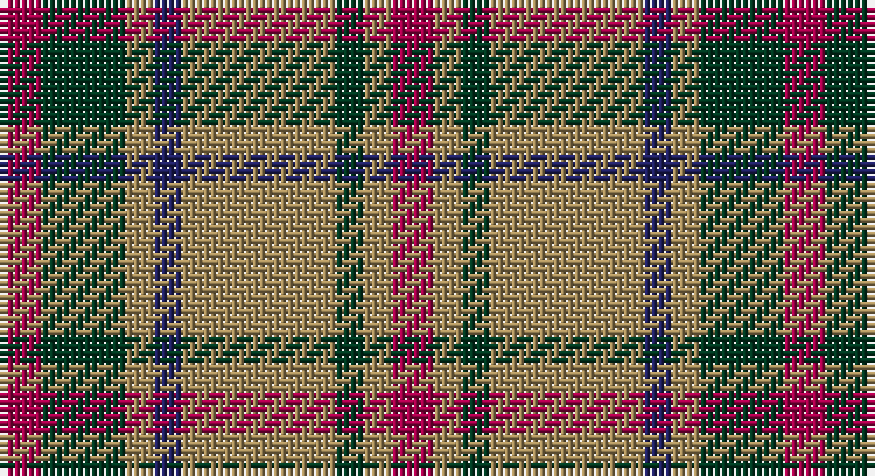

This page is one **sett** — a single exact thread-count. It belongs to the [tartan](/setts/m3dg6lo2db2lo11dg2lo2m3/)
(the same proportion at any scale), whose colour order is pattern [RGYBYGYR](/stripes/rgybygyr/).

Part of the [Invertere](/tartans/invertere/) tartan — the named design grouping this sett with its other cloths.

Sourced from tartans-authority.  It is a [8 stripe tartan](/stripes/stripes8/).

Original link http://www.tartansauthority.com/tartan-ferret/display/1540/

## Also known as

This cloth is also recorded under:

- Invertere,

## Register references

External register numbers recorded for this tartan.

- Scottish Tartans Authority (ITI): 1540

## Thread count
R/6 DG12 LT4 DB4 LT22 DG4 LT4 R/6

One full sett is **112 threads**.

## Palette

Palette: <strong>Tartan Register</strong>
<table><thead><tr><th>Colour</th><th>Threads</th><th>Shade</th><th>Base</th><th>OKLCh</th></tr></thead><tbody><tr><td>R/</td><td style="text-align:right;font-variant-numeric:tabular-nums">6</td><td><code style="background-color:#A00048;">#A00048</code> <small style="color:#888">#A00048</small></td><td>R <code style="background-color:#CC0000;">#CC0000</code></td><td><small style="color:#888">oklch(45.4% 0.182 5.3)</small></td></tr><tr><td>DG</td><td style="text-align:right;font-variant-numeric:tabular-nums">12</td><td><code style="background-color:#003820;">#003820</code> <small style="color:#888">#003820</small></td><td>G <code style="background-color:#006100;">#006100</code></td><td><small style="color:#888">oklch(30.0% 0.070 158.3)</small></td></tr><tr><td>LT</td><td style="text-align:right;font-variant-numeric:tabular-nums">4</td><td><code style="background-color:#A08858;">#A08858</code> <small style="color:#888">#A08858</small></td><td>Y <code style="background-color:#F2BF00;">#F2BF00</code></td><td><small style="color:#888">oklch(63.7% 0.071 84.0)</small></td></tr><tr><td>DB</td><td style="text-align:right;font-variant-numeric:tabular-nums">4</td><td><code style="background-color:#202060;">#202060</code> <small style="color:#888">#202060</small></td><td>B <code style="background-color:#2A418A;">#2A418A</code></td><td><small style="color:#888">oklch(28.9% 0.111 276.9)</small></td></tr><tr><td>LT</td><td style="text-align:right;font-variant-numeric:tabular-nums">22</td><td><code style="background-color:#A08858;">#A08858</code> <small style="color:#888">#A08858</small></td><td>Y <code style="background-color:#F2BF00;">#F2BF00</code></td><td><small style="color:#888">oklch(63.7% 0.071 84.0)</small></td></tr><tr><td>DG</td><td style="text-align:right;font-variant-numeric:tabular-nums">4</td><td><code style="background-color:#003820;">#003820</code> <small style="color:#888">#003820</small></td><td>G <code style="background-color:#006100;">#006100</code></td><td><small style="color:#888">oklch(30.0% 0.070 158.3)</small></td></tr><tr><td>LT</td><td style="text-align:right;font-variant-numeric:tabular-nums">4</td><td><code style="background-color:#A08858;">#A08858</code> <small style="color:#888">#A08858</small></td><td>Y <code style="background-color:#F2BF00;">#F2BF00</code></td><td><small style="color:#888">oklch(63.7% 0.071 84.0)</small></td></tr><tr><td>R/</td><td style="text-align:right;font-variant-numeric:tabular-nums">6</td><td><code style="background-color:#A00048;">#A00048</code> <small style="color:#888">#A00048</small></td><td>R <code style="background-color:#CC0000;">#CC0000</code></td><td><small style="color:#888">oklch(45.4% 0.182 5.3)</small></td></tr></tbody></table>

# Sample pattern

## Compared to the master

This cloth is one sett of its design; the master sett (the exemplar the design is anchored on) is below for comparison.

<figure style="margin:0"><figcaption style="color:#888;font-size:smaller">this sett</figcaption></figure>
<figure style="margin:0"><figcaption style="color:#888;font-size:smaller"><a href="/setts/dg6lo2db2lo11dg2lo2m3lo2dg2lo11db2lo2dg6m3/">master sett →</a></figcaption></figure>

## Nearest tartans

The nearest existing variants by ΔTartan distance, with this tartan at the top so the swatches line up against it.

ΔTartan

Tartan

Sett

—

<a href="/ttd/edit/#slug=m3dg6lo2db2lo11dg2lo2m3~x2">Invertere (Daks #1) (Fashion)</a> <a class="nn-out" href="/variants/s8/m3dg6lo2db2lo11dg2lo2m3~x2/" title="open its dictionary page">↗</a>

0.88

<a href="/ttd/edit/#slug=lo3t7do2m2do14t2do2lo3~x2&amp;base=m3dg6lo2db2lo11dg2lo2m3~x2">Daks (Blue Loden)</a> <a class="nn-out" href="/variants/s8/lo3t7do2m2do14t2do2lo3~x2/" title="open its dictionary page">↗</a>

1.00

<a href="/ttd/edit/#slug=r10dy60dt13lb24dt24dy8&amp;base=m3dg6lo2db2lo11dg2lo2m3~x2">Bronte House Check (Fashion)</a> <a class="nn-out" href="/variants/s6/r10dy60dt13lb24dt24dy8/" title="open its dictionary page">↗</a>

1.05

<a href="/ttd/edit/#slug=db1g4db1r1db1ly1db5r6db1ly1~x2&amp;base=m3dg6lo2db2lo11dg2lo2m3~x2">Unidentified, specimen</a> <a class="nn-out" href="/variants/s10/db1g4db1r1db1ly1db5r6db1ly1~x2/" title="open its dictionary page">↗</a>

1.06

<a href="/ttd/edit/#slug=o16oi2o11oi6k4w2k4oi16~x2&amp;base=m3dg6lo2db2lo11dg2lo2m3~x2">Sydney (Nova Scotia) (District)</a> <a class="nn-out" href="/variants/s8/o16oi2o11oi6k4w2k4oi16~x2/" title="open its dictionary page">↗</a>

1.08

<a href="/ttd/edit/#slug=g3r9t1g9r1g1r9db9r1~x4&amp;base=m3dg6lo2db2lo11dg2lo2m3~x2">Convention of the Baronage (Corp)</a> <a class="nn-out" href="/variants/s9/g3r9t1g9r1g1r9db9r1~x4/" title="open its dictionary page">↗</a>

1.10

<a href="/ttd/edit/#slug=m10dy60dt13lo24dt24dy8&amp;base=m3dg6lo2db2lo11dg2lo2m3~x2">Bronte House Check</a> <a class="nn-out" href="/variants/s6/m10dy60dt13lo24dt24dy8/" title="open its dictionary page">↗</a>

1.12

<a href="/ttd/edit/#slug=r1t1r6db3r1g6r1g6r6db1r1t1~x2&amp;base=m3dg6lo2db2lo11dg2lo2m3~x2">MacQuarrie 4</a> <a class="nn-out" href="/variants/s12/r1t1r6db3r1g6r1g6r6db1r1t1~x2/" title="open its dictionary page">↗</a>

1.15

<a href="/ttd/edit/#slug=r5dg12o4db4o22dg3o4r5&amp;base=m3dg6lo2db2lo11dg2lo2m3~x2">Invertere, (Daks)</a> <a class="nn-out" href="/variants/s8/r5dg12o4db4o22dg3o4r5/" title="open its dictionary page">↗</a>

1.17

<a href="/ttd/edit/#slug=g6r3db6r3g12r3db6r3g12r3ly2~x2&amp;base=m3dg6lo2db2lo11dg2lo2m3~x2">Hall (1994)</a> <a class="nn-out" href="/variants/s11/g6r3db6r3g12r3db6r3g12r3ly2~x2/" title="open its dictionary page">↗</a>

1.17

<a href="/ttd/edit/#slug=g21r5g21r21g5r4g5r21w4r5db21r4&amp;base=m3dg6lo2db2lo11dg2lo2m3~x2">MacRae</a> <a class="nn-out" href="/variants/s12/g21r5g21r21g5r4g5r21w4r5db21r4/" title="open its dictionary page">↗</a>

## Neighbour map

Every grey dot is one of 14360 variants placed by the first two principal components of the ΔTartan feature space (44% of its variance). Red is this tartan; blue dots are its nearest — click one to open its page.

<svg viewBox="0 0 640 380" role="img" style="max-width:100%;height:auto;border:1px solid #e0e0e0;border-radius:4px;display:block" xmlns="http://www.w3.org/2000/svg"><image href="/nn/cloud.v1.png" width="640" height="380"/><a href="/variants/s8/lo3t7do2m2do14t2do2lo3~x2/"><circle cx="266.5" cy="207.2" r="4" fill="#3465a4"><title>Daks (Blue Loden)</title></circle></a><a href="/variants/s6/r10dy60dt13lb24dt24dy8/"><circle cx="231.6" cy="221.3" r="4" fill="#3465a4"><title>Bronte House Check (Fashion)</title></circle></a><a href="/variants/s10/db1g4db1r1db1ly1db5r6db1ly1~x2/"><circle cx="188.2" cy="197.1" r="4" fill="#3465a4"><title>Unidentified, specimen</title></circle></a><a href="/variants/s8/o16oi2o11oi6k4w2k4oi16~x2/"><circle cx="243.6" cy="214.0" r="4" fill="#3465a4"><title>Sydney (Nova Scotia) (District)</title></circle></a><a href="/variants/s9/g3r9t1g9r1g1r9db9r1~x4/"><circle cx="251.2" cy="198.0" r="4" fill="#3465a4"><title>Convention of the Baronage (Corp)</title></circle></a><a href="/variants/s6/m10dy60dt13lo24dt24dy8/"><circle cx="248.2" cy="223.4" r="4" fill="#3465a4"><title>Bronte House Check</title></circle></a><a href="/variants/s12/r1t1r6db3r1g6r1g6r6db1r1t1~x2/"><circle cx="239.4" cy="201.3" r="4" fill="#3465a4"><title>MacQuarrie 4</title></circle></a><a href="/variants/s8/r5dg12o4db4o22dg3o4r5/"><circle cx="285.0" cy="225.4" r="4" fill="#3465a4"><title>Invertere, (Daks)</title></circle></a><a href="/variants/s11/g6r3db6r3g12r3db6r3g12r3ly2~x2/"><circle cx="226.9" cy="227.3" r="4" fill="#3465a4"><title>Hall (1994)</title></circle></a><a href="/variants/s12/g21r5g21r21g5r4g5r21w4r5db21r4/"><circle cx="203.2" cy="211.2" r="4" fill="#3465a4"><title>MacRae</title></circle></a><circle cx="230.8" cy="225.8" r="5" fill="#c00000"/></svg>

ID: /variants/s8/m3dg6lo2db2lo11dg2lo2m3~x2/
