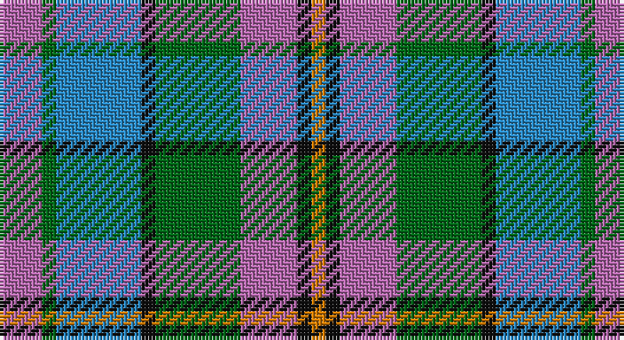

This page is one **sett** — a single exact thread-count. It belongs to the [tartan](/setts/m3g1t6k1g6m4k1lo1/)
(the same proportion at any scale), whose colour order is pattern [RGBKGRKY](/stripes/rgbkgrky/).

Part of the [Orkney](/tartans/orkney/) tartan — the named design grouping this sett with its other cloths.

Sourced from house-of-tartan.  It is a [8 stripe tartan](/stripes/stripes8/).

Original link http://www.house-of-tartan.scotland.net/house/TartanViewjs.asp?colr=Def&tnam=2301

## Provenance

Earliest known date: 2000 Orkney District tartan was designed for the Westry Knitters, on Orkney, by Ronnie Hek. Four designs were advertised in the window of a shop on Orkney's mainland and the most popular was chosen as the official Orcadian tartan.

## Thread count
P/12 G4 B24 K4 G24 P16 K4 O/4

One full sett is **168 threads**.

## Palette

Palette: <strong>Tartan Register</strong> <small style="color:#888">(4 of 5 colours)</small>
<table><thead><tr><th>Colour</th><th>Threads</th><th>Shade</th><th>Base</th><th>OKLCh</th></tr></thead><tbody><tr><td>P/</td><td style="text-align:right;font-variant-numeric:tabular-nums">12</td><td><code style="background-color:#B468AC;">#B468AC</code> <small style="color:#888">#B468AC</small></td><td>R <code style="background-color:#CC0000;">#CC0000</code></td><td><small style="color:#888">oklch(62.5% 0.131 330.9)</small></td></tr><tr><td>G</td><td style="text-align:right;font-variant-numeric:tabular-nums">4</td><td><code style="background-color:#006818;">#006818</code> <small style="color:#888">#006818</small></td><td>G <code style="background-color:#006100;">#006100</code></td><td><small style="color:#888">oklch(45.0% 0.142 145.0)</small></td></tr><tr><td>B</td><td style="text-align:right;font-variant-numeric:tabular-nums">24</td><td><code style="background-color:#2888C4;">#2888C4</code> <small style="color:#888">#2888C4</small></td><td>B <code style="background-color:#2A418A;">#2A418A</code></td><td><small style="color:#888">oklch(60.1% 0.125 241.5)</small></td></tr><tr><td>K</td><td style="text-align:right;font-variant-numeric:tabular-nums">4</td><td><code style="background-color:#101010;">#101010</code> <small style="color:#888">#101010</small></td><td>K <code style="background-color:#000000;">#000000</code></td><td><small style="color:#888">oklch(17.3% 0.000 89.9)</small></td></tr><tr><td>G</td><td style="text-align:right;font-variant-numeric:tabular-nums">24</td><td><code style="background-color:#006818;">#006818</code> <small style="color:#888">#006818</small></td><td>G <code style="background-color:#006100;">#006100</code></td><td><small style="color:#888">oklch(45.0% 0.142 145.0)</small></td></tr><tr><td>P</td><td style="text-align:right;font-variant-numeric:tabular-nums">16</td><td><code style="background-color:#B468AC;">#B468AC</code> <small style="color:#888">#B468AC</small></td><td>R <code style="background-color:#CC0000;">#CC0000</code></td><td><small style="color:#888">oklch(62.5% 0.131 330.9)</small></td></tr><tr><td>K</td><td style="text-align:right;font-variant-numeric:tabular-nums">4</td><td><code style="background-color:#101010;">#101010</code> <small style="color:#888">#101010</small></td><td>K <code style="background-color:#000000;">#000000</code></td><td><small style="color:#888">oklch(17.3% 0.000 89.9)</small></td></tr><tr><td>O/</td><td style="text-align:right;font-variant-numeric:tabular-nums">4</td><td><code style="background-color:#D87C00;">#D87C00</code> <small style="color:#888">#D87C00</small></td><td>Y <code style="background-color:#F2BF00;">#F2BF00</code></td><td><small style="color:#888">oklch(67.3% 0.155 61.8)</small></td></tr></tbody></table>

# Sample pattern

## Compared to the master

This cloth is one sett of its design; the master sett (the exemplar the design is anchored on) is below for comparison.

<figure style="margin:0"><figcaption style="color:#888;font-size:smaller">this sett</figcaption></figure>
<figure style="margin:0"><figcaption style="color:#888;font-size:smaller"><a href="/setts/k3r13g19k3b19g3r9g3b19k3g19r13k3lo3/">master sett →</a></figcaption></figure>

## Nearest tartans

The nearest existing variants by ΔTartan distance, with this tartan at the top so the swatches line up against it.

ΔTartan

Tartan

Sett

—

<a href="/ttd/edit/#slug=m3g1t6k1g6m4k1lo1~x4">Orkney District Tartan</a> <a class="nn-out" href="/variants/s8/m3g1t6k1g6m4k1lo1~x4/" title="open its dictionary page">↗</a>

0.88

<a href="/ttd/edit/#slug=w3t2n14o8t14db16n13t2w3~x2&amp;base=m3g1t6k1g6m4k1lo1~x4">Caitriot</a> <a class="nn-out" href="/variants/s9/w3t2n14o8t14db16n13t2w3~x2/" title="open its dictionary page">↗</a>

1.10

<a href="/ttd/edit/#slug=r9g3b19k3g19r13k3lo3~x2&amp;base=m3g1t6k1g6m4k1lo1~x4">Orkney (District?)</a> <a class="nn-out" href="/variants/s8/r9g3b19k3g19r13k3lo3~x2/" title="open its dictionary page">↗</a>

1.22

<a href="/ttd/edit/#slug=w3t2n14lr8t14db16n13t2w3~x2&amp;base=m3g1t6k1g6m4k1lo1~x4">Caitriot</a> <a class="nn-out" href="/variants/s9/w3t2n14lr8t14db16n13t2w3~x2/" title="open its dictionary page">↗</a>

1.23

<a href="/ttd/edit/#slug=db10t5lo2t2lb2t5o4t2o4lb2~x4&amp;base=m3g1t6k1g6m4k1lo1~x4">Unidentified #47</a> <a class="nn-out" href="/variants/s10/db10t5lo2t2lb2t5o4t2o4lb2~x4/" title="open its dictionary page">↗</a>

1.26

<a href="/ttd/edit/#slug=o30r3dg14w10r3b30~x2&amp;base=m3g1t6k1g6m4k1lo1~x4">Cercle de Fermières Varennes</a> <a class="nn-out" href="/variants/s6/o30r3dg14w10r3b30~x2/" title="open its dictionary page">↗</a>

1.29

<a href="/ttd/edit/#slug=db12r2db2r2db2g10w12o3~x2&amp;base=m3g1t6k1g6m4k1lo1~x4">Idaho, Centennial</a> <a class="nn-out" href="/variants/s8/db12r2db2r2db2g10w12o3~x2/" title="open its dictionary page">↗</a>

1.30

<a href="/ttd/edit/#slug=w1db6g1db1g1db1gi4m5lo1~x4&amp;base=m3g1t6k1g6m4k1lo1~x4">McLion</a> <a class="nn-out" href="/variants/s9/w1db6g1db1g1db1gi4m5lo1~x4/" title="open its dictionary page">↗</a>

1.31

<a href="/ttd/edit/#slug=r5o20dt13db42dt13o20lo5&amp;base=m3g1t6k1g6m4k1lo1~x4">Newmill Corporate Tartan</a> <a class="nn-out" href="/variants/s7/r5o20dt13db42dt13o20lo5/" title="open its dictionary page">↗</a>

1.34

<a href="/ttd/edit/#slug=r4g11k11g2n11ly3~x4&amp;base=m3g1t6k1g6m4k1lo1~x4">Casely (Name)</a> <a class="nn-out" href="/variants/s6/r4g11k11g2n11ly3~x4/" title="open its dictionary page">↗</a>

1.36

<a href="/ttd/edit/#slug=dg10lo2dg3r4dg13k13r2b13r4b3r2b10~x2&amp;base=m3g1t6k1g6m4k1lo1~x4">Bowie (Lochcarron)</a> <a class="nn-out" href="/variants/s12/dg10lo2dg3r4dg13k13r2b13r4b3r2b10~x2/" title="open its dictionary page">↗</a>

## Neighbour map

Every grey dot is one of 14360 variants placed by the first two principal components of the ΔTartan feature space (44% of its variance). Red is this tartan; blue dots are its nearest — click one to open its page.

<svg viewBox="0 0 640 380" role="img" style="max-width:100%;height:auto;border:1px solid #e0e0e0;border-radius:4px;display:block" xmlns="http://www.w3.org/2000/svg"><image href="/nn/cloud.v1.png" width="640" height="380"/><a href="/variants/s9/w3t2n14o8t14db16n13t2w3~x2/"><circle cx="135.9" cy="205.0" r="4" fill="#3465a4"><title>Caitriot</title></circle></a><a href="/variants/s8/r9g3b19k3g19r13k3lo3~x2/"><circle cx="151.5" cy="222.4" r="4" fill="#3465a4"><title>Orkney (District?)</title></circle></a><a href="/variants/s9/w3t2n14lr8t14db16n13t2w3~x2/"><circle cx="113.8" cy="194.8" r="4" fill="#3465a4"><title>Caitriot</title></circle></a><a href="/variants/s10/db10t5lo2t2lb2t5o4t2o4lb2~x4/"><circle cx="96.3" cy="206.8" r="4" fill="#3465a4"><title>Unidentified #47</title></circle></a><a href="/variants/s6/o30r3dg14w10r3b30~x2/"><circle cx="146.5" cy="195.2" r="4" fill="#3465a4"><title>Cercle de Fermières Varennes</title></circle></a><a href="/variants/s8/db12r2db2r2db2g10w12o3~x2/"><circle cx="105.7" cy="186.6" r="4" fill="#3465a4"><title>Idaho, Centennial</title></circle></a><a href="/variants/s9/w1db6g1db1g1db1gi4m5lo1~x4/"><circle cx="120.4" cy="178.2" r="4" fill="#3465a4"><title>McLion</title></circle></a><a href="/variants/s7/r5o20dt13db42dt13o20lo5/"><circle cx="177.0" cy="219.4" r="4" fill="#3465a4"><title>Newmill Corporate Tartan</title></circle></a><a href="/variants/s6/r4g11k11g2n11ly3~x4/"><circle cx="98.4" cy="244.4" r="4" fill="#3465a4"><title>Casely (Name)</title></circle></a><a href="/variants/s12/dg10lo2dg3r4dg13k13r2b13r4b3r2b10~x2/"><circle cx="123.8" cy="202.5" r="4" fill="#3465a4"><title>Bowie (Lochcarron)</title></circle></a><circle cx="117.7" cy="213.0" r="5" fill="#c00000"/></svg>

ID: /variants/s8/m3g1t6k1g6m4k1lo1~x4/
