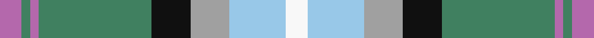
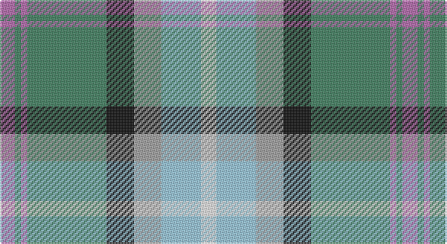

This page is one **sett** — a single exact thread-count. It belongs to the [tartan](/setts/m5g2m2g26k9lr9lb13w5/)
(the same proportion at any scale), whose colour order is pattern [RGRGKYWW](/stripes/rgrgkyww/).

Sourced from register-of-tartans.  It is a [8 stripe tartan](/stripes/stripes8/).

Original link https://www.tartanregister.gov.uk/tartanDetails.aspx?ref=49

## Also known as

This cloth is also recorded under:

- Alexander of Menstry Htg

2 attestations — the source records this cloth was collapsed from (oldest owns this page)

<ul>
<li>01/01/2002 — Alexander of Menstry Hunting (register-of-tartans, <a href="https://www.tartanregister.gov.uk/tartanDetails.aspx?ref=49">record</a>)</li>
<li>2002 — Alexander of Menstry Htg (Personal) (tartans-authority, <a href="http://www.tartansauthority.com/tartan-ferret/display/6715/">record</a>)</li>
</ul>

## Register references

External register numbers recorded for this tartan.

- Scottish Register of Tartans: [49](https://www.tartanregister.gov.uk/tartanDetails.aspx?ref=49)
- Scottish Tartans Authority (ITI): 6715

## Thread count
P/10 Ga4 P4 Ga52 K18 N18 LB26 W/10

One full sett is **264 threads**.

## Palette

Palette: <strong>Tartan Register</strong> <small style="color:#888">(11 of 12 colours)</small>
<table><thead><tr><th>Colour</th><th>Threads</th><th>Shade</th><th>Base</th><th>OKLCh</th></tr></thead><tbody><tr><td>P/</td><td style="text-align:right;font-variant-numeric:tabular-nums">10</td><td><code style="background-color:#B468AC;">#B468AC</code> <small style="color:#888">#B468AC</small></td><td>R <code style="background-color:#CC0000;">#CC0000</code></td><td><small style="color:#888">oklch(62.5% 0.131 330.9)</small></td></tr><tr><td>Ga</td><td style="text-align:right;font-variant-numeric:tabular-nums">4</td><td><code style="background-color:#408060;">#408060</code> <small style="color:#888">#408060</small></td><td>G <code style="background-color:#006100;">#006100</code></td><td><small style="color:#888">oklch(54.8% 0.084 160.1)</small></td></tr><tr><td>P</td><td style="text-align:right;font-variant-numeric:tabular-nums">4</td><td><code style="background-color:#B468AC;">#B468AC</code> <small style="color:#888">#B468AC</small></td><td>R <code style="background-color:#CC0000;">#CC0000</code></td><td><small style="color:#888">oklch(62.5% 0.131 330.9)</small></td></tr><tr><td>Ga</td><td style="text-align:right;font-variant-numeric:tabular-nums">52</td><td><code style="background-color:#408060;">#408060</code> <small style="color:#888">#408060</small></td><td>G <code style="background-color:#006100;">#006100</code></td><td><small style="color:#888">oklch(54.8% 0.084 160.1)</small></td></tr><tr><td>K</td><td style="text-align:right;font-variant-numeric:tabular-nums">18</td><td><code style="background-color:#101010;">#101010</code> <small style="color:#888">#101010</small></td><td>K <code style="background-color:#000000;">#000000</code></td><td><small style="color:#888">oklch(17.3% 0.000 89.9)</small></td></tr><tr><td>N</td><td style="text-align:right;font-variant-numeric:tabular-nums">18</td><td><code style="background-color:#A0A0A0;">#A0A0A0</code> <small style="color:#888">#A0A0A0</small></td><td>Y <code style="background-color:#F2BF00;">#F2BF00</code></td><td><small style="color:#888">oklch(70.6% 0.000 89.9)</small></td></tr><tr><td>LB</td><td style="text-align:right;font-variant-numeric:tabular-nums">26</td><td><code style="background-color:#98C8E8;">#98C8E8</code> <small style="color:#888">#98C8E8</small></td><td>W <code style="background-color:#F7F7F7;">#F7F7F7</code></td><td><small style="color:#888">oklch(81.0% 0.068 237.9)</small></td></tr><tr><td>W/</td><td style="text-align:right;font-variant-numeric:tabular-nums">10</td><td><code style="background-color:#F8F8F8;">#F8F8F8</code> <small style="color:#888">#F8F8F8</small></td><td>W <code style="background-color:#F7F7F7;">#F7F7F7</code></td><td><small style="color:#888">oklch(97.9% 0.000 89.9)</small></td></tr></tbody></table>

# Sample pattern

## Nearest tartans

The nearest existing variants by ΔTartan distance, with this tartan at the top so the swatches line up against it.

ΔTartan

Tartan

Sett

—

<a href="/ttd/edit/#slug=m5g2m2g26k9lr9lb13w5~x2">Alexander of Menstry Hunting</a> <a class="nn-out" href="/variants/s8/m5g2m2g26k9lr9lb13w5~x2/" title="open its dictionary page">↗</a>

1.05

<a href="/ttd/edit/#slug=db4k1lg18y2lg11y11lb18k1r4~x2&amp;base=m5g2m2g26k9lr9lb13w5~x2">Morgan in Maryland (USA)</a> <a class="nn-out" href="/variants/s9/db4k1lg18y2lg11y11lb18k1r4~x2/" title="open its dictionary page">↗</a>

1.07

<a href="/ttd/edit/#slug=db20r2g9w6ly4k2g8~x2&amp;base=m5g2m2g26k9lr9lb13w5~x2">Crofters (Personal)</a> <a class="nn-out" href="/variants/s7/db20r2g9w6ly4k2g8~x2/" title="open its dictionary page">↗</a>

1.09

<a href="/ttd/edit/#slug=g20gi6w15dt5w2dt15o4dt10r2~x2&amp;base=m5g2m2g26k9lr9lb13w5~x2">Copar a'Beannichte Dress (Personal)</a> <a class="nn-out" href="/variants/s9/g20gi6w15dt5w2dt15o4dt10r2~x2/" title="open its dictionary page">↗</a>

1.10

<a href="/ttd/edit/#slug=db16w6r8db3ly1g1b3db1g9~x2&amp;base=m5g2m2g26k9lr9lb13w5~x2">Ohio</a> <a class="nn-out" href="/variants/s9/db16w6r8db3ly1g1b3db1g9~x2/" title="open its dictionary page">↗</a>

1.10

<a href="/ttd/edit/#slug=t16r1g16w1dy1w8m3~x2&amp;base=m5g2m2g26k9lr9lb13w5~x2">Chambers, Christopher J (Personal)</a> <a class="nn-out" href="/variants/s7/t16r1g16w1dy1w8m3~x2/" title="open its dictionary page">↗</a>

1.12

<a href="/ttd/edit/#slug=r6w20g12o3g8t20k2t3~x2&amp;base=m5g2m2g26k9lr9lb13w5~x2">Coulter Dress (Personal)</a> <a class="nn-out" href="/variants/s8/r6w20g12o3g8t20k2t3~x2/" title="open its dictionary page">↗</a>

1.14

<a href="/ttd/edit/#slug=lb38dt18lb4ly3g10lo3g4lb3lo17r4~x2&amp;base=m5g2m2g26k9lr9lb13w5~x2">State Seal of Delaware (Fashion)</a> <a class="nn-out" href="/variants/s10/lb38dt18lb4ly3g10lo3g4lb3lo17r4~x2/" title="open its dictionary page">↗</a>

1.14

<a href="/ttd/edit/#slug=w4t5lo3t22ly4k3g16lo7k2lo7ly2~x2&amp;base=m5g2m2g26k9lr9lb13w5~x2">Cossar (Personal)</a> <a class="nn-out" href="/variants/s11/w4t5lo3t22ly4k3g16lo7k2lo7ly2~x2/" title="open its dictionary page">↗</a>

1.15

<a href="/ttd/edit/#slug=dg12g24t48r23w8r23t24ly4g12dg12&amp;base=m5g2m2g26k9lr9lb13w5~x2">Swiss Highlander (Corporate)</a> <a class="nn-out" href="/variants/s10/dg12g24t48r23w8r23t24ly4g12dg12/" title="open its dictionary page">↗</a>

1.16

<a href="/ttd/edit/#slug=gi6g20gi6w15dt5w2dt15o4dt10r2~x2&amp;base=m5g2m2g26k9lr9lb13w5~x2">Copar a'Beannichte Dress (Personal)</a> <a class="nn-out" href="/variants/s10/gi6g20gi6w15dt5w2dt15o4dt10r2~x2/" title="open its dictionary page">↗</a>

## Neighbour map

Every grey dot is one of 14360 variants placed by the first two principal components of the ΔTartan feature space (44% of its variance). Red is this tartan; blue dots are its nearest — click one to open its page.

<svg viewBox="0 0 640 380" role="img" style="max-width:100%;height:auto;border:1px solid #e0e0e0;border-radius:4px;display:block" xmlns="http://www.w3.org/2000/svg"><image href="/nn/cloud.v1.png" width="640" height="380"/><a href="/variants/s9/db4k1lg18y2lg11y11lb18k1r4~x2/"><circle cx="170.9" cy="127.8" r="4" fill="#3465a4"><title>Morgan in Maryland (USA)</title></circle></a><a href="/variants/s7/db20r2g9w6ly4k2g8~x2/"><circle cx="130.0" cy="164.6" r="4" fill="#3465a4"><title>Crofters (Personal)</title></circle></a><a href="/variants/s9/g20gi6w15dt5w2dt15o4dt10r2~x2/"><circle cx="107.4" cy="166.7" r="4" fill="#3465a4"><title>Copar a'Beannichte Dress (Personal)</title></circle></a><a href="/variants/s9/db16w6r8db3ly1g1b3db1g9~x2/"><circle cx="164.1" cy="130.2" r="4" fill="#3465a4"><title>Ohio</title></circle></a><a href="/variants/s7/t16r1g16w1dy1w8m3~x2/"><circle cx="170.4" cy="138.1" r="4" fill="#3465a4"><title>Chambers, Christopher J (Personal)</title></circle></a><a href="/variants/s8/r6w20g12o3g8t20k2t3~x2/"><circle cx="81.8" cy="153.8" r="4" fill="#3465a4"><title>Coulter Dress (Personal)</title></circle></a><a href="/variants/s10/lb38dt18lb4ly3g10lo3g4lb3lo17r4~x2/"><circle cx="176.1" cy="122.8" r="4" fill="#3465a4"><title>State Seal of Delaware (Fashion)</title></circle></a><a href="/variants/s11/w4t5lo3t22ly4k3g16lo7k2lo7ly2~x2/"><circle cx="122.5" cy="137.1" r="4" fill="#3465a4"><title>Cossar (Personal)</title></circle></a><a href="/variants/s10/dg12g24t48r23w8r23t24ly4g12dg12/"><circle cx="118.8" cy="160.9" r="4" fill="#3465a4"><title>Swiss Highlander (Corporate)</title></circle></a><a href="/variants/s10/gi6g20gi6w15dt5w2dt15o4dt10r2~x2/"><circle cx="90.9" cy="164.4" r="4" fill="#3465a4"><title>Copar a'Beannichte Dress (Personal)</title></circle></a><circle cx="131.8" cy="146.5" r="5" fill="#c00000"/></svg>

ID: /variants/s8/m5g2m2g26k9lr9lb13w5~x2/
