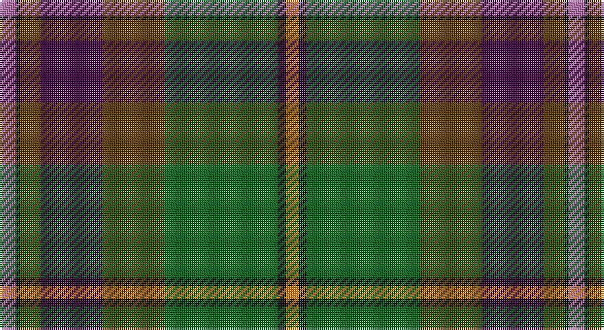

This page is one **sett** — a single exact thread-count. It belongs to the [tartan](/setts/m8k2dy10dp30dy30g55k4lo6/)
(the same proportion at any scale), whose colour order is pattern [RKGBGGKY](/stripes/rkgbggky/).

Part of the [Aberuchill](/tartans/aberuchill/) tartan — the named design grouping this sett with its other cloths.

Sourced from register-of-tartans.  It is a [8 stripe tartan](/stripes/stripes8/).

Original link https://www.tartanregister.gov.uk/tartanDetails.aspx?ref=23

2 attestations — the source records this cloth was collapsed from (oldest owns this page)

<ul>
<li>01/11/2005 — Aberuchill (register-of-tartans, <a href="https://www.tartanregister.gov.uk/tartanDetails.aspx?ref=23">record</a>)</li>
<li>2005 November — Aberuchill (Fashion) (tartans-authority, <a href="http://www.tartansauthority.com/tartan-ferret/display/6814/">record</a>)</li>
</ul>

## Register references

External register numbers recorded for this tartan.

- Scottish Register of Tartans: [23](https://www.tartanregister.gov.uk/tartanDetails.aspx?ref=23)
- Scottish Tartans Authority (ITI): 6814

## Thread count
P/8 K2 T10 DP30 T30 G55 K4 O/6

One full sett is **276 threads**.

## Palette

Palette: <strong>Tartan Register</strong> <small style="color:#888">(5 of 6 colours)</small>
<table><thead><tr><th>Colour</th><th>Threads</th><th>Shade</th><th>Base</th><th>OKLCh</th></tr></thead><tbody><tr><td>P/</td><td style="text-align:right;font-variant-numeric:tabular-nums">8</td><td><code style="background-color:#B468AC;">#B468AC</code> <small style="color:#888">#B468AC</small></td><td>R <code style="background-color:#CC0000;">#CC0000</code></td><td><small style="color:#888">oklch(62.5% 0.131 330.9)</small></td></tr><tr><td>K</td><td style="text-align:right;font-variant-numeric:tabular-nums">2</td><td><code style="background-color:#101010;">#101010</code> <small style="color:#888">#101010</small></td><td>K <code style="background-color:#000000;">#000000</code></td><td><small style="color:#888">oklch(17.3% 0.000 89.9)</small></td></tr><tr><td>T</td><td style="text-align:right;font-variant-numeric:tabular-nums">10</td><td><code style="background-color:#603800;">#603800</code> <small style="color:#888">#603800</small></td><td>G <code style="background-color:#006100;">#006100</code></td><td><small style="color:#888">oklch(38.1% 0.084 66.7)</small></td></tr><tr><td>DP</td><td style="text-align:right;font-variant-numeric:tabular-nums">30</td><td><code style="background-color:#440044;">#440044</code> <small style="color:#888">#440044</small></td><td>B <code style="background-color:#2A418A;">#2A418A</code></td><td><small style="color:#888">oklch(27.1% 0.125 328.4)</small></td></tr><tr><td>T</td><td style="text-align:right;font-variant-numeric:tabular-nums">30</td><td><code style="background-color:#603800;">#603800</code> <small style="color:#888">#603800</small></td><td>G <code style="background-color:#006100;">#006100</code></td><td><small style="color:#888">oklch(38.1% 0.084 66.7)</small></td></tr><tr><td>G</td><td style="text-align:right;font-variant-numeric:tabular-nums">55</td><td><code style="background-color:#006818;">#006818</code> <small style="color:#888">#006818</small></td><td>G <code style="background-color:#006100;">#006100</code></td><td><small style="color:#888">oklch(45.0% 0.142 145.0)</small></td></tr><tr><td>K</td><td style="text-align:right;font-variant-numeric:tabular-nums">4</td><td><code style="background-color:#101010;">#101010</code> <small style="color:#888">#101010</small></td><td>K <code style="background-color:#000000;">#000000</code></td><td><small style="color:#888">oklch(17.3% 0.000 89.9)</small></td></tr><tr><td>O/</td><td style="text-align:right;font-variant-numeric:tabular-nums">6</td><td><code style="background-color:#D87C00;">#D87C00</code> <small style="color:#888">#D87C00</small></td><td>Y <code style="background-color:#F2BF00;">#F2BF00</code></td><td><small style="color:#888">oklch(67.3% 0.155 61.8)</small></td></tr></tbody></table>

# Sample pattern

## Nearest tartans

The nearest existing variants by ΔTartan distance, with this tartan at the top so the swatches line up against it.

ΔTartan

Tartan

Sett

—

<a href="/ttd/edit/#slug=m8k2dy10dp30dy30g55k4lo6">Aberuchill</a> <a class="nn-out" href="/variants/s8/m8k2dy10dp30dy30g55k4lo6/" title="open its dictionary page">↗</a>

0.69

<a href="/ttd/edit/#slug=m8k2y10dp30y30g55k4o6&amp;base=m8k2dy10dp30dy30g55k4lo6">Aberuchill District Tartan</a> <a class="nn-out" href="/variants/s8/m8k2y10dp30y30g55k4o6/" title="open its dictionary page">↗</a>

0.94

<a href="/ttd/edit/#slug=o20dp2o2dp2o3dp8dg9g8y8dg1lr2~x2&amp;base=m8k2dy10dp30dy30g55k4lo6">Isle of Skye</a> <a class="nn-out" href="/variants/s11/o20dp2o2dp2o3dp8dg9g8y8dg1lr2~x2/" title="open its dictionary page">↗</a>

1.05

<a href="/ttd/edit/#slug=dpi5k1y5dp15dg15g28k2r4~x2&amp;base=m8k2dy10dp30dy30g55k4lo6">Batten of Argyll Clan Tartan</a> <a class="nn-out" href="/variants/s8/dpi5k1y5dp15dg15g28k2r4~x2/" title="open its dictionary page">↗</a>

1.13

<a href="/ttd/edit/#slug=r9dt8r8g52w2k32dt44b4&amp;base=m8k2dy10dp30dy30g55k4lo6">Highland Wedding (Fashion)</a> <a class="nn-out" href="/variants/s8/r9dt8r8g52w2k32dt44b4/" title="open its dictionary page">↗</a>

1.18

<a href="/ttd/edit/#slug=r4g4k2g17do5g5do17g6lb1db22r2~x2&amp;base=m8k2dy10dp30dy30g55k4lo6">Adams (Name)</a> <a class="nn-out" href="/variants/s11/r4g4k2g17do5g5do17g6lb1db22r2~x2/" title="open its dictionary page">↗</a>

1.18

<a href="/ttd/edit/#slug=dg30dt2n7r14n7r7w1dt14~x2&amp;base=m8k2dy10dp30dy30g55k4lo6">Harding (Name)</a> <a class="nn-out" href="/variants/s8/dg30dt2n7r14n7r7w1dt14~x2/" title="open its dictionary page">↗</a>

1.19

<a href="/ttd/edit/#slug=db1r4db12r1k7y12k7dy21lb1~x2&amp;base=m8k2dy10dp30dy30g55k4lo6">Redgate Htg #1 (Name)</a> <a class="nn-out" href="/variants/s9/db1r4db12r1k7y12k7dy21lb1~x2/" title="open its dictionary page">↗</a>

1.20

<a href="/variants/s10/r4dyi4r4dyi12k31dy16o1dy6ly1o1~x2/">Unnamed C20th - National Archives`</a>

1.21

<a href="/ttd/edit/#slug=r4lb1y6g25k8db15lb2~x2&amp;base=m8k2dy10dp30dy30g55k4lo6">Jones (Name)</a> <a class="nn-out" href="/variants/s7/r4lb1y6g25k8db15lb2~x2/" title="open its dictionary page">↗</a>

1.22

<a href="/ttd/edit/#slug=t1dr4t12dr1k7dg12k7do21w1~x2&amp;base=m8k2dy10dp30dy30g55k4lo6">Redgate (Connecticut) Hunting</a> <a class="nn-out" href="/variants/s9/t1dr4t12dr1k7dg12k7do21w1~x2/" title="open its dictionary page">↗</a>

## Neighbour map

Every grey dot is one of 14360 variants placed by the first two principal components of the ΔTartan feature space (44% of its variance). Red is this tartan; blue dots are its nearest — click one to open its page.

<svg viewBox="0 0 640 380" role="img" style="max-width:100%;height:auto;border:1px solid #e0e0e0;border-radius:4px;display:block" xmlns="http://www.w3.org/2000/svg"><image href="/nn/cloud.v1.png" width="640" height="380"/><a href="/variants/s8/m8k2y10dp30y30g55k4o6/"><circle cx="243.3" cy="151.3" r="4" fill="#3465a4"><title>Aberuchill District Tartan</title></circle></a><a href="/variants/s11/o20dp2o2dp2o3dp8dg9g8y8dg1lr2~x2/"><circle cx="192.2" cy="138.6" r="4" fill="#3465a4"><title>Isle of Skye</title></circle></a><a href="/variants/s8/dpi5k1y5dp15dg15g28k2r4~x2/"><circle cx="201.0" cy="133.7" r="4" fill="#3465a4"><title>Batten of Argyll Clan Tartan</title></circle></a><a href="/variants/s8/r9dt8r8g52w2k32dt44b4/"><circle cx="193.6" cy="144.9" r="4" fill="#3465a4"><title>Highland Wedding (Fashion)</title></circle></a><a href="/variants/s11/r4g4k2g17do5g5do17g6lb1db22r2~x2/"><circle cx="208.0" cy="142.2" r="4" fill="#3465a4"><title>Adams (Name)</title></circle></a><a href="/variants/s8/dg30dt2n7r14n7r7w1dt14~x2/"><circle cx="244.6" cy="162.5" r="4" fill="#3465a4"><title>Harding (Name)</title></circle></a><a href="/variants/s9/db1r4db12r1k7y12k7dy21lb1~x2/"><circle cx="191.0" cy="160.2" r="4" fill="#3465a4"><title>Redgate Htg #1 (Name)</title></circle></a><a href="/variants/s10/r4dyi4r4dyi12k31dy16o1dy6ly1o1~x2/"><circle cx="255.3" cy="117.5" r="4" fill="#3465a4"><title>Unnamed C20th - National Archives`</title></circle></a><a href="/variants/s7/r4lb1y6g25k8db15lb2~x2/"><circle cx="209.4" cy="147.6" r="4" fill="#3465a4"><title>Jones (Name)</title></circle></a><a href="/variants/s9/t1dr4t12dr1k7dg12k7do21w1~x2/"><circle cx="166.3" cy="148.8" r="4" fill="#3465a4"><title>Redgate (Connecticut) Hunting</title></circle></a><circle cx="232.1" cy="141.8" r="5" fill="#c00000"/></svg>

ID: /variants/s8/m8k2dy10dp30dy30g55k4lo6/
