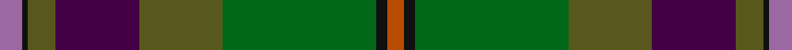
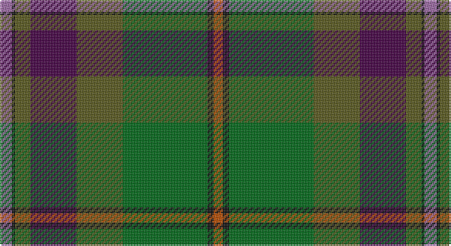

This page is one **sett** — a single exact thread-count. It belongs to the [tartan](/setts/m8k2y10dp30y30g55k4o6/)
(the same proportion at any scale), whose colour order is pattern [RKGBGGKR](/stripes/rkgbggkr/).

Part of the [Aberuchill](/tartans/aberuchill/) tartan — the named design grouping this sett with its other cloths.

Sourced from house-of-tartan.  It is a [8 stripe tartan](/stripes/stripes8/).

Original link http://www.house-of-tartan.scotland.net/house/TartanViewjs.asp?colr=Def&tnam=6814

## Provenance

Earliest known date: 2005 Aberuchill lends it name to the area south of Comrie where the river Ruchil meets the river Earn. The two rivers form the boundaries of the Aberuchill Estate for which this tartan was created.

## Thread count
LP/8 K2 Gb10 DP30 Gb30 G55 K4 DO/6

One full sett is **276 threads**.

## Palette

Palette: <strong>Tartan Register</strong> <small style="color:#888">(8 of 10 colours)</small>
<table><thead><tr><th>Colour</th><th>Threads</th><th>Shade</th><th>Base</th><th>OKLCh</th></tr></thead><tbody><tr><td>LP/</td><td style="text-align:right;font-variant-numeric:tabular-nums">8</td><td><code style="background-color:#9C68A4;">#9C68A4</code> <small style="color:#888">#9C68A4</small></td><td>R <code style="background-color:#CC0000;">#CC0000</code></td><td><small style="color:#888">oklch(59.4% 0.107 322.0)</small></td></tr><tr><td>K</td><td style="text-align:right;font-variant-numeric:tabular-nums">2</td><td><code style="background-color:#101010;">#101010</code> <small style="color:#888">#101010</small></td><td>K <code style="background-color:#000000;">#000000</code></td><td><small style="color:#888">oklch(17.3% 0.000 89.9)</small></td></tr><tr><td>Gb</td><td style="text-align:right;font-variant-numeric:tabular-nums">10</td><td><code style="background-color:#58581C;">#58581C</code> <small style="color:#888">#58581C</small></td><td>G <code style="background-color:#006100;">#006100</code></td><td><small style="color:#888">oklch(44.7% 0.081 109.3)</small></td></tr><tr><td>DP</td><td style="text-align:right;font-variant-numeric:tabular-nums">30</td><td><code style="background-color:#440044;">#440044</code> <small style="color:#888">#440044</small></td><td>B <code style="background-color:#2A418A;">#2A418A</code></td><td><small style="color:#888">oklch(27.1% 0.125 328.4)</small></td></tr><tr><td>Gb</td><td style="text-align:right;font-variant-numeric:tabular-nums">30</td><td><code style="background-color:#58581C;">#58581C</code> <small style="color:#888">#58581C</small></td><td>G <code style="background-color:#006100;">#006100</code></td><td><small style="color:#888">oklch(44.7% 0.081 109.3)</small></td></tr><tr><td>G</td><td style="text-align:right;font-variant-numeric:tabular-nums">55</td><td><code style="background-color:#006818;">#006818</code> <small style="color:#888">#006818</small></td><td>G <code style="background-color:#006100;">#006100</code></td><td><small style="color:#888">oklch(45.0% 0.142 145.0)</small></td></tr><tr><td>K</td><td style="text-align:right;font-variant-numeric:tabular-nums">4</td><td><code style="background-color:#101010;">#101010</code> <small style="color:#888">#101010</small></td><td>K <code style="background-color:#000000;">#000000</code></td><td><small style="color:#888">oklch(17.3% 0.000 89.9)</small></td></tr><tr><td>DO/</td><td style="text-align:right;font-variant-numeric:tabular-nums">6</td><td><code style="background-color:#B84C00;">#B84C00</code> <small style="color:#888">#B84C00</small></td><td>R <code style="background-color:#CC0000;">#CC0000</code></td><td><small style="color:#888">oklch(55.1% 0.156 45.5)</small></td></tr></tbody></table>

# Sample pattern

## Compared to the master

This cloth is one sett of its design; the master sett (the exemplar the design is anchored on) is below for comparison.

<figure style="margin:0"><figcaption style="color:#888;font-size:smaller">this sett</figcaption></figure>
<figure style="margin:0"><figcaption style="color:#888;font-size:smaller"><a href="/setts/m8k2dy10dp30dy30g55k4lo6/">master sett →</a></figcaption></figure>

## Nearest tartans

The nearest existing variants by ΔTartan distance, with this tartan at the top so the swatches line up against it.

ΔTartan

Tartan

Sett

—

<a href="/ttd/edit/#slug=m8k2y10dp30y30g55k4o6">Aberuchill District Tartan</a> <a class="nn-out" href="/variants/s8/m8k2y10dp30y30g55k4o6/" title="open its dictionary page">↗</a>

0.69

<a href="/ttd/edit/#slug=m8k2dy10dp30dy30g55k4lo6&amp;base=m8k2y10dp30y30g55k4o6">Aberuchill</a> <a class="nn-out" href="/variants/s8/m8k2dy10dp30dy30g55k4lo6/" title="open its dictionary page">↗</a>

1.01

<a href="/ttd/edit/#slug=dpi10k2dg10dp30dg30dgi55k4r8&amp;base=m8k2y10dp30y30g55k4o6">Batten of Argyll (Baddenach)</a> <a class="nn-out" href="/variants/s8/dpi10k2dg10dp30dg30dgi55k4r8/" title="open its dictionary page">↗</a>

1.07

<a href="/ttd/edit/#slug=dpi5k1y5dp15dg15g28k2r4~x2&amp;base=m8k2y10dp30y30g55k4o6">Batten of Argyll Clan Tartan</a> <a class="nn-out" href="/variants/s8/dpi5k1y5dp15dg15g28k2r4~x2/" title="open its dictionary page">↗</a>

1.08

<a href="/ttd/edit/#slug=g7lo2g5dg37db6r16db5b2~x2&amp;base=m8k2y10dp30y30g55k4o6">Telfer Green</a> <a class="nn-out" href="/variants/s8/g7lo2g5dg37db6r16db5b2~x2/" title="open its dictionary page">↗</a>

1.18

<a href="/ttd/edit/#slug=o20dp2o2dp2o3dp8dg9g8y8dg1lr2~x2&amp;base=m8k2y10dp30y30g55k4o6">Isle of Skye</a> <a class="nn-out" href="/variants/s11/o20dp2o2dp2o3dp8dg9g8y8dg1lr2~x2/" title="open its dictionary page">↗</a>

1.24

<a href="/ttd/edit/#slug=k5b3dy4ly1db13dy13g29w2~x2&amp;base=m8k2y10dp30y30g55k4o6">Teviotdale</a> <a class="nn-out" href="/variants/s8/k5b3dy4ly1db13dy13g29w2~x2/" title="open its dictionary page">↗</a>

1.26

<a href="/ttd/edit/#slug=dy20dp2dy2dp2dy3dp8dg9g8y8dg1lr2~x2&amp;base=m8k2y10dp30y30g55k4o6">Isle of Skye District Tartan</a> <a class="nn-out" href="/variants/s11/dy20dp2dy2dp2dy3dp8dg9g8y8dg1lr2~x2/" title="open its dictionary page">↗</a>

1.27

<a href="/ttd/edit/#slug=db1r4db12r1k7y12k7dy21lb1~x2&amp;base=m8k2y10dp30y30g55k4o6">Redgate Htg #1 (Name)</a> <a class="nn-out" href="/variants/s9/db1r4db12r1k7y12k7dy21lb1~x2/" title="open its dictionary page">↗</a>

1.31

<a href="/ttd/edit/#slug=dt6w1lo24g6n3g1n3g1n12r1~x2&amp;base=m8k2y10dp30y30g55k4o6">Chisholm Colonial</a> <a class="nn-out" href="/variants/s10/dt6w1lo24g6n3g1n3g1n12r1~x2/" title="open its dictionary page">↗</a>

1.35

<a href="/ttd/edit/#slug=r2dg13r2dg13k13dt30k1ly2~x2&amp;base=m8k2y10dp30y30g55k4o6">Chan (Name?)</a> <a class="nn-out" href="/variants/s8/r2dg13r2dg13k13dt30k1ly2~x2/" title="open its dictionary page">↗</a>

## Neighbour map

Every grey dot is one of 14360 variants placed by the first two principal components of the ΔTartan feature space (44% of its variance). Red is this tartan; blue dots are its nearest — click one to open its page.

<svg viewBox="0 0 640 380" role="img" style="max-width:100%;height:auto;border:1px solid #e0e0e0;border-radius:4px;display:block" xmlns="http://www.w3.org/2000/svg"><image href="/nn/cloud.v1.png" width="640" height="380"/><a href="/variants/s8/m8k2dy10dp30dy30g55k4lo6/"><circle cx="232.1" cy="141.8" r="4" fill="#3465a4"><title>Aberuchill</title></circle></a><a href="/variants/s8/dpi10k2dg10dp30dg30dgi55k4r8/"><circle cx="256.0" cy="168.3" r="4" fill="#3465a4"><title>Batten of Argyll (Baddenach)</title></circle></a><a href="/variants/s8/dpi5k1y5dp15dg15g28k2r4~x2/"><circle cx="201.0" cy="133.7" r="4" fill="#3465a4"><title>Batten of Argyll Clan Tartan</title></circle></a><a href="/variants/s8/g7lo2g5dg37db6r16db5b2~x2/"><circle cx="285.2" cy="163.4" r="4" fill="#3465a4"><title>Telfer Green</title></circle></a><a href="/variants/s11/o20dp2o2dp2o3dp8dg9g8y8dg1lr2~x2/"><circle cx="192.2" cy="138.6" r="4" fill="#3465a4"><title>Isle of Skye</title></circle></a><a href="/variants/s8/k5b3dy4ly1db13dy13g29w2~x2/"><circle cx="223.8" cy="124.3" r="4" fill="#3465a4"><title>Teviotdale</title></circle></a><a href="/variants/s11/dy20dp2dy2dp2dy3dp8dg9g8y8dg1lr2~x2/"><circle cx="227.7" cy="155.2" r="4" fill="#3465a4"><title>Isle of Skye District Tartan</title></circle></a><a href="/variants/s9/db1r4db12r1k7y12k7dy21lb1~x2/"><circle cx="191.0" cy="160.2" r="4" fill="#3465a4"><title>Redgate Htg #1 (Name)</title></circle></a><a href="/variants/s10/dt6w1lo24g6n3g1n3g1n12r1~x2/"><circle cx="264.8" cy="127.6" r="4" fill="#3465a4"><title>Chisholm Colonial</title></circle></a><a href="/variants/s8/r2dg13r2dg13k13dt30k1ly2~x2/"><circle cx="284.4" cy="169.6" r="4" fill="#3465a4"><title>Chan (Name?)</title></circle></a><circle cx="243.3" cy="151.3" r="5" fill="#c00000"/></svg>

ID: /variants/s8/m8k2y10dp30y30g55k4o6/
