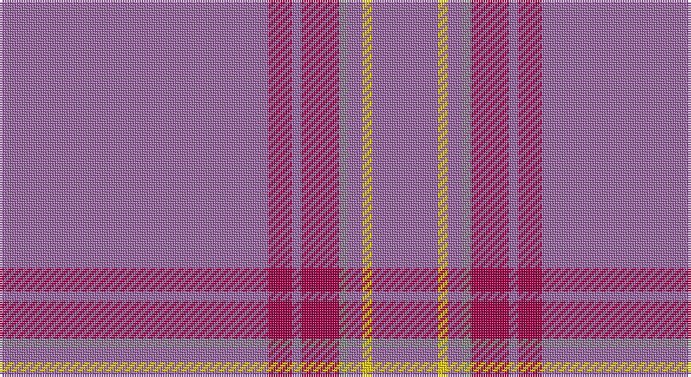

This page is one **sett** — a single exact thread-count. It belongs to the [tartan](/setts/mi57m5mi2m8o2mi3ly2mi14/)
(the same proportion at any scale), whose colour order is pattern [RRRRRRYR](/stripes/rrrrrryr/).

Part of the [Cairngorms National Park](/tartans/cairngorms-national-park/) tartan — the named design grouping this sett with its other cloths.

Sourced from tartans-authority.  It is a [8 stripe tartan](/stripes/stripes8/).

Original link http://www.tartansauthority.com/tartan-ferret/display/11197/

## Register references

External register numbers recorded for this tartan.

- Scottish Register of Tartans: [11197](https://www.tartanregister.gov.uk/tartanDetails?ref=11197)
- Scottish Tartans Authority (ITI): 11197

## Thread count
LP/114 R10 LP4 R16 N4 LP6 Y4 LP/28

One full sett is **230 threads**.

## Palette

Palette: <strong>Tartan Register</strong>
<table><thead><tr><th>Colour</th><th>Threads</th><th>Shade</th><th>Base</th><th>OKLCh</th></tr></thead><tbody><tr><td>LP/</td><td style="text-align:right;font-variant-numeric:tabular-nums">114</td><td><code style="background-color:#9C68A4;">#9C68A4</code> <small style="color:#888">#9C68A4</small></td><td>R <code style="background-color:#CC0000;">#CC0000</code></td><td><small style="color:#888">oklch(59.4% 0.107 322.0)</small></td></tr><tr><td>R</td><td style="text-align:right;font-variant-numeric:tabular-nums">10</td><td><code style="background-color:#A00048;">#A00048</code> <small style="color:#888">#A00048</small></td><td>R <code style="background-color:#CC0000;">#CC0000</code></td><td><small style="color:#888">oklch(45.4% 0.182 5.3)</small></td></tr><tr><td>LP</td><td style="text-align:right;font-variant-numeric:tabular-nums">4</td><td><code style="background-color:#9C68A4;">#9C68A4</code> <small style="color:#888">#9C68A4</small></td><td>R <code style="background-color:#CC0000;">#CC0000</code></td><td><small style="color:#888">oklch(59.4% 0.107 322.0)</small></td></tr><tr><td>R</td><td style="text-align:right;font-variant-numeric:tabular-nums">16</td><td><code style="background-color:#A00048;">#A00048</code> <small style="color:#888">#A00048</small></td><td>R <code style="background-color:#CC0000;">#CC0000</code></td><td><small style="color:#888">oklch(45.4% 0.182 5.3)</small></td></tr><tr><td>N</td><td style="text-align:right;font-variant-numeric:tabular-nums">4</td><td><code style="background-color:#888888;">#888888</code> <small style="color:#888">#888888</small></td><td>R <code style="background-color:#CC0000;">#CC0000</code></td><td><small style="color:#888">oklch(62.7% 0.000 89.9)</small></td></tr><tr><td>LP</td><td style="text-align:right;font-variant-numeric:tabular-nums">6</td><td><code style="background-color:#9C68A4;">#9C68A4</code> <small style="color:#888">#9C68A4</small></td><td>R <code style="background-color:#CC0000;">#CC0000</code></td><td><small style="color:#888">oklch(59.4% 0.107 322.0)</small></td></tr><tr><td>Y</td><td style="text-align:right;font-variant-numeric:tabular-nums">4</td><td><code style="background-color:#FCCC00;">#FCCC00</code> <small style="color:#888">#FCCC00</small></td><td>Y <code style="background-color:#F2BF00;">#F2BF00</code></td><td><small style="color:#888">oklch(86.2% 0.176 91.5)</small></td></tr><tr><td>LP/</td><td style="text-align:right;font-variant-numeric:tabular-nums">28</td><td><code style="background-color:#9C68A4;">#9C68A4</code> <small style="color:#888">#9C68A4</small></td><td>R <code style="background-color:#CC0000;">#CC0000</code></td><td><small style="color:#888">oklch(59.4% 0.107 322.0)</small></td></tr></tbody></table>

# Sample pattern

## Compared to the master

This cloth is one sett of its design; the master sett (the exemplar the design is anchored on) is below for comparison.

<figure style="margin:0"><figcaption style="color:#888;font-size:smaller">this sett</figcaption></figure>
<figure style="margin:0"><figcaption style="color:#888;font-size:smaller"><a href="/setts/dp57m5dp2m8lb2dp3ly2dp14/">master sett →</a></figcaption></figure>

## Nearest tartans

The nearest existing variants by ΔTartan distance, with this tartan at the top so the swatches line up against it.

ΔTartan

Tartan

Sett

—

<a href="/ttd/edit/#slug=mi57m5mi2m8o2mi3ly2mi14~x2">Cairngorms National Park</a> <a class="nn-out" href="/variants/s8/mi57m5mi2m8o2mi3ly2mi14~x2/" title="open its dictionary page">↗</a>

2.48

<a href="/ttd/edit/#slug=r13y3r4y56n4y4~x2&amp;base=mi57m5mi2m8o2mi3ly2mi14~x2">Auchairne grey</a> <a class="nn-out" href="/variants/s6/r13y3r4y56n4y4~x2/" title="open its dictionary page">↗</a>

2.52

<a href="/ttd/edit/#slug=r13o3r4o56n4o4~x2&amp;base=mi57m5mi2m8o2mi3ly2mi14~x2">Auchairne Grey</a> <a class="nn-out" href="/variants/s6/r13o3r4o56n4o4~x2/" title="open its dictionary page">↗</a>

2.61

<a href="/ttd/edit/#slug=o96db8o8w3o8g3o8r3~x2&amp;base=mi57m5mi2m8o2mi3ly2mi14~x2">Burnett, of Leys hunting</a> <a class="nn-out" href="/variants/s8/o96db8o8w3o8g3o8r3~x2/" title="open its dictionary page">↗</a>

2.67

<a href="/ttd/edit/#slug=n65k2n4lr2n10r24~x2&amp;base=mi57m5mi2m8o2mi3ly2mi14~x2">Norsemen (Corporate)</a> <a class="nn-out" href="/variants/s6/n65k2n4lr2n10r24~x2/" title="open its dictionary page">↗</a>

2.85

<a href="/ttd/edit/#slug=o64g6o2g3o2g6o64dr2o2dr6~x2&amp;base=mi57m5mi2m8o2mi3ly2mi14~x2">Connacht</a> <a class="nn-out" href="/variants/s10/o64g6o2g3o2g6o64dr2o2dr6~x2/" title="open its dictionary page">↗</a>

2.86

<a href="/ttd/edit/#slug=r2dt1ri6r1ri2dg2ri24dt6ri2~x2&amp;base=mi57m5mi2m8o2mi3ly2mi14~x2">Fitzgibbon Red</a> <a class="nn-out" href="/variants/s9/r2dt1ri6r1ri2dg2ri24dt6ri2~x2/" title="open its dictionary page">↗</a>

2.88

<a href="/ttd/edit/#slug=db3y1w1y25w1y1p3~x2&amp;base=mi57m5mi2m8o2mi3ly2mi14~x2">St Giles, Check</a> <a class="nn-out" href="/variants/s7/db3y1w1y25w1y1p3~x2/" title="open its dictionary page">↗</a>

2.92

<a href="/ttd/edit/#slug=oi32dy8oi1dy1lb1oi1lb1o1oi1dy1oii1oi4dy1~x4&amp;base=mi57m5mi2m8o2mi3ly2mi14~x2">Parma</a> <a class="nn-out" href="/variants/s13/oi32dy8oi1dy1lb1oi1lb1o1oi1dy1oii1oi4dy1~x4/" title="open its dictionary page">↗</a>

2.92

<a href="/ttd/edit/#slug=w2o44dt8o2dt2o3r1~x2&amp;base=mi57m5mi2m8o2mi3ly2mi14~x2">Reece, Mathew</a> <a class="nn-out" href="/variants/s7/w2o44dt8o2dt2o3r1~x2/" title="open its dictionary page">↗</a>

2.96

<a href="/ttd/edit/#slug=n110lp3o14w1dp10w1o6lp3dp4n2~x2&amp;base=mi57m5mi2m8o2mi3ly2mi14~x2">Vetoclock</a> <a class="nn-out" href="/variants/s10/n110lp3o14w1dp10w1o6lp3dp4n2~x2/" title="open its dictionary page">↗</a>

## Neighbour map

Every grey dot is one of 14360 variants placed by the first two principal components of the ΔTartan feature space (44% of its variance). Red is this tartan; blue dots are its nearest — click one to open its page.

<svg viewBox="0 0 640 380" role="img" style="max-width:100%;height:auto;border:1px solid #e0e0e0;border-radius:4px;display:block" xmlns="http://www.w3.org/2000/svg"><image href="/nn/cloud.v1.png" width="640" height="380"/><a href="/variants/s6/r13y3r4y56n4y4~x2/"><circle cx="608.4" cy="217.5" r="4" fill="#3465a4"><title>Auchairne grey</title></circle></a><a href="/variants/s6/r13o3r4o56n4o4~x2/"><circle cx="602.4" cy="213.0" r="4" fill="#3465a4"><title>Auchairne Grey</title></circle></a><a href="/variants/s8/o96db8o8w3o8g3o8r3~x2/"><circle cx="626.0" cy="154.7" r="4" fill="#3465a4"><title>Burnett, of Leys hunting</title></circle></a><a href="/variants/s6/n65k2n4lr2n10r24~x2/"><circle cx="578.6" cy="186.4" r="4" fill="#3465a4"><title>Norsemen (Corporate)</title></circle></a><a href="/variants/s10/o64g6o2g3o2g6o64dr2o2dr6~x2/"><circle cx="626.0" cy="188.4" r="4" fill="#3465a4"><title>Connacht</title></circle></a><a href="/variants/s9/r2dt1ri6r1ri2dg2ri24dt6ri2~x2/"><circle cx="600.7" cy="178.4" r="4" fill="#3465a4"><title>Fitzgibbon Red</title></circle></a><a href="/variants/s7/db3y1w1y25w1y1p3~x2/"><circle cx="573.3" cy="153.6" r="4" fill="#3465a4"><title>St Giles, Check</title></circle></a><a href="/variants/s13/oi32dy8oi1dy1lb1oi1lb1o1oi1dy1oii1oi4dy1~x4/"><circle cx="610.1" cy="127.8" r="4" fill="#3465a4"><title>Parma</title></circle></a><a href="/variants/s7/w2o44dt8o2dt2o3r1~x2/"><circle cx="626.0" cy="135.6" r="4" fill="#3465a4"><title>Reece, Mathew</title></circle></a><a href="/variants/s10/n110lp3o14w1dp10w1o6lp3dp4n2~x2/"><circle cx="593.6" cy="107.9" r="4" fill="#3465a4"><title>Vetoclock</title></circle></a><circle cx="626.0" cy="173.9" r="5" fill="#c00000"/></svg>

ID: /variants/s8/mi57m5mi2m8o2mi3ly2mi14~x2/
