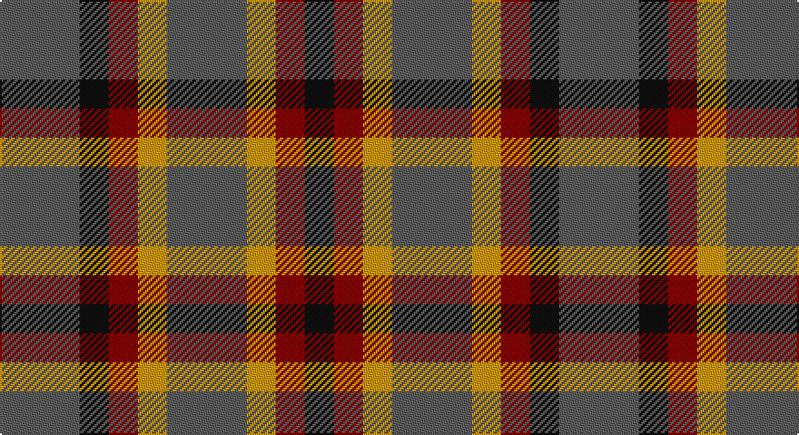

This page is one **sett** — a single exact thread-count. It belongs to the [tartan](/setts/n11k4r4lo4n11/)
(the same proportion at any scale), whose colour order is pattern [BKRYBYRK](/stripes/bkrybyrk/).

Sourced from register-of-tartans.  It is a [8 stripe tartan](/stripes/stripes8/).

Original link https://www.tartanregister.gov.uk/tartanDetails.aspx?ref=1813

## Also known as

This cloth is also recorded under:

- Ikelman #3

## Register references

External register numbers recorded for this tartan.

- Scottish Register of Tartans: [1813](https://www.tartanregister.gov.uk/tartanDetails.aspx?ref=1813)
- Scottish Tartans Authority (ITI): 2212
- Scottish Tartans World Register: 2212

## Thread count
N/44 K16 DR16 DY16 N44 DY16 DR16 K/16

One full sett is **308 threads**.

## Palette

Palette: <strong>Tartan Register</strong> <small style="color:#888">(2 of 4 colours)</small>
<table><thead><tr><th>Colour</th><th>Threads</th><th>Shade</th><th>Base</th><th>OKLCh</th></tr></thead><tbody><tr><td>N/</td><td style="text-align:right;font-variant-numeric:tabular-nums">44</td><td><code style="background-color:#5C5C5C;">#5C5C5C</code> <small style="color:#888">#5C5C5C</small></td><td>B <code style="background-color:#2A418A;">#2A418A</code></td><td><small style="color:#888">oklch(47.5% 0.000 89.9)</small></td></tr><tr><td>K</td><td style="text-align:right;font-variant-numeric:tabular-nums">16</td><td><code style="background-color:#101010;">#101010</code> <small style="color:#888">#101010</small></td><td>K <code style="background-color:#000000;">#000000</code></td><td><small style="color:#888">oklch(17.3% 0.000 89.9)</small></td></tr><tr><td>DR</td><td style="text-align:right;font-variant-numeric:tabular-nums">16</td><td><code style="background-color:#880000;">#880000</code> <small style="color:#888">#880000</small></td><td>R <code style="background-color:#CC0000;">#CC0000</code></td><td><small style="color:#888">oklch(39.4% 0.162 29.2)</small></td></tr><tr><td>DY</td><td style="text-align:right;font-variant-numeric:tabular-nums">16</td><td><code style="background-color:#D09800;">#D09800</code> <small style="color:#888">#D09800</small></td><td>Y <code style="background-color:#F2BF00;">#F2BF00</code></td><td><small style="color:#888">oklch(71.4% 0.147 82.1)</small></td></tr><tr><td>N</td><td style="text-align:right;font-variant-numeric:tabular-nums">44</td><td><code style="background-color:#5C5C5C;">#5C5C5C</code> <small style="color:#888">#5C5C5C</small></td><td>B <code style="background-color:#2A418A;">#2A418A</code></td><td><small style="color:#888">oklch(47.5% 0.000 89.9)</small></td></tr><tr><td>DY</td><td style="text-align:right;font-variant-numeric:tabular-nums">16</td><td><code style="background-color:#D09800;">#D09800</code> <small style="color:#888">#D09800</small></td><td>Y <code style="background-color:#F2BF00;">#F2BF00</code></td><td><small style="color:#888">oklch(71.4% 0.147 82.1)</small></td></tr><tr><td>DR</td><td style="text-align:right;font-variant-numeric:tabular-nums">16</td><td><code style="background-color:#880000;">#880000</code> <small style="color:#888">#880000</small></td><td>R <code style="background-color:#CC0000;">#CC0000</code></td><td><small style="color:#888">oklch(39.4% 0.162 29.2)</small></td></tr><tr><td>K/</td><td style="text-align:right;font-variant-numeric:tabular-nums">16</td><td><code style="background-color:#101010;">#101010</code> <small style="color:#888">#101010</small></td><td>K <code style="background-color:#000000;">#000000</code></td><td><small style="color:#888">oklch(17.3% 0.000 89.9)</small></td></tr></tbody></table>

# Sample pattern

## Nearest tartans

The nearest existing variants by ΔTartan distance, with this tartan at the top so the swatches line up against it.

ΔTartan

Tartan

Sett

—

<a href="/ttd/edit/#slug=n11k4r4lo4n11~x4">Ikelman #3 (Personal)</a> <a class="nn-out" href="/variants/s8/n11k4r4lo4n11~x4/" title="open its dictionary page">↗</a>

1.24

<a href="/ttd/edit/#slug=lr10dt3lr3dt3lr3dt11dy11o3~x2&amp;base=n11k4r4lo4n11~x4">Holden Monaro Corporate Tartan</a> <a class="nn-out" href="/variants/s8/lr10dt3lr3dt3lr3dt11dy11o3~x2/" title="open its dictionary page">↗</a>

1.29

<a href="/ttd/edit/#slug=g6dp3k3dp3k3dp3g6r2~x2&amp;base=n11k4r4lo4n11~x4">Wilson's No.137</a> <a class="nn-out" href="/variants/s8/g6dp3k3dp3k3dp3g6r2~x2/" title="open its dictionary page">↗</a>

1.30

<a href="/ttd/edit/#slug=r2g4db8r9g9k2r2~x4&amp;base=n11k4r4lo4n11~x4">Stewart (Artefact)</a> <a class="nn-out" href="/variants/s7/r2g4db8r9g9k2r2~x4/" title="open its dictionary page">↗</a>

1.34

<a href="/ttd/edit/#slug=r20dg29db10dg16r6dg10k19~x2&amp;base=n11k4r4lo4n11~x4">MacDonagh (Name)</a> <a class="nn-out" href="/variants/s7/r20dg29db10dg16r6dg10k19~x2/" title="open its dictionary page">↗</a>

1.40

<a href="/variants/s8/g4r3t1k1t3~x4/">Wilson's No.214</a>

1.42

<a href="/ttd/edit/#slug=g4db9r9g9k2r2k2g9r9db8g4r2~x4&amp;base=n11k4r4lo4n11~x4">Stewart/Stuart C18th - Cf 1314 &amp; 4454</a> <a class="nn-out" href="/variants/s12/g4db9r9g9k2r2k2g9r9db8g4r2~x4/" title="open its dictionary page">↗</a>

1.42

<a href="/ttd/edit/#slug=r20g29db10g16r6g10k19~x2&amp;base=n11k4r4lo4n11~x4">MacDonagh</a> <a class="nn-out" href="/variants/s7/r20g29db10g16r6g10k19~x2/" title="open its dictionary page">↗</a>

1.43

<a href="/ttd/edit/#slug=r5g6ly2g6r5b6r2~x2&amp;base=n11k4r4lo4n11~x4">Gleneagles Group</a> <a class="nn-out" href="/variants/s7/r5g6ly2g6r5b6r2~x2/" title="open its dictionary page">↗</a>

1.46

<a href="/ttd/edit/#slug=r2g4db8r9g9k2r2~x2&amp;base=n11k4r4lo4n11~x4">Stewart, Plaid</a> <a class="nn-out" href="/variants/s7/r2g4db8r9g9k2r2~x2/" title="open its dictionary page">↗</a>

1.53

<a href="/ttd/edit/#slug=dr5g6y2g6dr5db6dr2~x2&amp;base=n11k4r4lo4n11~x4">Gleneagles Group</a> <a class="nn-out" href="/variants/s7/dr5g6y2g6dr5db6dr2~x2/" title="open its dictionary page">↗</a>

## Neighbour map

Every grey dot is one of 14360 variants placed by the first two principal components of the ΔTartan feature space (44% of its variance). Red is this tartan; blue dots are its nearest — click one to open its page.

<svg viewBox="0 0 640 380" role="img" style="max-width:100%;height:auto;border:1px solid #e0e0e0;border-radius:4px;display:block" xmlns="http://www.w3.org/2000/svg"><image href="/nn/cloud.v1.png" width="640" height="380"/><a href="/variants/s8/lr10dt3lr3dt3lr3dt11dy11o3~x2/"><circle cx="141.2" cy="251.5" r="4" fill="#3465a4"><title>Holden Monaro Corporate Tartan</title></circle></a><a href="/variants/s8/g6dp3k3dp3k3dp3g6r2~x2/"><circle cx="131.8" cy="296.9" r="4" fill="#3465a4"><title>Wilson's No.137</title></circle></a><a href="/variants/s7/r2g4db8r9g9k2r2~x4/"><circle cx="159.8" cy="253.8" r="4" fill="#3465a4"><title>Stewart (Artefact)</title></circle></a><a href="/variants/s7/r20dg29db10dg16r6dg10k19~x2/"><circle cx="209.2" cy="281.4" r="4" fill="#3465a4"><title>MacDonagh (Name)</title></circle></a><a href="/variants/s8/g4r3t1k1t3~x4/"><circle cx="117.0" cy="251.3" r="4" fill="#3465a4"><title>Wilson's No.214</title></circle></a><a href="/variants/s12/g4db9r9g9k2r2k2g9r9db8g4r2~x4/"><circle cx="144.7" cy="240.0" r="4" fill="#3465a4"><title>Stewart/Stuart C18th - Cf 1314 &amp; 4454</title></circle></a><a href="/variants/s7/r20g29db10g16r6g10k19~x2/"><circle cx="196.9" cy="276.7" r="4" fill="#3465a4"><title>MacDonagh</title></circle></a><a href="/variants/s7/r5g6ly2g6r5b6r2~x2/"><circle cx="138.2" cy="311.5" r="4" fill="#3465a4"><title>Gleneagles Group</title></circle></a><a href="/variants/s7/r2g4db8r9g9k2r2~x2/"><circle cx="145.6" cy="247.8" r="4" fill="#3465a4"><title>Stewart, Plaid</title></circle></a><a href="/variants/s7/dr5g6y2g6dr5db6dr2~x2/"><circle cx="131.6" cy="313.6" r="4" fill="#3465a4"><title>Gleneagles Group</title></circle></a><circle cx="174.0" cy="277.8" r="5" fill="#c00000"/></svg>

ID: /variants/s8/n11k4r4lo4n11~x4/
